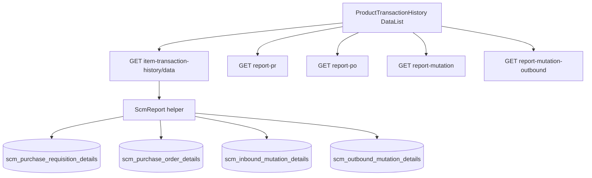

# Product Transaction History — Requirement Documentation

> **DRAFT** — Dokumen ini adalah draft awal hasil analisis codebase otomatis per 2026-06-19. Perlu direview PM/QA sebelum final.

## 0. Metadata & Changelog

| Version | Date | Author | Changes |
|---------|------|--------|---------|
| 1.0 | 2026-06-19 | QA - Yemima | Initial draft (AS-IS) |

## 1. Ringkasan Eksekutif

UI route `product-transaction-history` memanggil API `ItemTransactionHistoryController` (`item-transaction-history`). Helper `ScmReport` mengagregasi metrik PR/PO/inbound/outbound. FE: `ProductTransactionHistory/DataList.vue` dengan sub-komponen chart dan tab.

## 2. Acceptance Criteria (AS-IS)

| ID | Kriteria | Validasi | Fitur |
|----|----------|----------|-------|
| A-01 | Dashboard KPI load | `GET item-transaction-history/data` | Summary cards |
| A-02 | Require product_id for metrics | Conditional in data_report | Filter |
| A-03 | Date range default | start null→0, end null→now | Period |
| A-04 | Approve filter | `approve_status` 0=all, 1=approved | Filter |
| A-05 | PR detail tab | `report-pr` | PurchaseRequisition.vue |
| A-06 | PO detail tab | `report-po` | PurchaseOrder.vue |
| A-07 | Mutation tab | `report-mutation` | Mutation.vue |
| A-08 | Outbound chart | `report-mutation-outbound` | LineChartOutbound |
| A-09 | Export Excel async | `export-excel` + progress | Export |
| A-10 | Select2 product | `select2-product` | Product picker |

## 3. Metrik KPI (AS-IS dari ScmReport)

| Metrik | Sumber |
|--------|--------|
| PR transaction total | `getPrTransactionTotal` |
| Total requested qty | `getTotalRequestedQuantity` |
| Avg requested qty | total / pr_transaction_total |
| Avg daily requested | total / day_in_period |
| PO transaction total | `getPoTransactionTotal` |
| Inbound to PO % | inbound_qty / po_ordered_qty × 100 |
| Avg lead time | `getAvgLeadTime` |
| PO min/max/avg price | `getPoMinMaxPrice` |
| Outbound metrics | ScmReport outbound helpers |

## 4. Validasi & Rules

| ID | Rule | Trigger | Pesan |
|----|------|---------|-------|
| V-01 | Policy viewAny ItemTransactionHistory | select2, export | 403 |
| V-02 | Division by zero guarded | KPI calculations | Return 0 or N/A |

## 5. Diagram Alur

## 6. QA Test Notes

- Pilih produk dengan PR+PO+inbound+outbound di staging
- Toggle Approved Only → count harus ≤ All
- Verifikasi chart date array match periode
- Export + cek `export-excel-progress`

## Related Documents

| Doc | Path |
|-----|------|
| Knowledge Base | [knowledge-base.md](./knowledge-base.md) |
| Technical | [technical.md](./technical.md) |
