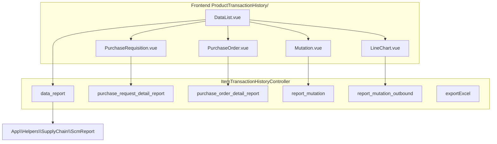

# Product Transaction History — Technical Documentation

> **DRAFT** — Dokumen ini adalah draft awal hasil analisis codebase otomatis per 2026-06-19. Perlu direview PM/QA sebelum final.

**UI route:** `/supplychain/product-transaction-history`  
**API prefix:** `supplychain/item-transaction-history` (catatan: path API ≠ path UI)

---

## 1. Architecture Overview

---

## 2. Frontend File Map

| File | Role | Key API |
|------|------|---------|
| `DataList.vue` | Filter + KPI dashboard | `GET item-transaction-history/data` |
| `PurchaseRequisition.vue` | Tab PR | `GET item-transaction-history/report-pr` |
| `PurchaseOrder.vue` | Tab PO | `GET item-transaction-history/report-po` |
| `Mutation.vue` | Tab mutation | `GET item-transaction-history/report-mutation` |
| `RecentPriceHistory.vue` | Price history | Sub-endpoints in controller |
| `RecentOutboundHistory.vue` | Outbound history | Sub-endpoints |
| `LineChart.vue` / `LineChartOutbound.vue` | Charts | data_report + outbound report |

---

## 3. Backend File Map

| File | Role |
|------|------|
| `ItemTransactionHistoryController.php` | All report endpoints |
| `ScmReport.php` | Aggregation helper |
| `ItemTransactionHistory.php` | Policy entity |
| `ProductTransactionHistoryExportJob.php` | Export job |
| `ReportProductTransactionHistory.php` | Excel export class |
| `ProductTransactionHistoryExportFiles.php` | Export tracking |

---

## 4. API Routes

| Method | Path | Handler |
|--------|------|---------|
| GET | `supplychain/item-transaction-history/data` | data_report |
| GET | `supplychain/item-transaction-history/select2-product` | select2Product |
| GET | `supplychain/item-transaction-history/report-pr` | purchase_request_detail_report |
| GET | `supplychain/item-transaction-history/report-po` | purchase_order_detail_report |
| GET | `supplychain/item-transaction-history/report-mutation` | report_mutation |
| GET | `supplychain/item-transaction-history/report-mutation-outbound` | report_mutation_outbound |
| GET | `supplychain/item-transaction-history/export-excel` | exportExcel |
| GET | `supplychain/item-transaction-history/export-excel-datalist` | ProductTransactionHistoryExportFiles |
| GET | `supplychain/item-transaction-history/export-excel-progress` | getExportAllProgress |

---

## 5. Database Schema (read sources)

| Tabel | Role |
|-------|------|
| `scm_purchase_requisition_details` | PR lines |
| `scm_purchase_order_details` | PO lines |
| `scm_inbound_mutation_details` | Inbound |
| `scm_outbound_mutation_details` | Outbound |
| `scm_product_transaction_history_export_files` | Export jobs |

---

## 6. Jobs

| Job | Fungsi |
|-----|--------|
| `ProductTransactionHistoryExportJob` | Async Excel |

---

## 7. Related docs

- [supplychain-purchase-order/technical.md](../supplychain-purchase-order/technical.md)
- [supplychain-product-mutation/technical.md](../supplychain-product-mutation/technical.md)
