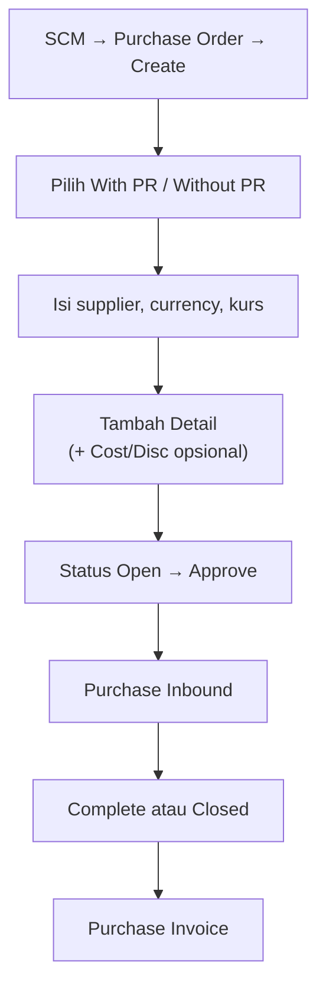

# Purchase Order — Knowledge Base

**Audience:** Operator, Support  
**Path:** SCM → **Purchase Order** (`/supplychain/purchase-order`)  
**Prefix dokumen:** `PO-`

---

## 1. Apa itu Purchase Order?

**Purchase Order (PO)** adalah pesanan pembelian resmi ke **supplier**. PO bisa dibuat **With PR** (dari Purchase Requisition) atau **Without PR** (produk langsung). Setelah PO **disetujui**, barang diterima lewat **Purchase Inbound**, lalu ditagih di **Purchase Invoice**.

---

## 2. Kapan dipakai?

| ✅ Buat PO jika | ❌ Jangan buat PO jika |
|-----------------|------------------------|
| Ada kebutuhan beli ke supplier (dengan atau tanpa PR) | Supplier belum lengkap accounting setting — tidak muncul di daftar |
| With PR: masih ada sisa qty PR outstanding | Qty PR sudah habis / PR sudah closed-complete |
| Without PR: produk aktif dengan COA group | Produk bundle / random (tidak bisa dipilih) |

---

## 3. Alur kerja standar

Setelah kebutuhan beli jelas, buat PO lalu approve agar bisa diterima di inbound.

```mermaid
flowchart TD
    A["SCM → Purchase Order → Create"] --> B["Pilih With PR / Without PR"]
    B --> C["Isi supplier, currency, kurs"]
    C --> D["Tambah Detail\n(+ Cost/Disc opsional)"]
    D --> E["Status Open → Approve"]
    E --> F["Purchase Inbound"]
    F --> G["Complete atau Closed"]
    G --> H["Purchase Invoice"]
```

**Keterangan langkah:**

- **Create:** pilih tipe With/Without PR; isi supplier, mata uang, kurs. Create biasanya mulai status **Open**.
- **Detail:** With PR → ambil dari outstanding PR; Without PR → pilih produk. Opsional: Additional Cost / Discount (nominal ikut ke PI; di PI COA masih bisa diganti sebelum approve).
- **Approve:** status harus **Open** + minimal 1 baris detail.
- **Inbound:** setelah approved, buat Purchase Inbound.
- **Selesai:** **Complete** (otomatis jika semua qty diterima) atau **Closed** (manual dari Processed jika sisa tidak dilanjutkan).
- **Invoice:** tagih di Purchase Invoice dari inbound.

---

## 4. Status — arti untuk operator

| Status | Arti | Bisa ubah data? |
|--------|------|-----------------|
| **Draft** | Belum siap approve / setelah reject + save | Ya |
| **Open** | Siap diajukan approve | Ya |
| **Approved** | Disetujui — siap inbound | Tidak |
| **Rejected** | Ditolak — perbaiki lalu set Open | Ya |
| **Processed** | Sebagian qty sudah masuk inbound | Tidak |
| **Complete** | **Selesai otomatis** — semua qty sudah diterima | Tidak |
| **Closed** | **Selesai manual** — sisa qty tidak akan di-inbound | Tidak |
| **Void** | Dibatalkan dari **Approved** (bukan draft) | Tidak |

> **Complete vs Closed:** keduanya artinya proses PO **selesai** untuk sisa inbound — trigger berbeda.
>
> **Kapan pakai Closed?** Saat PO sudah **Processed** (sudah pernah terima barang sebagian), tapi supplier **tidak akan kirim sisa**. Klik Closed → Inbound baru untuk sisa qty **ditolak sistem**.

---

## 5. Tipe PO

| Tipe | Kapan dipakai |
|------|---------------|
| **With PR** | Pembelian berdasarkan PR yang sudah approved/processed |
| **Without PR** | Pembelian langsung tanpa PR |

Tipe **tidak bisa diubah** di form jika sudah ada baris detail. Import Excel bisa mengubah tipe PO (hati-hati — sesuaikan file dengan tipe yang diinginkan).

---

## 6. Tombol & fungsi UI

### 6.1 Form create / edit (sidebar)

| Tombol / aksi | Fungsi |
|---------------|--------|
| **Save & Next** | Simpan header baru lalu lanjut ke detail |
| **Save All** | Simpan header (Draft/Open dari radio) |
| **Approve** | Setujui — hanya status **Open**, min 1 detail |
| **Print** (ikon) | Unduh PDF PO |
| **Void** (ikon) | Batalkan PO **Approved** (belum ada inbound) |
| **Closed** (ikon) | Tutup PO **Processed** — sisa qty tidak dilanjutkan |
| **Radio Draft / Open** | Pilih sebelum save; create biasanya mulai **Open** |

### 6.2 Section Detail

| Tombol / aksi | Fungsi |
|---------------|--------|
| **Select Product** | Tambah **satu** produk dari dropdown |
| **Available Products** (With PR) | Modal outstanding PR → **Use** → isi qty/harga per baris (Single Use) |
| **Select Outstanding PR Products** (With PR) | Modal centang banyak baris outstanding → masuk detail sekaligus; qty = **sisa outstanding**; harga otomatis |
| **Select Multiple Products** (Without PR) | Modal centang banyak SKU master → tiap baris qty **1**; harga otomatis |
| **Allocate Full Qty Clearing** | Di Single Use (With PR) — isi sisa qty PR |
| **Import Detail** | Upload Excel massal |
| **Export Detail** | Download detail PO |
| Edit / Delete baris | Sebelum approved |

Tombol multi-select hanya di halaman **edit** (Draft / Open / Rejected). Tidak muncul setelah Approved (Show).

- Maksimal **500** baris per PO. Kalau pilihan modal akan melebihi 500, sistem **menolak seluruh** pilihan.
- With PR: qty tidak boleh melebihi sisa outstanding di PR.

### 6.3 Datalist row actions

| Aksi | Kapan |
|------|-------|
| Edit / Delete | Draft, Open, Rejected |
| Approve | Open |
| Void | **Approved** (bukan draft/open) |
| Closed | **Processed** |
| Print | Semua status |

**Penting:** batalkan PO yang masih draft/open → **Delete**, bukan Void.

---

## 7. Import detail — panduan operator

Download template dari panel import (With PR / Without PR). Jika file tidak tersedia (404) — buat Excel manual mengikuti kolom di bawah, atau minta IT deploy template.

| Kolom | Isi | Wajib? |
|-------|-----|--------|
| A | Kode PR — **semua baris** isi atau **semua kosong** | Wajib jika With PR |
| B | System Product SKU | **Ya** |
| C | PO Qty (> 0) | **Ya** |
| D | Unit (kode exact) | **Ya** |
| E | Unit Price (≥ 1) | **Ya** |
| F | Disc. (%) | Opsional |
| G | Description | Opsional |
| H | Required Delivery Date (**Excel date**, bukan ketik teks) | Opsional |
| I | **VAT** — hanya `yes` atau `no` (rencana) | Opsional |
| J | **VAT Code** — kode pajak dari master (rencana) | Opsional |
| K | **VAT Type** — `include` atau `exclude` (rencana) | Opsional |

**VAT hari ini (AS-IS):** kolom I–K belum aktif — sistem mengisi pajak otomatis dari master produk + setting supplier.  
**Setelah rilis:** isi `yes`/`no`/kode/type di Excel untuk override; biarkan kosong ketiga kolom jika ingin perilaku otomatis lama. `VAT=no` = tanpa pajak. File lama tanpa kolom I–K tetap bisa diimport.

Warranty tetap sistem — bukan kolom Excel.

**Aturan:** maks **500** baris; jangan campur baris With PR dan Without PR dalam 1 file; tipe file harus cocok dengan detail PO yang sudah ada; bundle/random ditolak.  
**Partial (setelah rilis):** baris valid tetap masuk meski ada baris gagal — cek Import Log. **Sementara (AS-IS):** satu error di validasi awal bisa membatalkan seluruh file.

Lingo: [Import Detail](#sf-lingo:SF-IMP-01).

---

## 8. Basic Information — tips

| Field | Tips |
|-------|------|
| Supplier | Hanya muncul jika accounting setting **100% lengkap**. Di layar tampil **kode** saja (bukan nama). Boleh **cari by nama** — hasil tetap menampilkan kode. Tidak ada tooltip nama. |
| Currency / Payment | Auto dari supplier saat dipilih |
| Exchange Rate | Default **1** — ubah manual untuk mata uang asing |
| Your Ref | Max 50 karakter |

Setelah ada detail, **tanggal, supplier, currency, payment** terkunci.

### Supplier di layar vs cetak / export

- **Layar** (datalist, form, modal, Column Show/Hide): hanya **kode** supplier — semua role.
- **Export:** tanpa nama supplier.
- **Print PDF:** nama supplier **masih boleh** tampil (pengecualian).

---

## 9. Troubleshooting

| Gejala | Penyebab | Solusi |
|--------|----------|--------|
| Supplier tidak muncul | Accounting belum lengkap | Lengkapi di General Company |
| Tidak bisa approve | Status Draft / belum Open | Set **Open** + save |
| Setelah reject sulit approve | Flow reject → draft | Set **Open** + save lagi |
| Void tidak muncul | PO masih draft/open | Gunakan **Delete** |
| Void gagal (sudah prepared) | Sudah ada inbound | Tidak bisa void — Close jika processed |
| Closed tidak muncul | Belum pernah inbound | Buat inbound dulu → **Processed** |
| Import type not match | File With PR vs PO Without PR | Kosongkan detail atau sesuaikan file |
| Kurs invalid | Currency primer tapi rate ≠ 1 | Set rate = 1 |
| PR tidak muncul | PR closed/complete atau qty habis | Cek status PR |
| Select Multiple / Outstanding ditolak (>500) | Centang terlalu banyak | Kurangi centang atau hapus baris — sistem tolak **seluruh** batch |
| Tidak lihat Select Multiple Products | PO Without PR di Show / sudah Approved | Hanya di edit Draft/Open/Rejected |
| Select Outstanding melebihi sisa PR | Qty akan > outstanding | Kurangi pilihan atau sesuaikan baris PO yang sudah ada |
| Σ DPP detail ≠ Total DPP tippy | Bug Path A/B atau data lama | Escalate jika beda besar (~0,03+) — bukan kasus 1 sen |
| Jumlah manual DPP+VAT kolom = Total +0,01 | Known behavior UI (rounding tie) | Normal jika Total Price / Net tetap pas; jangan “perbaiki” hitungan. Audit → export 4dp (TO-BE) |
| Total Price / Net ≠ Unit×Qty | Seharusnya tidak (backend exact) | Escalate — bug, bukan known behavior UI |

### Contoh hitung (untuk Lingo / panduan user)

PPN include 11%. Angka sudah divalidasi (SoT 27 Jul 2026).

| Input | DPP tampil | VAT tampil | Jumlah manual | **Total Price (acuan)** |
|-------|------------|------------|---------------|-------------------------|
| Unit **38.000**, Disc **0%**, Qty **25** | 855.855,86 | 94.144,15 | **950.000,01** | **950.000,00** |
| Unit **40.000**, Disc **5%**, Qty **25** | sama | sama | **950.000,01** | **950.000,00** |
| Unit **38.000**, Qty **1.000**, Disc 0% | — | — | = Total | **38.000.000,00** (pas) |

Lingo card: [DPP & VAT di detail](../_meta/shared-capabilities/dpp-vat-breakdown-display.md) (`SF-PRICE-01`).

---

## 10. FAQ

**Q: Apakah qty boleh desimal?**  
A: Input manual: **bilangan bulat**. Import: boleh angka > 0 (termasuk desimal).

**Q: Berapa maksimal baris detail?**  
A: **500** baris (Select Product + multi-select modal + import digabung).

**Q: Beda Select Multiple Products vs Select Outstanding PR Products?**  
A: **Select Multiple Products** = PO **Without PR** (SKU master, qty 1). **Select Outstanding PR Products** = PO **With PR** (centang outstanding PR, qty = sisa). **Available Products** (With PR) tetap ada untuk isi qty/harga satu per satu via Use.

**Q: Apakah void mengembalikan qty ke PR?**  
A: **Belum** — void PO approved saat ini **tidak** mengembalikan qty yang sudah dikunci di PR. Hapus detail sebelum approve akan mengembalikan qty yang masih direservasi.

**Q: Apakah print PDF sama dengan Net Purchase di layar?**  
A: **Belum selalu** — print **tidak include** Other Cost/Discount.

**Q: DPP di grid detail harus sama dengan Total DPP di panel Totals?**  
A: Setelah ETM-15313, rumus display Path B sama. Selisih besar (~0,03+) antar kolom vs tippy = defect. **Pengecualian known behavior:** jika kamu **menjumlahkan sendiri** DPP + VAT yang tampil (2 desimal), bisa dapat **+0,01** dibanding **Total Price / Net** — itu rounding tampilan, bukan error hutang.

**Q: Kenapa jumlah DPP + VAT di layar bisa beda 0,01 dari Total harga baris?**  
A: UI membulatkan DPP dan VAT **terpisah** ke 2 desimal. Total Price / Net tetap exact (= harga×qty). Contoh: Unit 38.000 × Qty 25 → DPP 855.855,86 + VAT 94.144,15 = **950.000,01** kalau dijumlah manual, tapi Total Price **950.000,00**. Sudah disetujui end user (27 Jul 2026). Export 4 desimal (TO-BE) untuk audit. Qty 500/1000 sering tidak memicu — regresi tetap pakai qty 25, 75, dll.

**Q: Apakah PPN dicatat saat terima barang (Inbound)?**  
A: **Tidak.** Inbound menjurnal harga sebelum PPN ke Unbilled Goods. PPN masuk di **Purchase Invoice**.

---

## Related Documents

| Doc | Path |
|-----|------|
| Feature Map | [feature-map.md](./feature-map.md) |
| User Guide | [user-guide.md](./user-guide.md) |
| Requirement | [requirement.md](./requirement.md) |
| Technical | [technical.md](./technical.md) |
| Purchase Requisition | [../supplychain-purchase-requisition/knowledge-base.md](../supplychain-purchase-requisition/knowledge-base.md) |
| Purchase Inbound | [../supplychain-new-purchase-inbound/knowledge-base.md](../supplychain-new-purchase-inbound/knowledge-base.md) |
| Purchase Invoice | [../accounting-supplier-invoice/knowledge-base.md](../accounting-supplier-invoice/knowledge-base.md) |
