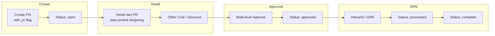
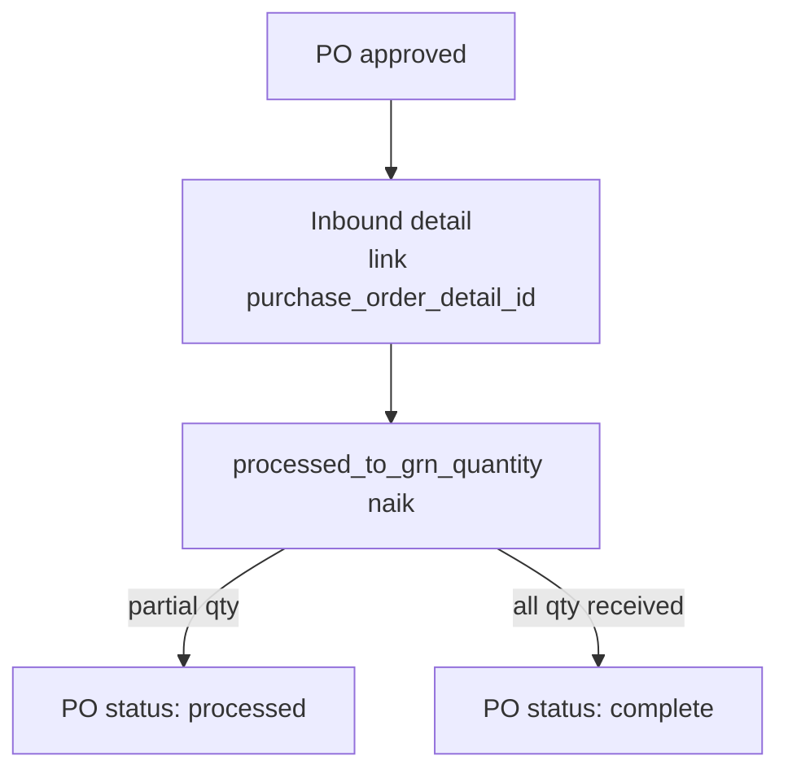
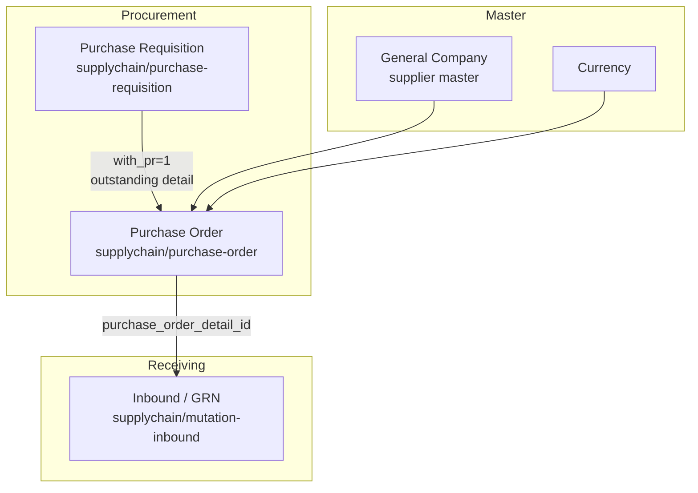

# Purchase Order — Requirement Detail

> **DRAFT** — Dokumen ini adalah draft awal hasil analisis codebase otomatis per 2026-06-19. Perlu direview PM/QA sebelum final.

**Modul:** SupplyChain + GeneralSetting  
**Audience:** PM, Operations, QA, Support, Developer  
**Status:** Sesuai perilaku sistem saat ini (AS-IS)

---

## Daftar Isi

1. [Fungsi & Tujuan](#1-fungsi--tujuan)
2. [How It Works — Alur Kerja](#2-how-it-works--alur-kerja)
3. [Validasi yang Berjalan](#3-validasi-yang-berjalan)
4. [Relasi Menu Lain](#4-relasi-menu-lain)
5. [FAQ](#5-faq)

---

## 1. Fungsi & Tujuan

### Apa itu Purchase Order?

**Purchase Order (PO)** adalah dokumen pembelian resmi ke supplier. PO menyimpan header transaksi (`scm_purchase_orders`) dan detail barang (`scm_purchase_order_details`), mendukung dua mode input detail:

- **With PR** (`with_pr = 1`) — detail berasal dari Purchase Requisition outstanding
- **Without PR** (`with_pr = 0`) — detail produk dipilih langsung

Supplier diambil dari **General Company** yang berflag supplier (`company_type = general`, `is_supplier = 1`).

### Masalah yang diselesaikan

| Kebutuhan Bisnis | Bagaimana PO Menjawab |
|------------------|----------------------|
| Standarisasi pembelian ke vendor | Header PO + approval workflow |
| Traceability dari permintaan internal | Mode With PR + update qty PR |
| Pembelian ad-hoc | Mode Without PR |
| Kontrol harga & pajak | Detail harga, diskon, VAT per baris |
| Penerimaan barang terkontrol | Link ke Inbound (GRN) via `purchase_order_detail_id` |

### Entitas data utama

| Entitas | Tabel |
|---------|-------|
| Header PO | `scm_purchase_orders` |
| Detail PO | `scm_purchase_order_details` |
| Approval | `scm_purchase_order_approvals` |
| Other Cost / Discount | `scm_purchase_order_other_costs`, `scm_purchase_order_other_discounts` |
| Tax per detail | `scm_purchase_order_detail_tax` (via relasi) |

---

## 2. How It Works — Alur Kerja

### 2.1 Siklus hidup PO (overview)

### 2.2 Create header

1. User buka `/supplychain/purchase-order/create`.
2. `POST supplychain/purchase-order` — `PurchaseOrderController@store`.
3. Validasi supplier, mata uang, kurs, fiscal period, `with_pr`.
4. PO dibuat dengan `transaction_status = open` (bukan draft default).
5. Kode auto-generate prefix `PO` jika kosong.

### 2.3 Tambah detail

**Without PR:**

- `POST supplychain/purchase-order/{id}/purchase-order-detail`
- Wajib `product_id` + `order_quantity` + harga.

**With PR:**

- Panel Outstanding PR → referensi `purchase_requisition_detail_id`
- Saat approve PO: `processed_to_po_quantity` PR naik, `prepared_to_po_quantity` turun.
- Jika semua detail PR terpenuhi → PR status `complete`.

### 2.4 Approval

`POST supplychain/purchase-order/{id}/approve`:

1. Cek cache lock approval & batch import aktif.
2. Minimal 1 detail.
3. Validasi fiscal period.
4. `approval_status`: `approved` | `rejected` | `void` | `closed`.
5. Jika approved + With PR → `approvePurchaseOrder()` update qty PR.
6. Simpan MA buffer & price history produk.

### 2.5 Progress via GRN (Inbound)

Observer `PurchaseOrderDetail::updated`:

- Jika `sum(order_quantity_in_base_unit) == sum(processed_to_grn_quantity)` → PO **`complete`**
- Jika ada `prepared_to_grn_quantity` atau `processed_to_grn_quantity` > 0 → PO **`processed`**
- Jika GRN di-void semua → revert ke **`approved`**

---

## 3. Validasi yang Berjalan

### 3.1 Header — create/update

| Field | Rule |
|-------|------|
| `code` | Unique per company (`owned_by`) |
| `transaction_date` | Required; tidak boleh > hari ini; fiscal period valid |
| `with_pr` | Required (0 atau 1) |
| `supplier_id` | Required; exists di General Company supplier |
| `currency_id` | Required; currency aktif di master |
| `exchange_rate` | Required, numeric, min 1; = 1 jika currency primer |
| `transaction_status` | Hanya `open` atau `draft` saat update |
| `description`, `term_and_condition` | Max 150 karakter |
| `supplier_reference_document` | Max 50 karakter |
| File attachment | Validasi extension |

**Edit diblokir** jika status bukan `draft`, `open`, atau `rejected`.

### 3.2 Detail — create

| Field | Rule |
|-------|------|
| `order_quantity` | Required, > 0; whole number (non-import) |
| `each_price_before_discount_before_vat` | Required, numeric, min 0 |
| `product_id` | Required jika tanpa referensi PR |
| `purchase_discount`, `vat` | Numeric, min 0/1 |
| `description` | Max 150 karakter |
| PO status | `can_update` harus true |
| Max detail | `validate_max_details()` — limit per company |

### 3.3 Detail — With PR

| Rule | Detail |
|------|--------|
| PR status | Tidak boleh `closed` saat dipakai |
| Qty | Tidak melebihi outstanding PR |
| Produk | Diambil dari PR detail, bukan input bebas |

### 3.4 Approval

| Rule | Detail |
|------|--------|
| Minimal detail | ≥ 1 baris |
| Fiscal period | Tanggal PO harus valid |
| Concurrent approve | Cache lock 60 detik |
| Import batch | Blok jika `PurchaseOrderWithPrImport` batch aktif |
| `can_approve` / `can_void` / `can_closed` | Sesuai state dokumen & policy |

---

## 4. Relasi Menu Lain

| Menu | Dampak ke/dari PO |
|------|-------------------|
| Purchase Requisition | Sumber detail; qty `processed_to_po_quantity` |
| Inbound | Update `processed_to_grn_quantity`; ubah status PO |
| General Company | Master supplier & alamat |
| Product | Master SKU di detail |
| **Master Other Cost** | Tab biaya tambahan header PO; picker hanya **active**; warisan ke [Supplier Invoice](../accounting-supplier-invoice/requirement.md) — [detail master](../omni-other-cost/requirement.md) |
| Master Other Discount | Tab diskon tambahan (struktur paralel) |

---

## 5. FAQ

**Q: Apakah tipe PO bisa diubah setelah create?**  
A: Tidak. Field `with_pr` ditetapkan saat create.

**Q: Kenapa PO langsung `open` meski user pilih draft di UI?**  
A: `store()` hardcode `transaction_status = open`. Draft hanya via update header.

**Q: Apa beda `processed` dan `complete`?**  
A: `processed` = sebagian qty sudah GRN; `complete` = semua qty PO sudah diterima penuh.

**Q: Apakah PO Without PR update PR?**  
A: Tidak. Logic update PR hanya di `approvePurchaseOrder()` saat `with_pr = 1`.

**Q: Menu Inbound mana yang dipakai?**  
A: `supplychain/mutation-inbound` (Inventory In) — detail inbound link ke `purchase_order_detail_id`.

**Q: Bisakah approve tanpa supplier?**  
A: Tidak — `supplier_id` wajib saat create.
