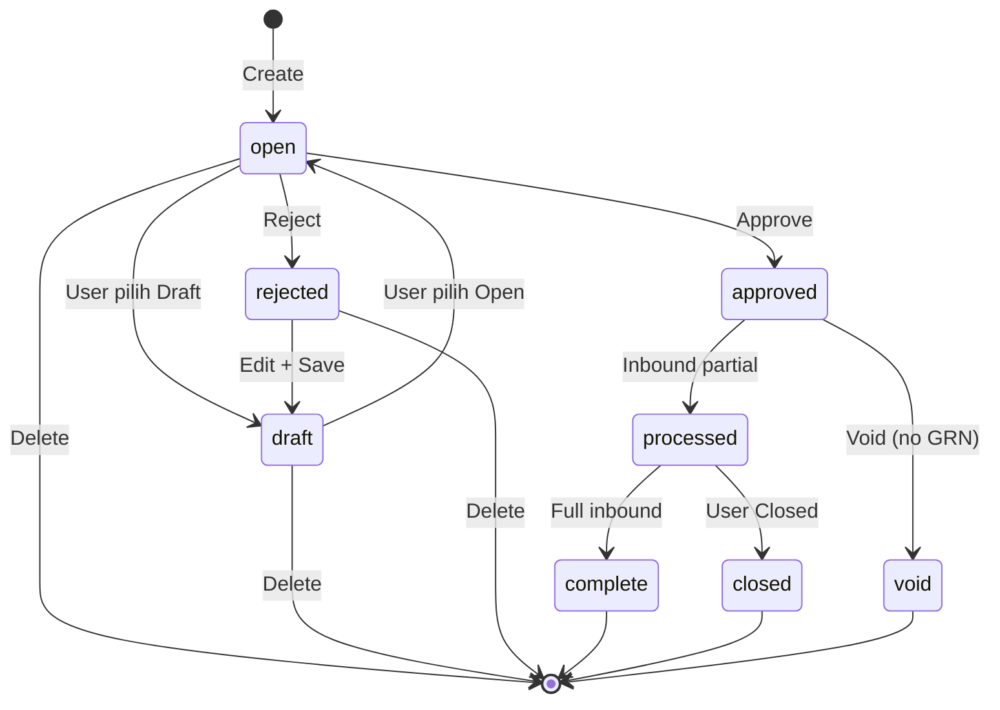
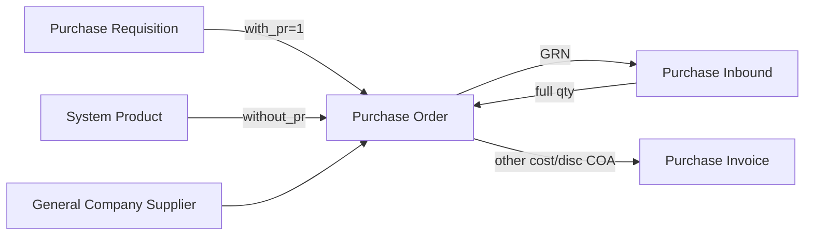

# Purchase Order — Requirement Documentation

**Modul:** Supply Chain Management (SCM) / Procurement  
**Prefix transaksi:** `PO-`  
**Audience:** PM, Operations, QA  
**Status:** AS-IS verified against codebase (compliance pass 2026-07-17)

**UI route:** `/supplychain/purchase-order`  
**PM source:** `purchase_order_requirement.md` v1.0 (2026-07-05)

---

## 0. Metadata & Changelog

| Version | Date | Author | Changes |
|---------|------|--------|---------|
| 1.0 | 2026-06-19 | QA - Yemima | Initial draft (AS-IS codebase auto-analysis) |
| 2.0 | 2026-07-05 | QA - Yemima | Full rewrite: merge PM requirement v1.0, import/export/print, pricing formulas, UI buttons, gaps §19–§20 |
| 2.1 | 2026-07-05 | QA - Yemima | GAP clarifications; import §12 expanded; §21 Pending Items Major |
| 2.2 | 2026-07-10 | QA - Yemima | Clarifikasi: COA Other Cost/Disc di PO = default; di PI bisa di-override; koreksi posisi jurnal PI |
| 2.3 | 2026-07-17 | QA - Yemima | Compliance qa-docs-standard: Prasyarat/FAQ; trim import teknis ke technical; hapus §20 DEV (rumah technical); stateDiagram |

---

## 1. Ringkasan Eksekutif

**Purchase Order (PO)** adalah dokumen pembelian formal ke **Supplier**. PO bisa **With PR** (berbasis Purchase Requisition outstanding) atau **Without PR** (produk langsung dari System Product). Setelah PO di-approve, barang diterima via **Purchase Inbound (GRN)**.

| Kebutuhan Bisnis | Bagaimana PO Menjawab |
|------------------|----------------------|
| Traceability PR → PO → Inbound | Field `prepared_to_po_quantity` / `processed_to_po_quantity` di PR; `processed_to_grn_quantity` di PO detail |
| Multi-currency | Currency + Exchange Rate per transaksi |
| Kontrol partial receiving | **Complete** (auto full inbound) vs **Closed** (manual stop sisa qty) |
| Harga & pajak per baris | Unit price, discount %, VAT include/exclude, DPP per pivot tax |
| Biaya/diskon header | Other Cost / Other Discount → grand total + jurnal Purchase Invoice |

### 1.1 Dua tipe PO

| Tipe | `with_pr` | Sumber detail |
|------|-----------|---------------|
| **Without PR** | `0` | System Product aktif (Single/Variant, punya COA group) |
| **With PR** | `1` | Baris PR outstanding (status approved/processed, sisa qty) |

---

## 1.2 Prasyarat

| Prasyarat | Sumber | Catatan |
|-----------|--------|---------|
| Supplier accounting lengkap | General Company | Select2 filter — tidak 100% → tidak muncul |
| With PR: PR approved/processed + sisa qty | Purchase Requisition | Tanggal PR sebelum tanggal PO |
| Without PR: produk aktif + COA group | System Product | Bukan bundle/random |
| Currency + exchange rate | Master Currency | Rate default 1; foreign diubah manual |
| Fiscal period terbuka | Accounting period | Validasi store/approve |

## 2. Siklus Status Transaksi

### 2.1 Diagram (AS-IS)

### 2.2 Definisi status

| Status | Definisi | Bisa edit? |
|--------|----------|------------|
| **draft** | User switch manual dari Open; atau setelah reject + save | Ya |
| **open** | Default setelah create; siap approve | Ya |
| **approved** | Sudah disetujui (single-level) | Tidak |
| **rejected** | Ditolak approver | Ya |
| **processed** | Sebagian/seluruh qty sudah masuk Purchase Inbound | Tidak |
| **complete** | **Otomatis** — semua qty PO sudah diterima inbound approved | Tidak |
| **closed** | **Manual** — user close dari **processed** (sisa qty tidak dilanjutkan inbound) | Tidak |
| **void** | Dibatalkan dari **approved** (bukan draft/open) | Tidak |

### 2.3 PO selesai — dua jalur (tidak bisa inbound baru)

| # | Jalur | Trigger | Status UI |
|---|-------|---------|-----------|
| 1 | **Otomatis (system)** | Σ `order_quantity_in_base_unit` = Σ `processed_to_grn_quantity` | **`complete`** |
| 2 | **Manual (end user)** | Klik **Closed** saat PO **`processed`** | **`closed`** |

Keduanya: sisa qty tidak bisa dibuatkan Purchase Inbound baru; header & detail read-only.

### 2.3.1 Tujuan tombol **Closed** (codebase)

Tombol **Closed** muncul saat PO status **`processed`** — artinya **sudah ada** aktivitas Purchase Inbound (sebagian qty sudah diterima), tapi **belum** full (`complete`).

| Aspek | **Complete** (otomatis) | **Closed** (manual) |
|-------|-------------------------|---------------------|
| Trigger | Semua qty PO sudah inbound approved | User klik Closed dari **processed** |
| Sisa qty | 0 — semua terpenuhi | **Masih ada** sisa yang belum di-inbound |
| Inbound baru | Tidak perlu (sudah full) | **Diblok** — error `"Document purhase order has been closed."` |
| Use case bisnis | Supplier kirim semua | Supplier **tidak akan kirim sisa** / procurement putuskan stop receiving |

**Catatan:** PM dokumen menyebut Closed dari approved+partial; AS-IS inbound partial → **processed** dulu, baru Closed. Bukan bug — Close = stop sisa setelah pernah inbound.

### 2.4 Draft vs Open

- **Create:** backend selalu simpan **`open`** (radio draft di UI tidak apply saat first create).
- **Switch:** radio Draft / Open di sidebar form — `PUT` update `transaction_status`.
- **Reject + save:** header → **draft** (sama seperti PR); user harus set **Open** lalu save sebelum approve lagi.

### 2.5 Transisi otomatis lainnya

| Trigger | Status baru |
|---------|-------------|
| `store()` create | **open** |
| Detail add/delete (With PR, pre-approve) | Update PR `prepared_to_po_quantity` |
| PO approve + With PR | PR `processed_to_po_quantity` ↑, `prepared_to_po_quantity` ↓; PR header bisa → **complete** |
| Inbound partial | PO **processed** (observer detail) |
| Inbound full qty | PO **complete** |
| Inbound void semua qty | PO revert **approved** |
| Approve | **approved** |
| Reject | **rejected** |
| Close (`approval_status=closed`) | **closed** |
| Void (`approval_status=void`) | **void** |

---

## 3. Datalist — Kolom & Fitur

### 3.1 Kolom (AS-IS)

| Kolom | Visible default | Keterangan |
|-------|-----------------|------------|
| TRX. DATE | false | Sortable date |
| TRX. CODE / TRX. DATE | true | Link edit |
| PRODUCT | false | Search SKU dalam detail PO (Advanced Filter) |
| SUPPLIER | true | Nama supplier |
| YOUR REF. | true | `supplier_reference_document` |
| TRX. REF. | true | Nomor PR (comma-separated jika multiple) |
| Qty | true | Sum qty detail **tanpa konversi unit** |
| CURR. | true | Currency code |
| EXCHANGE | true | Exchange rate |
| Net Purchase | true | `grand_total_after_vat` (termasuk Other Cost/Disc) |
| Description | true | Header description |
| Trx. Status | true | Tooltip status lengkap |
| Data Owner, Created/Updated By | true | Default DataTablesV3 |
| Action | true | §3.2 |

### 3.2 Action button per status (AS-IS)

| Aksi | Kondisi |
|------|---------|
| **Edit** (Show read-only untuk approved+) | `can_update` atau status terminal dengan render_update |
| **Delete** | draft/open/rejected + privilege |
| **Approve** | **open** + `can_approve` |
| **Void** | **approved** + `can_void` + approval privilege |
| **Closed** | **processed** + `can_closed` |
| **Print** | Semua status (sidebar form + policy view) |
| **Bulk Approve / Bulk Delete** | Multi-select |

**Catatan PM vs AS-IS — Void:**
- PM: Void dari **draft/open/rejected** jika 0 inbound.
- **AS-IS:** Void hanya dari **approved** (`can_void`). Draft/open/rejected → gunakan **Delete**, bukan Void.

**Catatan PM vs AS-IS — Closed:** PM doc menyebut Closed dari **approved**. AS-IS: partial inbound → status **processed** dulu, baru tombol Closed tersedia. Lihat §2.3.1 untuk tujuan tombol.

### 3.3 Fitur datalist

| Fitur | AS-IS |
|-------|-------|
| Global Search | ✅ |
| Advanced Filter | ✅ — kolom Product (hidden) searchable |
| Show Deleted | ✅ |
| Column Show/Hide | ✅ |
| Export Advanced | ✅ **With Details**, **Without Details**, **This Page Only** — async + tab Export File |

---

## 4. Create / Edit — Basic Information

| Field | Wajib? | Default | Validasi AS-IS | Catatan |
|-------|--------|---------|----------------|---------|
| Transaction Code | — | Auto `PO-*` | Unique per company | Disabled saat edit |
| Transaction Date | **Required** | Now | ≤ today; fiscal period | **Terkunci** jika sudah ada detail (currency/supplier/payment/date) |
| Valid Until Date | Opsional | null | Date | |
| Estimated Arrival | Opsional | null | Date | |
| Supplier | **Required** | — | General Company `is_supplier=1`, active, **accounting setting 100%** | Select2 max 25 |
| Payment Type | Opsional | Dari supplier master (`payment_and_currency`) | Integer FK | Default FE fallback id **8** |
| Currency | **Required** | Dari supplier / id **1** | Active currency | |
| Exchange Rate | **Required** | User input; min **1** | = **1** wajib jika currency primer | **Tidak auto-fetch** rate saat ganti currency |
| Type (With/Without PR) | **Required** | — | `with_pr` 0/1 | FE **disable** jika sudah ada detail; import bisa overwrite `with_pr` |
| Your Ref | Opsional | — | Max **50** | `supplier_reference_document` |
| Description | Opsional | — | Max 150 | |
| Term & Condition | Opsional | — | Max 150 | |
| Shipping / Billing Address | Opsional | — | Text | |
| Upload Files | Opsional | — | xlsx, xls, docx, doc, pdf, jpeg, jpg | |

**Status radio (edit only):** Draft / Open — pilih sebelum Save All.

---

## 5. Section PO Detail — Tipe With PR

### 5.1 Konsep

SKU hanya dari PR **approved** atau **processed** dengan outstanding qty; PR `transaction_date` < PO `transaction_date`; baris parent tree only.

Endpoint outstanding: `GET purchase-order-detail/outstanding?purchase_order_id={id}`

### 5.2 Modal Available Product (Outstanding PR)

| Kolom | Visible default | Keterangan |
|-------|-----------------|------------|
| System Product SKU / Name | true | Tombol **Use** per row |
| Availability | true | Stok realtime all WH |
| Req. Qty | true | Qty PR |
| Unit | true | Unit PR |
| PO Status | true | Prepared / Processed qty ke PO |
| Code PR | false | Nomor PR |
| **Already Prepared** | false | **1** jika `prepared_to_po + processed_to_po = qty` (PR line full ke PO) |
| Action | true | **Use** → modal Single Use |

### 5.3 Modal Single Use (With PR)

| Field | Keterangan |
|-------|------------|
| Purchase Requisition Reference | Nomor PR |
| Request Quantity | Qty PR (converted ke unit terpilih) |
| Prepared / Processed to PO Qty | Tracking qty ke PO draft/approved |
| Highest / Lowest / Latest / Average / Avg 30 Days (IDR) | Dari `Product::highestPrice()` dll via `baseToPrimary()` |
| Unit | Primary + alternate — **bisa beda dari unit PR** |
| Purchase Order Quantity | Input qty PO — **integer** (manual) |
| Price (IDR) | Editable; autofill dari latest price logic |
| Qty in Base Unit / Price in Pieces | FE: `qty × conversion_rate`; `price / conversion_rate` |
| Warranty | Master Warranty (informatif) |
| Discount (%) | Per baris |
| VAT (%) | Autofill dari Purchase VAT Setting jika supplier `auto_add` + product tax pivot; toggle **Include/Exclude** |
| Required Delivery Date | Opsional |
| Net Purchase | Preview FE dari price × qty − disc + VAT |
| **Allocate Full Qty Clearing** | Set `order_quantity = round(poBalance)` — untuk sisa outstanding PR desimal |

**Backend:** flag `isFullAlocated` dikirim FE tapi **tidak diproses** server — qty sudah di-set client-side.

### 5.4 Datatable detail (PrimeDataTables)

| Kolom | Inline edit? | Keterangan |
|-------|--------------|------------|
| SKU / Name | — | |
| Availability | — | Realtime |
| Req Qty | — | Dari PR |
| PO Qty | ✅ | Selama `can_update` |
| Unit | ✅ | Konversi qty otomatis saat ganti unit |
| Unit Price | ✅ | |
| Disc (%) | ❌ | Hanya via modal Edit |
| DPP | — | Sum pivot `dpp_amount` |
| VAT | — | Sum pivot `vat_amount` |
| Total Price | — | `price_after_vat` |
| Action Edit/Delete | — | Hanya jika `can_update`; bundle child: edit ✓ delete ✗ |

### 5.5 Validasi konversi unit (With PR)

Saat ganti unit inline atau di modal:
- Qty PO dikonversi ke base unit dibanding outstanding PR.
- Jika melebihi sisa PR → error; qty auto-adjust saat unit berubah.

---

## 6. Section PO Detail — Tipe Without PR

| Aspek | Perbedaan vs With PR |
|-------|---------------------|
| Sumber SKU | Select2 product transaksi — active, COA group, exclude bundle/random |
| Modal Available Product | Master product (bukan PR outstanding) |
| Req Qty kolom | **Tidak ada** |
| Allocate Full Qty Clearing | **Tidak ada** |
| PR qty tracking | **Tidak** update PR |

Bulk add multiselect: qty default **1**, unit stock, `latestPrice()`, auto taxes.

---

## 7. Section Additional Cost

| Field | Rule |
|-------|------|
| Additional Cost | FK Master Other Cost **active** |
| Amount | Required, ≥ 0 |
| Cost Description | Max 150 |

- Tidak masuk perhitungan PPN per baris.
- Recalculate `grand_total_before_vat` / `grand_total_after_vat`.
- COA dari master di-copy ke line PO, lalu ke PI sebagai **default**.
- Di **Purchase Invoice**, COA baris Additional Cost **bisa di-override** sebelum approve; Amount dari PO **locked**. Lihat [PI §8.3](../accounting-supplier-invoice/requirement.md#83-coa-editable-per-baris-change-req-2026-07).
- Penjurnalan di PI: Other Cost → posisi **Debit** (expense COA baris PI).

---

## 8. Section Additional Disc

Struktur paralel Other Cost.

- Di PI: COA Additional Discount **editable**; Amount dari PO **locked**.
- Penjurnalan di PI: Other Discount → posisi **Credit**.

Guard: grand total before VAT tidak boleh < 0 setelah insert/update.

---

## 9. Section Totals

| Field | Kalkulasi AS-IS |
|-------|-----------------|
| Total Products | Σ(`each_price_before_discount_before_vat × order_quantity`) — tooltip bisa tampilkan Total DPP |
| Disc Products | Σ diskon produk per baris |
| Total VAT | Σ VAT per baris |
| Total Additional Cost | Σ other costs |
| Total Additional Disc | Σ other discounts |
| **Net Purchase** | `grand_total_after_vat` = subtotal after VAT + Other Cost − Other Disc |

### 9.1 Rumus per baris (DPP / VAT / Total)

Perhitungan baris (DPP / VAT):

| Kondisi | Perhitungan |
|---------|-------------|
| VAT **Exclude** | `each_tax = each_price_after_discount_before_vat × rate` |
| VAT **Include** | Back-calculate base dari harga after VAT |
| **Coefficient** tax | Rate dipaksa **11%** untuk kalkulasi jika `tax.coefficient = true` |
| **DPP** | `each_dpp = each_tax / fake_rate` (fake_rate = sum pivot % / 100) |
| **Total Price** | `price_after_vat = each_dpp + each_tax` per qty |

Pivot tax disimpan di `scm_purchase_order_detail_tax`.

---

## 10. Section Approval

| Informasi | AS-IS |
|-----------|-------|
| Log | Slideover **Approval** |
| Approve/Reject | Modal approval — **Description** opsional (max 150) |
| Level | **Single-level** |
| Eligibility | Tab **Approval Eligibility** |
| Void / Closed | Dialog Void / Closed — description opsional |

**Catatan:** approve eligibility masih punya sisa cek status legacy multi-level; reject set status **rejected**.

---

## 11. Section Audit Log

Audit menampilkan header, detail (termasuk soft-deleted), attachments, other costs/discounts.

---

## 12. Import Detail Purchase Order

### 12.1 Ringkasan perilaku

| Item | Nilai AS-IS |
|------|-------------|
| Deteksi With/Without PR | Baris 2 kolom A: terisi → With PR; kosong → Without PR |
| Side effect tipe | Import sukses **overwrite** flag tipe PO sesuai file |
| Max baris | **500** |
| Re-upload | Bisa ganti semua detail existing |
| VAT / warranty | Auto dari master produk (bukan kolom Excel) |
| Wiring teknis | Class/import job/API: [technical §9](./technical.md#9-import-detail) |

### 12.2 Template Excel — struktur file

**Baris 1** = header (label exact kolom B–H wajib match).  
**Baris 2+** = data produk.

Satu file fleksibel — **mode With PR vs Without PR** ditentukan oleh isi kolom A di **seluruh file** (tidak boleh campur):

| Mode | Kolom A semua baris data | Header kolom A |
|------|--------------------------|----------------|
| **With PR** | Semua baris **wajib** isi kode PR | Tidak divalidasi exact (boleh kosong di header row) |
| **Without PR** | Semua baris **kosong** | — |

**Campuran** (sebagian baris ada PR Code, sebagian kosong) → **gagal total** per baris kosong: `Row {n}: PR Number is empty. When using PR references, every row must include a PR number.`

### 12.3 Kolom import — data yang harus diisi

| Kolom Excel | Header exact (baris 1) | Wajib? | Format / isi | Dipakai untuk |
|-------------|------------------------|--------|--------------|---------------|
| **A** | *(bebas / kosong di header)* | With PR: **Ya** per baris | Kode transaksi PR exact, contoh `PR-20250705-001` | Lookup `PurchaseRequisition` → resolve `purchase_requisition_detail_id` by PR + SKU |
| **B** | `System Product SKU` | **Ya** | SKU exact dari System Product company | Lookup product; exclude bundle child |
| **C** | `PO Qty` | **Ya** | Integer atau double; **> 0** | `order_quantity` |
| **D** | `Unit` | **Ya** | Kode unit exact (case sensitive match ke master) | `order_quantity_unit_id` — primary stock unit atau alternate unit product |
| **E** | `Unit Price` | **Ya** | Integer atau double; **≥ 1** | `each_price_before_discount_before_vat` |
| **F** | `Disc.` | Opsional | Integer/double; **≥ 0** jika diisi | `purchase_discount` (%) |
| **G** | `Description` | Opsional | Freetext max ~150 | Remark baris detail |
| **H** | `Required Delivery Date` | Opsional | **Excel serial date** (integer) — bukan string `DD/MM/YYYY` | `required_delivery_date` — dikonversi `(cell - 25569) × 86400` |

VAT / warranty / PR detail ID **tidak** di template — diisi sistem saat import.

### 12.4 Template Without PR (belum aktif)

Mode Without PR via class terpisah **belum di-wire**. Jika diaktifkan nanti: kolom A = Product ID; batas baris historis **100** (inkonsisten vs 500). Lihat GAP-PO-04 / technical.

### 12.5 Validasi file-level

| # | Kondisi | Pesan error |
|---|---------|-------------|
| F-01 | File bukan `.xlsx`/`.xls` | "The uploaded data format does not match the system." |
| F-02 | Batch import masih running | "Please wait, other import is being process" |
| F-03 | Header B–H label salah | "The file format doesn't match the system template." |
| F-04 | Hanya header, no data | "The imported file is empty. Please add at least one product." |
| F-05 | PO sudah punya detail + tipe file ≠ `with_pr` PO | "type of import not match" |
| F-06 | existing + import > **500** | "Cannot add more than 500 details to this transaction." |
| F-07 | Campuran baris With/Without PR dalam 1 file | PR Number empty per baris (lihat §12.2) |

### 12.6 Validasi per baris (ringkas)

Kategori gagal yang sering muncul di Import Log:

| Area | Contoh kondisi gagal |
|------|----------------------|
| PR Code | Kosong (mode With PR), tidak ditemukan |
| SKU | Kosong, tidak ditemukan, bundle, random |
| PO Qty | Kosong, bukan angka, ≤ 0 |
| Unit | Kosong, tidak ada di master, tidak terkait produk |
| Unit Price | Kosong, bukan angka, < 1 |
| Disc. | Bukan angka, < 0 |
| Delivery Date | Bukan Excel serial date |
| PR + SKU | PR valid tapi SKU tidak di outstanding PR |

Pesan exact per baris (R-01…R-19) & resolve PR detail: [technical §9](./technical.md#9-import-detail).

### 12.7 All-or-nothing vs partial

| Fase | Perilaku |
|------|----------|
| **Pre-validation (sync)** | Semua baris dicek di `collection()`. **Satu error → 0 job → 0 insert.** |
| **Job queue (async)** | Satu job per baris. Job gagal → log row; sibling yang sukses **tetap ada**. |

Import dari header **rejected** → status **draft**. Batch selesai → recalc grand totals.

### 12.8 Duplicate SKU

Tidak merge — baris valid = baris detail baru (bisa duplikat SKU).

### 12.9 Download template (GAP-PO-05)

Tombol download mengarah ke file static With-PR / Without-PR di `/files/…`. **AS-IS:** aset sering **404** — operator buat manual (§12.3) atau IT deploy. Detail path: [technical §1](./technical.md#1-file-map).

### 12.10 Monitoring import

Progress, import log, dan history tersedia di API import — lihat [technical §2 & §9](./technical.md).

---

## 13. Export

### 13.1 Export detail (single PO)

Export detail single PO (excel/csv):

Kolom: System Product SKU, Stok WH, Req Qty, Po Qty, Unit, Unit Price, Discount, VAT, Total Price

### 13.2 Export Advanced (datalist)

| Mode | Kolom utama |
|------|-------------|
| **With Details** | Trx Date, Code, Supplier, Currency, SKU, Unit Price, Qty, Unit, Disc %, Disc IDR, VAT, Total Price, Status, Created/Updated/Approved metadata |
| **Without Details** | Header only (~11 kolom) |
| **This Page Only** | Filter halaman aktif |

Async job → tab Export File.

---

## 14. Print Detail

**Output:** PDF

**Header:** Supplier, currency, your ref, PO number, dates, company logo/NPWP, QR = PO code.

**Detail columns:** No, Product Name, SKU, Qty, Unit (**dari PR detail unit** — Without PR bisa kosong), Cond., Delivery, Price, Extended Price.

**Totals di print:** Sub Total, Discount Total, VAT Total, Grand Total — **hanya dari detail lines**; **Other Cost/Discount TIDAK ikut**.

**Footer:** T&C, addresses, remark, creator + first approver signature.

---

## 15. Validasi yang Berjalan

| # | Validasi | Behavior |
|---|----------|----------|
| V-01 | Transaction date ≤ today | 422 |
| V-02 | Exchange rate min 1; primary currency = 1 | Error "Invalid rate" |
| V-03 | Supplier accounting complete | Excluded dari select2 |
| V-04 | With PR — SKU outside outstanding | Blocked / not in list |
| V-05 | Unit conversion vs PR outstanding | Error jika qty > sisa |
| V-06 | Approve | Status **open** only; min 1 detail |
| V-07 | Void | **Approved** only; block if **processed** (GRN exists) |
| V-08 | Close | **Processed** + approval privilege |
| V-09 | Delete header | **draft, open, rejected** |
| V-10 | Edit | Blocked approved/processed/complete/closed/void |
| V-11 | Max detail | **500** rows |
| V-12 | Fiscal period | create/update/approve |
| V-13 | Approval | Single-level; reject description opsional |
| V-14 | Qty manual | Integer — import allows angka > 0 (termasuk desimal) |
| V-15 | Grand total | Other cost/disc cannot make total before VAT < 0 |

---

## 16. Relasi Menu Lain

**GRN docs:** [supplychain-new-purchase-inbound requirement v2.0](../supplychain-new-purchase-inbound/requirement.md) (BETA UI + COLLI). Legacy UI: [supplychain-mutation-inbound](../supplychain-mutation-inbound/README.md).

Cross-ref PR: [supplychain-purchase-requisition requirement §2.3](../supplychain-purchase-requisition/requirement.md).

### 16.1 Behavior Void/Delete PO vs PR (AS-IS)

| Event | PR effect AS-IS |
|-------|-----------------|
| Detail delete (pre-approve) | `prepared_to_po_quantity` **decrement** ✓ |
| Header delete | **Bug:** formula revert prepared salah (`DEV-PO-02`) |
| **Void approved PO** | **`processed_to_po_quantity` TIDAK di-revert** (`GAP-PO-01`) |
| Approve PO With PR | `processed_to_po_quantity` increment; PR bisa → **complete** |

---

## 17. Do's and Don'ts (ringkas)

**Do:** lengkapi accounting supplier; set Open sebelum Approve; ubah kurs foreign manual; Closed hanya jika sisa qty memang tidak dilanjutkan.  
**Don't:** void PO processed; expect Void dari draft/open (pakai Delete); import file dengan baris error; andalkan print untuk total termasuk Other Cost/Disc.

## 18. Acceptance Criteria (AS-IS)

Create open + With/Without PR · supplier filter · outstanding/Single Use · pricing + Other Cost/Disc · single-level approval · complete/closed · import max 500 · export/print · GRN drives processed/complete.

## 19. Gap PM vs AS-IS — penjelasan

| ID | PM / expect | AS-IS | Klasifikasi | Penjelasan |
|----|-------------|-------|-------------|------------|
| **GAP-PO-01** | Void PO → qty PR kembali available | Void **tidak revert** `processed_to_po_quantity` | **Not implemented** | → **Pending Major P-PO-01** (Finance) |
| **GAP-PO-02** | Void draft/open/rejected (0 inbound) | Void hanya **approved**; draft/open → **Delete** | **Design differs — confirmed OK** | PM expectation tidak match; AS-IS by design |
| **GAP-PO-03** | Closed dari **approved** partial inbound | Closed dari **processed** | **Bukan gap fungsional** | Partial inbound ubah status ke **processed** dulu. Tombol Close = stop sisa inbound (§2.3.1) |
| **GAP-PO-04** | Import Without PR aktif | Class Without PR tidak di-wire | **Not wired** | Mode Without PR via kolom A kosong; detail §12 / technical |
| **GAP-PO-05** | Template xlsx tersedia | File **404** di FE `/files/` | **Asset missing** | Lihat penjelasan §19.1 |
| **GAP-PO-06** | Print = Net Purchase layar | Print **exclude** Other Cost/Disc | **Incomplete print** | → **Pending Major P-PO-02** (End user) |
| **GAP-PO-07** | Type PO locked setelah create | Import overwrite `with_pr`; BE update tidak lock | **Partial gap** | Lihat penjelasan §19.2 |

### 19.1 GAP-PO-05 — Template file missing (detail)

Link download template di panel Import mengarah ke asset static yang **sering belum di-deploy** (404). Workaround: Excel manual (§12.3). Perbaikan: deploy 2 file template atau generate dinamis di FE. Path/detail: [technical §1](./technical.md#1-file-map).

### 19.2 GAP-PO-07 — Type PO bisa berubah (detail)

**Apa maksudnya — 3 lapisan berbeda:**

| Lapisan | Perilaku AS-IS |
|---------|----------------|
| **UI form** | Radio With/Without PR **disabled** (`disable_relation_pr=true`) jika PO **sudah punya detail** — user tidak bisa klik ganti tipe |
| **API update** | `PUT purchase-order/{id}` **masih terima** field `with_pr` — **tidak ada** guard "reject if details exist" (beda dengan supplier/currency yang di-lock) |
| **Import sukses** | Import **overwrite** flag tipe PO di header berdasarkan deteksi kolom A file |

**Risiko:** import file With PR ke PO Without PR (kosong detail) bisa overwrite tipe meski radio UI terkunci; jika sudah ada detail + tipe mismatch → error type not match. **PM expect:** tipe fixed setelah create. **AS-IS:** UI lock, API/import bisa drift.

---

## 20. Dev follow-ups

Daftar DEV-PO-* (void PR qty, destroy formula, print unit, Without PR import wiring, max_child unify): [technical §15 Known Issues](./technical.md#15-known-issues).

## 21. Pending Items — Major (diskusi stakeholder)

Butuh keputusan bisnis sebelum implementasi:

| ID | Priority | Stakeholder | Item | Konteks AS-IS | Keputusan dibutuhkan |
|----|----------|-------------|------|---------------|---------------------|
| **P-PO-01** | 🔴 **Highest** | **Finance + Procurement** | **Void PO harus revert qty PR?** (GAP-PO-01) | Saat PO With PR di-**void** setelah approve, `processed_to_po_quantity` di PR **tidak dikembalikan** — PR tetap "terkunci" seolah qty masih di PO. Delete detail pre-approve revert `prepared_to_po` ✓ | Apakah void PO wajib release qty ke PR outstanding? Impact: PR status, laporan open commitment, audit trail PR→PO |
| **P-PO-02** | 🔴 **Major** | **End user / Procurement** | **Print PDF harus sama dengan Net Purchase di layar?** (GAP-PO-06) | Layar form: Net Purchase = detail + VAT + **Other Cost** − **Other Disc**. Print PDF: Sub Total / VAT / Grand Total **hanya dari detail lines** — Other Cost/Disc **tidak tampil** | Apakah printout resmi ke supplier/internal harus mirror Totals section? Atau print hanya ringkasan barang? |
| **P-PO-03** | 🟡 Medium | **Dev + QA** | Deploy template import xlsx (GAP-PO-05) | Download template 404 — operator tidak punya file resmi | IT deploy 2 file template atau FE generate template |
| **P-PO-04** | 🟡 Medium | **PM + Dev** | Lock `with_pr` di backend + import (GAP-PO-07) | UI lock tapi API/import bisa ubah tipe | Apakah `with_pr` immutable setelah first detail / setelah create? |
| **P-PO-05** | 🟡 Medium | **Dev** | Enable import Without PR terpisah (GAP-PO-04) | Mode class terpisah disabled | Satu alur cukup atau perlu split + unify max 500? |

**Confirmed OK (bukan pending):** GAP-PO-02 (Void draft/open = Delete); GAP-PO-03 (Closed dari processed intentional).

---

## 22. FAQ

**Q: Kenapa supplier tidak muncul?**  
A: Accounting setting supplier belum 100% lengkap di General Company.

**Q: Setelah reject, kenapa belum bisa approve?**  
A: Reject + save → Draft. Set **Open** lagi sebelum Approve.

**Q: Void vs Delete?**  
A: Draft/Open/Rejected → **Delete**. Approved (belum inbound) → **Void**.

**Q: Void mengembalikan qty PR?**  
A: Belum (GAP-PO-01 / P-PO-01) — butuh keputusan Finance + Procurement.

**Q: Print beda dengan Net Purchase layar?**  
A: Print belum include Other Cost/Disc (GAP-PO-06 / P-PO-02).

## Related Documents

| Doc | Path |
|-----|------|
| Knowledge Base | [knowledge-base.md](./knowledge-base.md) |
| Technical | [technical.md](./technical.md) |
| User Guide | [user-guide.md](./user-guide.md) |
| Purchase Requisition | [../supplychain-purchase-requisition/requirement.md](../supplychain-purchase-requisition/requirement.md) |
| Other Cost | [../omni-other-cost/requirement.md](../omni-other-cost/requirement.md) |
| Supplier Invoice | [../accounting-supplier-invoice/requirement.md](../accounting-supplier-invoice/requirement.md) |
