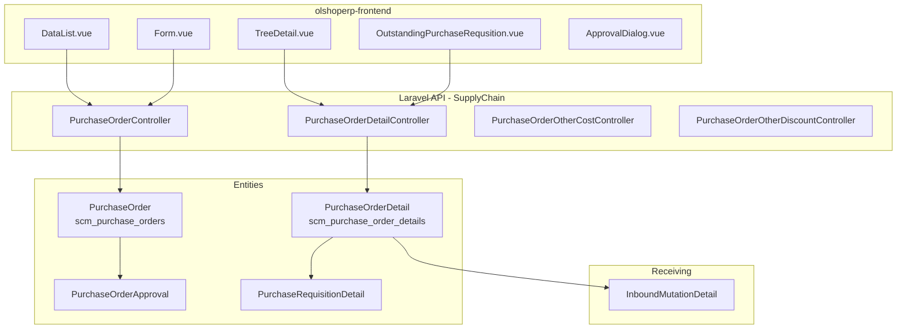
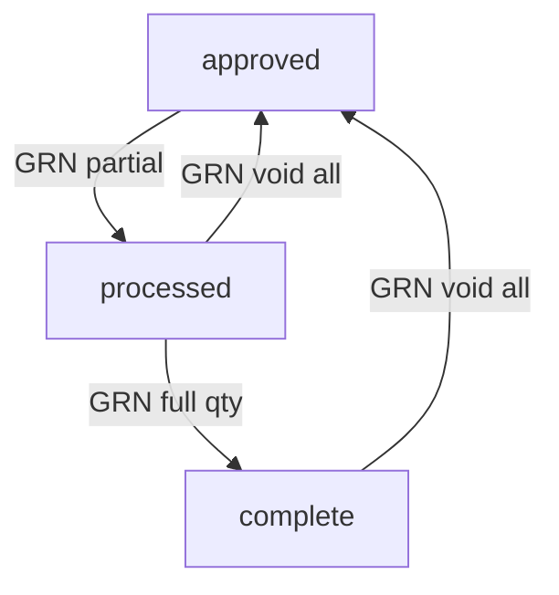

# Purchase Order — Technical Documentation

> **DRAFT** — Dokumen ini adalah draft awal hasil analisis codebase otomatis per 2026-06-19. Perlu direview PM/QA sebelum final.

**Stack:** Laravel 13 API · Vue 3 SPA  
**Primary module:** `Modules/SupplyChain`  
**Menu slug:** `supplychain-purchase-order`  
**UI route:** `/supplychain/purchase-order`  
**API base:** `{VITE_API_URL}supplychain/purchase-order*`

---

## 1. Architecture Overview

---

## 2. Frontend File Map

**Root:** `olshoperp-frontend/src/pages/SCM/PurchaseOrder/`

| File | Role | Key API |
|------|------|---------|
| `DataList.vue` | Datalist PO + export | `GET supplychain/purchase-order` |
| `Form.vue` | Create/edit header | `POST/PUT supplychain/purchase-order/{id}` |
| `HeaderBasicInformation.vue` | Form header supplier, currency, with_pr | select2 supplier, currency, payment |
| `TreeDetail.vue` | Detail tree grid | `purchase-order-detail` resource |
| `DatalistDetail.vue` | Detail flat list (PrimeVue) | `purchase-order-detail/primevue` |
| `OutstandingPurchaseRequsition.vue` | Panel PR outstanding (With PR) | `purchase-order-detail/outstanding` |
| `OtherCost.vue` / `OtherCostForm.vue` | Other cost CRUD | `purchase-order/{id}/other-costs` |
| `OtherDiscount.vue` / `OtherDiscountForm.vue` | Other discount CRUD | `purchase-order/{id}/other-discounts` |
| `ApprovalDialog.vue` | Submit approval | `POST purchase-order/{id}/approve` |
| `ApprovalEligibility.vue` | Eligible approvers | `purchase-order/approval-eligibility/{id}` |
| `DatalistLogApproval.vue` | Approval log | `purchase-order/{id}/log/approve` |

### Router (`src/router/index.ts`)

| Route | Component |
|-------|-----------|
| `supplychain/purchase-order` | `DataList.vue` |
| `supplychain/purchase-order/create` | `Form.vue` |
| `supplychain/purchase-order/edit/:id` | `Form.vue` |

---

## 3. Backend File Map

### 3.1 Controllers

| Class | Path | Responsibility |
|-------|------|----------------|
| `PurchaseOrderController` | `Modules/SupplyChain/Http/Controllers/PurchaseOrderController.php` | CRUD header, approve, export, select2, audit |
| `PurchaseOrderDetailController` | `Modules/SupplyChain/Http/Controllers/PurchaseOrderDetailController.php` | CRUD detail, PR bulk-use, import/export |
| `PurchaseOrderOtherCostController` | `.../PurchaseOrderOtherCostController.php` | Other cost lines |
| `PurchaseOrderOtherDiscountController` | `.../PurchaseOrderOtherDiscountController.php` | Other discount lines |

### 3.2 Models & policies

| Class | Table | Notes |
|-------|-------|-------|
| `PurchaseOrder` | `scm_purchase_orders` | `with_pr`, approval traits |
| `PurchaseOrderDetail` | `scm_purchase_order_details` | Observer update status via GRN qty |
| `PurchaseOrderApproval` | `scm_purchase_order_approvals` | Approval log |
| `PurchaseOrderApprovalEligibility` | `scm_purchase_order_approval_eligibilities` | |
| `PurchaseOrderPolicy` | — | `viewAny`, `create`, `update`, `approval` |

### 3.3 Jobs & imports

| Class | Purpose |
|-------|---------|
| `PurchaseOrderWithPrImportJob` | Import PO with PR |
| `PurchaseOrderWithoutPrImportJob` | Import PO without PR |
| `PurchaseOrderExportJob` | Async export header |
| `PurchaseOrderDetailExportJob` | Async export detail |

---

## 4. API Routes

**Prefix:** `supplychain` · **Middleware:** `auth:sanctum`, `auth_verified`  
**File:** `Modules/SupplyChain/Routes/api.php`

| Method | Path | Controller@method |
|--------|------|-------------------|
| GET | `purchase-order` | `PurchaseOrderController@index` |
| POST | `purchase-order` | `PurchaseOrderController@store` |
| GET | `purchase-order/{id}` | `PurchaseOrderController@show` |
| PUT | `purchase-order/{id}` | `PurchaseOrderController@update` |
| DELETE | `purchase-order/{id}` | `PurchaseOrderController@destroy` |
| POST | `purchase-order/{id}/approve` | `PurchaseOrderController@approve` |
| GET | `purchase-order/{id}/log/approve` | `PurchaseOrderController@purchaseOrderApprovalLog` |
| GET | `purchase-order/approval-eligibility/{id}` | `PurchaseOrderController@purchaseOrderApprovalEligibility` |
| GET | `purchase-order-detail/outstanding` | `PurchaseOrderDetailController@outstanding_purchase_request_details` |
| POST | `purchase-order/{po}/purchase-order-detail` | `PurchaseOrderDetailController@store` |
| POST | `purchase-order-detail/{pr_id}/bulk-use` | `PurchaseOrderDetailController@bulkUse` |

---

## 5. Database

### 5.1 Header `scm_purchase_orders`

| Column | Keterangan |
|--------|------------|
| `code` | Kode PO (prefix PO) |
| `with_pr` | 1 = With PR, 0 = Without PR |
| `supplier_id` | FK General Company |
| `transaction_status` | open → approved → processed → complete |
| `currency_id`, `exchange_rate` | Mata uang transaksi |
| `grand_total_before_vat`, `grand_total_after_vat` | Total header |

### 5.2 Detail `scm_purchase_order_details`

| Column | Keterangan |
|--------|------------|
| `purchase_order_id` | FK header |
| `product_id` | FK product |
| `order_quantity`, `order_quantity_in_base_unit` | Qty pesan |
| `processed_to_grn_quantity` | Qty sudah diterima inbound |
| `prepared_to_grn_quantity` | Qty disiapkan ke inbound |
| `purchase_requisition_detail_id` | FK PR detail (With PR) |

### 5.3 Status transition (GRN observer)

---

## 6. Key Integration Points

| Sistem | Mekanisme |
|--------|-----------|
| Purchase Requisition | `approvePurchaseOrder()` increment/decrement PR qty |
| Inbound (GRN) | `InboundMutationDetail.purchase_order_detail_id`; observer PO detail |
| Product pricing | `ProductCalculation::getProductMaBuffer`, `getProductPriceHistory` on approve |
| General Company | Supplier select2 `select2-general-company` filter `is_supplier` |
| Fiscal period | `validate_fiscal_period()` on create/update/approve |

---

## 7. Permissions

Policy: `PurchaseOrderPolicy` — actions: `viewAny`, `view`, `create`, `update`, `delete`, `approval`.

Approval eligibility: `PurchaseOrderApprovalEligibility` + trait `ApprovalHandlerTrait` pada entity.
