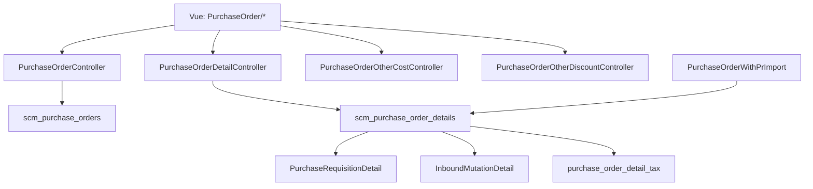

# Purchase Order — Technical Documentation

## 1. Architecture Overview



---

## 2. Frontend File Map

**Root:** `olshoperp-frontend/src/pages/SCM/PurchaseOrder/`

| File | Role |
|------|------|
| `DataList.vue` | Index, bulk approve/delete, export advanced |
| `Form.vue` | Header, sidenav, approve/void/close/print, totals |
| `HeaderBasicInformation.vue` | Summary header display |
| `DatalistDetail.vue` | PrimeVue detail grid, import/export, Single Use modal |
| `OutstandingPurchaseRequsition.vue` | Outstanding PR panel (With PR) |
| `OtherCost.vue` / `OtherCostForm.vue` | Additional cost CRUD |
| `OtherDiscount.vue` / `OtherDiscountForm.vue` | Additional discount CRUD |
| `DatalistLogApproval.vue` | Approval slideover |
| `ApprovalEligibility.vue` | Eligibility datatable |
| `TreeDetail.vue` | Bundle/BOM tree lines |

**Routes:** `/supplychain/purchase-order`, `/create`, `/edit/:id`

**Import templates (expected static):**
- `/files/Template-Import-PO-With-PR.xlsx`
- `/files/Template-Import-PO-Without-PR.xlsx`

---

## 3. Backend File Map

| File | Role |
|------|------|
| `PurchaseOrderController.php` | CRUD, approve, print, export, payment/currency |
| `PurchaseOrderDetailController.php` | Detail CRUD, outstanding, bulk-use, import upload |
| `PurchaseOrderWithPrImport.php` | Excel parse + validation (active) |
| `PurchaseOrderWithoutPrImport.php` | Without PR import (**not wired**) |
| `PurchaseOrderWithPrImportJob.php` | Per-row insert queue |
| `PurchaseOrderDetailExport.php` | Single PO export |
| `PurchaseOrderDetailExportAll.php` | Advanced export staging |
| `PurchaseOrderDetailExportJob.php` | Async export worker |
| `Entities/PurchaseOrder.php` | Header model |
| `Entities/PurchaseOrderDetail.php` | Detail + GRN status observer |
| `Policies/PurchaseOrderPolicy.php` | Authorization |

**Helpers:**
- `app/Helpers/SupplyChain/PurchaseOrderPrice.php` — grand totals
- `app/Helpers/SupplyChain/PurchaseOrderDetailPrice.php` — line DPP/VAT

**Print blade:** `Modules/SupplyChain/Resources/views/pages/purchase-order/print.blade.php`

---

## 4. API Routes ( utama )

| Method | Path | Action |
|--------|------|--------|
| GET | `/purchase-order` | index datalist |
| POST | `/purchase-order` | store |
| GET | `/purchase-order/{id}` | show |
| PUT | `/purchase-order/{id}` | update |
| DELETE | `/purchase-order/{id}` | destroy |
| POST | `/purchase-order/{id}/approve` | approve/reject/void/closed |
| GET | `/purchase-order/{id}/print` | PDF |
| GET | `/purchase-order/{id}/audit` | audit |
| GET | `/purchase-order/{id}/log/approve` | approval log |
| GET | `/purchase-order/payment_and_currency/{supplier}` | default payment & currency |
| GET | `/purchase-order-detail/outstanding` | PR outstanding panel |
| POST | `/purchase-order/{po}/purchase-order-detail` | store detail |
| POST | `/purchase-order-detail/{pr_id}/bulk-use` | bulk use PR lines |
| GET | `/purchase-requisition-detail/{id}/show-for-po` | Single Use modal data + prices |
| POST | `/purchase-order/{id}/show/upload` | import detail |
| GET | `/purchase-order/{id}/show/export-excel` | export detail |
| POST | `/purchase-order/export-all` | advanced export |

---

## 5. Database Schema

### `scm_purchase_orders`

| Column | Note |
|--------|------|
| `code` | PO-{…} |
| `with_pr` | 0/1 |
| `supplier_id` | FK General Company |
| `currency_id`, `exchange_rate` | |
| `payment_type_id` | |
| `supplier_reference_document` | max 50 |
| `grand_total_before_vat`, `grand_total_after_vat` | |
| `transaction_status` | draft/open/approved/… |

### `scm_purchase_order_details`

| Column | Note |
|--------|------|
| `purchase_order_id`, `product_id` | |
| `purchase_requisition_detail_id` | With PR FK |
| `order_quantity`, `order_quantity_in_base_unit` | |
| `each_price_before_discount_before_vat` | |
| `purchase_discount` | % |
| `prepared_to_grn_quantity`, `processed_to_grn_quantity` | Inbound linkage |
| `price_discount`, `price_vat`, `price_after_vat` | Stored rollups |

### Supporting

| Table | Role |
|-------|------|
| `scm_purchase_order_detail_tax` | VAT pivot per line |
| `scm_purchase_order_approvals` | Approval log |
| `scm_purchase_order_other_costs` | Additional cost |
| `scm_purchase_order_other_discounts` | Additional disc |
| `scm_purchase_order_detail_import_histories` | Import batch |
| `scm_purchase_order_detail_import_logs` | Per-row import errors |
| `scm_purchase_order_export_temps` | Advanced export staging |

---

## 6. Status Engine

### PO selesai — dua jalur

| Jalur | Trigger | Status |
|-------|---------|--------|
| Auto | Σ `order_quantity_in_base_unit` = Σ `processed_to_grn_quantity` | `complete` |
| Manual | `approval_status=closed` from **processed** | `closed` |

### Observer (`PurchaseOrderDetail.php` booted)

```php
// complete: sum(order_quantity_in_base_unit) == sum(processed_to_grn_quantity)
// processed: any prepared_to_grn_quantity > 0 OR processed_to_grn_quantity > 0
// revert to approved: processed/complete → all GRN qty sums == 0
```

### Approval

- Menu `PurchaseOrder::class` → `gate_menus.approval = 1` (**single-level**)
- `can_void`: `transaction_status === approved` + approval permission
- `can_closed`: `transaction_status === processed` + approval permission
- Void blocked on `processed`: `'Document have been prepared at purchase'`

### PR qty on PO lifecycle

| Event | PR detail fields |
|-------|------------------|
| Detail store (With PR) | `prepared_to_po_quantity` increment |
| Detail destroy (pre-approve) | `prepared_to_po_quantity` decrement |
| PO approve (With PR) | `processed_to_po_quantity` ↑, `prepared_to_po_quantity` ↓ |
| PO void | **No revert** (GAP) |
| Header destroy | **Buggy update** (DEV-PO-02) |

---

## 7. Pricing Engine

### Line tax (`PurchaseOrderDetailPrice::withTax`)

```php
$discounted_ratio = 1.0 - $detail->purchase_discount / 100;
// Exclude: each_tax = each_price_after_discount_before_vat * rate
// Include: back-calculate from after-VAT price
// coefficient: rate forced to 11% when tax.coefficient
$each_dpp = $each_tax / $fake_rate;
```

### Grand total (`PurchaseOrderPrice::grandTotal`)

```php
grandTotalBeforeVat = subTotalBeforeVat + totalOtherCost - totalOtherDiscount
grandTotalAfterVat  = subTotalAfterVat  + totalOtherCost - totalOtherDiscount
```

### Price hints (With PR modal)

`showPurchaseRequisitionDetail()` → `highestPrice()`, `lowestPrice()`, `latestPrice()`, `maPrice()`, `MaPrice30Days()` via `baseToPrimary()`.

---

## 8. Import Detail

**Active class:** `PurchaseOrderWithPrImport` only  
**Upload:** `PurchaseOrderDetailController@uploadFilePo`

### Type detection

Row index 1 (Excel row 2), column A non-null → `with_pr=1`; else `with_pr=0`. Updates PO header on successful validation.

### Header validation (cols B–H exact)

`System Product SKU` | `PO Qty` | `Unit` | `Unit Price` | `Disc.` | `Description` | `Required Delivery Date`

### Limits

```php
config('general.max_child_500') // = 500 — import + manual validate_max_details
// PurchaseOrderWithoutPrImport (inactive) uses max_child = 100
```

### Batch

- Name: `PurchaseOrderWithPrImport-{po_id}`
- Queue: `import_connection_{git_branch}`
- Pre-validation fail → `ValidationException` + import logs
- Success → recalc grand totals in batch `finally`

### Without PR class (not wired)

Expects col A header `Product ID`; would use `PurchaseOrderWithoutPrImportJob`.

---

## 9. Export

### Detail export columns

SKU, Stok WH, Req Qty, Po Qty, Unit, Unit Price, Discount, VAT, Total Price

### Advanced export

Staging: `PurchaseOrderExportTemp` · Job: `PurchaseOrderDetailExportJob` · Service: `PurchaseOrderExportService`

Modes: `EXPORT_WITH_DETAILS`, `EXPORT_WITHOUT_DETAILS`, page filter snapshot.

---

## 10. Print Pipeline

`print()` loads supplier, details+PR unit, approvals; computes subTotal/discountTotal/vatTotal/grandTotal **from detail lines only** (excludes other cost/disc).

Blade renders extended price = `each_price × qty` without full VAT breakdown per column.

---

## 11. Supplier Select2

`GeneralCompanyController@select2`:
- `company_type = general`, `is_supplier = 1`, `status = 1`
- Requires complete accounting COA tagging match
- Limit 25 results

---

## 12. Testing Notes

| Scenario | Expected |
|----------|----------|
| Create PO | status open |
| Approve without detail | Error |
| Import 501 rows | Fail max_child_500 |
| Import 1 bad row | 0 rows inserted (pre-validation) |
| GRN full qty | PO complete |
| Closed on processed | status closed |
| Void on processed | Error |
| Void on approved (no GRN) | status void; PR qty **unchanged** (GAP) |
| Delete header With PR | PR prepared qty **bug** (DEV-PO-02) |

---

## 13. Dev Team — Technical Follow-ups

### DEV-PO-01 — Void tidak revert PR processed qty

**Impact:** PM expect PR available setelah void; AS-IS qty tetap ter-lock di `processed_to_po_quantity`.

**Fix:** On void approved With PR PO, decrement `processed_to_po_quantity` per line; re-evaluate PR header status.

### DEV-PO-02 — Header destroy PR revert formula

**File:** `PurchaseOrderController@destroy` L732–734

```php
// Current (wrong):
'prepared_to_po_quantity' => $detail->order_quantity_in_base_unit - $pr_detail->prepared_to_po_quantity
// Should be decrement by order_quantity_in_base_unit
```

### DEV-PO-03 — can_approve vs rejected status

**File:** `MainModel::canApprove()` checks `TS_DECLINED`; reject sets `TS_REJECTED`.

### DEV-PO-04 — isFullAlocated unused

FE sends flag; `PurchaseOrderDetailController` ignores it.

### DEV-PO-05 — Print unit from PR only

**File:** `print.blade.php` — Without PR lines may show empty unit.

### DEV-PO-06 — Wire Without PR import + template assets

Uncomment `PurchaseOrderWithoutPrImport` in `uploadFilePo`; add xlsx to `public/files/`.

### DEV-PO-07 — Unify max_child limits

With PR import: 500; Without PR class: 100; align config.

---

## Related Documents

| Doc | Path |
|-----|------|
| Requirement | [requirement.md](./requirement.md) |
| Knowledge Base | [knowledge-base.md](./knowledge-base.md) |
| Purchase Requisition | [../supplychain-purchase-requisition/technical.md](../supplychain-purchase-requisition/technical.md) |
