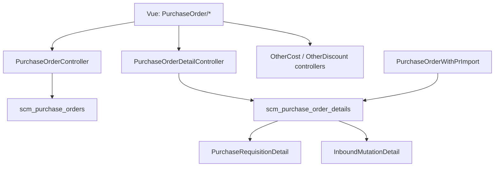
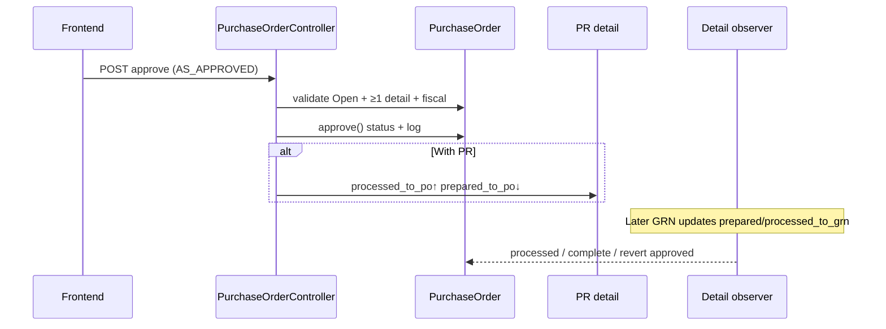

# Purchase Order — Technical Documentation

**API prefix:** `supplychain/purchase-order`  
**Behavior SoT:** [requirement.md](./requirement.md) v2.5  
**Rounding SoT:** `dpp-vat-rounding-calculation.md` (23 Jul 2026)

---

## 1. File Map

### Frontend

**Root:** `olshoperp-frontend/src/pages/SCM/PurchaseOrder/`

| File | Role |
|------|------|
| `DataList.vue` | Index, bulk approve/delete, export advanced |
| `Form.vue` | Header, sidenav, approve/void/close/print, totals |
| `HeaderBasicInformation.vue` | Summary header display |
| `DatalistDetail.vue` | Detail grid, import/export, Single Use modal |
| `OutstandingPurchaseRequsition.vue` | Outstanding PR panel (With PR) |
| `OtherCost.vue` / `OtherDiscount.vue` (+ Form) | Additional cost/disc CRUD |
| `DatalistLogApproval.vue` / `ApprovalEligibility.vue` | Approval UI |
| `TreeDetail.vue` | Bundle/BOM tree lines |

**Routes:** `/supplychain/purchase-order`, `/create`, `/edit/:id`  
**Import templates (expected):** `/files/Template-Import-PO-With-PR.xlsx`, `…Without-PR.xlsx` (assets often 404 — GAP-PO-05)

### Backend

| File | Role |
|------|------|
| `PurchaseOrderController.php` | CRUD, approve, print, export, payment/currency |
| `PurchaseOrderDetailController.php` | Detail CRUD, outstanding, bulk-use, import upload |
| `PurchaseOrderWithPrImport.php` | Excel parse + validation (**active**) |
| `PurchaseOrderWithoutPrImport.php` | Without PR import (**not wired**) |
| `PurchaseOrderWithPrImportJob.php` | Per-row insert queue |
| `PurchaseOrderDetailExport*.php` / ExportJob | Detail + advanced export |
| `Entities/PurchaseOrder.php` / `PurchaseOrderDetail.php` | Models + GRN status observer |
| `Policies/PurchaseOrderPolicy.php` | Authorization |

**Helpers:** `PurchaseOrderPrice` (grand totals), `PurchaseOrderDetailPrice` (line DPP/VAT)  
**Print blade:** `Modules/SupplyChain/Resources/views/pages/purchase-order/print.blade.php`

---

## 2. API Routes (utama)

| Method | Path | Action |
|--------|------|--------|
| GET/POST | `/purchase-order` | index / store |
| GET/PUT/DELETE | `/purchase-order/{id}` | show / update / destroy |
| POST | `/purchase-order/{id}/approve` | approve / reject / void / closed |
| GET | `/purchase-order/{id}/print` | PDF |
| GET | `/purchase-order/{id}/audit` | audit |
| GET | `/purchase-order/{id}/log/approve` | approval log |
| GET | `/purchase-order/payment_and_currency/{supplier}` | defaults |
| GET | `/purchase-order-detail/outstanding` | PR outstanding |
| POST | `/purchase-order/{po}/purchase-order-detail` | store detail |
| POST | `/purchase-order-detail/{pr_id}/bulk-use` | bulk use PR lines |
| GET | `/purchase-requisition-detail/{id}/show-for-po` | Single Use modal + prices |
| POST | `/purchase-order/{id}/show/upload` | import detail |
| GET | `/purchase-order/{id}/show/export-excel` | export detail |
| POST | `/purchase-order/export-all` | advanced export |
| GET | `/purchase-order-detail/progress/{id}` | import progress |
| GET | `/purchase-order-detail/{id}/import-log/detail` | import log |
| GET | `/purchase-order-detail/{id}/import-history` | import history |

---

## 3. Database — Key Tables

### `scm_purchase_orders`

| Column | Notes |
|--------|-------|
| `code`, `with_pr` | Prefix `PO-`; 0/1 tipe |
| `supplier_id`, `currency_id`, `exchange_rate`, `payment_type_id` | Header lock after details |
| `supplier_reference_document` | max 50 |
| `grand_total_before_vat`, `grand_total_after_vat` | Pricing service |
| `transaction_status` | draft/open/approved/rejected/processed/complete/closed/void |

### `scm_purchase_order_details`

| Column | Notes |
|--------|-------|
| `purchase_requisition_detail_id` | With PR FK |
| `order_quantity`, `order_quantity_in_base_unit` | Validation base unit |
| `prepared_to_grn_quantity`, `processed_to_grn_quantity` | Inbound bridge |
| Price + discount + tax rollups | From `PurchaseOrderDetailPrice` |

### Supporting

`scm_purchase_order_detail_tax` · `scm_purchase_order_approvals` · `scm_purchase_order_other_costs` / `_discounts` · import histories/logs · export temps

---

## 4. Approve / Status Flow

**PO selesai — dua jalur:**

| Jalur | Trigger | Status |
|-------|---------|--------|
| Auto | Σ `order_quantity_in_base_unit` = Σ `processed_to_grn_quantity` | `complete` |
| Manual | `approval_status=closed` from **processed** | `closed` |

**Approval:** single-level (`gate_menus.approval = 1`).  
`can_void`: approved + permission. `can_closed`: processed + permission.  
Void blocked if prepared at purchase.

---

## 5. Pricing & decimal precision (ETM-15313 + rounding SoT 23 Jul)

**Helpers:** `NumberHelper::truncateDecimal` (4dp), `roundHalfDown` (money 2dp; **half-down** pada exact 0,5), `truncateAndRound`.

**Line save — `PurchaseOrderDetailPrice::withTax`:**

| Mode | Inti |
|------|------|
| Exclude | `each_tax = price × rate`; `each_price` = after discount before VAT |
| Include | `each_tax = price × rate/(1+rate)`; base = `price/(1+rate)` |
| Coefficient | Rate kalkulasi dipaksa **11%** jika `tax.coefficient` |
| DPP unit | `truncateDecimal(each_tax / fake_rate, 4)` |
| Totals line | `roundHalfDown(unit × qty)` untuk dpp / vat / price |

**VAT include — sifat komplemen:** pada level 4dp, DPP/unit + VAT/unit = Net. Rounding **terpisah** ke 2dp per sisi → Total Price bisa **±0,01** vs Net×Qty (GAP-PO-09). Case referensi: Unit 38000, Qty 25 → sisa `…8550` / `…1450` di 4dp sebelum uang.

**Datalist detail:**

| Column | Formula |
|--------|---------|
| DPP | `truncateAndRound(each_dpp_after_discount × order_quantity)` |
| VAT | `truncateAndRound(each_vat × order_quantity)` |

**Section Totals:** `PurchaseOrderPrice::totalProduct` = **Σ per line** (bukan `Grand÷1,11`). Invariant: Σ detail DPP/VAT = tippy Totals.

**Residual sort:** `orderColumn('dpp_value')` masih `SUM(dpp_amount)` — GAP-PO-08.

**Downstream valuation**

| Step | Amount basis |
|------|----------------|
| Inbound journal | `each_price_before_vat` (dari PO) × qty base — **tanpa VAT** → Dr Inventory/… Cr Unbilled |
| PI journal | Clear Unbilled (`invoice_each_price_after_discount_before_vat` × qty) + Debit VAT (prorate `vat_amount` PO) + Credit AP |

Detail: [inbound technical §9](../supplychain-new-purchase-inbound/technical.md) · [PI technical §4–§5](../accounting-supplier-invoice/technical.md).

**Grand total:** `PurchaseOrderPrice::grandTotal` = subTotal ± otherCost − otherDiscount.  
**Print:** detail only — excludes other cost/disc (GAP-PO-06).

---

## 6. Invariants

| ID | Invariant |
|----|-----------|
| INV-PO-01 | `prepared_to_grn + processed_to_grn ≤ order_quantity_in_base_unit` per PO detail |
| INV-PO-02 | Complete iff Σ order base qty = Σ processed GRN qty |
| INV-PO-03 | Detail count ≤ `config('general.max_child_500')` (500) |
| INV-PO-04 | Primary currency ⇒ `exchange_rate = 1` |
| INV-PO-05 | Void only from `approved` with no GRN preparation |
| INV-PO-06 | Closed only from `processed` |
| INV-PO-07 | With PR: on approve, PR `processed_to_po` / `prepared_to_po` balance moves; void **does not** currently reverse processed (GAP-PO-01) |
| INV-PO-08 | Σ DPP/VAT detail display = Totals tippy (same Path B helpers) |
| INV-PO-09 | Unit DPP/VAT storage ≤ 4dp; money totals 2dp via `roundHalfDown` |

---

## 7. Failure Modes & Transaction Boundary

| Failure | Scope | Behavior |
|---------|-------|----------|
| Approve without detail / wrong status / fiscal closed | Pre-TX | Error; no status change |
| Concurrent / invalid void on processed | Pre-TX | Error *prepared at purchase* |
| Import pre-validation fail | Sync | **All-or-nothing** — 0 jobs, 0 inserts |
| Import job row fail (async) | Per job | Sibling rows already inserted **remain** |
| Header destroy With PR | Destroy TX | PR prepared revert **buggy** (DEV-PO-02) |
| Void approved With PR | Approve TX | Status void; PR processed qty **unchanged** (GAP-PO-01) |
| Template download | FE static | Often **404** (GAP-PO-05) |

---

## 8. Data Lifecycle (PR → PO → GRN → PI)

| Stage | Document | Flag / field | Meaning |
|-------|----------|--------------|---------|
| PR | Detail | `prepared_to_po_quantity` | Reserved by PO draft line |
| PR | Detail | `processed_to_po_quantity` | Finalized on PO approve |
| PO | Detail | `prepared_to_grn_quantity` | Reserved by inbound draft |
| PO | Detail | `processed_to_grn_quantity` | Finalized on inbound approve |
| PO header | Status | processed / complete / closed | Receiving progress / stop |
| PO → PI | Other cost/disc | prepared/processed_to_invoice | Billed on Purchase Invoice |

Business rules: [requirement.md](./requirement.md).

---

## 9. Import Detail

**Active class:** `PurchaseOrderWithPrImport` only · Upload: `PurchaseOrderDetailController@uploadFilePo`  
**Type detection:** Excel row 2 col A non-null → `with_pr=1`; else `0` (overwrites header on success).

**Header B–H exact:** System Product SKU | PO Qty | Unit | Unit Price | Disc. | Description | Required Delivery Date

**Per-row validation (R-01…R-19):** PR code present/found; SKU required/found/not bundle/not random; qty > 0 numeric; unit associated; unit price ≥ 1; disc ≥ 0; delivery date Excel serial. Full message table historically in requirement §12 — keep AS-IS messages in import logs.

**Batch:** `PurchaseOrderWithPrImport-{po_id}` on `import_connection_{git_branch}`; recalc totals in `finally`.

**Without PR class:** not wired; expects Product ID col A; max_child **100** (inconsistent vs 500).

---

## 10. Export & Print

Detail export columns: SKU, Stok WH, Req Qty, Po Qty, Unit, Unit Price, Discount, VAT, Total Price.  
Advanced: `PurchaseOrderExportTemp` + `PurchaseOrderDetailExportJob` (with/without details).

Print loads supplier, details, approvals; totals **without** other cost/disc.

---

## 11. Supplier Select2

`GeneralCompanyController@select2`: supplier + active + **complete accounting COA tagging**; limit 25.

---

## 12. Frontend Behaviors

| Behavior | Note |
|----------|------|
| Create default Open | Backend create status open |
| Header lock after details | Date, supplier, currency, payment |
| With/Without PR radio | Disabled in UI if details exist; API/import can still change `with_pr` (GAP-PO-07) |
| Void vs Delete | Void = approved; Delete = draft/open/rejected |
| Closed | Only processed |
| Import template links | Static `/files/…` — may 404 |

---

## 13. Validation Highlights

| Rule | Location |
|------|----------|
| Unique code / fiscal / trx date ≤ today | Store-update / approve |
| Max 500 details | Manual + import |
| Exchange rate / primary currency | Header validation |
| Qty integer on manual UI; import allows decimal > 0 | Detail store vs import |
| Other cost/disc cannot drive before-VAT total < 0 | Cost/disc store |
| Approve requires Open + ≥1 detail | Approve |

---

## 14. Tests & QA Notes

| Scenario | Expected |
|----------|----------|
| Create PO | status open |
| Approve without detail | Error |
| Import 501 rows | Fail max 500 |
| Import 1 bad row (pre-val) | 0 inserts |
| GRN full qty | PO complete |
| Closed on processed | status closed |
| Void on processed | Error |
| Void on approved (no GRN) | void; PR qty unchanged (GAP-PO-01) |
| Delete header With PR | Check prepared revert (DEV-PO-02) |

---

## 15. Known Issues

| ID | Issue |
|----|-------|
| GAP-PO-01 / DEV-PO-01 | Void tidak revert PR `processed_to_po_quantity` |
| DEV-PO-02 | Header destroy PR prepared formula salah |
| DEV-PO-03 | `can_approve` cek `declined` vs reject `rejected` |
| DEV-PO-04 | `isFullAlocated` FE ignored by backend |
| DEV-PO-05 | Print unit column primarily from PR detail |
| GAP-PO-04 / DEV-PO-06 | Without PR import class not wired |
| GAP-PO-05 | Template xlsx assets missing (404) |
| GAP-PO-06 | Print excludes Other Cost/Disc |
| GAP-PO-07 | `with_pr` mutable via API/import despite UI lock |
| DEV-PO-07 | Without PR import max 100 vs With PR 500 |

Full gap narrative: [requirement §19–§21](./requirement.md).

---

## Related Documents

| Doc | Path |
|-----|------|
| Requirement | [requirement.md](./requirement.md) |
| Knowledge Base | [knowledge-base.md](./knowledge-base.md) |
| User Guide | [user-guide.md](./user-guide.md) |
| Purchase Requisition | [../supplychain-purchase-requisition/technical.md](../supplychain-purchase-requisition/technical.md) |
| Purchase Invoice | [../accounting-supplier-invoice/technical.md](../accounting-supplier-invoice/technical.md) |
