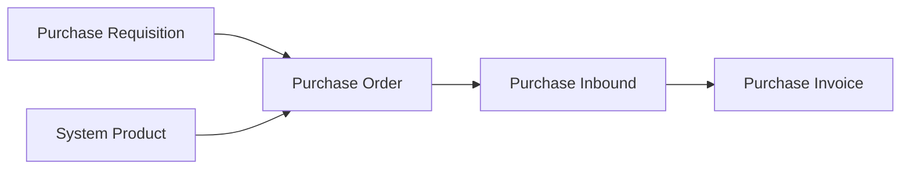
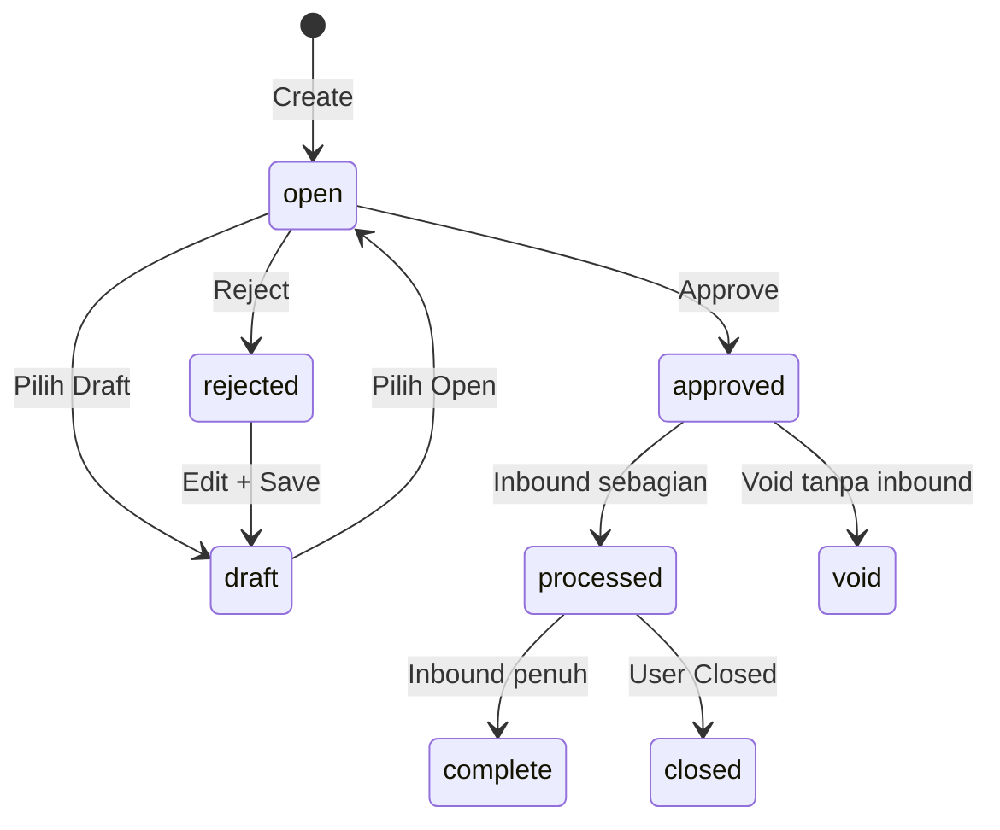

# Purchase Order — Panduan Pengguna

**Siapa yang baca panduan ini:** procurement, purchasing, operations support  
**Menu di sistem:** SCM → Purchase Order  
**Kode transaksi:** dimulai dengan `PO-`

---

## 1. Apa Itu & Kenapa Penting

Purchase Order adalah **pesanan pembelian resmi** ke supplier. Lewat menu ini kamu mencatat apa yang dibeli, berapa harganya, dan dari supplier mana — sebagai dasar penerimaan barang dan tagihan berikutnya.

Tanpa PO yang disetujui, proses terima barang (Purchase Inbound) dan tagihan (Purchase Invoice) tidak punya acuan yang jelas.

---

## 2. Overview Flow & Proses Bisnis

### Rantai proses

**Versi teks (tanpa diagram):**

1. Kebutuhan beli bisa dari **Purchase Requisition** (With PR) atau langsung pilih produk (Without PR).
2. Buat dan **approve** Purchase Order.
3. Terima barang di **Purchase Inbound**.
4. Tagih di **Purchase Invoice** (termasuk biaya/diskon tambahan dari PO bila ada).

🎬 [Interactive demo akan ditambahkan di sini]

### Siklus status

**Versi teks — arti tiap status:**

| Status | Artinya | Bisa diubah? |
|--------|---------|--------------|
| **Draft** | Belum siap / setelah reject lalu disimpan | Ya |
| **Open** | Siap di-approve | Ya |
| **Approved** | Disetujui — siap inbound | Tidak |
| **Rejected** | Ditolak; setelah Save jadi Draft | Ya |
| **Processed** | Sudah terima barang sebagian | Tidak |
| **Complete** | Semua qty sudah diterima (otomatis) | Tidak |
| **Closed** | Sisa qty dihentikan manual (dari Processed) | Tidak |
| **Void** | Dibatalkan dari Approved (belum ada inbound) | Tidak |

> **Complete** = barang sudah full diterima. **Closed** = sudah partial inbound, tapi sisa **tidak** dilanjutkan.

---

## 3. Sebelum Mulai (Flow Sebelum)

Pastikan ini sudah siap:

- [ ] **Supplier** sudah lengkap pengaturan accounting-nya — kalau belum, tidak muncul di daftar.
- [ ] **With PR:** PR sudah approved/processed dan masih ada sisa qty; tanggal PR sebelum tanggal PO.
- [ ] **Without PR:** produk aktif, punya grup akun, bukan bundle/random.
- [ ] Mata uang & kurs sudah jelas (kurs default 1 — ubah manual jika asing).
- [ ] Periode fiskal masih terbuka.

🎬 [Interactive demo akan ditambahkan di sini]

---

## 4. Setelah Selesai (Flow Sesudah)

Setelah PO **di-approve**:

1. Buat **Purchase Inbound** untuk menerima barang.
2. Kalau semua qty diterima → status jadi **Complete** otomatis.
3. Kalau sudah partial tapi sisa tidak akan dikirim → klik **Closed** (muncul saat status Processed).
4. Buat **Purchase Invoice** dari inbound — biaya/diskon tambahan dari PO bisa ikut; di PI nominal dari PO terkunci, akun masih bisa diganti sebelum approve PI.

Yang perlu diingat:

- Void PO approved **belum** mengembalikan qty ke PR (saat ini).
- Print PDF **belum** selalu sama dengan Net Purchase di layar (Other Cost/Disc belum ikut cetak).

🎬 [Interactive demo akan ditambahkan di sini]

---

## 5. Yang Perlu Diperhatikan

- **Kalau kamu approve saat status masih Draft**, sistem menolak — set **Open** dulu (terutama setelah reject).
- **Kalau kamu approve tanpa baris detail**, sistem menolak.
- **Kalau kamu ubah tanggal/supplier/mata uang setelah ada detail**, field itu terkunci.
- **Kalau kamu void PO yang masih draft/open**, tombol Void tidak untuk itu — pakai **Delete**.
- **Kalau kamu void PO yang sudah ada inbound**, sistem menolak.
- **Kalau kamu Closed dari status Approved** (belum pernah inbound), tombol Closed tidak muncul — buat inbound dulu sampai Processed.
- **Kalau kamu isi lebih dari 500 baris detail**, sistem menolak.
- **Kalau kamu input qty desimal di form manual**, ditolak — pakai bilangan bulat. Import Excel boleh angka > 0 termasuk desimal.
- **Kalau satu baris import salah di validasi awal**, seluruh file batal — perbaiki lalu upload ulang.
- **Kalau file import tipenya tidak cocok** dengan detail PO yang sudah ada, sistem menolak (type not match).
- **Kalau currency utama tapi kurs bukan 1**, validasi gagal.
- **Kalau Other Cost/Disc membuat total sebelum PPN negatif**, sistem menolak.
- **Kalau kamu mengandalkan print PDF untuk total final termasuk biaya tambahan**, angka bisa beda dari layar — print belum include Other Cost/Disc.

---

## 6. Langkah-Langkah (Step by Step)

### Cek dulu

1. Supplier siap muncul di daftar.
2. With PR: sisa PR ada — atau Without PR: produk siap dipilih.

### Langkah 1 — Buat PO

1. Buka **SCM → Purchase Order → Create**.
2. Pilih **With PR** atau **Without PR**.
3. Isi supplier, tanggal, mata uang, kurs, referensi (opsional, max 50 karakter).
4. Simpan (biasanya mulai status **Open**).

### Langkah 2 — Tambah detail

**With PR:**

1. Buka **Available Product** → pilih baris outstanding PR.
2. **Use** → isi qty, unit, harga, diskon, VAT.
3. Atau **Allocate Full Qty Clearing** untuk mengisi sisa qty sekaligus.
4. Atau **Import Detail** massal.

**Without PR:**

1. Buka **Available Product** → pilih produk.
2. Isi qty, harga, unit, VAT — atau import Excel (kolom A kosong semua baris).

### Langkah 3 — Biaya / diskon tambahan (opsional)

1. Tambah **Additional Cost** / **Additional Discount** bila perlu.
2. Cek panel **Total** (Net Purchase).

### Langkah 4 — Approve

1. Pastikan status **Open**.
2. Klik **Approve**.
3. Setelah sukses, header & detail terkunci.

### Langkah 5 — Terima & selesaikan

1. Buat **Purchase Inbound** dari PO approved.
2. Full terima → **Complete**; stop sisa → **Closed** dari Processed.
3. Lanjut **Purchase Invoice** bila siap ditagih.

🎬 [Interactive demo akan ditambahkan di sini]

---

## 7. Tips & Hal yang Sering Bikin Bingung

- **Supplier tidak muncul?** Lengkapi accounting setting di General Company.
- **Setelah reject susah approve?** Save → Draft → set **Open** lagi.
- **Void tidak muncul?** Masih draft/open — pakai Delete.
- **Closed tidak muncul?** Belum pernah inbound — buat inbound dulu.
- **Template import 404?** Buat Excel manual (kolom B–H sesuai panduan) atau minta IT.
- **Qty desimal:** manual = bulat; import = boleh desimal > 0.
- **Max 500 baris** per PO.
- **Void belum mengembalikan qty PR** — koordinasikan dengan tim bila perlu release qty.
- **Print vs layar:** print belum include Other Cost/Discount.
- **Tipe With/Without PR:** radio terkunci setelah ada detail; import tetap bisa mengubah tipe jika file tidak hati-hati.

---

## 8. Referensi

| Dokumen | Isi |
|---------|-----|
| [knowledge-base.md](./knowledge-base.md) | SOP operator, troubleshooting, FAQ |
| [requirement.md](./requirement.md) | Aturan bisnis, validasi, gap |
| [technical.md](./technical.md) | API, database, import/approve teknis |

**Menu terkait:** Purchase Requisition · Purchase Inbound · General Company · Other Cost / Discount · Purchase Invoice

---

*Derivatif dari requirement / knowledge-base / technical v2.3 — tanpa menambah fakta baru di luar sumber.*
