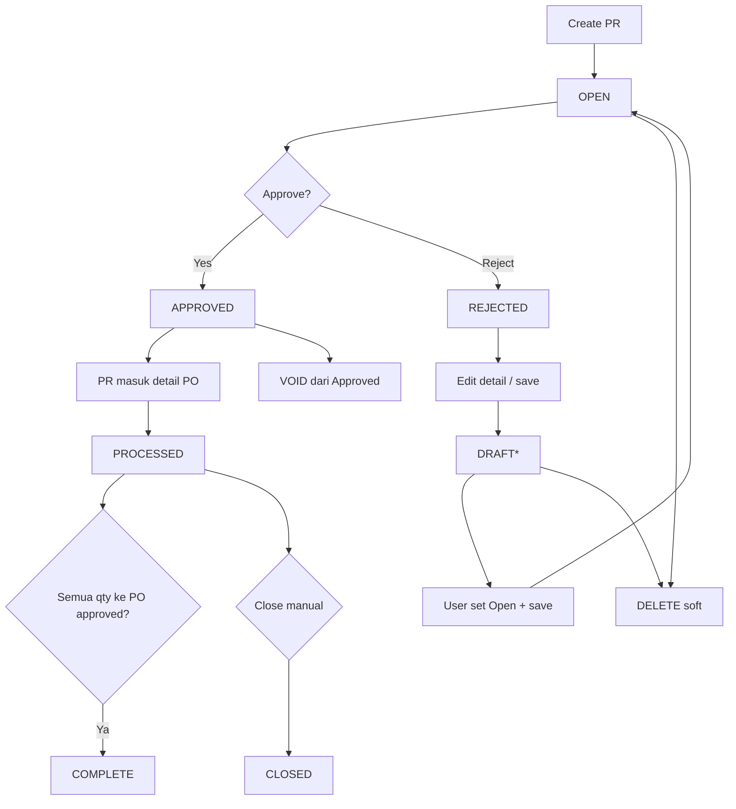
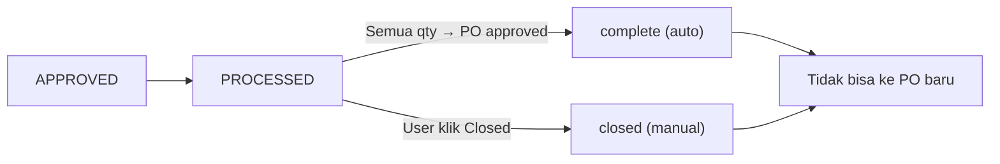
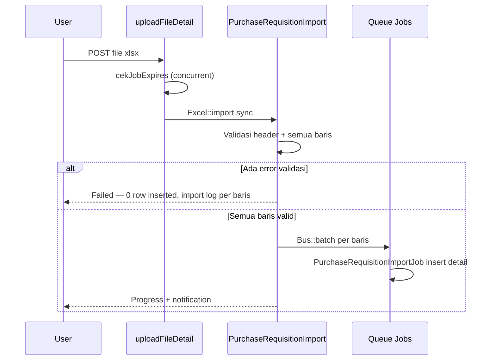
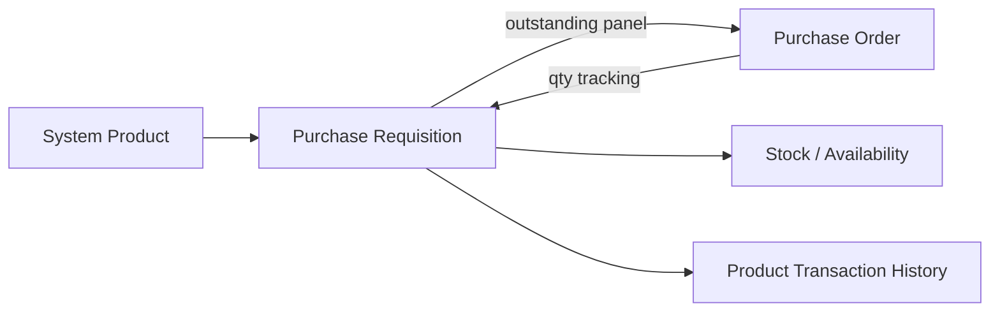

# Purchase Requisition — Requirement Documentation

**Modul:** Supply Chain Management (SCM) / Procurement  
**Prefix transaksi:** `PR-`  
**Audience:** PM, Operations, QA, Support, Developer  
**Status:** AS-IS verified against codebase per 2026-07-05

**UI route:** `/supplychain/purchase-requisition`  
**API base:** `{VITE_API_URL}supplychain/purchase-requisition`  
**Tables:** `scm_purchase_requisitions` · `scm_purchase_requisition_detail` · approvals · import/export logs

**PM source:** `purchase_requisition_requirement.md` v1.0 (2026-07-04)

---

## 0. Metadata & Changelog

| Version | Date | Author | Changes |
|---------|------|--------|---------|
| 1.0 | 2026-06-19 | QA - Yemima | Initial draft (AS-IS codebase) |
| 2.0 | 2026-07-05 | QA - Yemima | Full rewrite: merge PM requirement, import/export/print/duplicate spec, UI buttons, gaps §13–§15 |
| 2.1 | 2026-07-05 | QA - Yemima | Canonical codebase rules; §2.5 closure paths; import validation expanded |

---

## 1. Ringkasan Eksekutif

**Purchase Requisition (PR)** adalah dokumen permintaan pembelian internal sebelum **Purchase Order (PO)**. Team peminta mengajukan PR → approve → procurement memproses ke PO.

| Kebutuhan Bisnis | Bagaimana PR Menjawab |
|------------------|----------------------|
| Kontrol pengadaan formal | PR wajib di-approve sebelum dipakai di PO |
| Prioritas pengadaan | Master priority: Normal, Urgent, Top Urgent |
| Traceability PR → PO | Field `prepared_to_po_quantity` / `processed_to_po_quantity` per detail |
| Input massal SKU | Import detail Excel (template 5 kolom) |
| Audit & approval | Approval log + audit header/detail/attachment |

---

## 2. Siklus Status Transaksi

### 2.1 Diagram (AS-IS)

\* Status **Draft** juga di-set otomatis saat edit detail/import dari **Rejected** (lihat §2.3).

### 2.2 Definisi status

| Status | Definisi | Bisa edit? |
|--------|----------|------------|
| **draft** | Sementara; hasil duplicate; atau setelah reject + ubah detail | Ya |
| **open** | Default setelah create; siap approve | Ya |
| **approved** | Sudah disetujui (single-level approval) | Tidak |
| **rejected** | Ditolak approver | Ya; **delete tidak tersedia** |
| **processed** | Sebagian/seluruh qty sudah masuk PO (`prepared_to_po_quantity` atau `processed_to_po_quantity` > 0) | Tidak |
| **complete** | **Otomatis sistem** — semua qty PR sudah ter-process ke PO **approved** | Tidak |
| **closed** | **Manual user** — close dari status **processed** (sisa qty tidak dilanjutkan) | Tidak |
| **void** | Dibatalkan dari **approved** | Tidak |

### 2.3 PR selesai — dua jalur (tidak bisa diambil ke PO baru)

Setelah PR **selesai**, nomor PR **tidak muncul lagi** di outstanding PO (tidak bisa diproses ke PO baru). Ada **dua jalur**:

| # | Jalur | Siapa | Kondisi | Status di UI |
|---|-------|-------|---------|--------------|
| 1 | **Otomatis (system)** | Sistem | Σ `quantity_in_base_unit` semua detail = Σ `processed_to_po_quantity` — terjadi saat PO With PR di-**approve** (qty masuk `processed_to_po_quantity`) | **`complete`** |
| 2 | **Manual (end user)** | User | Klik **Closed** saat PR masih **`processed`** (masih ada sisa qty yang belum/full ke PO) | **`closed`** |

**Implikasi bisnis (keduanya):**
- PR tidak tampil di panel outstanding PO
- Header & detail **read-only**

**Catatan UI:** Tooltip datalist menjelaskan **Complete** vs **Closed** secara terpisah — keduanya artinya proses PR **selesai**, dengan trigger berbeda.

### 2.4 Transisi otomatis lainnya

| Trigger | Status baru |
|---------|-------------|
| `store()` create | **open** |
| Detail store/update/delete / import sukses dari **rejected** | Header → **draft** |
| Detail observer / PO approve: ada qty prepared/processed ke PO | **processed** |
| PO approve: semua detail full `processed_to_po_quantity` | **complete** |
| PO qty kembali 0 (PO dihapus/void) | **approved** (revert dari processed/complete) |
| Approve | **approved** |
| Reject | **rejected** |
| Close action (`approval_status=closed`) | **closed** |
| Void action | **void** |

---

## 3. Datalist — Kolom & Fitur

### 3.1 Kolom (AS-IS — `DataList.vue`)

| Kolom | Visible default | Keterangan |
|-------|-----------------|------------|
| TRX. DATE | false | `transaction_date_sortable` |
| TRX. CODE / TRX. DATE | true | Link edit; search code + date |
| PRODUCT | false | Search SKU dalam detail PR (`product_detail_formatted`) |
| PRIORITY | true | `purchase_requisition_priority.name` |
| Qty | true | Sum detail qty |
| TRX. REF. | true | `transaction_reference_text` |
| DESCRIPTION | true | Header description |
| Trx. Status | true | Tooltip menjelaskan Draft/Open/Approved/Complete/Closed/Rejected/Void |
| Data Owner, Created/Updated By | true | Default DataTablesV3 (`with_updated_by`) |
| Action | true | §3.2 |

### 3.2 Action button per status (AS-IS)

| Aksi | Kondisi |
|------|---------|
| **Edit** | `can_update` (draft/open/rejected) |
| **Show** (update only, no delete) | approved, processed, complete, closed, void |
| **Delete** | draft, open + `can_approve` branch |
| **Approve** | open + privilege + `can_approve` |
| **Void** | approved + `can_void` |
| **Closed** | processed + `can_closed` + approval privilege |
| **Print** | Semua status (via form sidebar / policy view) |
| **Bulk Approve** | Multi-select checkbox + bulk action |
| **Bulk Delete** | Multi-select (status eligible) |

### 3.3 Fitur datalist

| Fitur | AS-IS |
|-------|-------|
| Advanced Filter | ✅ SearchBuilder — kolom Product (hidden) searchable |
| Show Deleted | ✅ |
| Column Show/Hide | ✅ `filter_column` + custom columns |
| Export Advanced | ✅ **With Details**, **Without Details**, **This Page Only** — async batch + tab Export File |

---

## 4. Create / Edit — Basic Information

| Field | Wajib? | Default | Validasi AS-IS | Catatan |
|-------|--------|---------|----------------|---------|
| Transaction Code | — | Auto `PR-*` | Unique per company | Disabled saat edit |
| Transaction Date | **Required** | Now (create) | ≤ today; fiscal period; min ~6 bulan (FE) | **Terkunci** jika sudah ada detail |
| Required Delivery Date | Opsional | Now (FE) | Min = transaction date | **Terkunci** jika sudah ada detail |
| Reference | Opsional | — | Max **30** karakter | |
| Priority | **Required** | Normal | FK `scm_purchase_requisition_priorities` | Tidak lock proses sistem |
| Description | Opsional | — | Max 150 | |
| Upload Files | Opsional | — | Ext: xlsx, xls, docx, doc, pdf, jpeg, jpg | `validationExtensionFile()` |

**Status radio (edit only):** Draft / Open — user pilih sebelum Save.

**Create:** backend selalu simpan **open** (radio draft tidak apply saat first create).

---

## 5. Section Purchase Requisition Detail

### 5.1 Select Product (AS-IS)

| Kriteria | Implementasi |
|----------|--------------|
| Active | `status = 1` |
| Single / Variant | Product dengan accounting; variant leaf atau single tree root |
| COA group types | Semua yang punya `productAccounting` |
| **Diblok** | Bundle (`isBundle()`), BOM header (`is_bom=0` without header), **random variant** (`is_random`) |
| Bulk add | Multiselect → qty=1, unit = stock unit |

Endpoint: `GET purchase-requisition-detail/select2-product`

### 5.2 Datatable detail (PrimeDataTables)

| Kolom | Keterangan |
|-------|------------|
| System Product SKU / Name | Inline edit jika `can_update` |
| Availability | `getAvailability()` per unit — stok realtime |
| Request Qty | Editable; **bilangan bulat wajib** — desimal ditolak saat input manual |
| Unit | Primary + alternate unit aktif |
| PO Status / Receiving | Kolom tambahan **setelah approve** |
| Action | Edit modal + Delete — hanya jika `can_update` |

### 5.3 Tombol section detail & form

| Tombol | Lokasi | Perilaku |
|--------|--------|----------|
| **Save All** | Sidebar | PUT header (+ status draft/open dari radio) |
| **Save & Next** | Sidebar | Save lalu navigasi section berikutnya |
| **Approve** | Sidebar / modal | POST approve — hanya status **open** |
| **Import Detail** | Detail panel | Upload template Excel |
| **Export Detail** | Detail panel | xlsx/csv per PR |
| **Print** | Sidebar icon | PDF blob |
| **Duplicate** | Sidebar icon | GET duplicate → PR baru draft |
| **Void** | Sidebar | Approved → void |
| **Close** | Sidebar / datalist | Processed → closed |

Detail tombol & edge case UI: [knowledge-base §5](./knowledge-base.md#5-tombol--fungsi-ui).

---

## 6. Section Approval

| Informasi | Detail |
|-----------|--------|
| Log | Slideover **Approval** — Approved By, Status, Date, Description |
| Approve/Reject | `ApprovalModal` — **Description** opsional (alasan reject) |
| Level | **Single-level** (`gate_menus.approval = 1` untuk PR) |
| Eligibility | Tab **Approval Eligibility** — department, employee, position |

---

## 7. Section Audit Log

- Endpoint: `GET purchase-requisition/{id}/audit`
- Scope: header, detail (incl. soft-deleted), attachments
- Kolom standar AuditLogTables

---

## 8. Import Detail Purchase Requisition

### 8.1 Ringkasan

Input massal detail SKU via Excel — alternatif dari add satu-per-satu. Maksimal **100 baris detail per PR** (existing + import), dari `config('general.max_child')`.

- **Template:** `/files/Template-Import-Detail-PR.xlsx`
- **Upload:** `POST purchase-requisition/{id}/show/upload`
- **Format file upload:** `.xlsx` / `.xls` only

### 8.2 Format template (baris 1 = header)

| Kolom | Header exact | Wajib isi data? | Aturan |
|-------|--------------|-----------------|--------|
| A | `Product ID` | Salah satu A **atau** B | Integer ID dari System Product |
| B | `System Product SKU` | Salah satu A **atau** B | Lookup fallback jika ID tidak match |
| C | `Qty` | **Ya** | Numeric ≥ 1 (integer atau decimal) |
| D | `Unit` | **Ya** | Kode unit — harus primary atau alternate unit product |
| E | `Description` | Opsional | Remark baris detail |

Baris 2+ = data. Header **harus persis** 5 kolom dengan label di atas.

### 8.3 Alur import (step-by-step)

### 8.4 Validasi file & header

| # | Kondisi | Hasil | Pesan error |
|---|---------|-------|-------------|
| F-01 | File bukan xlsx/xls | Upload ditolak | "The uploaded data format does not match the system." |
| F-02 | Import lain masih `processing` (timeout belum lewat) | Upload ditolak | "Please wait, other import is being process" |
| F-03 | Jumlah kolom ≠ 5 | Gagal total | "The file format doesn't match the system template." |
| F-04 | Header label tidak exact | Gagal total | "Import failed. The file format doesn't match the system template." |
| F-05 | Hanya baris header (no data) | Gagal total | "The imported file is empty. Please add at least one product." |
| F-06 | `existing + import_rows > 100` | Gagal total | "This transaction have more than 100 details." |

### 8.5 Validasi per baris data

Lookup product (batch): company `owned_by` **or** `is_all_company=1`; exclude bundle child (`whereDoesntHave productTree.children`).

| # | Field | Kondisi gagal | Pesan (import log) |
|---|-------|---------------|-------------------|
| R-01 | Product ID & SKU | Keduanya kosong | `row {n}: Product ID or System Product SKU is empty.` |
| R-02 | Product ID | Terisi tapi bukan integer | `row {n}: {value} Please fill in this column using the product_id from master system product.` |
| R-03 | Product | ID/SKU tidak ditemukan | `row {n}: {value} Product is not found.` |
| R-04 | Qty | Kosong | `row {n}: Qty is empty.` |
| R-05 | Qty | Bukan integer/double | `row {n}: '{value}' Invalid data type. The value must be an integer or a double.` |
| R-06 | Qty | `< 1` | `row {n}: '{value}' The quantity field must be at least 1.` |
| R-07 | Unit | Kosong | `row {n}: Unit is empty.` |
| R-08 | Unit | Tidak terdaftar di product | `row {n}: '{unit}' The unit entered is not available or not set up in the product system.` |
| R-09 | Unit | Alternate unit inactive | `row {n}: The selected unit is inactive.` |

**Product ID vs SKU resolution order:**
1. Match by Product ID dari kolom A (preload batch)
2. Jika tidak ketemu → lookup SKU kolom B (`owned_by = company`)

### 8.6 Perilaku duplicate SKU

| Skenario | Perilaku |
|----------|----------|
| SKU sama **2× dalam 1 file** import | **2 baris detail terpisah** — qty **tidak** digabung |
| SKU sudah ada di PR + import SKU sama lagi | **Baris baru** ditambah — **tidak merge** qty ke baris lama |
| SKU sama di file, baris 1 valid baris 2 error | Pre-validation gagal → **seluruh file batal** (0 insert) |

Setiap baris sukses → `PurchaseRequisitionDetail::create()` + tree row (`parent_id = null`).

### 8.7 All-or-nothing vs partial (2 fase)

| Fase | Perilaku |
|------|----------|
| **Fase 1 — Pre-validation (sync)** | Semua baris divalidasi di memory. **Satu error saja → tidak ada job dispatch → 0 row insert.** History: `import_status=failed`. |
| **Fase 2 — Job queue (async)** | Satu job per baris valid. Jika job individual gagal di DB → log row error; **baris sukses tetap tersimpan** (tidak rollback batch). History: `failed` jika ada failed jobs. |

**Progress UI:** `GET purchase-requisition-detail/progress/{id}` — status `queued` / `Importing` / `success` / `failed`.

### 8.8 Side effects

| Event | Effect |
|-------|--------|
| Import pre-validation sukses + header **rejected** | Header → **draft** |
| Import sukses | Notification: "Purchase Requisition imported successfully" |
| Import gagal | Notification error + **Import Log** tab (per-row messages) |

### 8.9 Endpoint & monitoring

| Method | Path | Fungsi |
|--------|------|--------|
| POST | `purchase-requisition/{id}/show/upload` | Upload file |
| GET | `purchase-requisition-detail/progress/{id}` | Progress bar |
| GET | `purchase-requisition-detail/{id}/import-log/detail` | Error log |
| GET | `purchase-requisition-detail/{id}/check-import-log/detail` | Cek log exists |
| GET | `purchase-requisition-detail/{id}/import-history` | Riwayat import |

Detail teknis: [technical.md §8](./technical.md#8-import-detail).

---

## 9. Export Detail & Export Advanced

### 9.1 Export detail (single PR)

**Endpoint:** `GET purchase-requisition/{id}/show/export-excel?type=1|2` (xlsx/csv)

| Kolom export |
|--------------|
| System Product SKU |
| System Product Name |
| Stock WH |
| Qty |
| Unit |

Header PR **tidak** ikut — hanya baris detail.

### 9.2 Export Advanced (datalist)

Opsi FE: **With Details**, **Without Details**, **This Page Only**.

**With Details (~16 kol):** Trx Code/Date, Priority, Trx Ref, SKU, Availability, Qty, Unit, Description, Status, Created/Updated/Approved metadata.

**Without Details (~11 kol):** Header only.

Async via `PurchaseRequisitionExportJob` → download dari tab Export File.

---

## 10. Duplicate PR

| Aspek | AS-IS |
|-------|-------|
| Entry point | Icon **Duplicate** di form edit (sidebar) |
| Status sumber | **Semua** status (find with trashed) — tidak dibatasi |
| Status hasil | **draft** |
| Code | Auto generate baru `PR-*` |
| Transaction date | Reset **now** |
| Detail | Copy semua lines; reset `prepared_to_po_quantity` / `processed_to_po_quantity` = 0 |
| Attachment | **Tidak** di-copy |
| Approval | **Tidak** di-copy |
| FE after duplicate | Toast sukses — **tidak auto-navigate** ke PR baru |

---

## 11. Print Detail

**Output:** PDF (`PrintController`)

**Header PDF:** Title, QR = PR code, company logo/name/NPWP.

**Body:** Priority, Number, Date; tabel No, SKU, Qty, Unit code, Remark; product name baris kedua; PR Remark; **Issued By** (creator).

**Tidak tampil:** Approver block (data loaded tapi blade tidak render).

---

## 12. Validasi yang Berjalan

| # | Validasi | Behavior |
|---|----------|----------|
| V-01 | Transaction date required, ≤ today | 422 / FE max date |
| V-02 | Reference max **30** karakter | 422 |
| V-03 | Description max 150 | 422 |
| V-04 | Random / Bundle product | Error / excluded select2 |
| V-05 | Inactive product | Excluded select2 (manual add) |
| V-06 | Edit approved/processed/complete/closed/void | Blocked |
| V-07 | Delete | **draft, open only** |
| V-08 | Approve | Status **open**; min 1 detail; bukan draft |
| V-09 | Close manual | Status **processed** + approval privilege → **closed** |
| V-10 | Reject + edit detail | Header → **draft** |
| V-11 | Qty detail manual | **Bilangan bulat** (`ctype_digit`); desimal ditolak |
| V-12 | Qty import | Integer atau double; **≥ 1** |
| V-13 | Max detail | **100** baris (`general.max_child`) — manual add & import |
| V-14 | Fiscal period | `validate_fiscal_period()` on create/update/approve |
| V-15 | Approval | **Single-level**; reject description opsional |

---

## 13. Relasi Menu Lain

| Menu | Relasi |
|------|--------|
| [Purchase Order](../supplychain-purchase-order/) | Consumer utama; outstanding PR panel |
| [System Product](../system-product/) | Sumber SKU |
| Stock | Availability column realtime |
| Product Transaction History | Tab PR history per product |

Cross-ref PO: [supplychain-purchase-order requirement §With PR](../supplychain-purchase-order/requirement.md).

---

## 14. Do's and Don'ts

### Do's

- Set priority sesuai urgensi (informasi procurement)
- Pakai **Import Detail** untuk banyak SKU (max 100 baris total per PR)
- Set status **Open** sebelum Approve (terutama setelah reject)
- Close manual hanya jika yakin sisa qty tidak akan diproses ke PO

### Don'ts

- Jangan approve sebelum detail lengkap (post-approve tidak editable)
- Jangan asumsikan reject langsung bisa approve — ubah ke **Open** + save dulu
- Jangan import file dengan baris error — seluruh file akan batal di fase validasi

---

## 15. Acceptance Criteria

- [x] Create → **open**; priority default Normal
- [x] Reference max **30**; description max **150**
- [x] Delete hanya **draft/open**
- [x] Qty manual **integer**; import qty ≥ 1 (int/double)
- [x] Max **100** detail per PR
- [x] Single-level approval + optional reject description
- [x] PR selesai: **complete** (auto full PO) atau **closed** (manual) — keduanya tidak bisa ke PO baru
- [x] Import: template 5 kolom; pre-validation all-or-nothing; duplicate SKU = baris baru
- [x] Export detail & export advanced; duplicate; print PDF

---

## 16. Dev Team — Technical Follow-ups

| ID | Temuan | Klasifikasi |
|----|--------|-------------|
| DEV-PR-01 | **ClosedDialog** form kirim `void` — Close dari sidebar form gagal pada Processed. Datalist action kirim `closed` ✓ | Bug UI |
| DEV-PR-02 | `duplicate()` tree parent_id mapping | Bug potensial |
| DEV-PR-03 | Duplicate FE tidak redirect ke PR baru | UX |
| DEV-PR-04 | Print approver tidak di-render | Template |

Detail: [technical.md §15](./technical.md#15-dev-team--technical-follow-ups)

---

## Related Documents

| Doc | Path |
|-----|------|
| Knowledge Base | [knowledge-base.md](./knowledge-base.md) |
| Technical | [technical.md](./technical.md) |
| Purchase Order | [../supplychain-purchase-order/requirement.md](../supplychain-purchase-order/requirement.md) |
