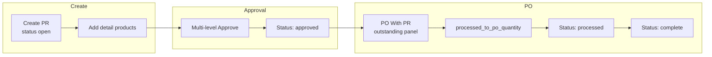
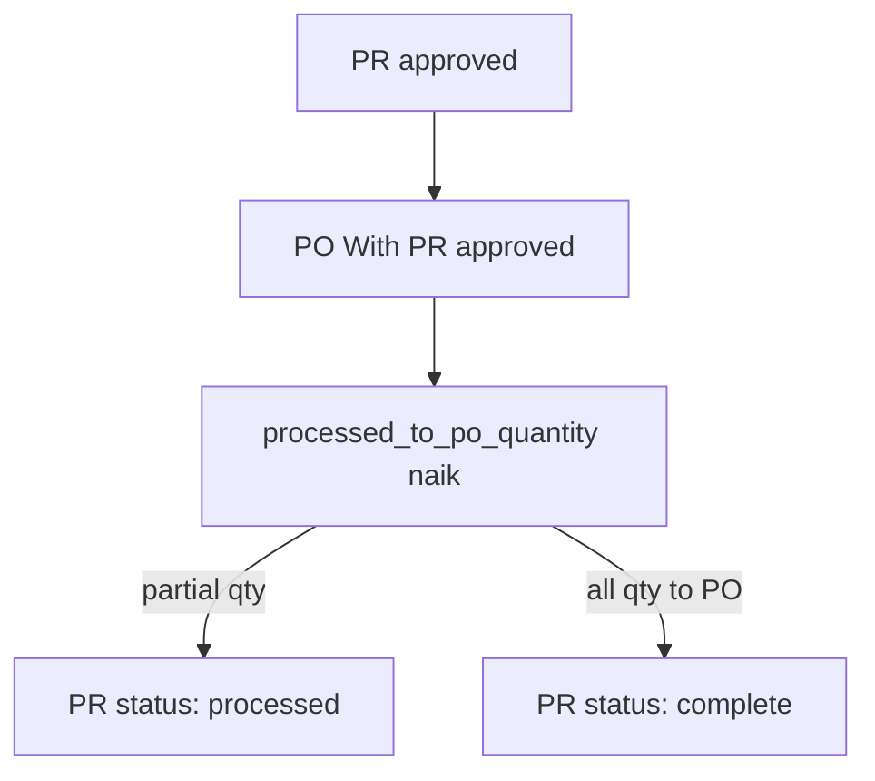
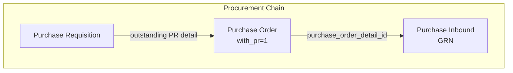

# Purchase Requisition — Requirement Detail

> **DRAFT** — Dokumen ini adalah draft awal hasil analisis codebase otomatis per 2026-06-19. Perlu direview PM/QA sebelum final.

**Modul:** SupplyChain  
**Audience:** PM, Operations, QA, Support, Developer  
**Status:** Sesuai perilaku sistem saat ini (AS-IS)

---

## Daftar Isi

1. [Fungsi & Tujuan](#1-fungsi--tujuan)
2. [How It Works — Alur Kerja](#2-how-it-works--alur-kerja)
3. [Validasi yang Berjalan](#3-validasi-yang-berjalan)
4. [Relasi Menu Lain](#4-relasi-menu-lain)
5. [FAQ](#5-faq)

---

## 1. Fungsi & Tujuan

### Apa itu Purchase Requisition?

**Purchase Requisition (PR)** mendokumentasikan kebutuhan pembelian internal sebelum PO. Header disimpan di `scm_purchase_requisitions`; detail produk di `scm_purchase_requisition_detail` dengan relasi tree opsional.

### Masalah yang diselesaikan

| Kebutuhan Bisnis | Bagaimana PR Menjawab |
|------------------|----------------------|
| Kontrol permintaan beli internal | Header + approval workflow |
| Traceability ke PO | Qty tracking `prepared_to_po_quantity` / `processed_to_po_quantity` |
| Prioritas kebutuhan | Master `PurchaseRequisitionPriority` |
| Struktur produk kompleks | Detail tree (parent-child) |

### Entitas data utama

| Entitas | Tabel |
|---------|-------|
| Header PR | `scm_purchase_requisitions` |
| Detail PR | `scm_purchase_requisition_detail` |
| Tree detail | `scm_purchase_requisition_detail_trees` |
| Approval | `scm_purchase_requisition_approvals` |
| Priority | `scm_purchase_requisition_priorities` |

---

## 2. How It Works — Alur Kerja

### 2.1 Siklus hidup PR

### 2.2 Create header

1. `POST supplychain/purchase-requisition` — `PurchaseRequisitionController@store`.
2. Kode auto `PR` jika kosong.
3. Status disimpan **`open`** (meskipun request mengizinkan draft/open, store selalu set open).
4. Fiscal period divalidasi.

### 2.3 Tambah detail

- `POST supplychain/purchase-requisition-detail` — produk, unit, qty > 0.
- Bulk: `POST purchase-requisition-detail/create-select`.
- Import Excel via batch `PurchaseRequestImport`.
- Observer detail: update status PR ke `processed` / `complete` berdasarkan qty PO.

### 2.4 Approval

`POST purchase-requisition/{id}/approve`:

1. Cache lock 60 detik (`approval_process_pr`).
2. Status tidak boleh `draft`.
3. Minimal 1 detail.
4. `approval_status`: `approved` | `rejected` | `void` | `closed`.
5. Fiscal period divalidasi.

### 2.5 Link ke PO

Saat PO **With PR** approved (`approvePurchaseOrder()`):

- `prepared_to_po_quantity` PR turun, `processed_to_po_quantity` naik.
- Jika semua detail PR terpenuhi → PR **`complete`**.

---

## 3. Validasi yang Berjalan

### 3.1 Header — create/update

| Field | Rule |
|-------|------|
| `code` | Unique per company (`scm_purchase_requisitions.code`) |
| `transaction_date` | Required; tidak boleh > hari ini |
| `description` | Max 150 |
| `purchase_requisition_priority` | Required integer (FK priority) |
| `transaction_reference_text` | Max 30 |
| `transaction_status` | `open` atau `draft` (update only) |
| `file_attachment` | Extension validation |
| Fiscal period | `validate_fiscal_period()` |

**Update lock (jika sudah ada detail):** tanggal transaksi, required delivery date, dan priority **tidak boleh diubah**.

**Update lock (status):** hanya `draft`, `open`, `rejected` yang boleh diedit.

### 3.2 Detail — create/update

| Field | Rule |
|-------|------|
| `product_id` | Required; status aktif; bukan bundle; bukan random |
| `quantity_unit_id` | Required; unit aktif |
| `quantity` | Numeric, required, > 0, whole number |
| `description` | Max 150 |
| `parent_id` | Parent qty harus 1; tree validation |
| Max detail | `config('general.max_child')` per transaksi |

### 3.3 Approval

| Rule | Pesan |
|------|-------|
| Status draft | "cannot be approved as its status remains in draft" |
| No detail | "doesn't have any detail data" |
| Cache busy | "Approval process is in progress" |
| Import batch aktif | "Please wait, other import is being process" |

### 3.4 Delete

Hanya status `draft` atau `open`.

---

## 4. Relasi Menu Lain

| Menu | Relasi |
|------|--------|
| **Purchase Order** | PO `with_pr=1` → outstanding PR → update qty PR on PO approve |
| **Inbound (GRN)** | Tidak langsung; via PO detail |
| **Product** | Select2 produk transaksi |
| **Fiscal Period** | Validasi tanggal |

---

## 5. FAQ

**Q: Apakah PR wajib sebelum PO?**  
A: Tidak. PO bisa **Without PR**. PR hanya wajib untuk alur With PR.

**Q: Bisakah qty PR desimal?**  
A: Tidak. Qty detail harus whole number.

**Q: Apa beda processed vs complete?**  
A: `processed` = sebagian qty sudah ke PO; `complete` = semua qty detail sudah `processed_to_po_quantity`.

---

## Related Documents

| Doc | Path |
|-----|------|
| Knowledge Base | [knowledge-base.md](./knowledge-base.md) |
| Technical | [technical.md](./technical.md) |
| Purchase Order | [../supplychain-purchase-order/requirement.md](../supplychain-purchase-order/requirement.md) |
