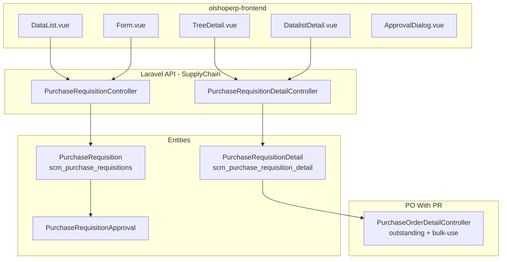
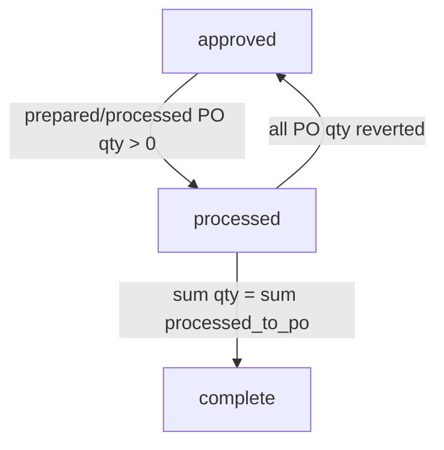

# Purchase Requisition — Technical Documentation

> **DRAFT** — Dokumen ini adalah draft awal hasil analisis codebase otomatis per 2026-06-19. Perlu direview PM/QA sebelum final.

**Stack:** Laravel 13 API · Vue 3 SPA  
**Primary module:** `Modules/SupplyChain`  
**Menu slug:** `supplychain-purchase-requisition`  
**UI route:** `/supplychain/purchase-requisition`  
**API base:** `{VITE_API_URL}supplychain/purchase-requisition*`

---

## 1. Architecture Overview

---

## 2. Frontend File Map

**Root:** `olshoperp-frontend/src/pages/SCM/PurchaseRequisition/`

| File | Role | Key API |
|------|------|---------|
| `DataList.vue` | Datalist PR + export | `GET supplychain/purchase-requisition` |
| `Form.vue` | Create/edit header | `POST/PUT supplychain/purchase-requisition/{id}` |
| `TreeDetail.vue` | Detail tree grid | `purchase-requisition-detail/tree/{id}` |
| `DatalistDetail.vue` | Detail PrimeVue grid | `purchase-requisition/{id}/show/primevue` |
| `ApprovalDialog.vue` | Submit approval | `POST purchase-requisition/{id}/approve` |
| `ApprovalEligibility.vue` | Eligible approvers | `purchase-requisition/approval-eligibility/{id}` |
| `DatalistLogApproval.vue` | Approval log | `purchase-requisition/{id}/log/approve` |

### Router (`src/router/index.ts`)

| Route | Component |
|-------|-----------|
| `supplychain/purchase-requisition` | `DataList.vue` |
| `supplychain/purchase-requisition/create` | `Form.vue` |
| `supplychain/purchase-requisition/edit/:id` | `Form.vue` |

---

## 3. Backend File Map

### 3.1 Controllers

| Class | Path | Responsibility |
|-------|------|----------------|
| `PurchaseRequisitionController` | `Modules/SupplyChain/Http/Controllers/PurchaseRequisitionController.php` | CRUD header, approve, export, duplicate, audit |
| `PurchaseRequisitionDetailController` | `.../PurchaseRequisitionDetailController.php` | CRUD detail, tree, bulk store, import |

### 3.2 Models & policies

| Class | Table | Notes |
|-------|-------|-------|
| `PurchaseRequisition` | `scm_purchase_requisitions` | Code prefix `PR` |
| `PurchaseRequisitionDetail` | `scm_purchase_requisition_detail` | Observer update PR status via PO qty |
| `PurchaseRequisitionApproval` | `scm_purchase_requisition_approvals` | Approval log |
| `PurchaseRequisitionPolicy` | — | `viewAny`, `create`, `update`, `delete`, `approval` |

### 3.3 Jobs & imports

| Class | Purpose |
|-------|---------|
| `PurchaseRequisitionExportJob` | Async export header |
| `PurchaseRequisitionImport` | Import detail batch `PurchaseRequestImport` |

---

## 4. API Routes

**Prefix:** `supplychain` · **Middleware:** `auth:sanctum`, `auth_verified`  
**File:** `Modules/SupplyChain/Routes/api.php`

| Method | Path | Controller@method |
|--------|------|-------------------|
| GET | `purchase-requisition` | `PurchaseRequisitionController@index` |
| POST | `purchase-requisition` | `PurchaseRequisitionController@store` |
| GET | `purchase-requisition/{id}` | `PurchaseRequisitionController@show` |
| PUT | `purchase-requisition/{id}` | `PurchaseRequisitionController@update` |
| DELETE | `purchase-requisition/{id}` | `PurchaseRequisitionController@destroy` |
| POST | `purchase-requisition/{id}/approve` | `PurchaseRequisitionController@purchaseRequisitionApprove` |
| GET | `purchase-requisition/{id}/duplicate` | `PurchaseRequisitionController@duplicate` |
| GET | `purchase-requisition-detail/outstanding` | (via PO) `PurchaseOrderDetailController@outstanding_purchase_request_details` |
| POST | `purchase-requisition-detail` | `PurchaseRequisitionDetailController@store` |
| POST | `purchase-requisition-detail/create-select` | `PurchaseRequisitionDetailController@bulkStore` |

---

## 5. Database

### 5.1 Header `scm_purchase_requisitions`

| Column | Keterangan |
|--------|------------|
| `code` | Kode PR (prefix PR) |
| `transaction_date` | Tanggal transaksi |
| `required_delivery_date` | Tanggal delivery diharapkan |
| `pr_priority_id` | FK priority |
| `transaction_status` | draft → open → approved → processed → complete |
| `transaction_reference_text` | Referensi eksternal (max 30) |

### 5.2 Detail `scm_purchase_requisition_detail`

| Column | Keterangan |
|--------|------------|
| `pr_id` | FK header |
| `product_id` | FK product |
| `quantity`, `quantity_in_base_unit` | Qty permintaan |
| `prepared_to_po_quantity` | Qty disiapkan ke PO |
| `processed_to_po_quantity` | Qty sudah di PO approved |
| `is_complete` | Flag baris selesai |

### 5.3 Status transition (PO qty observer)

---

## 6. Key Integration Points

| Sistem | Mekanisme |
|--------|-----------|
| Purchase Order | `PurchaseOrderDetail.purchase_requisition_detail_id`; `approvePurchaseOrder()` |
| Product | Select2 `purchase-requisition-detail/select2-product` |
| Fiscal period | `validate_fiscal_period()` on create/update/approve |
| Form attachment | `FormAttachment` via `handleAttachment()` |

---

## 7. Permissions

Policy: `PurchaseRequisitionPolicy` — actions: `viewAny`, `view`, `create`, `update`, `delete`, `approval`.

Gate menu: `SupplyChainMenuSeeder` → `supplychain/purchase-requisition`.
