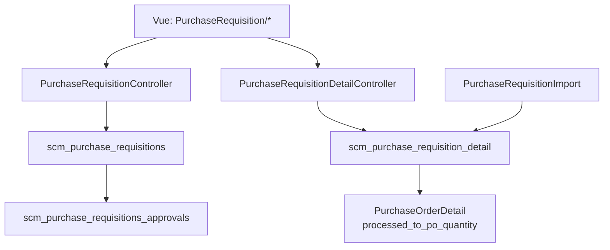

# Purchase Requisition — Technical Documentation

## 1. Architecture Overview



---

## 2. Frontend File Map

**Root:** `olshoperp-frontend/src/pages/SCM/PurchaseRequisition/`

| File | Role |
|------|------|
| `DataList.vue` | Index + export advanced + bulk approve |
| `Form.vue` | Header, sidenav, approve/void/close/duplicate/print |
| `DatalistDetail.vue` | PrimeVue detail grid, import/export detail |
| `DatalistLogApproval.vue` | Approval slideover |
| `ApprovalEligibility.vue` | Eligibility datatable |
| `TreeDetail.vue` | Detail tree view (bundle/BOM lines) |

**Routes:** `/supplychain/purchase-requisition`, `/create`, `/edit/:id`

**Template file (static):** `public/files/Template-Import-Detail-PR.xlsx`

---

## 3. Backend File Map

| File | Role |
|------|------|
| `PurchaseRequisitionController.php` | CRUD, approve, duplicate, print, export all |
| `PurchaseRequisitionDetailController.php` | Detail CRUD, select2, import upload |
| `PurchaseRequisitionImport.php` | Excel parse + validation |
| `PurchaseRequisitionImportJob.php` | Per-row insert queue |
| `PurchaseRequisitionDetailExport.php` | Single PR export |
| `PurchaseRequisitionExportAll.php` | Advanced export staging |
| `PurchaseRequisitionExportJob.php` | Async export worker |
| `Entities/PurchaseRequisition.php` | Header model |
| `Entities/PurchaseRequisitionDetail.php` | Detail + status observer |
| `Policies/PurchaseRequisitionPolicy.php` | Authorization |

**Print blade:** `Modules/SupplyChain/Resources/views/pages/purchase-requisition/print.blade.php`

---

## 4. API Routes ( utama )

| Method | Path | Action |
|--------|------|--------|
| GET | `/purchase-requisition` | index datalist |
| POST | `/purchase-requisition` | store |
| GET | `/purchase-requisition/{id}` | show |
| PUT | `/purchase-requisition/{id}` | update |
| DELETE | `/purchase-requisition/{id}` | destroy |
| GET | `/purchase-requisition/{id}/duplicate` | duplicate |
| POST | `/purchase-requisition/{id}/approve` | approve/reject/void/closed |
| GET | `/purchase-requisition/{id}/print` | PDF |
| GET | `/purchase-requisition/{id}/audit` | audit |
| GET | `/purchase-requisition/{id}/log/approve` | approval log |
| GET | `/purchase-requisition/approval-eligibility/{id}` | eligibility |
| POST | `/purchase-requisition/{id}/show/upload` | import detail |
| GET | `/purchase-requisition/{id}/show/export-excel` | export detail |
| POST | `/purchase-requisition/export-all` | advanced export |
| GET | `/purchase-requisition-detail/select2-product` | product picker |
| POST | `/purchase-requisition-detail` | store detail |
| GET | `/purchase-requisition/{id}/show/primevue` | detail datatable (auto-appended) |

---

## 5. Database Schema

### `scm_purchase_requisitions`

| Column | Note |
|--------|------|
| `code` | PR-{…} |
| `transaction_date`, `required_delivery_date` | |
| `pr_priority_id` | FK priorities |
| `description`, `transaction_reference_text` | |
| `transaction_status` | draft/open/approved/… |
| `owned_by`, audit cols | |

### `scm_purchase_requisition_detail`

| Column | Note |
|--------|------|
| `pr_id`, `product_id`, `quantity`, `quantity_unit_id` | |
| `quantity_in_base_unit` | PO tracking base |
| `prepared_to_po_quantity`, `processed_to_po_quantity` | PO linkage |
| `prepared_to_rfq_quantity`, `processed_to_rfq_quantity` | RFQ (AS-IS extra) |
| `description` | Line remark |

### Supporting

| Table | Role |
|-------|------|
| `scm_purchase_requisition_detail_trees` | Parent-child detail (bundle explode) |
| `scm_purchase_requisitions_approvals` | Approval log |
| `scm_purchase_requisition_priorities` | Normal/Urgent/Top Urgent |
| `scm_purchase_requisition_detail_import_logs` | Per-row import errors |
| `scm_purchase_requisition_export_files` | Export job output |

---

## 6. Status Engine

### PR selesai — dua jalur

| Jalur | Trigger | Status | File / method |
|-------|---------|--------|---------------|
| Auto | Σ `quantity_in_base_unit` = Σ `processed_to_po_quantity` (PO approved) | `complete` | `PurchaseRequisitionDetail` observer; `PurchaseOrderController@approvePurchaseOrder` |
| Manual | User action `approval_status=closed` dari **processed** | `closed` | `PurchaseRequisitionController@approve` → `setTransactionStatus` |

Keduanya: PR excluded dari outstanding PO panel; header/detail read-only.

### Observer (`PurchaseRequisitionDetail.php` booted)

```php
// complete: sum(quantity_in_base_unit) == sum(processed_to_po_quantity)
// processed: any prepared_to_po_quantity > 0 OR processed_to_po_quantity > 0
// revert to approved: processed/complete → all PO qty sums == 0
```

### Approval (`MainModel::approve` + `setTransactionStatus`)

- Menu class `PurchaseRequisition::class` → `gate_menus.approval = 1` (**single-level**)
- Reject: `approval_status=rejected` → header `transaction_status=rejected`
- Close: `approval_status=closed` → `transaction_status=closed`
- Void: blocked on `processed` (`Document have been prepared at purchase`)

### `can_closed` / `can_void`

- `can_closed`: `transaction_status == processed` + user has approval privilege
- `can_void`: approved state + policy (not processed)

---

## 7. Detail Product Rules

**select2ProductForTransaction** filters:

- `status=1`, has `productAccounting`
- Excludes bundle children, BOM headers (`is_bom=0` without header), random variants
- Includes single products + variant leaves

**store validation:**

- `quantity` numeric `gt:0`, **ctype_digit** (integer) for manual entry
- Bundle / random blocked
- `validate_max_details()` before insert

---

## 8. Import Detail

**Class:** `Modules/SupplyChain/Import/PurchaseRequisitionImport.php`  
**Upload:** `PurchaseRequisitionController@uploadFileDetail`  
**Job:** `PurchaseRequisitionImportJob` → `importProcess()` per row

### Upload pre-check

```php
// Request validation
'file_attachment' => 'required|mimes:xlsx,xls'
// mimes fail → "The uploaded data format does not match the system."
cekJobExpires() // blocks if batch PurchaseRequestImport unfinished within timeout
```

### Template (`checkFormat` row 1)

```
Product ID | System Product SKU | Qty | Unit | Description
```

Exact string match required on all 5 headers.

### Product lookup (batch preload)

```php
Product::whereDoesntHave('productTree.children')
    ->where(owned_by = company OR is_all_company = 1)
    ->whereIn(id, excelIds) OR whereIn(sku, excelSkus)
```

Per row resolution:
1. Match `$columns[0]` (Product ID) against preloaded collection
2. Fallback: `Product::where('sku', $columns[1])->where('owned_by', $company_id)`

### Row validation matrix

| Check | Code ref | Log message pattern |
|-------|----------|---------------------|
| ID & SKU empty | L207–208 | `row {n}: {val}Product ID or System Product SKU is empty.` |
| ID not integer | L211–212 | `row {n}: {val} Please fill in this column using the product_id...` |
| Product not found | L227 | `row {n}: {val} Product is not found.` |
| Qty empty | L233–237 | `row {n}: Qty is empty.` |
| Qty type | L240–241 | `row {n}: '{val}' Invalid data type. The value must be an integer or a double.` |
| Qty < 1 | L243–244 | `row {n}: '{val}' The quantity field must be at least 1.` |
| Unit empty | L251–252 | `row {n}: {val} Unit is empty.` |
| Unit not on product | L275–277 | `row {n}: '{unit}' The unit entered is not available or not set up...` |
| Alt unit inactive | L268–269 | `row {n}: The selected unit is inactive.` |

Unit match: `LOWER(unit.code) === strtolower(input)` against primary stock unit or active alternate unit.

### Limits

```php
config('general.max_child') // = 100
$totalRow + $existsPoDetail > max_child → fail entire import
// message: "This transaction have more than 100 details."
```

### Duplicate SKU behavior

No dedup/merge — each valid row → separate `PurchaseRequisitionDetail::create()` + tree row (`parent_id = null`).

| Scenario | Result |
|----------|--------|
| Same SKU twice in file | 2 detail rows |
| SKU exists on PR + re-import same SKU | Additional row (no merge) |
| Row 1 valid, row 2 invalid in pre-validation | 0 rows inserted (all-or-nothing phase 1) |

### Two-phase execution

| Phase | Sync/async | Rollback |
|-------|------------|----------|
| Pre-validation (`collection()`) | Sync in `Excel::import` | Any error → throw ValidationException, 0 jobs dispatched |
| Job batch (`Bus::batch`) | Async queue `import_connection_{branch}` | Per-row DB failure logged; successful rows kept |

Batch name: `PurchaseRequestImport-{pr_id}`.

History table: `scm_purchase_requisition_detail_import_histories` — `import_status`: processing → success/failed.

Log table: `scm_purchase_requisition_detail_import_logs` — message format `"row {n}: {reason}"`.

### Side effects

- Pre-validation pass + header `rejected` → update to `draft`
- Success notification: `notifyUserSuccess('Purchase Requisition imported successfully')`
- Pre-validation fail: `"The import failed. Please check the import log for details."`

### Progress API

`PurchaseRequisitionImport::getProgress()` via `GET purchase-requisition-detail/progress/{id}`:

| status | Meaning |
|--------|---------|
| `queued` | Batch created, cache not started |
| `Importing` | pending_jobs decreasing |
| `success` | All jobs done, 0 failed |
| `failed` | failed_jobs > 0 |

---

## 9. Export

### Detail (`PurchaseRequisitionDetailExport`)

Columns: SKU, Name, Stock WH, Qty, Unit — styling red header cols A-B, D-E.

### Advanced (`PurchaseRequisitionExportAll` + Job)

Modes: `with_details`, `without_details`, page filter via SearchBuilder snapshot.

Staging table: `scm_purchase_requisition_export_temps`.

---

## 10. Duplicate Implementation

```php
// PurchaseRequisitionController@duplicate
$duplicate->transaction_status = TS_DRAFT;
$duplicate->code = generateCode(..., 'PR');
// details replicated; PO qty reset 0
// attachments NOT copied
```

---

## 11. Print Pipeline

`print()` → `PrintController::print($header, $content, $footer)`

Loads: priority, details+product+unit, approvals (approver unused in blade), company logo/NPWP.

---

## 12. PO Integration

| Event | PR effect |
|-------|-----------|
| PO detail links PR line | `prepared_to_po_quantity` / on approve `processed_to_po_quantity` |
| PO void/delete removes qty | Observer may revert PR to **approved** |
| Outstanding PO panel | Filters approved/processed PR with outstanding qty |

See [supplychain-purchase-order/technical.md](../supplychain-purchase-order/technical.md).

---

## 13. Attachment Validation

```php
validationExtensionFile() // MainHelper
// allowed: xlsx,xls,docx,doc,pdf,jpeg,jpg
```

---

## 14. Testing Notes

| Scenario | Expected |
|----------|----------|
| Create PR | status open |
| Approve without detail | Error |
| Import 101 rows total | Fail max_child |
| Import 1 bad row | No rows inserted |
| PO full qty | PR complete |
| Datalist Closed on processed | status closed |
| Form ClosedDialog on processed | **Error void on processed** (DEV-PR-01) |
| Delete rejected PR | Error ERR_APPROVED_MSG |

---

## 15. Dev Team — Technical Follow-ups

### DEV-PR-01 — ClosedDialog sends `void` not `closed`

**Files:** `ClosedDialog.vue` L50 · `DataTablesV3.vue` L4135 (datalist correct)

**Impact:** Close icon on **form** for Processed PR fails validation. Datalist **Closed** action works.

**Fix:** Set `approval_status` to `closed` in ClosedDialog when used for PR close (or dedicated dialog).

### DEV-PR-02 — Duplicate tree parent_id

**File:** `PurchaseRequisitionController@duplicate` L417–418 — `$parent_id = $duplicate_id[$purchaseRequisitionDetail->id]` likely wrong index.

### DEV-PR-03 — Duplicate `$request` undefined

**File:** L425 `'owned_by' => $request->owned_by ?? null` — `$request` not in method signature.

### DEV-PR-04 — Duplicate FE navigation

**File:** `Form.vue` `duplicate()` — success toast only, no router push to new id.

### DEV-PR-05 — Print approver section missing

**File:** print.blade.php — `$approver` passed but not rendered.

---

## Related Documents

| Doc | Path |
|-----|------|
| Requirement | [requirement.md](./requirement.md) |
| Knowledge Base | [knowledge-base.md](./knowledge-base.md) |
| Purchase Order | [../supplychain-purchase-order/technical.md](../supplychain-purchase-order/technical.md) |
| System Product | [../system-product/technical.md](../system-product/technical.md) |
