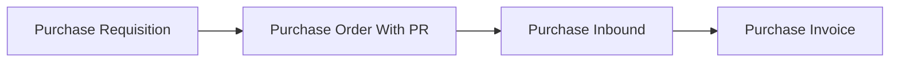
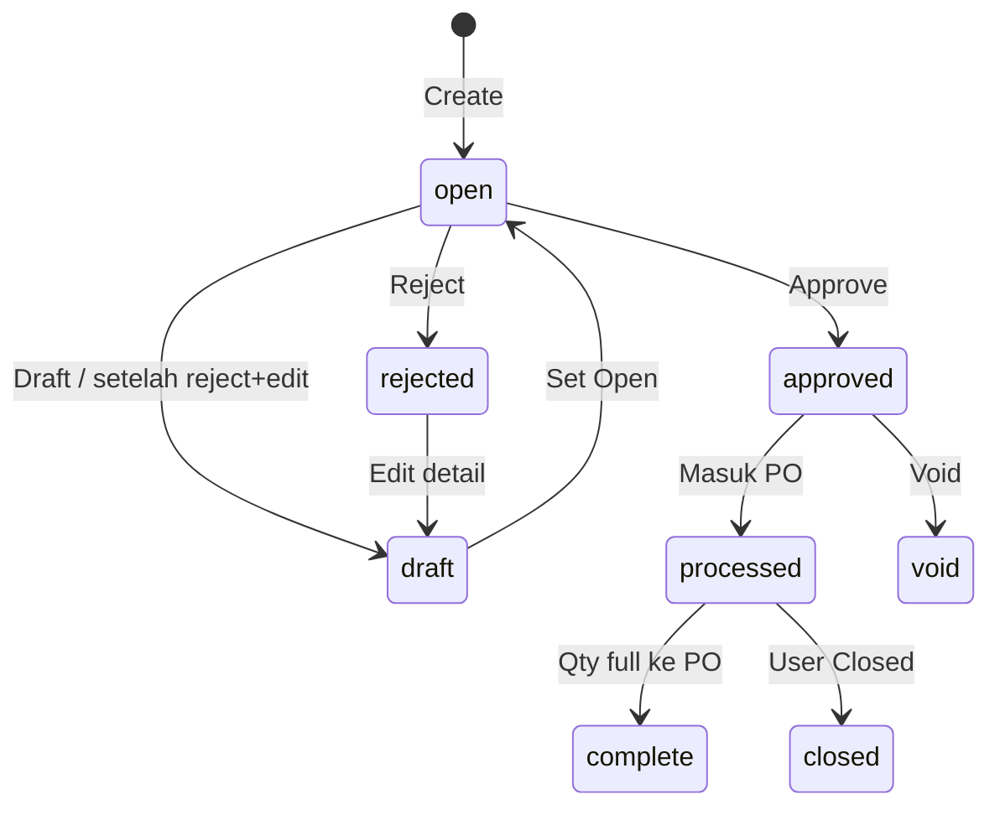

# Purchase Requisition — Panduan Pengguna

**Siapa yang baca panduan ini:** peminta barang, procurement, operations support  
**Menu di sistem:** SCM → Purchase Requisition  
**Kode transaksi:** dimulai dengan `PR-`  
**Feature Map / Lingo:** [feature-map.md](./feature-map.md)

---

## 1. Apa Itu & Kenapa Penting

Purchase Requisition (PR) adalah **permintaan pembelian internal**. Setelah disetujui, procurement membuat **Purchase Order** yang mengacu ke PR.

PR **bukan** pesanan ke supplier — itu langkah persetujuan internal sebelum PO.

---

## 2. Overview Flow & Proses Bisnis

### Rantai proses

**Versi teks (tanpa diagram):**

1. Buat & **Approve** Purchase Requisition.
2. Buat **Purchase Order** tipe **With PR** dari outstanding.
3. Terima barang di Purchase Inbound, lalu tagih di Purchase Invoice.

🎬 [Interactive demo akan ditambahkan di sini]

### Siklus status

**Versi teks:**

| Status | Artinya | Bisa diubah? |
|--------|---------|--------------|
| **Draft** | Disusun / setelah reject+edit / hasil duplicate | Ya |
| **Open** | Siap approve | Ya |
| **Approved** | Siap diproses ke PO | Tidak |
| **Rejected** | Ditolak — perbaiki | Ya (tidak bisa delete) |
| **Processed** | Sudah masuk PO | Tidak |
| **Complete** | Semua qty ke PO approved (otomatis) | Tidak |
| **Closed** | Sisa dihentikan manual dari Processed | Tidak |
| **Void** | Dibatalkan dari Approved | Tidak |

> [**Complete** vs **Closed**](#sf-lingo:SF-PR-01): keduanya = PR selesai, tidak bisa ke PO baru.

---

## 3. Sebelum Mulai (Flow Sebelum)

- [ ] Produk aktif di System Product (bukan bundle child / random).
- [ ] Priority dipilih (Normal / Urgent / Top Urgent — info saja).
- [ ] Periode fiskal tanggal transaksi terbuka.
- [ ] Tahu batas **100** baris detail per PR; reference max **30** karakter.

🎬 [Interactive demo akan ditambahkan di sini]

---

## 4. Setelah Selesai (Flow Sesudah)

Setelah PR **Approved**:

1. Buat [PO With PR](#sf-lingo:SF-PR-03) dari outstanding.
2. Partial → PR **Processed**; full → **Complete** otomatis; stop sisa → **Closed** di datalist.
3. Lanjut inbound & invoice di rantai PO.

🎬 [Interactive demo akan ditambahkan di sini]

---

## 5. Yang Perlu Diperhatikan

- **Kalau kamu Approve saat masih Draft**, set **Open** dulu (terutama setelah reject).
- **Kalau kamu Approve tanpa detail**, sistem menolak.
- **Kalau total detail > 100**, tambah/import ditolak — pecah ke PR lain.
- **Kalau qty manual desimal**, ditolak — pakai bilangan bulat; import boleh desimal ≥ 1.
- **Kalau satu baris import salah**, seluruh file batal.
- **Kalau Close dari form gagal**, pakai **Closed** di **datalist**.
- **Kalau hapus PR Rejected**, tidak boleh — hanya Draft/Open.
- **Kalau ubah tanggal setelah ada detail**, field terkunci — hapus detail dulu.

---

## 6. Langkah-Langkah (Step by Step)

### Langkah 1 — Buat PR

1. Buka **SCM → Purchase Requisition → Create**.
2. Isi tanggal, priority, reference (opsional).
3. Simpan (biasanya **Open**).

### Langkah 2 — Detail

1. Tambah SKU lewat **Select Product** (satu-satu), **Select Multiple Products** (centang banyak di modal), atau [**Import Detail**](#sf-lingo:SF-IMP-01).
2. Cek qty & unit; max **100** baris. Kalau modal multi-select akan melebihi 100, sistem menolak seluruh pilihan.
3. Tiap SKU dari Select / Select Multiple mulai dengan qty **1** (boleh diubah di grid).

### Langkah 3 — Approve

1. Status **Open** + minimal 1 detail.
2. Klik **Approve**.

### Langkah 4 — Ke PO

1. Buat PO **With PR** → ambil outstanding.
2. Selesaikan dengan Complete otomatis atau Closed manual.

🎬 [Interactive demo akan ditambahkan di sini]

---

## 7. Tips & Hal yang Sering Bikin Bingung

- **Select Multiple Products:** di kanan Select Product (edit saja) — centang banyak SKU tanpa Excel.
- **Cari SKU di list PR:** Advanced Filter kolom **Product** (tersembunyi).
- **Setelah reject:** Edit → Draft → set **Open** → Approve.
- **Duplicate:** PR baru Draft; buka manual dari datalist jika tidak auto-redirect.
- **Void vs Delete:** lihat [Void vs Delete](#sf-lingo:SF-PR-02).
- **Priority** tidak mempercepat sistem — hanya label.

---

## 8. Referensi

| Dokumen | Isi |
|---------|-----|
| [feature-map.md](./feature-map.md) | Indeks sub-feature + Lingo |
| [knowledge-base.md](./knowledge-base.md) | SOP & troubleshooting |
| [requirement.md](./requirement.md) | Aturan & gap |
| [technical.md](./technical.md) | API / import teknis |
| [Purchase Order](../supplychain-purchase-order/) | Consumer With PR |

---

*Derivatif dari requirement / knowledge-base / technical v2.2 — tanpa menambah fakta baru di luar sumber.*
