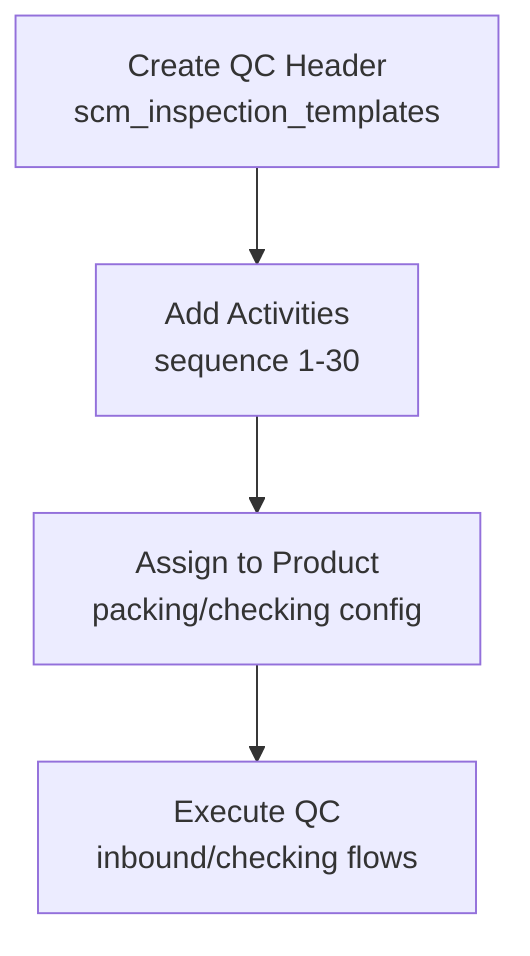
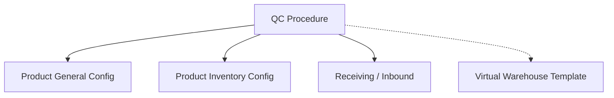

# QC Procedure — Requirement Detail

> **DRAFT** — Dokumen ini adalah draft awal hasil analisis codebase otomatis per 2026-06-19. Perlu direview PM/QA sebelum final.

**Modul:** SupplyChain · **Status:** AS-IS

---

## Daftar Isi

1. [Fungsi & Tujuan](#1-fungsi--tujuan)
2. [How It Works](#2-how-it-works)
3. [Validasi yang Berjalan](#3-validasi-yang-berjalan)
4. [Relasi Menu Lain](#4-relasi-menu-lain)
5. [FAQ](#5-faq)
6. [Known Gaps](#6-known-gaps)

---

## 1. Fungsi & Tujuan

### Apa itu QC Procedure?

Master checklist inspeksi (`ReceivingInspectionTemplate`) dengan detail berurutan (`ReceivingInspectionTemplateDetail`) untuk QC receiving, checking, dan packing.

### Masalah yang diselesaikan

| Kebutuhan | Solusi |
|-----------|--------|
| Standarisasi langkah QC | Template + sequenced activities |
| Assign per produk | Processing configuration endpoints |
| Audit perubahan template | Audit trait on header/detail |

### Entitas

| Entitas | Tabel |
|---------|-------|
| ReceivingInspectionTemplate | `scm_inspection_templates` |
| ReceivingInspectionTemplateDetail | `scm_inspection_template_details` |
| ReceivingInspectionTemplateApplicabilities | `scm_inspection_template_applicabilities` |

---

## 2. How It Works

### Header CRUD

- Controller: `ReceivingInspectionTemplateController`
- Store: `is_all_company` hardcoded 0
- Datalist columns: `totalActivity` (count details), `appliedProduct` (always 0)

### Detail CRUD

- Nested resource: `qc-procedure/{id}/qc-procedure-detail`
- PrimeVue grid: `GET .../qc-procedure-detail/primevue`
- Store hardcodes response labels to class constants

### Product assignment

- `POST product/{product}/packing-standarization/qc-procedure`
- `POST product/{product}/checking-standarization/qc-procedure`
- Mirrored on product-general-configuration and product-inventory-configuration routes

---

## 3. Validasi yang Berjalan

### Header store

| Field | Rule |
|-------|------|
| `code` | Required, max **15**, unique |
| `name` | Required, max 50 |
| `description` | Nullable, max 150 |

### Header update

| Field | Rule |
|-------|------|
| `code` | Required, max **50**, unique |
| `name` | Required, max 50 |
| `description` | Nullable, max 150 |

### Detail store

| Field | Rule |
|-------|------|
| `activity` | Required, max 30 |
| `sequence` | Required, numeric, 1–30, unique per template+company |
| `true_text/false_text/null_text` | Validated nullable max 15 — **ignored, overwritten** |

### Detail update

| Field | Rule |
|-------|------|
| `activity` | Required, max **125** |
| `sequence` | Required, unique per template |

---

## 4. Relasi Menu Lain

| Menu | Relasi |
|------|--------|
| Product Configuration | setQcProcedure endpoints |
| Receiving Inspection | Execution of template |
| Quality Assurance module | Duplicate FE/controllers |

---

## 5. FAQ

**Q: Kenapa code max 15 saat create tapi 50 saat update?**  
A: Inkonsistensi AS-IS di controller validation.

**Q: Apakah detail punya approval?**  
A: Tidak.

---

## 6. Known Gaps

- `appliedProduct` column always returns 0 — filter logic exists but unused.
- Detail `index()` commented out; nested resource GET index may 500 — FE should use `/primevue`.
- `true_text`/`false_text`/`null_text` validated then overwritten with constants.
- `code` max length differs store (15) vs update (50).
- `activity` max differs store (30) vs update (125).
- FE `Form.vue` may reference wrong select2 URL (copy-paste from currency).
- Parallel QualityAssurance module entities/controllers.
- Typo FK `receving_inspection_template_id` in applicabilities entity.

---

## Related Documents

| Doc | Path |
|-----|------|
| Knowledge Base | [knowledge-base.md](./knowledge-base.md) |
| Technical | [technical.md](./technical.md) |
