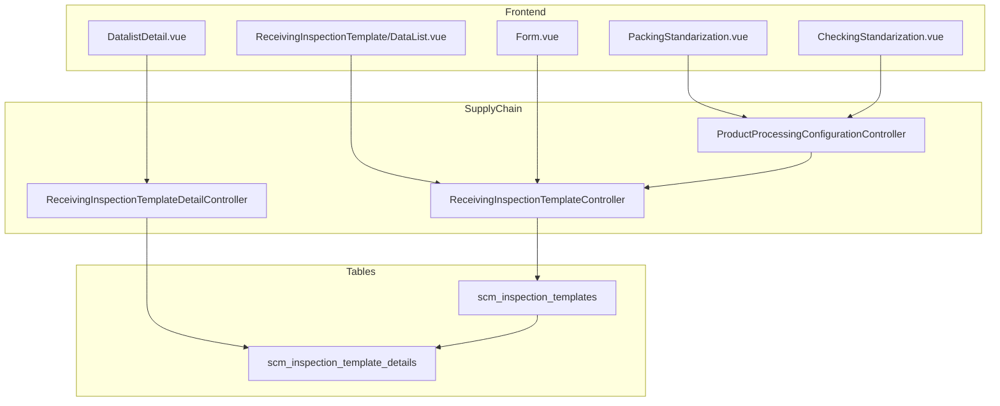

# QC Procedure — Technical Documentation

> **DRAFT** — Dokumen ini adalah draft awal hasil analisis codebase otomatis per 2026-06-19. Perlu direview PM/QA sebelum final.

**Menu slug:** `supplychain-qc-procedure`  
**UI route:** `/supplychain/qc-procedure`  
**API base:** `{VITE_API_URL}supplychain/qc-procedure*`

---

## 1. Architecture Overview

---

## 2. Frontend File Map

**Root:** `olshoperp-frontend/src/pages/SCM/master/ReceivingInspectionTemplate/`

| File | Role | Key API |
|------|------|---------|
| `DataList.vue` | Header datalist | `GET qc-procedure` |
| `Form.vue` | Create/edit header | `POST/PUT qc-procedure/{id}` |
| `DatalistDetail.vue` | Activity grid | `GET qc-procedure/{id}/qc-procedure-detail/primevue` |

Duplicate QA pages: `src/pages/QualityAssurance/master/ReceivingInspectionTemplate/`.

Product integration: `Product/PackingStandarization.vue`, `Product/CheckingStandarization.vue` (+ general/inventory variants).

| Route | Component |
|-------|-----------|
| `supplychain/qc-procedure` | `DataList.vue` |
| `supplychain/qc-procedure/create` | `Form.vue` |
| `supplychain/qc-procedure/edit/:id` | `Form.vue` |

---

## 3. Controllers

| Class | Path |
|-------|------|
| `ReceivingInspectionTemplateController` | `Modules/SupplyChain/Http/Controllers/ReceivingInspectionTemplateController.php` |
| `ReceivingInspectionTemplateDetailController` | `Modules/SupplyChain/Http/Controllers/ReceivingInspectionTemplateDetailController.php` |
| `ProductProcessingConfigurationController` | `.../ProductProcessingConfigurationController.php` |
| `ProductGeneralProcessingConfigurationController` | general config variant |
| `ProductInventoryProcessingConfigurationController` | inventory config variant |

---

## 4. Model / Entity

| Class | Table |
|-------|-------|
| `ReceivingInspectionTemplate` | `scm_inspection_templates` |
| `ReceivingInspectionTemplateDetail` | `scm_inspection_template_details` |
| `ReceivingInspectionTemplateApplicabilities` | `scm_inspection_template_applicabilities` |

**Detail constants:** `true_text = Yes`, `false_text = No`, `null_text = -`.

**Detail columns:** `inspection_template_id`, `sequence`, `activity`, response text columns.

---

## 5. DB Tables

| Table | Purpose |
|-------|---------|
| `scm_inspection_templates` | QC procedure header |
| `scm_inspection_template_details` | Sequenced activities |
| `scm_inspection_template_applicabilities` | Template ↔ virtual warehouse applicability |

---

## 6. API Routes

### Header

| Method | URI |
|--------|-----|
| GET/POST/GET/PUT/DELETE | `qc-procedure` |
| GET | `qc-procedure/{id}/audit` |
| GET | `product/select2-qc-procedure` |
| GET | `product-general-configuration/select2-qc-procedure` |
| GET | `product-inventory-configuration/select2-qc-procedure` |

### Detail (nested)

| Method | URI |
|--------|-----|
| GET | `qc-procedure/{id}/qc-procedure-detail/primevue` |
| GET/POST/GET/PUT/DELETE | `qc-procedure/{id}/qc-procedure-detail` |

### Product assignment

| Method | URI |
|--------|-----|
| POST | `product/{product}/packing-standarization/qc-procedure` |
| POST | `product/{product}/checking-standarization/qc-procedure` |
| POST | `product-general-configuration/{product}/packing-standarization/qc-procedure` |
| POST | `product-general-configuration/{product}/checking-standarization/qc-procedure` |
| POST | `product-inventory-configuration/{product}/...` (mirrored) |

---

## 7. Policy

| Class | Abilities |
|-------|-----------|
| `ReceivingInspectionTemplatePolicy` | `viewAny`, `view`, `create`, `update`, `delete` |

Detail operations authorize against header policy class.

---

## Related Documents

| Doc | Path |
|-----|------|
| Knowledge Base | [knowledge-base.md](./knowledge-base.md) |
| Requirement | [requirement.md](./requirement.md) |
