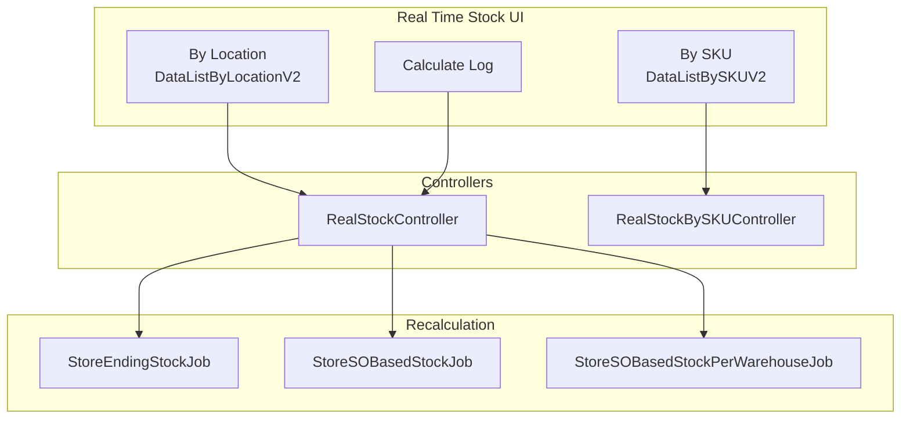

# Real Time Stock — Requirement Documentation

> **DRAFT** — Dokumen ini adalah draft awal hasil analisis codebase otomatis per 2026-06-19. Perlu direview PM/QA sebelum final.

## 0. Metadata & Changelog

| Version | Date | Author | Changes |
|---------|------|--------|---------|
| 1.0 | 2026-06-19 | QA - Yemima | Initial draft (AS-IS) |

## 1. Ringkasan Eksekutif

`RealStockController` (by location) dan `RealStockBySKUController` (by SKU) membaca `ItemStockRealStock` / `scmag_ending_stocks` dengan kalkulasi on hand, ATS, reserved, in transit. Manual calculate memicu jobs `StoreEndingStockJob`, `StoreSOBasedStockJob`, dll.

## 2. Acceptance Criteria (AS-IS)

| ID | Kriteria | Validasi | Fitur |
|----|----------|----------|-------|
| A-01 | By Location datalist | `GET real-stock/by-location` | Tab location |
| A-02 | By SKU datalist | `POST real-stock/by-sku` | Tab SKU |
| A-03 | Warehouse column dynamic | `GET real-stock/warehouse-column` | SKU pivot headers |
| A-04 | Select2 warehouse/level | `select2-warehouse`, `select2-warehouse-level` | Filters |
| A-05 | Drill-down modals | `stock-on-hand`, `stock_availability`, `stock-booked`, `stock_reserved` | Detail |
| A-06 | `with_unit_up` toggle | Query boolean | Primary unit columns |
| A-07 | Export by location/SKU | export-file + export-progress | Async export |
| A-08 | Manual calculate | `manual-calculate` + progress + log | Recalc |
| A-09 | Latest calculation date | `CalculateTodoDate` | Staleness indicator |

## 3. Metrik Stok (AS-IS)

| Metrik | Endpoint detail | Rumus (high-level) |
|--------|-----------------|-------------------|
| On Hand | `stock-on-hand` | Inbound − transfer out approved − used − in transit |
| Availability | `stock_availability` | On hand − outstanding SO − reserved out |
| Stock Booked | `stock-booked` | Outstanding SO qty |
| Stock Reserved | `stock_reserved` | Open/draft transfer + outbound |

## 4. Validasi & Rules

| ID | Rule | Trigger | Pesan |
|----|------|---------|-------|
| V-01 | Policy viewAny ItemStockRealStock | index methods | 403 |
| V-02 | Virtual warehouse excluded | `is_virtual = 0` join | Non-virtual only |
| V-03 | SQL_MODE relaxed | `SET SQL_MODE=''` | MySQL aggregation |

## 5. Diagram Komponen

## 6. QA Test Notes

- Bandingkan On Hand vs Product Ending Stock untuk SKU+gudang sama
- Uji toggle with_unit_up → kolom primary unit muncul di modal
- Uji manual calculate end-to-end + log detail
- Uji export SKU dengan banyak warehouse columns

## Related Documents

| Doc | Path |
|-----|------|
| Knowledge Base | [knowledge-base.md](./knowledge-base.md) |
| Technical | [technical.md](./technical.md) |
