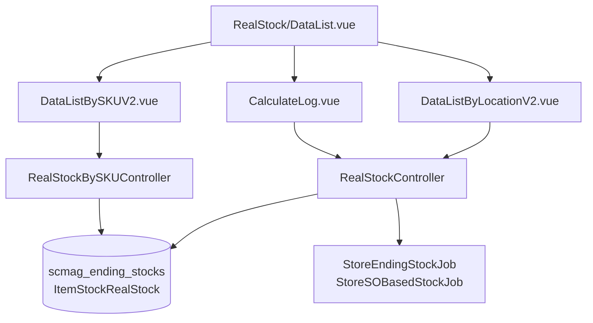

# Real Time Stock — Technical Documentation

> **DRAFT** — Dokumen ini adalah draft awal hasil analisis codebase otomatis per 2026-06-19. Perlu direview PM/QA sebelum final.

**UI route:** `/supplychain/real-stock`

---

## 1. Architecture Overview

---

## 2. Frontend File Map

| File | Role | Key API |
|------|------|---------|
| `Report/RealStock/DataList.vue` | Tab container + drill-down modal | Dynamic `real-stock/{type}` |
| `DataListByLocationV2.vue` | By Location (active) | `GET real-stock/by-location` |
| `DataListBySKUV2.vue` | By SKU (active) | `POST real-stock/by-sku` |
| `DataListByLocation.vue` / `DataListBySKU.vue` | Legacy variants | Same endpoints |
| `CalculateLog.vue` | Manual calc log | `manual-calculate-log`, `manual-calculate-detail` |

Modal detail types: `stock-on-hand`, `stock_availability`, `stock-booked`, `stock_reserved`

---

## 3. Backend File Map

| File | Role |
|------|------|
| `RealStockController.php` | by-location, drill-down, manual calculate, export location |
| `RealStockBySKUController.php` | by-sku index, warehouse columns, export sku |
| `ItemStockRealStock.php` | Entity extends EndingStock |
| `RealStockExportFile.php` | Export tracking |
| `RealStockExportTemp.php` | Export staging |
| `EndingStockManualCalcLog.php` | Calculate audit log |
| `RealStockSkuExportJob` / `RealStockSkuExportJob2` | SKU export |
| `RealStockLocationExportJob` | Location export |

---

## 4. API Routes

| Method | Path | Handler |
|--------|------|---------|
| GET | `supplychain/real-stock/by-location` | indexByLocation |
| POST | `supplychain/real-stock/by-sku` | RealStockBySKUController@index |
| GET | `supplychain/real-stock/warehouse-column` | warehouseColumn |
| GET | `supplychain/real-stock/select2-warehouse-level` | select2WarehouseLevel |
| GET | `supplychain/real-stock/select2-warehouse` | select2Warehouse |
| GET | `supplychain/real-stock/stock-booked` | indexStockBooked |
| GET | `supplychain/real-stock/stock-on-hand` | indexStockOnHand |
| GET | `supplychain/real-stock/stock_availability` | indexStockAvailability |
| GET | `supplychain/real-stock/stock_reserved` | indexStockReserved |
| GET | `supplychain/real-stock/manual-calculate` | manualCalculate |
| GET | `supplychain/real-stock/manual-calculate-progress` | manualCalculateProgress |
| GET | `supplychain/real-stock/manual-calculate-log` | manualCalculateLog |
| GET | `supplychain/real-stock/manual-calculate-detail/{id}` | manualCalculateLogDetail |
| GET | `supplychain/real-stock/by-location/export-file` | exportFileByLocation |
| GET | `supplychain/real-stock/by-sku/export-file` | exportFile (SKU) |

---

## 5. Database Schema

| Tabel | Role |
|-------|------|
| `scmag_ending_stocks` | Core stock balances |
| `scm_item_stocks` | Lot-level stock |
| `scm_wh_parent_by_types` | Warehouse hierarchy |
| `scm_s_o_based_stocks` | SO outstanding |
| `scm_s_o_based_stock_per_warehouses` | Per-WH SO stock |
| `scm_real_stock_export_files` | Export metadata |
| `scm_ending_stock_manual_calc_logs` | Manual calc history |

---

## 6. Jobs / Commands

| Komponen | Fungsi |
|----------|--------|
| `StoreEndingStockJob` | Rebuild ending stock |
| `StoreSOBasedStockJob` | SO-based metrics |
| `StoreSOBasedStockPerWarehouseJob` | Per-warehouse SO |
| `RealStockSkuExportJob2` | Large SKU export |
| `stock:calculate-ending-balance` | Shared dengan mutation menus |

---

## 7. Related docs

- [supplychain-product-ending-stock/technical.md](../supplychain-product-ending-stock/technical.md)
- [supplychain-inventory-detail/technical.md](../supplychain-inventory-detail/technical.md)
