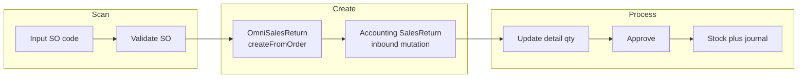

# Sales Return — Requirement Detail

> **DRAFT** — Draft per 2026-06-19. AS-IS.

**Modul UI:** SupplyChain · **Modul API:** Accounting + OmniChannel  
**Route UI:** `supplychain/sales-returns` · **API:** `accounting/sales-returns`

---

## 1. Fungsi & Tujuan

Sales Return memproses pengembalian barang dari Sales Order ke gudang. Flow:

1. `OmniSalesReturn` — data retur platform (header + detail dari SO).
2. `Accounting\SalesReturn` — `StockMutation` inbound dengan `is_return_process = 1`.

---

## 2. Alur Kerja

### 2.1 Create (`POST accounting/sales-returns`)

| Field | Validasi |
|-------|----------|
| `sales_order_code` | Wajib — match `code`, `platform_order_id`, atau `platform_return_id` |
| `warehouse_destination_id` | Wajib |
| `location_id` | Wajib (CCTV location) |

**Business rules:**

- SO harus ditemukan.
- `validateDetails()` — cek eligibility per detail (invoice, outbound, dll.).
- Jika ada pending return (`has_pending`) → return existing mutation (success message).
- Jika sudah fully processed → success message + link mutation terakhir.
- `getScrapWHParent()` pada warehouse destination.

Creates:

- `OmniSalesReturn` (jika belum ada yang pending)
- `Accounting\SalesReturn` stock mutation `TS_OPEN`, `return_type = RETURN_TYPE_PLATFORM`

### 2.2 Update detail (`PATCH accounting/sales-returns/{return_id}/details/{id}`)

Via `SalesReturnDetailController` — update restock/broken/lost qty per line.

### 2.3 Approve (`POST accounting/sales-returns/{id}/approve`)

| Validasi | Efek |
|----------|------|
| `can_approve` | Tidak boleh double approve |
| Fiscal period | `transaction_date` |
| Minimal 1 qty > 0 | restock, broken, atau lost |
| `description` max 150 | Approval note |

**Efek:** `ItemStockMutation::approveReturn()`; jika ada remainder → `platform_return->duplicate()`.

### 2.4 Delete (`DELETE accounting/sales-returns/{id}`)

Hanya jika status memungkinkan (`firstValidateStockMutation`).

---

## 3. Authorization

- `authorizeAny` pada `Accounting\SalesReturn` dan `SupplyChain\SalesReturn` (policy stub).
- Approve: policy `approval` pada `Accounting\SalesReturn`.

---

## 4. Relasi Menu

| Menu | Relasi |
|------|--------|
| Omni Sales Order | Sumber transaksi |
| Inventory In | Mutasi stok hasil approve |
| Customer Invoice | COA & tax reference |

---

## 5. FAQ

**Q: Kenapa API di Accounting?**  
A: Retur menghasilkan jurnal akuntansi (Return Inventory, COGS, AR, dll.).

**Q: Apakah bisa retur partial?**  
A: Ya — `duplicate()` platform return jika masih ada `available_quantity_in_base_unit`.
