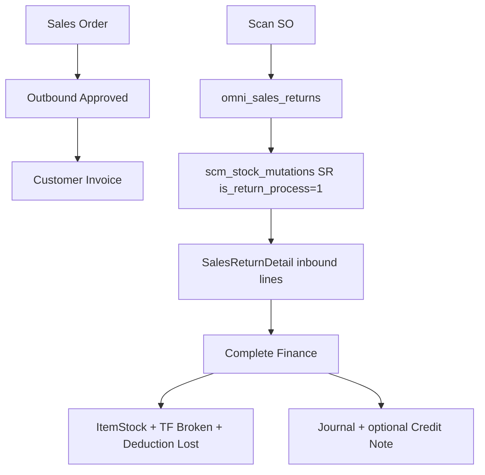
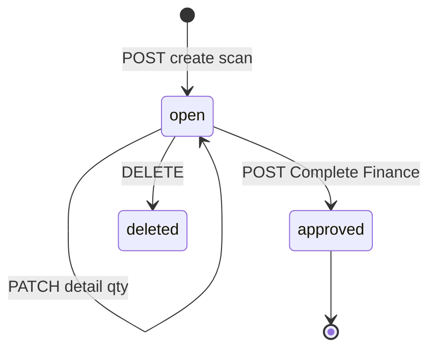
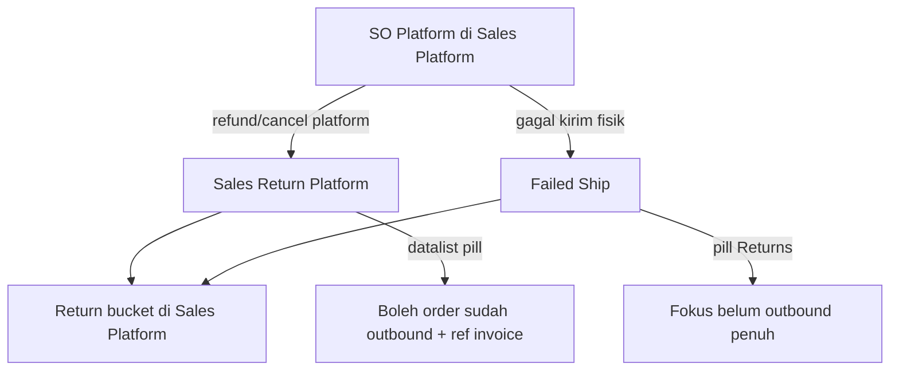

# Sales Return — Requirement Documentation

**Modul:** Supply Chain (SCM) + Finance Accounting — **satu fitur, dua menu**  
**Audience:** PM, Operations (Gudang), Finance, QA, Support, Developer  
**Status:** AS-IS verified against codebase per 2026-07-05

| Menu | Route UI | Persona |
|------|----------|---------|
| **Sales Return** (SCM) | `/supplychain/sales-returns` | Team Gudang — scan, input qty |
| **Sales Return Approval** (Accounting) | `/accounting/sales-return` | Team Finance — review harga/COGS, Complete |

**API base:** `{VITE_API_URL}accounting/sales-returns` · Datalist platform: `omnichannel/sales-returns`  
**Prefix transaksi:** `SR-` · Platform layer: `SRP` (`omni_sales_returns`)

**PM source:** `sales-return-requirement.md` (Notion, Live) · Perubahan COGS 7 Mei 2026

**Finance layer doc:** [accounting-sales-return/requirement.md](../accounting-sales-return/requirement.md)

---

## 0. Metadata & Changelog

| Version | Date | Author | Changes |
|---------|------|--------|---------|
| 1.0 | 2026-06-19 | QA - Yemima | Initial draft AS-IS codebase |
| 2.0 | 2026-07-05 | QA - Yemima | Full rewrite: merge PM requirement, D&W COGS 7 Mei, dual-menu flow, gaps §19–§21 |
| 2.1 | 2026-07-15 | QA - Yemima | Relasi Sales Platform (Return bucket, flow vs Failed Ship) |

---

## 1. Ringkasan Eksekutif

**Sales Return** memproses pengembalian barang dari customer setelah order **sudah outbound & invoiced** (settled). Berbeda dari [Failed Ship](../supplychain-failed-ship/requirement.md) yang untuk order gagal kirim **sebelum** SI & Outbound.

| Kebutuhan Bisnis | Bagaimana SR Menjawab |
|------------------|----------------------|
| Traceability SO → Outbound → Return | Lines auto dari outbound; pivot `omni_sales_return_detail_has_mutations` |
| Restock / rusak / hilang | Tiga qty per SKU: Restock, Broken, Lost |
| Kontrol finance | Gudang save qty → Finance **Complete** → stok + jurnal |
| Platform refund/cancel | Pill **Sales Return Platform** + Sync API |
| Billed vs Unbilled | `accounting_type` dari status pembayaran invoice |

### 1.1 Arsitektur data (AS-IS)



| Layer | Table / Entity | Role |
|-------|----------------|------|
| Platform | `omni_sales_returns`, `omni_sales_return_details` | Header/detail dari SO platform |
| Inbound mutation | `scm_stock_mutations` (`Accounting\SalesReturn`) | `is_return_process=1`, `return_type=platform`, code `SR` |
| Detail | `Accounting\SalesReturnDetail` | Restock/broken/lost per outbound line |
| Pivot | `omni_sales_return_detail_has_mutations` | Link omni detail ↔ outbound ↔ inbound detail |

**Legacy V1** (`RETURN_TYPE_SYSTEM`, import/export multi-SO): routes **commented out** — bukan scope aktif.

---

## 2. Prasyarat & General Rules

| Rule | AS-IS validation | Pesan error |
|------|------------------|-------------|
| Outbound approved | `processed_to_out_quantity > 0` per detail | `{code} has not been processed to outbound, please use Failed Ship` |
| Invoice complete | `processed_to_invoice_quantity > 0` | `{code} has not been fully processed to invoice` / pending invoice |
| Product bound | `product_id` not empty | `{sku} is not binded to system product` |
| **IDR only** | `current_primary_currency_id == currency_id` | `…linked to Sales Invoice in foreign currency… Please use manual settlement…` |
| Pending payment | `prepared_to_payment_amount == 0` | `{code} has pending payment for invoice {code}…` |
| Pending return | `prepared_to_return_quantity > 0` | Redirect ke existing SR (success message) |
| Fully returned | all qty prepared | `This Sales Order is already fully processed to Sales Return.` |

**PM vs AS-IS — AR Unapproved:** PM menyebut AR unapproved block. Code **tidak** cek status AR document secara eksplisit; yang dicek: invoice processed, pending payment, foreign currency (GAP-SR-01).

**Failed Ship vs SR:**

| Kondisi order | Menu |
|---------------|------|
| Shipped, **belum** SI & Outbound | [Failed Ship](../supplychain-failed-ship/requirement.md) |
| **Sudah** SI & Outbound | **Sales Return** |

---

## 3. Perubahan COGS — 7 Mei 2026 (Agreement)

| Aspek | Before | After (AS-IS code) |
|-------|--------|---------------------|
| Nilai persediaan return | Stock ID inbound date **terbaru** | **Average** total nilai outbound ÷ total qty outbound |
| Stock ID hasil return | — | **1 Stock ID** per detail line (restock+broken+lost share same `ItemStock`) |

**Implementasi BE** (`SalesReturnController@createDetail` L459–471):

```
total_cogs = Σ (outbound_qty × item_stock.each_price_before_vat)
average_price = total_cogs / total_outbound_qty
each_price_before_vat on return detail = average_price
```

**Rule 1 — 1 Stock ID:** `SalesReturnDetail::generateItemStock()` creates **one** `ItemStock` per inbound detail; broken transfer & lost deduction reference same stock.

**GAP-SR-02:** Tooltip FE Return COGS masih menyebut *"most recent Stock ID date"* (`DetailTable.vue` L77) — **tidak match** BE average (7 Mei 2026).

---

## 4. PART 1 — Menu Sales Return (SCM)

**Route:** `/supplychain/sales-returns`  
**Komponen:** `SCM/SalesReturn/DataList.vue` + shared `@Accounting/Return/SalesReturn/*`

### 4.1 Header Section (Scan)

| Field | Rules AS-IS |
|-------|-------------|
| **Scan Order** | `sales_order_code` — match `code`, `platform_order_id`, atau `platform_return_id` |
| **Select WH Location** | Required; filter `is-return`, `has-scrap`, level under building, non-virtual |
| **Select CCTV Location** | Required; master location |
| **Reset** | Clear WH + Location ke null (`ActionButtons.vue`) |
| **Sync** | Bulk platform sync → `POST omnichannel/sales-returns/sync` |

**Preferensi user:** `localStorage` keys `return-warehouse-{companyId}`, `return-location-{companyId}` — persist antar session ✓

**Tooltip WH (PM):** ✓ implemented via WarehouseSelect props

### 4.2 Datalist — Kolom

**API:** `GET/POST omnichannel/sales-returns?from_scm=true`  
**Komponen:** `SalesReturnPlatformTable.vue`

| # | Kolom PM | Field BE / FE | Visible default |
|---|----------|---------------|-----------------|
| 1 | Sales Order | `order_formatted` | ✓ |
| 2 | Order Date | `order_deadline_formatted` | ✓ |
| 3 | Store Name / Buyer | `customer_formatted` | ✓ |
| 4 | Shipper / Tracking | `shipping_info_formatted` | ✓ |
| 5 | Return Shipper / Tracking | `return_shipping_formatted` | ✓ (PM: hidden default — **AS-IS visible**) |
| 6 | Total SKU / Qty | `total_quantity_formatted` | ✓ |
| 7 | Return Location | `warehouse_destination_formatted` | ✓ |
| 8 | 3PL Reference | `warehouse_origin_formatted` | ✓ |
| 9 | CS Type / Reason | `reason_formatted` | ✓ |
| 10 | Order Status | `order_status_formatted` | ✓ |
| 11 | Return Platform Status | `return_status_formatted` | ✓ |
| 12 | SR Code / Date | `transaction_code_formatted` | ✓ |
| 13 | Type Billed/Unbilled | `accounting_type` | ✓ |
| 14 | Outbound ref | `outbound_reference_formatted` | ✓ |
| 15 | Sales Invoice ref | `invoice_reference_formatted` | ✓ |
| 16 | AR ref | via invoice join | Partial — no dedicated AR column (GAP-SR-03) |
| 17 | Generated Trx (Credit Note) | — | **Not in datalist** (GAP-SR-04) |
| 18 | SR Status | `return_status_formatted` / mutation status | ✓ |
| 19 | Created By / At | `created_by_formatted` | ✓ |

**List filter default:** SO detail harus **full outbound** (`processed_to_out_quantity = sales_order_quantity_in_base_unit`).

### 4.3 Pill — Sales Return Platform

| PM | AS-IS |
|----|-------|
| Order refund/cancelled dari platform | Toggle section `platformOpen` di DataList |
| Belum ada SR | `without_used=true` → `stock_mutation_id IS NULL` |
| Outbound approved | Default query full outbound |
| Count dengan separator | `GET omnichannel/sales-returns/count` |

### 4.4 Bulk Select

| PM rule | AS-IS |
|---------|-------|
| Multi order → 1 SR | **Not implemented** in active scan flow — **1 SO per scan** (GAP-SR-05) |
| Same store (platform) | N/A — V1 commented |
| Same customer (internal) | N/A |
| IDR blocking message | ✓ at create validation |

---

## 5. PART 2 — Halaman Edit/Proses

**Route SCM:** `/supplychain/sales-returns/edit/:id`  
**Route Finance:** `/accounting/sales-return/edit/:id` (same components, different props)

### 5.1 Section Order Details

**Komponen:** `Header.vue` — read-only disclosure

| Field PM | AS-IS |
|----------|-------|
| Order No, Buyer, Notes, Return Type, SR Status | ✓ |
| Return WH, Returned By/Location | ✓ |
| SR No + timestamp | ✓ |
| Shipping info, Packing, Pickup | **Partial** — not all PM fields in Header (GAP-SR-06) |
| Return Shipper / Return Tracking editable | **Not in Header** — datalist only (GAP-SR-07) |

### 5.2 Product Detail — Return Table

**Header:** `Sales Return No: SR-… | created_at`

| Kolom SCM | Field | Validasi |
|-----------|-------|----------|
| Product | image + SKU + name | Auto from outbound |
| Product Qty | `return_quantity` | Order qty |
| Restock Qty | `quantity` | Whole number |
| Lost Items | `lost_quantity` | Whole number |
| Broken Items | `broken_quantity` | Whole number |
| Total SR Qty | computed | ≤ returnable; FE: `Total return qty can't exceed…` |
| Unit | product unit | — |

**Returnable max:**

```
outbound_qty_in_base - prepared_to_return_qty - processed_to_return_qty
```

**Auto-save:** debounce ~1200ms → `PATCH …/details/{id}`

**SCM toast after save:** `Return data saved. Waiting for Finance team to review and complete the approval process.` ✓

**Kolom Finance** (`with_price=1`): Order Price/COGS, Return Price/COGS — lihat [accounting-sales-return](../accounting-sales-return/requirement.md).

### 5.3 Action Buttons

| Tombol | SCM (`fromScm=true`) | Finance (`fromScm=false`) |
|--------|----------------------|---------------------------|
| Back to Datalist | ✓ → `/supplychain/sales-returns` | ✓ → `/accounting/sales-return` |
| Edit Qty | ✓ (auto-save) | ✓ |
| **Complete** | ❌ hidden | ✓ when `can_approve` |
| Delete | ✓ if not approved | ✓ |

---

## 6. Status Lifecycle (AS-IS)



| Status | Used? | Notes |
|--------|-------|-------|
| **open** | ✓ | Default on create |
| **approved** | ✓ | After Finance Complete |
| draft, rejected, processed, complete, void, closed | ❌ | Constants exist; not in active flow |

**No reject button** in active UI (legacy `ApprovalDialog` unused).  
**Auto-approve:** command `salesreturn:auto-approve` + config `omni_sales_return_configurations`.

---

## 7. PART 3 — Completion Flow & Generated Transactions

### 7.1 POV Gudang (SCM)

Setelah save qty → status tetap **open** → menunggu Finance. Tidak ada Complete.

### 7.2 POV Finance — Complete (`POST …/approve`)

**Validasi approve:**

| Rule | Message |
|------|---------|
| Not already approved | `This data and its properties already approved…` |
| Min 1 qty > 0 | `Please enter at least one restock quantity, broken quantity, or lost quantity` |
| Lost > 0 needs Return Expense COA | `Cannot approve. Return Expense COA is not configured…` |
| Product active + COA group | `SKU {sku} is inactive` / `Please check COA group…` |
| `description` max 150 | optional approval note |

**Sub-proses on approve** (`SalesReturnDetail::generateStock`):

| Outcome | Generated transaction |
|---------|----------------------|
| **Restock** (+ broken + lost total) | `ItemStock` at Return WH (`available_quantity`) |
| **Broken Items** | Auto **Transfer Internal** → Scrap WH (`PROCESS_TYPE_SCRAP`) — auto-approved |
| **Lost Items** | Auto **Stock Deduction** (`PROCESS_TYPE_LOST`, inventory adjustment) — auto-approved |

**Partial remainder:** jika masih ada `available_quantity_in_base_unit` → `platform_return->duplicate()` untuk SR baru.

### 7.3 Jurnal (AS-IS — `JournalProcess::stockSalesReturnAutoJournal`)

| Type | Jurnal |
|------|--------|
| **UNBILLED** | J1: Sales (D) / AR (K) · J2: Return Inventory (D) / COGS (K) · J3: Expense (D) / Inventory (K) if Lost |
| **BILLED** | J1: **Credit Note** (D) / AR (K) · J2: Return Inventory (D) / COGS (K) · J3: Expense if Lost |

**Credit Note (billed):** auto jika `processed_to_payment_amount > 0` → `generateCreditNoteFromReturn`. Lihat [Credit Note](../accounting-credit-note/README.md).

**PM Completion Summary Dialog:** `Sales Return Processed` dengan breakdown + Print Summary — **not implemented** (GAP-SR-08).

---

## 8. Delete Rules

| Action | When | Effect |
|--------|------|--------|
| **Delete** | Not approved (`ensureMutationNotApprovedOrApproving`) | Revert `prepared_to_return_quantity`; clear pivot; soft-delete mutation |

Messages: `Data already approved.` · `Data approval process is in progress. Please wait a moment.`

**Void / Close:** tidak ada endpoint aktif.

---

## 9. Import / Export / Print

| Feature | AS-IS |
|---------|-------|
| **Export datalist** | ✓ `omnichannel/sales-returns/export-*` — chunk 5000, with/without details |
| **Import** | ❌ V1 routes commented |
| **Print** | Seeder SCM `print=1` but **no UI** (GAP-SR-09) |

---

## 10. Stock Impact Timeline

| Phase | Stock effect |
|-------|--------------|
| Create (open) | `prepared_to_return_quantity` ↑ — blocks qty |
| Edit qty | Adjust prepared counters + invoice `prepared_to_amount_return` |
| Approve | +ItemStock restock; broken→scrap TF; lost→deduction; `processed_to_return_quantity` finalized |

---

## 11. Validasi & Notifikasi Lengkap

| Kondisi | Notifikasi (exact / near-exact) |
|---------|--------------------------------|
| Missing SO code | `Please input Sales Order Code` |
| Missing WH | `Please select Warehouse Location` |
| Missing location | `Please select CCTV Location` |
| SO not found | `Unable to find sales order` |
| No outbound | `…has not been processed to outbound, please use Failed Ship` |
| Pending invoice | `…has pending invoice, please complete it first` |
| Not invoiced | `…has not been fully processed to invoice` |
| Foreign currency | `…linked to Sales Invoice in foreign currency…` |
| Pending payment | `…has pending payment for invoice…` |
| Pending SR exists | `There is a pending sales return for this order…` |
| Fully processed | `This Sales Order is already fully processed to Sales Return.` |
| Total SR > Product Qty | `Total return qty can't exceed the original ordered qty.` (FE) / `Total quantity exceed returnable quantity` (BE) |
| Qty = 0 save | `Total return quantity must be greater than 0 to save this document.` |
| Sync in progress | `Sync Sales Return Platform is being processed…` |

---

## 12. Do's & Don'ts

| ✅ Do | ❌ Don't |
|-------|----------|
| Pastikan order sudah outbound + invoice sebelum scan | Pakai SR untuk order pre-outbound (gunakan Failed Ship) |
| Isi minimal 1 dari Restock/Broken/Lost | Complete dengan semua qty 0 |
| Set Return Expense COA jika ada Lost Items | Approve tanpa COA group produk |
| Finance Complete setelah gudang save | Gudang klik Complete (hidden di SCM) |
| Foreign currency → manual settlement | Force SR untuk order non-IDR |

---

## 13. Acceptance Criteria (QA smoke)

1. Scan valid SO → create SR open + omni header  
2. Datalist platform pill shows count + full-outbound filter  
3. Edit restock/broken/lost → auto-save + SCM waiting toast  
4. Total SR qty capped at returnable  
5. SCM tidak lihat Complete; Finance lihat Complete  
6. Approve → ItemStock + journals + optional Credit Note (billed)  
7. Broken → auto TF scrap; Lost → auto deduction + expense journal  
8. Delete open SR reverts prepared qty  
9. Foreign currency SO blocked at create  
10. COGS uses average outbound price (7 Mei 2026 rule)

---

## 14. Relasi Menu

| Menu | Relasi |
|------|--------|
| [Failed Ship](../supplychain-failed-ship/requirement.md) | Pre-outbound / shipping failures; qty FS mengurangi room return |
| [Sales Platform](../omni-sales-platform/requirement.md) | SO marketplace sumber return; Return bucket + Failed Ship Status |
| [All Sales Order](../all-sales-order/requirement.md) | Monitoring gabungan general + platform |
| [Sales Order](../sales-order-general/requirement.md) | SO internal / Dev Sales Order |
| [Customer Invoice](../accounting-customer-invoice/) | Price, tax, billed/unbilled |
| [Credit Note](../accounting-credit-note/README.md) | Auto-generated billed returns |
| [Warehouse Setting](../supplychain-setting/) | Return Location WH |
| [Sales Return Configuration](../omni-global-setting/) | Auto-approve duration |

### Relasi Sales Platform (detail)



| Aspek | Peran Sales Return vs SP |
|-------|--------------------------|
| Eligibility | Platform return biasanya setelah outbound (`processed_to_out_quantity`); jika belum outbound → arahkan Failed Ship |
| Feedback SP | Memicu bucket **Return**; status dokumen SR independen dari Invoice Status di detail SP |
| Sync | `POST omnichannel/sales-returns/sync` menarik retur dari marketplace ke daftar platform |
| Qty | Tidak melebihi outbound residual setelah FS + return prepared/processed |

Canonical SP: [omni-sales-platform/requirement.md §7.1](../omni-sales-platform/requirement.md).

---

## 19. Gaps — PM vs AS-IS

| ID | Topik | PM | AS-IS | Status |
|----|-------|-----|-------|--------|
| GAP-SR-01 | AR unapproved block | Explicit AR check | Invoice/payment checks only | **Partial** |
| GAP-SR-02 | COGS tooltip Finance | Average outbound (7 Mei) | BE ✓; FE tooltip still "latest Stock ID date" | **UI drift** |
| GAP-SR-03 | AR column datalist | Dedicated column | Not present | **Not implemented** |
| GAP-SR-04 | Generated Trx / CN column | Datalist column | Not present | **Not implemented** |
| GAP-SR-05 | Bulk multi-order → 1 SR | Supported | 1 SO per scan | **Not implemented** |
| GAP-SR-06 | Order Details fields | Full PM list | Partial in Header | **Partial UI** |
| GAP-SR-07 | Return Shipper/Tracking edit | Editable internal | Not on edit form | **Not implemented** |
| GAP-SR-08 | Completion Summary dialog | Picking-list pattern | No dialog | **Not implemented** |
| GAP-SR-09 | Print Summary | Footer Print | No print UI | **Not implemented** |
| GAP-SR-10 | Reject flow | — | No reject button | **Not implemented** |
| GAP-SR-11 | Return Shipper column default hidden | Hidden | Visible default | **UI differs** |
| GAP-SR-12 | Status processed/complete | — | Jump open→approved | **By design AS-IS** |

---

## 20. Dev Follow-ups

| ID | Item | Hint |
|----|------|------|
| DEV-SR-01 | Update Return COGS tooltip to average | `DetailTable.vue` L77 |
| DEV-SR-02 | AR unapproved explicit check | `validateDetails()` |
| DEV-SR-03 | Completion Summary dialog | Finance approve success handler |
| DEV-SR-04 | Print Summary | New blade/component |
| DEV-SR-05 | Return shipper/tracking on edit form | Header or new section |
| DEV-SR-06 | Bulk multi-order create | New API + FE selection |

---

## 21. Pending Items — Major

| ID | Severity | Stakeholder | Pertanyaan | AS-IS |
|----|----------|-------------|------------|-------|
| **P-SR-01** | 🔴 Major | **Finance + Dev** | **Completion Summary + Print** wajib? (GAP-SR-08/09) | Approve success tanpa dialog breakdown |
| **P-SR-02** | 🔴 Major | **PM + Ops** | **Bulk 1 SR = multi order** masih roadmap? (GAP-SR-05) | Scan single SO only |
| **P-SR-03** | 🟡 Medium | **Finance** | **AR unapproved** — perlu cek eksplisit? (GAP-SR-01) | Invoice processed + no pending payment |
| **P-SR-04** | 🟡 Medium | **End user** | **Return Shipper/Tracking** editable internal? (GAP-SR-07) | Datalist/platform API only |
| **P-SR-05** | 🟡 Medium | **QA** | Kolom **Generated Credit Note** di datalist? (GAP-SR-04) | CN exists post-approve, tidak tampil di list |

**Confirmed OK:**

- COGS average outbound (7 Mei 2026) ✓ BE  
- 1 Stock ID per return detail ✓  
- Dual menu SCM/Finance split ✓  
- IDR-only enforcement ✓  
- Failed Ship routing pre-outbound ✓

---

## Related Documents

| Doc | Path |
|-----|------|
| Finance layer | [../accounting-sales-return/requirement.md](../accounting-sales-return/requirement.md) |
| Knowledge Base (Gudang) | [knowledge-base.md](./knowledge-base.md) |
| Technical | [technical.md](./technical.md) |
| Failed Ship | [../supplychain-failed-ship/requirement.md](../supplychain-failed-ship/requirement.md) |
