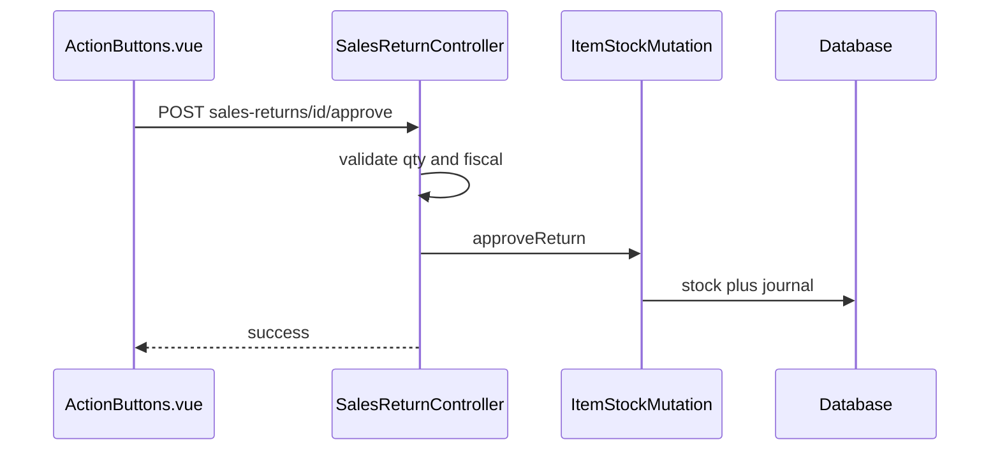

# Sales Return — Technical Documentation

> **DRAFT** — Draft per 2026-06-19.

**UI route:** `/supplychain/sales-returns`  
**API base:** `{VITE_API_URL}accounting/sales-returns`

---

## 1. Frontend File Map

**SCM entry:** `olshoperp-frontend/src/pages/SCM/SalesReturn/`

| File | Role |
|------|------|
| `DataList.vue` | Landing — warehouse/location + scan |
| `Form.vue` | Edit return (`sales-returns/edit/:id`) |

**Shared components:** `olshoperp-frontend/src/pages/Accounting/Return/SalesReturn/`

| File | Role |
|------|------|
| `ScanForm.vue` | Scan SO → create return |
| `components/ActionButtons.vue` | Approve/delete |
| `components/SalesReturnPlatformTable.vue` | Platform return table |
| `components/DetailTable.vue` | Qty restock/broken/lost |
| `components/Header.vue` | Header info |

### Router

| Route | Component |
|-------|-----------|
| `supplychain/sales-returns` | `SCM/SalesReturn/DataList.vue` |
| `supplychain/sales-returns/edit/:id` | `SCM/SalesReturn/Form.vue` |

---

## 2. Backend

| File | Module | Role |
|------|--------|------|
| `SalesReturnController.php` | Accounting | store, show, approve, destroy |
| `SalesReturnDetailController.php` | Accounting | index, update detail |
| `Entities/SalesReturn.php` | Accounting | Extends `StockMutation` |
| `Entities/SalesReturnDetail.php` | Accounting | Detail lines |
| `Entities/SalesReturn.php` | OmniChannel | Platform return header |
| `Entities/SalesReturnDetail.php` | OmniChannel | Platform return detail |
| `Policies/SalesReturnPolicy.php` | SupplyChain | Auth bridge |
| `Broadcasting/SalesReturnChannel.php` | SupplyChain | WebSocket channel |
| `Helpers/SupplyChain/ItemStockMutation.php` | App | `approveReturn()` |

---

## 3. API Routes

| Method | Path | Controller |
|--------|------|------------|
| POST | `accounting/sales-returns` | `SalesReturnController@store` |
| GET | `accounting/sales-returns/{id}` | `show` |
| DELETE | `accounting/sales-returns/{id}` | `destroy` |
| POST | `accounting/sales-returns/{id}/approve` | `approve` |
| GET | `accounting/sales-returns/{return_id}/details` | `SalesReturnDetailController@index` |
| PATCH | `accounting/sales-returns/{return_id}/details/{id}` | `update` |

---

## 4. Database

Inbound mutation: `scm_stock_mutations` (`is_return_process = 1`, `return_type = platform`).

Detail: `acc_sales_return_details` (Accounting entity).

Platform layer: `omni_sales_returns`, `omni_sales_return_details`.

---

## 5. Sequence — Approve

---

## 6. LocalStorage keys

- `return-warehouse-{companyId}`
- `return-location-{companyId}`

Diset di `SCM/SalesReturn/DataList.vue`.
