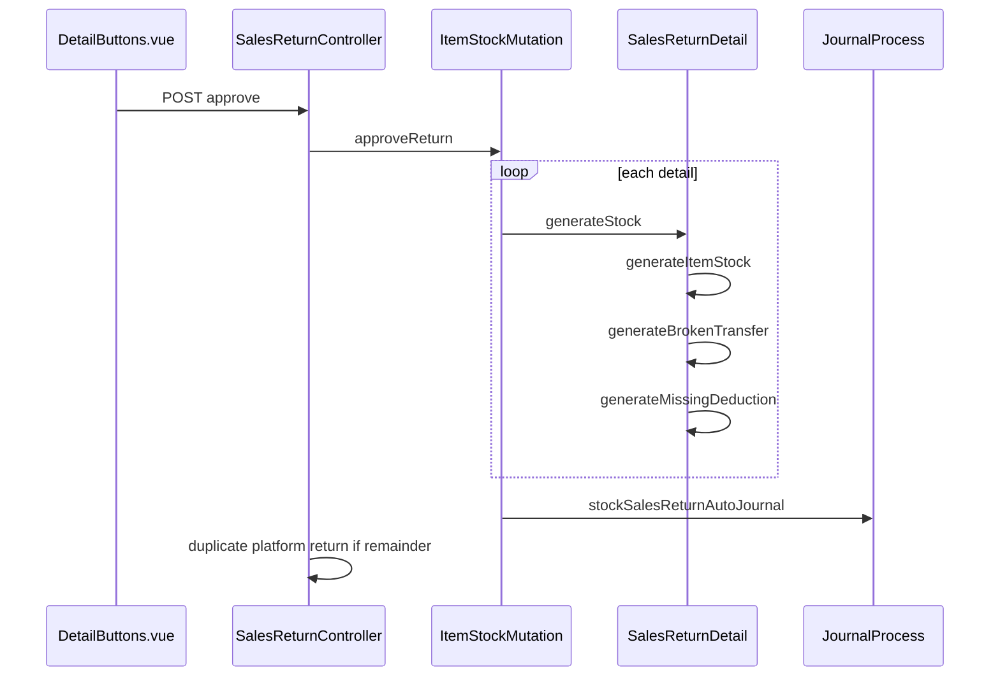

# Sales Return — Technical Documentation

**UI route (SCM):** `/supplychain/sales-returns`  
**UI route (Finance):** `/accounting/sales-return`  
**API base:** `{VITE_API_URL}accounting/sales-returns`  
**Datalist API:** `{VITE_API_URL}omnichannel/sales-returns`

---

## 1. Architecture

Dual-menu, shared FE components under `Accounting/Return/SalesReturn/`, props `fromScm` / `withPrice` differentiate personas.

| Layer | Entity | Table |
|-------|--------|-------|
| Platform return | `OmniChannel\Entities\SalesReturn` | `omni_sales_returns` |
| Platform detail | `OmniChannel\Entities\SalesReturnDetail` | `omni_sales_return_details` |
| Inbound mutation | `Accounting\Entities\SalesReturn` extends `StockMutation` | `scm_stock_mutations` |
| Inbound detail | `Accounting\Entities\SalesReturnDetail` | inbound detail table |
| Pivot | — | `omni_sales_return_detail_has_mutations` |

Flags: `is_return_process = 1`, `return_type = RETURN_TYPE_PLATFORM` (`'platform'`), `code_identifier = SR`.

---

## 2. Frontend File Map

### SCM entry

| File | Role |
|------|------|
| `olshoperp-frontend/src/pages/SCM/SalesReturn/DataList.vue` | WH/location + scan + platform pill |
| `olshoperp-frontend/src/pages/SCM/SalesReturn/Form.vue` | Edit (`fromScm=true`, `withPrice=false`) |

### Accounting entry

| File | Role |
|------|------|
| `olshoperp-frontend/src/pages/Accounting/Return/SalesReturn/DataList.vue` | Finance datalist |
| `olshoperp-frontend/src/pages/Accounting/Return/SalesReturn/Form.vue` | Edit (`fromScm=false`, `withPrice=true`) |

### Shared components

| File | Role |
|------|------|
| `ScanForm.vue` | Scan SO → POST create |
| `components/SalesReturnPlatformTable.vue` | Datalist PrimeVue |
| `components/ActionButtons.vue` | Reset, Sync, export |
| `components/DetailTable.vue` | Qty + auto-save + price columns |
| `components/DetailButtons.vue` | Back, Complete (Finance only), Delete |
| `components/Header.vue` | Order details disclosure |

### Router

| Route name | Path |
|------------|------|
| `supplychain_sales-returns_index` | `supplychain/sales-returns` |
| `edit_sales-return-_form` | `supplychain/sales-returns/edit/:id` |
| `accounting_sales-return_index` | `accounting/sales-return` |
| `edit_sales-return_form` | `accounting/sales-return/edit/:id` |

---

## 3. Backend File Map

| File | Role |
|------|------|
| `Modules/Accounting/Http/Controllers/SalesReturnController.php` | store, show, approve, destroy |
| `Modules/Accounting/Http/Controllers/SalesReturnDetailController.php` | index, update |
| `Modules/OmniChannel/Http/Controllers/SalesReturnController.php` | datalist, count, sync, export |
| `Modules/OmniChannel/Http/Controllers/SalesReturnConfigurationController.php` | auto-approve config |
| `Modules/Accounting/Entities/SalesReturn.php` | StockMutation subclass |
| `Modules/Accounting/Entities/SalesReturnDetail.php` | generateStock, ItemStock, TF, deduction |
| `Modules/OmniChannel/Entities/SalesReturn.php` | Platform header |
| `Modules/SupplyChain/Policies/SalesReturnPolicy.php` | Auth bridge |
| `app/Helpers/SupplyChain/ItemStockMutation.php` | `approveReturn()` L616+ |
| `app/Helpers/Accounting/JournalProcess.php` | `stockSalesReturnAutoJournal` L1867+ |
| `app/Console/Commands/SalesReturnAutoApprove.php` | Scheduled auto-approve |

**Legacy (inactive):** `SalesReturnV1Controller`, import/export V1 classes — routes commented in `Modules/Accounting/Routes/api.php` L713–751.

---

## 4. API Routes

### Accounting (mutation)

| Method | Path | Action |
|--------|------|--------|
| POST | `accounting/sales-returns` | Create from scan |
| GET | `accounting/sales-returns/{id}` | Show merged header |
| DELETE | `accounting/sales-returns/{id}` | Destroy open |
| POST | `accounting/sales-returns/{id}/approve` | Finance complete |
| GET | `accounting/sales-returns/{return_id}/details` | Detail index (`?with_price=1`) |
| PATCH | `accounting/sales-returns/{return_id}/details/{id}` | Update qty |

### OmniChannel (datalist)

| Method | Path | Action |
|--------|------|--------|
| GET/POST | `omnichannel/sales-returns` | Platform datalist |
| GET | `omnichannel/sales-returns/count` | Pill count |
| POST | `omnichannel/sales-returns/sync` | Platform sync |
| GET | `omnichannel/sales-returns/export-file` | Export start |
| GET | `omnichannel/sales-returns/export-progress` | Export poll |

---

## 5. Create Flow (`SalesReturnController@store`)

1. Resolve SO by `code` | `platform_order_id` | `platform_return_id`
2. `validateDetails()` — outbound, invoice, currency, payment, pending
3. If `has_pending` → return existing mutation
4. If `already_processed` → message + last mutation link
5. `OmniSalesReturn::createFromOrder()`
6. Create `Accounting\SalesReturn` mutation `TS_OPEN`
7. `createDetail()` per line — COGS average, increment `prepared_to_return_quantity`

### COGS average (7 Mei 2026)

```php
// SalesReturnController.php L459-471
foreach ($order_detail->outbound_mutation_details as $outbound_detail) {
    $total_quantity_in_base += $outbound_detail->outbound_quantity_in_base_unit;
    $total_cogs_price = bcadd($total_cogs_price,
        bcmul($outbound_qty, $outbound_detail->item_stock->each_price_before_vat, 4), 4);
}
$average_price = bcdiv($total_cogs_price, $total_quantity_in_base, 4);
```

---

## 6. Approve Flow



### Stock generation (`SalesReturnDetail.php`)

| Method | Output |
|--------|--------|
| `generateItemStock` | 1 `ItemStock` at return WH, `each_price_before_vat` = average |
| `generateBrokenTransfer` | Auto `StockMutationTransfer` → scrap WH |
| `generateMissingDeduction` | Auto `StockMutationDeduction` expense |

---

## 7. Detail Update (`SalesReturnDetailController@update`)

- Whole number validation on qty fields
- FIFO/LIFO allocation by `initial_inbound_mutation_date` on outbound item stocks
- Cap: `Total quantity exceed returnable quantity`
- Updates `prepared_to_return_quantity` on outbound + SO detail
- Updates invoice `prepared_to_amount_return` / `prepared_to_amount_credit_note`

---

## 8. Datalist Query Filters

| Param | Effect |
|-------|--------|
| `from_scm=true` | Edit links → SCM route |
| `platform_only=true` | Exclude `Platform::PL_OTHER` |
| `without_used=true` | `stock_mutation_id IS NULL` |
| `without_outbound=true` | Zero outbound (count endpoint) |

Default join: full outbound (`processed_to_out_quantity = sales_order_quantity_in_base_unit`).

---

## 9. Accounting Types

Set at create from invoice payment state:

| Type | Condition | Journal path |
|------|-----------|--------------|
| `unbilled` | No payment on invoice | Sales + AR reversal |
| `billed` | `processed_to_payment_amount > 0` | Credit Note + AR |

Constants: `OmniSalesReturn::TYPE_ACCOUNTING_BILLED`, `TYPE_ACCOUNTING_UNBILLED`.

Credit Note: `generateCreditNoteFromReturn` in approve path.

---

## 10. Authorization

| Gate | Entity |
|------|--------|
| CRUD | `Accounting\SalesReturn` + `SupplyChain\SalesReturn` policy |
| Approve | `authorize('approval', Accounting\SalesReturn::class)` |
| SCM menu | `approval => 0` (AccountingMenuSeeder) |
| Finance menu | `approval => 1` |

---

## 11. LocalStorage

```
return-warehouse-{companyId}
return-location-{companyId}
```

Set in `SCM/SalesReturn/DataList.vue` on WH/location change.

---

## 12. Export

- Chunk: **5000** rows (`SalesReturnController@exportExcel` Omni L460)
- Types: `with_details` / `without_details`
- Job: `SalesReturnExportJob`

---

## 13. Testing Notes

1. Create → verify average COGS on detail `each_price_before_vat`
2. Approve with restock only → 1 ItemStock, no TF/deduction
3. Approve with broken → scrap TF auto-approved
4. Approve with lost → deduction + Return Expense COA required
5. Billed invoice → Credit Note generated
6. Partial return → `duplicate()` creates new omni return
7. Delete open → prepared qty reverted
8. SCM Form: Complete button absent (`fromScm=true`)
9. Foreign currency SO → create blocked
10. FE Return COGS tooltip vs BE average (regression GAP-SR-02)

---

## 14. Related Documents

| Doc | Path |
|-----|------|
| Requirement | [requirement.md](./requirement.md) |
| Finance technical | [../accounting-sales-return/technical.md](../accounting-sales-return/technical.md) |
| Failed Ship | [../supplychain-failed-ship/technical.md](../supplychain-failed-ship/technical.md) |
| API routes | `docs/api/accounting/routes.md`, `docs/api/omni_channel/routes.md` |
