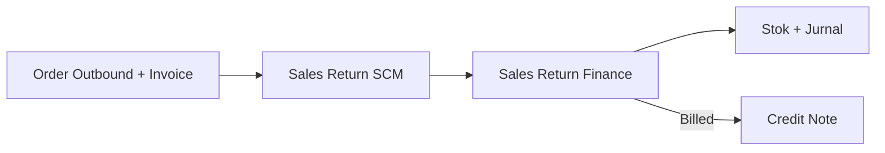
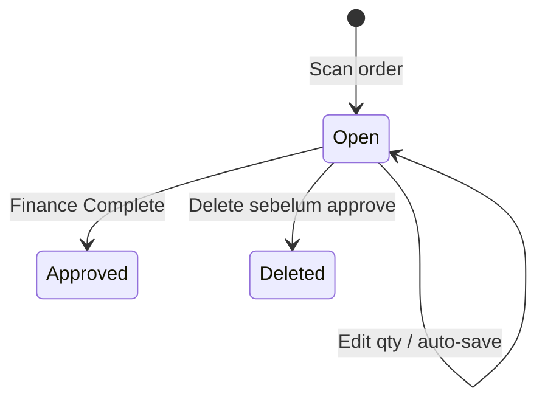

# Sales Return (SCM) — Panduan Pengguna

**Siapa yang baca:** operator gudang, receiving, operations support  
**Menu:** Supply Chain → Operations → Sales Return  
**Kode transaksi:** `SR-`  
**Feature Map / Lingo:** [feature-map.md](./feature-map.md)

---

## 1. Apa Itu & Kenapa Penting

Sales Return mencatat barang yang dikembalikan customer **setelah order sudah outbound dan invoiced**. Gudang scan order dan mengelompokkan kondisi barang; Finance menyelesaikan approval, stok, jurnal, dan Credit Note bila relevan.

---

## 2. Overview Flow & Proses Bisnis

**Versi teks:**

1. Order sudah outbound dan memiliki Sales Invoice.
2. Gudang scan order, lalu isi Restock/Broken/Lost.
3. Dokumen tetap Open dan menunggu Finance.
4. Finance Complete → stok dan jurnal diproses; return Billed menghasilkan Credit Note.

🎬 [Interactive demo akan ditambahkan di sini]

### Status

| Status | Arti | Bisa diedit gudang? |
|--------|------|----------------------|
| **Open** | Menunggu Finance Complete | Ya |
| **Approved** | Stok/jurnal selesai | Tidak |
| **Deleted** | Dihapus sebelum approve | Tidak |

---

## 3. Sebelum Mulai

- [ ] Order sudah outbound dan Sales Invoice sudah diproses.
- [ ] Transaksi memakai IDR dan tidak ada payment pending.
- [ ] Return Warehouse dan CCTV Location sudah dipilih.
- [ ] Jika barang belum outbound/invoice, gunakan **Failed Ship**.

🎬 [Interactive demo akan ditambahkan di sini]

---

## 4. Setelah Selesai

Setelah gudang menyimpan qty:

1. SR tetap **Open**.
2. Finance mereview Price/COGS dan klik **Complete**.
3. Restock masuk Return Warehouse; Broken ke scrap; Lost menjadi deduction.
4. Return Billed menghasilkan Credit Note; Unbilled memakai jurnal sales/AR.

---

## 5. Yang Perlu Diperhatikan

- Kalau order belum outbound, sistem meminta kamu memakai Failed Ship.
- Kalau invoice belum selesai, selesaikan invoice/settlement dulu.
- Kalau invoice foreign currency atau payment masih pending, scan ditolak.
- Kalau sudah ada SR Open, lanjutkan dokumen itu—jangan buat duplikat.
- Kalau total Restock+Broken+Lost melebihi sisa returnable, kurangi qty.
- Kalau semua qty 0, dokumen tidak bisa diselesaikan.
- Kalau mencari tombol Complete di SCM, tombol memang tidak ada—itu tugas Finance.
- Kalau ada Lost tanpa Return Expense COA, Finance tidak bisa Complete.

---

## 6. Langkah-Langkah

### Langkah 1 — Siapkan lokasi

1. Pilih [**Return WH Location** dan **CCTV Location**](#sf-lingo:SF-SR-02).
2. Gunakan **Reset** jika perlu mengganti keduanya.

### Langkah 2 — Pilih order

1. [Scan order](#sf-lingo:SF-SR-01), atau buka [Sales Return Platform](#sf-lingo:SF-SR-03).
2. Untuk platform, klik **Sync** bila datanya belum terbaru, lalu **Continue**.

### Langkah 3 — Isi kondisi barang

1. Isi [**Restock / Broken / Lost**](#sf-lingo:SF-SR-04) per SKU.
2. Pastikan total tidak melebihi sisa qty.
3. Tunggu auto-save dan pesan sukses.

### Langkah 4 — Serahkan ke Finance

1. Kembali ke datalist atau lanjut order lain.
2. Finance melakukan [Complete](#sf-lingo:SF-SR-05).

🎬 [Interactive demo akan ditambahkan di sini]

---

## 7. Tips & Hal yang Sering Bikin Bingung

- **Failed Ship vs Sales Return:** sebelum outbound/invoice → Failed Ship; sesudahnya → Sales Return.
- **Complete tidak muncul:** normal di SCM.
- **Satu SR beberapa order:** belum tersedia; satu order per scan.
- **Platform return:** Sync memperbarui refund/cancelled dari marketplace.
- **Billed:** Credit Note otomatis setelah Finance Complete.
- **Open salah input:** delete sebelum approved, lalu proses ulang.

---

## 8. Referensi

| Dokumen | Isi |
|---------|-----|
| [feature-map.md](./feature-map.md) | Indeks sub-feature + Lingo |
| [knowledge-base.md](./knowledge-base.md) | SOP gudang & troubleshooting |
| [requirement.md](./requirement.md) | Aturan E2E & gap |
| [technical.md](./technical.md) | API, stok, jurnal |
| [Sales Return Approval](../accounting-sales-return/) | Finance Complete |
| [Credit Note](../accounting-credit-note/) | Hasil return Billed |

---

*Derivatif dari requirement / knowledge-base / technical v2.1.*
