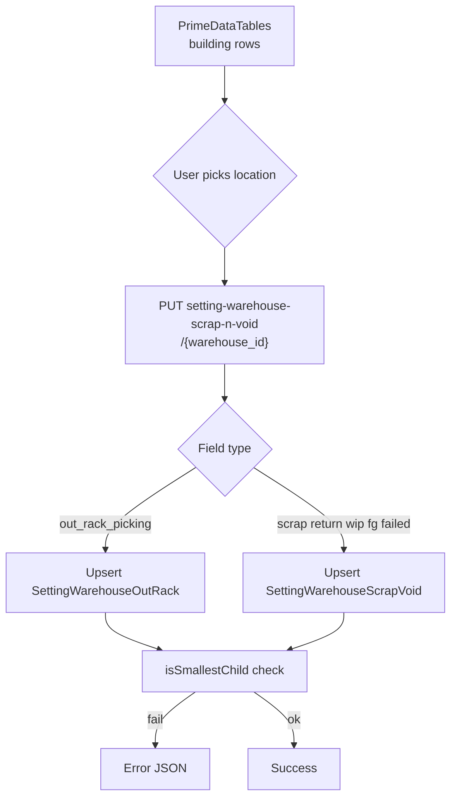
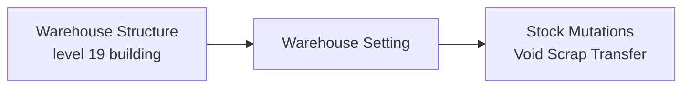

# Warehouse Setting — Requirement Documentation

> **DRAFT** — Dokumen ini adalah draft awal hasil analisis codebase otomatis per 2026-06-19. Perlu direview PM/QA sebelum final.

## 0. Metadata & Changelog

| Version | Date | Author | Changes |
|---------|------|--------|---------|
| 1.0 | 2026-06-19 | QA - Yemima | Initial draft (AS-IS) |
| 1.1 | 2026-07-04 | QA - Yemima | Cross-reference Relasi Assembly (WIP + Finish Good) |
| 1.2 | 2026-07-05 | QA - Yemima | Relasi Manual Picking List (Outrack Picking) |

## 1. Ringkasan Eksekutif

Halaman konfigurasi tunggal (bukan CRUD master klasik): datalist building level 19 dengan inline edit ke `scm_setting_warehouse_out_racks` dan `scm_setting_warehouse_scrap_voids` via `SettingWarehouseScrapVoidController`.

## 2. How It Works

## 3. Acceptance Criteria (AS-IS)

| ID | Kriteria | Validasi | Fitur |
|----|----------|----------|-------|
| A-01 | List buildings level 19 active | index query | Datalist |
| A-02 | Inline update per column | update partial body | PrimeDataTables |
| A-03 | Select2 leaf children only | select2* endpoints | Dropdown |
| A-04 | Smallest child validation | update | Business rule |
| A-05 | Merged audit | audit | Audit slideover |
| A-06 | Helper getWarehouseOutRack | static method | Used by mutations |

## 4. Validasi & Rules

| ID | Rule | Trigger | Pesan error |
|----|------|---------|-------------|
| V-01 | Selected WH must be smallest child | update any location field | `You can only select a warehouse without child locations.` |
| V-02 | Select2 scope: descendants of building | select2* | level = `rack_level - 1`, no children |
| V-03 | Index filter: `is_virtual=0`, `status=1`, space type level 19 | index | — |

## 5. Relasi Menu

| Menu | Relasi |
|------|--------|
| Warehouse Structure | Source buildings & leaf racks |
| Transfer Void / Scrap / Picking | Consumes `getWarehouseOutRack` |
| [Assembly](../supplychain-assembly/) | WIP + Finish Good warehouse per building |

---

## Relasi Assembly

**Dampak ke menu ini:** Assembly **tidak** punya field user untuk WIP / Finish Good warehouse. Kedua lokasi di-resolve dari `SettingWarehouseScrapVoid` per **Building Origin** yang dipilih operator:

| Field setting | Kolom DB | Dipakai Assembly saat |
|---------------|----------|----------------------|
| WIP Warehouse | `warehouse_wip_id` | TFI destination + Outbound origin |
| Finish Good Warehouse | `warehouse_finish_good_id` | Other Inbound destination |

**Prasyarat dari menu ini agar Assembly lolos:** Building Origin harus punya **WIP dan FG configured** — jika tidak, Open/Approve ditolak. Building Origin **tidak boleh sama** dengan WIP warehouse.

**Independensi:** Ubah WIP/FG setting setelah Assembly Open **tidak** retroaktif mengubah TFI yang sudah dibuat.

**Detail alur:** [Assembly requirement §5](../supplychain-assembly/requirement.md) — warehouse resolution, stock chain.

---

## Relasi Manual Picking List

**Dampak ke menu ini:** Kolom **Outrack Picking** (`SettingWarehouseOutRack::PICKING_TYPE`) wajib terisi agar Manual PL bisa dibuat dan complete.

| Aspek | Detail |
|-------|--------|
| Helper | `SettingWarehouseScrapVoidController@getWarehouseOutRack($building_id, PICKING_TYPE)` |
| Dipakai saat | Create MPL header → set `warehouse_destination` |
| Validasi | Jika Outrack NULL → create PL **gagal** |
| FIFO exclude | Semua Outrack picking + destination PL di-exclude dari alloc origin |
| Complete picked | Stok transfer rack → Outrack ini |

**Prasyarat:** Building Origin harus punya leaf Outrack Picking configured (smallest child validation).

**Detail:** [Manual Picking List requirement §12](../supplychain-manual-picking-list/requirement.md)

## 6. Permission

- Policy: `SettingSCMPolicy` (entity `SettingSCM`)
- Menu id **251** — add/update/delete flags exist but UI is single Form page

## 7. QA Test Notes

- [ ] Each column saves independently
- [ ] Pick parent warehouse → error
- [ ] select2 limited to 20 results
- [ ] Audit shows both out rack and scrap void changes

## 8. Known Gaps

- `store`/`destroy` empty on controller — no create/delete UI.
- Return/WIP/FG use same select2 URL as scrap (`select2-warehouse-scrap`).

## Related Documents

| Doc | Path |
|-----|------|
| Knowledge Base | [knowledge-base.md](./knowledge-base.md) |
| Technical | [technical.md](./technical.md) |
| Warehouse Structure | [../supplychain-warehouse-structure/requirement.md](../supplychain-warehouse-structure/requirement.md) |
| Assembly | [../supplychain-assembly/requirement.md](../supplychain-assembly/requirement.md) |
