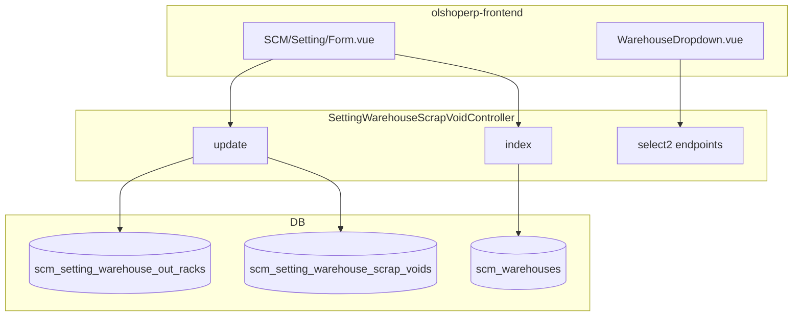

# Warehouse Setting — Technical Documentation

> **DRAFT** — Dokumen ini adalah draft awal hasil analisis codebase otomatis per 2026-06-19. Perlu direview PM/QA sebelum final.

**UI route:** `/supplychain/setting`  
**API base:** `{VITE_API_URL}supplychain/setting-warehouse-scrap-n-void`

---

## 1. Architecture Overview

---

## 2. Frontend File Map

| File | Role | Key API |
|------|------|---------|
| `src/pages/SCM/Setting/Form.vue` | Single-page inline grid | `GET/PUT setting-warehouse-scrap-n-void` |
| `src/pages/SCM/master/Warehouse/components/WarehouseDropdown.vue` | Inline select | `.../select2-warehouse-*` |

### Router

| Route | Component |
|-------|-----------|
| `supplychain/setting` | `Setting/Form.vue` |

---

## 3. Backend

| File | Role |
|------|------|
| `SettingWarehouseScrapVoidController.php` | index, update, select2, audit, `getWarehouseOutRack` |
| `Entities/SettingWarehouseScrapVoid.php` | Scrap/void/return/wip/fg/failed ship FKs |
| `Entities/SettingWarehouseOutRack.php` | Out rack by type constant |
| `Entities/SettingSCM.php` | Policy menu class |
| `Policies/SettingSCMPolicy.php` | Authorization |

---

## 4. API Routes

| Method | Path | Notes |
|--------|------|-------|
| GET | `setting-warehouse-scrap-n-void` | index datalist |
| GET | `setting-warehouse-scrap-n-void/primevue` | alias index |
| PUT/PATCH | `setting-warehouse-scrap-n-void/{warehouse_id}` | partial field update |
| GET | `setting-warehouse-scrap-n-void/audit` | merged audit |
| GET | `setting-warehouse-scrap-n-void/{warehouse}/select2-warehouse-void` | out rack options |
| GET | `.../select2-warehouse-scrap` | scrap/return/wip/fg options |
| GET | `.../select2-warehouse-failed-ship` | failed ship options |

Resource registered but `store`/`destroy` are no-op.

---

## 5. Database

### `scm_setting_warehouse_out_racks`

| Column | Keterangan |
|--------|------------|
| `warehouse_id` | Building (level 19) |
| `warehouse_out_rack_id` | Target leaf |
| `type` | e.g. `PICKING_TYPE` constant |

### `scm_setting_warehouse_scrap_voids`

| Column | Keterangan |
|--------|------------|
| `warehouse_id` | Building |
| `warehouse_scrap_id`, `warehouse_return_id`, `warehouse_wip_id`, `warehouse_finish_good_id`, `warehouse_failed_ship_id` | Optional FKs |

---

## 6. Config dependencies

- `config('warehouse.rack_level')` — level rack untuk filter select2
- `config('warehouse.out_racks.{type}')` — fallback virtual out rack
- Building filter uses `warehouseSpaceType.level = 19`

---

## 7. Integration

`getWarehouseOutRack($warehouse_id, $type)` — cached 5 min; used across mutation controllers for resolving outbound virtual/physical rack.
