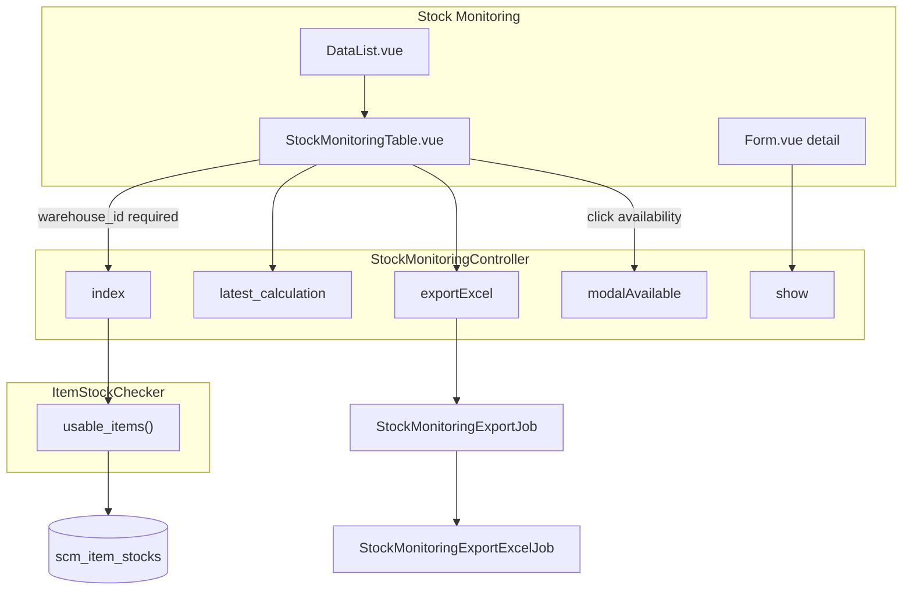
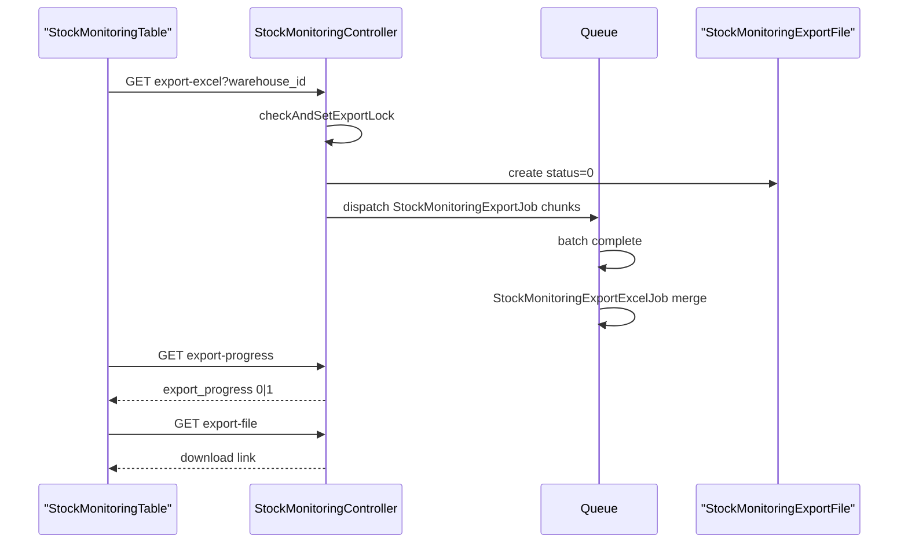

# Dev - Stock Monitoring — Requirement Documentation

> **DRAFT** — Dokumen ini adalah draft awal hasil analisis codebase otomatis per 2026-06-19. Perlu direview PM/QA sebelum final.

## 0. Metadata & Changelog

| Version | Date | Author | Changes |
|---------|------|--------|---------|
| 1.0 | 2026-06-19 | QA - Yemima | Initial draft (AS-IS) |

## 1. Ringkasan Eksekutif

Stock Monitoring menampilkan item stock per warehouse via `ItemStockChecker::usable_items()`. Controller `StockMonitoringController` mendukung mode SCM (`show_unit_value=0`), Accounting value (`show_unit_value=1`), dan asset list. FE wajib pilih warehouse sebelum render tabel. Export async: chunk jobs → merge Excel/ZIP. Detail page: tabs history, certificate, interchange.

**Catatan:** `ScmReport` **tidak** dipakai menu ini.

## 2. Acceptance Criteria (AS-IS)

| ID | Kriteria | Validasi | Fitur |
|----|----------|----------|-------|
| A-01 | Warehouse required di FE | `dataTableComponentKey > 1` setelah Apply | Gate UI |
| A-02 | Datalist scoped company | `ItemStockChecker` + token | Multi-tenant |
| A-03 | Policy viewAny | `ItemStockMonitoring` pada index/show/export | Auth |
| A-04 | Kolom qty breakdown | inbound, transfer, used, reserved, availability, on hand | Datalist |
| A-05 | Klik availability → modal | `GET stock-monitoring/{id}/modal-available` | Drill-down |
| A-06 | Latest calculation banner | `GET stock-monitoring/cek/latest-calculation` | Header info |
| A-07 | Select2 warehouse | `GET stock-monitoring/select2/warehouse` | Filter |
| A-08 | Export all Excel | `GET stock-monitoring/export-excel` + jobs | Async export |
| A-09 | Export file list | `GET stock-monitoring/export-file` | Download UI |
| A-10 | Export progress | `GET stock-monitoring/export-progress` | Polling |
| A-11 | Detail show item stock | `GET stock-monitoring/{item_stock}` | Form.vue header |
| A-12 | Certificate tab | `GET .../certificate`, download | Form.vue |
| A-13 | Interchange tab | `GET .../interchange` | InterChange.vue |
| A-14 | Virtual WH toggle | Double-click label + `with_virtual_processing` | Dev feature |
| A-15 | Advanced filter | `advanced_filter=true` prop | SearchBuilder |

## 3. Validasi & Rules

| ID | Rule | Trigger | Pesan error |
|----|------|---------|-------------|
| V-01 | `authorize viewAny ItemStockMonitoring` | index (authorized=true) | 403 |
| V-02 | Export lock 600s per user | `checkAndSetExportLock` | Toast "Export process is running" |
| V-03 | Export empty data | `exportExcel` count=0 | Error "Data Not Found." |
| V-04 | Export progress timeout 30 min | `exportProgress` | Auto set status=1 |
| V-05 | ZIP jika rows > 5000 | `exportExcel` | File .zip |
| V-06 | Chunk size 500 IDs | `StockMonitoringExportJob` dispatch | Batch pipeline |
| V-07 | Include virtual WH void | `RenderTransactionLimit.include_virtual_wh_void` | Config company |

## 4. Fitur & Behavior

| ID | Fitur | Trigger | Expected result |
|----|-------|---------|-----------------|
| F-01 | Warehouse Apply | `click_select` | URL `?warehouse_id=` |
| F-02 | Reuse table component | `StockMonitoringTable` shared | Juga dipakai mutation embed |
| F-03 | Mode inventory_out / transfer | `table_type` prop | Tombol Use Item + modal |
| F-04 | Mode stock_monitoring | `table_type=stock_monitoring` | Read-only, export on |
| F-05 | Row link ke detail | `product_formatted` HTML links | `/supplychain/stock-monitoring/{id}` |
| F-06 | Expired date columns | Optional render | Exp. Date / Exp. Status |
| F-07 | Price columns | `with_price_column=true` | Hanya accounting mode |

## 5. Permission & Dependencies

| Item | Detail |
|------|--------|
| Menu Gate | `ItemStockMonitoring::class`, add=1 update=1 |
| Policy | `ItemStockMonitoringPolicy` |
| Core helper | `App\Helpers\SupplyChain\ItemStockChecker` |
| Jobs | `StockMonitoringExportJob`, `StockMonitoringExportExcelJob`, `StockMonitoringGenerateSingleExcelFileJob`, `StockMonitoringMergeExcelFilesJob` |
| Related | Real Stock (kalkulasi), Mutation outbound/transfer (picker), Accounting stock-monitoring-value |

## 6. Diagram Alur

## 7. Sequence Export

## 8. QA Test Notes

- Pilih warehouse dengan mixed inbound/outbound → verifikasi formula Availability
- Klik Availability → modal colli qty sum = angka availability
- Export warehouse kecil (<100) → single xlsx
- Export warehouse besar (>5000) → zip
- Parallel export same user → toast error lock
- Buka detail → tab certificate download
- Bandingkan dengan Accounting menu: unit value muncul hanya di accounting path

## 9. Known Gaps / Open Questions

| Gap | Detail |
|-----|--------|
| G-01 | Prefix menu "Dev" — belum promote ke production naming |
| G-02 | `console.log` di `updateModal` inventory_out branch |
| G-03 | Double-click warehouse label untuk virtual WH tidak terdokumentasi di UI |
| G-04 | Shared controller dengan asset-list accounting — regresi lintas modul |

## Related Documents

| Doc | Path |
|-----|------|
| Knowledge Base | [knowledge-base.md](./knowledge-base.md) |
| Technical | [technical.md](./technical.md) |
