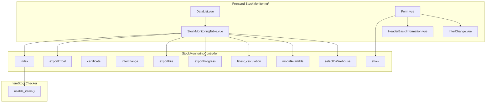
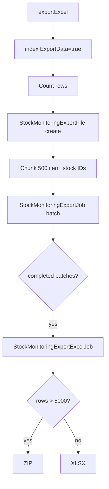

# Dev - Stock Monitoring — Technical Documentation

> **DRAFT** — Dokumen ini adalah draft awal hasil analisis codebase otomatis per 2026-06-19. Perlu direview PM/QA sebelum final.

**UI route:** `/supplychain/stock-monitoring`  
**Detail route:** `/supplychain/stock-monitoring/{item_stock_id}`  
**API prefix:** `supplychain/stock-monitoring`

---

## 1. Architecture Overview

---

## 2. Frontend File Map

**Root:** `olshoperp-frontend/src/pages/SCM/Report/StockMonitoring/`

| File | Role | Key API |
|------|------|---------|
| `DataList.vue` | Warehouse gate + table host | `GET stock-monitoring` |
| `Form.vue` | Detail tabs | `GET stock-monitoring/{id}` |
| `HeaderBasicInformation.vue` | Item stock header card | show response |
| `InterChange.vue` / `InterChangeDataList.vue` | Interchange products | `GET .../interchange` |
| `StockMonitoringTable.vue` | Shared datalist (also mutation embed) | index + export + modal |

**Router:**

| Name | Path |
|------|------|
| `supplychain_stock-monitoring_index` | `stock-monitoring` |
| `edit_stock-monitoring_form` | `stock-monitoring/:id` |

---

## 3. Backend File Map

| File | Role |
|------|------|
| `StockMonitoringController.php` | All endpoints |
| `ItemStockChecker.php` | `usable_items()` query + column formatters |
| `ItemStockMonitoring.php` | Policy entity (extends ItemStock) |
| `ItemStockMonitoringPolicy.php` | Authorization |
| `StockMonitoringExportFile.php` | Export tracking |
| `StockMonitoringExportJob.php` | Chunk data to temp |
| `StockMonitoringExportExcelJob.php` | Merge Excel/ZIP |
| `StockMonitoringGenerateSingleExcelFileJob.php` | Per-chunk Excel |
| `StockMonitoringMergeExcelFilesJob.php` | Merge files |
| `StockMonitoringCleanupTempFilesJob.php` | Temp cleanup |
| `CalculateTodoDate.php` | Latest calculation timestamp |
| `Accounting/.../StockMonitoringValueExportJob.php` | Finance export variant |

---

## 4. API Routes

| Method | Path | Handler |
|--------|------|---------|
| GET | `supplychain/stock-monitoring` | index |
| GET | `supplychain/stock-monitoring/{item_stock}` | show |
| GET | `supplychain/stock-monitoring/{item_stock}/certificate` | certificate |
| GET | `supplychain/stock-monitoring/{item_stock}/certificate-download` | CertificateDownload |
| GET | `supplychain/stock-monitoring/{item_stock}/interchange` | interchange |
| GET | `supplychain/stock-monitoring/{item_stock}/modal-available` | modalAvailable |
| GET | `supplychain/stock-monitoring/cek/latest-calculation` | latest_calculation |
| GET | `supplychain/stock-monitoring/select2/warehouse` | select2Warehouse |
| GET | `supplychain/stock-monitoring/export-file` | exportFile |
| GET | `supplychain/stock-monitoring/export-progress` | exportProgress |
| GET | `supplychain/stock-monitoring/export-excel` | exportExcel |

### index() parameters

| Param | Effect |
|-------|--------|
| `warehouse_id` | **Required** for meaningful data |
| `with_use_button` | Embed picker mode |
| `interchange_of` | Filter interchange items |
| `until_date` / `request_date` | Point-in-time stock |
| `with_virtual_processing` | Include virtual WH |
| `company_id` | Export override |
| `start` / `length` | Pagination (export mode) |

### Controller mode routing

| Request path | `show_unit_value` | `is_finance` |
|--------------|-------------------|--------------|
| `api/supplychain/stock-monitoring` | 0 | false |
| `api/accounting/stock-monitoring-value` | 1 | true |
| `api/accounting/asset-list` | 1 | true (+ fix asset) |

---

## 5. Export Pipeline

| Setting | Value |
|---------|-------|
| Chunk ID size | 500 |
| Jobs per batch | 40 max |
| Export lock TTL | 600s per user |
| Progress stale | 30 minutes |
| ZIP threshold | 5000 rows |

---

## 6. Database Schema (read)

| Tabel | Role |
|-------|------|
| `scm_item_stocks` | Primary entity |
| `scm_products` | Product SKU/name/unit |
| `scm_stock_mutations` | Inbound reference |
| `scm_inbound_mutation_details` | Inbound ref formatted |
| `scm_warehouses` | Warehouse filter |
| `scm_stock_monitoring_export_files` | Export jobs |
| `scm_stock_monitoring_data_temp` | Export staging |
| `scm_calculate_todo_dates` | Latest calculation |

---

## 7. Embedded Usage (cross-module)

`StockMonitoringTable` reused with `table_type`:

| table_type | Context |
|------------|---------|
| `stock_monitoring` | Report page |
| `inventory_out` | Mutation outbound picker |
| `transfer` | Mutation transfer picker |
| `sales_order_detail` | SO fulfill picker |

---

## 8. Related docs

- [supplychain-real-stock/technical.md](../supplychain-real-stock/technical.md)
- [accounting-stock-monitoring-value/technical.md](../accounting-stock-monitoring-value/technical.md)
- `app/Helpers/SupplyChain/ItemStockChecker.php` — source of truth qty formulas
