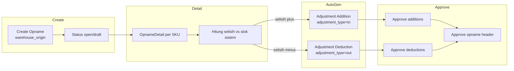
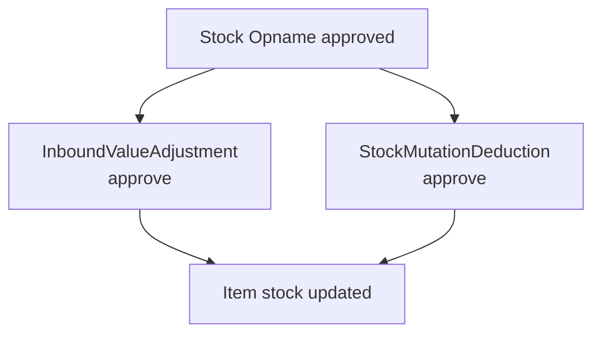
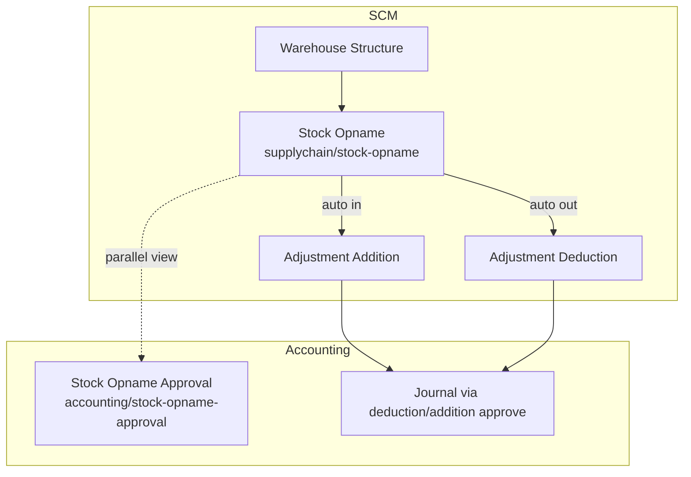

# Stock Opname — Requirement Detail

> **DRAFT** — Dokumen ini adalah draft awal hasil analisis codebase otomatis per 2026-06-19. Perlu direview PM/QA sebelum final.

**Modul:** SupplyChain + Accounting  
**Audience:** PM, Operations, QA, Support, Developer  
**Status:** Sesuai perilaku sistem saat ini (AS-IS)

---

## Daftar Isi

1. [Fungsi & Tujuan](#1-fungsi--tujuan)
2. [How It Works — Alur Kerja](#2-how-it-works--alur-kerja)
3. [Validasi yang Berjalan](#3-validasi-yang-berjalan)
4. [Relasi Menu Lain](#4-relasi-menu-lain)
5. [FAQ](#5-faq)

---

## 1. Fungsi & Tujuan

### Apa itu Stock Opname?

**Stock Opname** adalah transaksi penyesuaian stok berbasis hitungan fisik. Secara teknis merupakan subclass `StockMutation` (`StockOpname extends StockMutation`) dengan:

- `is_opname = 1`
- `warehouse_origin` = gudang opname
- Detail di `OpnameDetail` (`scm_opname_details`)

Menu paralel **Stock Opname Approval** di Accounting memakai `StockOpnameFA` (subclass `StockMutation` di modul Accounting) dengan controller wrapper yang mendelegasikan ke `SupplyChain\StockOpnameController` dengan flag `is_finance = true`.

### Masalah yang diselesaikan

| Kebutuhan Bisnis | Bagaimana Stock Opname Menjawab |
|------------------|--------------------------------|
| Rekonsiliasi stok fisik vs sistem | Input opname qty per produk/lokasi |
| Audit trail penyesuaian | Auto-generate adjustment addition/deduction |
| Kontrol finance | Menu approval terpisah di Accounting |
| Bulk input | Import Excel detail + bulk create dari available warehouse |

### Entitas data utama

| Entitas | Tabel / Class |
|---------|---------------|
| Header opname | `scm_stock_mutations` (`is_opname=1`) |
| Detail opname | `scm_opname_details` — class `OpnameDetail` |
| Adjustment in | `StockMutationAddition` / `InboundValueAdjustment` (FA) |
| Adjustment out | `StockMutationDeduction` / `StockMutationDeductionFA` |
| Finance view | `StockOpnameFA` (Accounting module) |

---

## 2. How It Works — Alur Kerja

### 2.1 Siklus hidup opname

### 2.2 Create header

`POST supplychain/stock-opname` → `StockOpnameController@store`:

- `warehouse_origin` wajib (kecuali opening stock flow).
- `is_opname = 1` otomatis.
- Kode auto `SP` prefix.
- Unique code per company untuk opname rows.

### 2.3 Tambah / update detail

`StockOpnameDetailController@store` / `@update`:

1. Ambil `available_quantity` stok per produk + warehouse destination pada tanggal transaksi.
2. Hitung `adjustment_quantity_in_base_unit = opname_qty - stock_sistem`.
3. Jika selisih > 0:
   - Set `adjustment_type = in`
   - Auto-create `StockMutationAddition` (jika belum ada per warehouse)
   - Auto-create inbound detail via `StockMutationAdditionDetailController`
   - Harga: input user atau **`product.benchmarkPrice.benchmark_price`** (menu [Benchmark COGS](../accounting-product-benchmark-price/requirement.md)) — **bukan** MA30 (`MaPrice30Days()` commented out di controller)
4. Jika selisih < 0:
   - Set `adjustment_type = out`
   - Auto-create `StockMutationDeduction` + outbound detail

### 2.4 Approve

`POST supplychain/stock-opname/{id}/approve`:

1. Validasi detail lengkap (warehouse, service product, harga bulat).
2. Cross-check: total qty opname addition/deduction = total qty di dokumen auto-generated.
3. Approve semua `InboundValueAdjustment` (addition) terkait.
4. Approve semua `StockMutationDeductionFA` (deduction) terkait.
5. `$stock_opname->approve($request)` — header `approved`.

### 2.5 Menu Accounting (parallel)

`Accounting\Http\Controllers\StockOpnameController` mendelegasikan ke SupplyChain controller dengan `StockOpnameFA` class:

- Route prefix: `accounting/stock-opname-approval`
- UI: `olshoperp-frontend/src/pages/Accounting/StockOpnameApproval/` (jika ada) atau shared SCM components
- Logic approve identik; policy berbeda (`StockOpnameFAPolicy`)

---

## 3. Validasi yang Berjalan

### 3.1 Header — create/update

| Field | Rule |
|-------|------|
| `code` | Unique per company untuk opname (`is_opname=1`, `warehouse_origin` not null) |
| `transaction_date` | Required; fiscal period valid |
| `warehouse_origin` | Required |
| `description` | Max 150 karakter |
| `transaction_status` | `open` atau `draft` |

### 3.2 Detail — create/update

| Rule | Detail |
|------|--------|
| Produk | Harus ada di stok/warehouse tree |
| `warehouse_destination_id` | Wajib untuk adjustment in |
| Qty | Dihitung dari selisih fisik vs sistem |
| Harga (adjustment in) | Whole number — tidak boleh desimal |
| Service product | Ditolak saat approve |

### 3.3 Approve

| Rule | Pesan |
|------|-------|
| Minimal 1 detail | `ERR_NO_DETAIL_MSG` |
| Warehouse destination null | "Destination Warehouse field cannot be empty" |
| Warehouse inactive | "Warehouse {name} is inactive..." |
| Service SKU | "Product with SKU ... are Service type..." |
| Decimal price | "must be entered with a Unit Price in whole numbers" |
| Addition/deduction mismatch | "failed to generate addition or deduction" |
| Concurrent update | Cache `Stock Opname Update` |
| Fiscal period | `validate_fiscal_period()` |

---

## 4. Relasi Menu Lain

| Menu | Route | Hubungan |
|------|-------|----------|
| Stock Opname Approval | `accounting/stock-opname-approval` | Finance approval — same DB rows |
| Adjustment Addition | `supplychain/adjustment-addition` | Auto-generated child docs |
| Adjustment Deduction | `supplychain/adjustment-deduction` | Auto-generated child docs |
| Warehouse Structure | `supplychain/warehouse-structure` | Master `warehouse_destination` |
| Real Stock | `supplychain/real-stock` | Referensi stok untuk operator |
| **Benchmark COGS** | `accounting/product-benchmark-price` | Default harga surplus opname (jika user tidak input) — lihat [requirement](../accounting-product-benchmark-price/requirement.md) §7 |

---

## 5. FAQ

**Q: Apakah Stock Opname dan Stock Opname Approval data terpisah?**  
A: Tidak — keduanya baca `scm_stock_mutations` dengan `is_opname=1`. Approval menu memakai class `StockOpnameFA` untuk policy/routing berbeda.

**Q: Kapan adjustment dibuat?**  
A: Saat detail opname di-create/update, bukan saat approve header (tapi approve header yang finalize adjustment).

**Q: Bagaimana harga adjustment in ditentukan?**  
A: Dari input `each_price_before_discount_before_vat` atau fallback **`product.benchmarkPrice.benchmark_price`** dari menu [Benchmark COGS](../accounting-product-benchmark-price/knowledge-base.md). Sumber kalkulasi benchmark = highest PO inbound 30 hari → Last Buy → 0. **Stock opname inbound tidak** mempengaruhi nilai benchmark master.

**Q: Apakah bisa opname tanpa selisih?**  
A: Jika selisih = 0, tidak ada adjustment in/out untuk baris tersebut.

**Q: Import detail didukung?**  
A: Ya — `POST stock-opname/{id}/stock-opname-detail/upload` → `StockOpnameDetailImportJob`.
