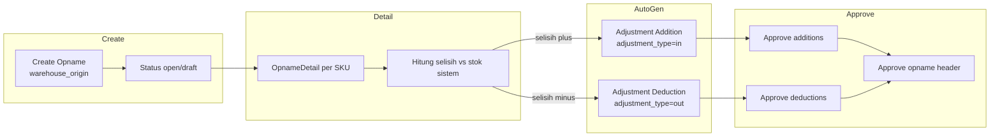
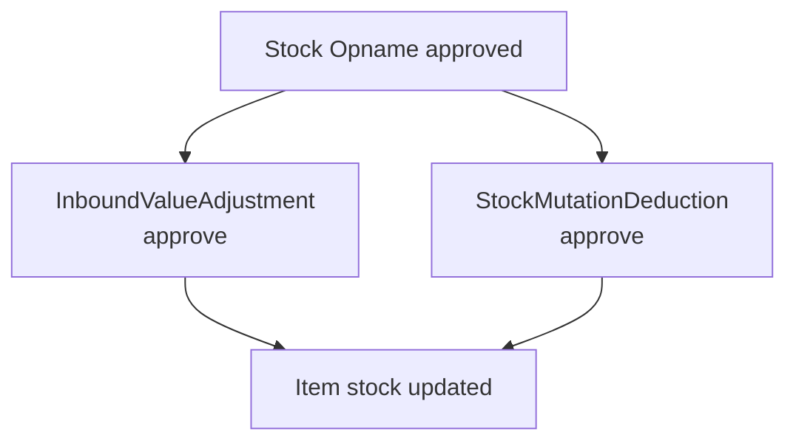
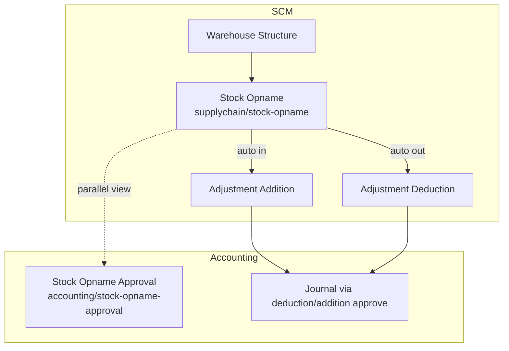

# Stock Opname — Requirement Detail

> **DRAFT** — Dokumen ini adalah draft awal hasil analisis codebase otomatis per 2026-06-19. Perlu direview PM/QA sebelum final.

**Modul:** SupplyChain + Accounting  
**Audience:** PM, Operations, QA, Support, Developer  
**Status:** AS-IS + GAP TO-BE (unit price desimal) — lihat §3.4

| Version | Date | Author | Changes |
|---------|------|--------|---------|
| 1.2 | 2026-09-18 | QA - Yemima | GAP-SOPNAME-01: AS-IS vs TO-BE unit price desimal (selaras PO); qty manual tetap whole |
| 1.1 | 2026-07-09 | QA - Yemima | Relasi Benchmark COGS v1.1 · cross-ref Stock Remapping |

---

## Daftar Isi

1. [Fungsi & Tujuan](#1-fungsi--tujuan)
2. [How It Works — Alur Kerja](#2-how-it-works--alur-kerja)
3. [Validasi yang Berjalan](#3-validasi-yang-berjalan)
4. [Relasi Menu Lain](#4-relasi-menu-lain)
5. [FAQ](#5-faq)

---

## 1. Fungsi & Tujuan

### Apa itu Stock Opname?

**Stock Opname** adalah transaksi penyesuaian stok berbasis hitungan fisik. Secara teknis merupakan subclass `StockMutation` (`StockOpname extends StockMutation`) dengan:

- `is_opname = 1`
- `warehouse_origin` = gudang opname
- Detail di `OpnameDetail` (`scm_opname_details`)

Menu paralel **Stock Opname Approval** di Accounting memakai `StockOpnameFA` (subclass `StockMutation` di modul Accounting) dengan controller wrapper yang mendelegasikan ke `SupplyChain\StockOpnameController` dengan flag `is_finance = true`.

### Masalah yang diselesaikan

| Kebutuhan Bisnis | Bagaimana Stock Opname Menjawab |
|------------------|--------------------------------|
| Rekonsiliasi stok fisik vs sistem | Input opname qty per produk/lokasi |
| Audit trail penyesuaian | Auto-generate adjustment addition/deduction |
| Kontrol finance | Menu approval terpisah di Accounting |
| Bulk input | Import Excel detail + bulk create dari available warehouse |

### Entitas data utama

| Entitas | Tabel / Class |
|---------|---------------|
| Header opname | `scm_stock_mutations` (`is_opname=1`) |
| Detail opname | `scm_opname_details` — class `OpnameDetail` |
| Adjustment in | `StockMutationAddition` / `InboundValueAdjustment` (FA) |
| Adjustment out | `StockMutationDeduction` / `StockMutationDeductionFA` |
| Finance view | `StockOpnameFA` (Accounting module) |

---

## 2. How It Works — Alur Kerja

### 2.1 Siklus hidup opname

```mermaid
flowchart LR
    subgraph Create
        A["Create Opname\nwarehouse_origin"]
        B["Status open/draft"]
    end
    subgraph Detail
        C["OpnameDetail per SKU"]
        D["Hitung selisih vs stok sistem"]
    end
    subgraph AutoGen
        E["Adjustment Addition\nadjustment_type=in"]
        F["Adjustment Deduction\nadjustment_type=out"]
    end
    subgraph Approve
        G["Approve additions"]
        H["Approve deductions"]
        I["Approve opname header"]
    end

    A --> B --> C --> D
    D -->|"selisih plus"| E
    D -->|"selisih minus"| F
    E --> G
    F --> H
    G --> I
    H --> I
```

### 2.2 Create header

`POST supplychain/stock-opname` → `StockOpnameController@store`:

- `warehouse_origin` wajib (kecuali opening stock flow).
- `is_opname = 1` otomatis.
- Kode auto `SP` prefix.
- Unique code per company untuk opname rows.

### 2.3 Tambah / update detail

`StockOpnameDetailController@store` / `@update`:

1. Ambil `available_quantity` stok per produk + warehouse destination pada tanggal transaksi.
2. Hitung `adjustment_quantity_in_base_unit = opname_qty - stock_sistem`.
3. Jika selisih > 0:
   - Set `adjustment_type = in`
   - Auto-create `StockMutationAddition` (jika belum ada per warehouse)
   - Auto-create inbound detail via `StockMutationAdditionDetailController`
   - Harga: input user atau **`product.benchmarkPrice.benchmark_price`** (menu [Benchmark COGS](../accounting-product-benchmark-price/requirement.md)) — **bukan** MA30 (`MaPrice30Days()` commented out di controller)
4. Jika selisih < 0:
   - Set `adjustment_type = out`
   - Auto-create `StockMutationDeduction` + outbound detail

### 2.4 Approve

`POST supplychain/stock-opname/{id}/approve`:

1. Validasi detail lengkap (warehouse, service product, **harga** — AS-IS: bulat; TO-BE: lihat §3.4).
2. Cross-check: total qty opname addition/deduction = total qty di dokumen auto-generated.
3. Approve semua `InboundValueAdjustment` (addition) terkait.
4. Approve semua `StockMutationDeductionFA` (deduction) terkait.
5. `$stock_opname->approve($request)` — header `approved`.

```mermaid
flowchart TD
    OP["Stock Opname approved"]
    ADD["InboundValueAdjustment\napprove"]
    DED["StockMutationDeduction\napprove"]
    STK["Item stock updated"]

    OP --> ADD --> STK
    OP --> DED --> STK
```

### 2.5 Menu Accounting (parallel)

`Accounting\Http\Controllers\StockOpnameController` mendelegasikan ke SupplyChain controller dengan `StockOpnameFA` class:

- Route prefix: `accounting/stock-opname-approval`
- UI: `olshoperp-frontend/src/pages/Accounting/StockOpnameApproval/` (jika ada) atau shared SCM components
- Logic approve identik; policy berbeda (`StockOpnameFAPolicy`)

---

## 3. Validasi yang Berjalan

### 3.1 Header — create/update

| Field | Rule |
|-------|------|
| `code` | Unique per company untuk opname (`is_opname=1`, `warehouse_origin` not null) |
| `transaction_date` | Required; fiscal period valid |
| `warehouse_origin` | Required |
| `description` | Max 150 karakter |
| `transaction_status` | `open` atau `draft` |

### 3.2 Detail — create/update

| Rule | Detail |
|------|--------|
| Produk | Harus ada di stok/warehouse tree |
| `warehouse_destination_id` | Wajib untuk adjustment in |
| Qty (input manual) | **AS-IS & TO-BE:** bilangan bulat (`ctype_digit`). Desimal qty hanya boleh dari perhitungan sistem (selisih / konversi unit) — pola sama dengan Purchase Order |
| Harga (adjustment in) | **AS-IS:** whole number — ditolak jika ada fraksi. **TO-BE:** boleh desimal — lihat [§3.4](#34-gap-sopname-01--unit-price-desimal-to-be) |
| Service product | Ditolak saat approve |

### 3.3 Approve

| Rule | Pesan |
|------|-------|
| Minimal 1 detail | `ERR_NO_DETAIL_MSG` |
| Warehouse destination null | "Destination Warehouse field cannot be empty" |
| Warehouse inactive | "Warehouse {name} is inactive..." |
| Service SKU | "Product with SKU ... are Service type..." |
| Decimal price | **AS-IS:** `"must be entered with a Unit Price in whole numbers"` · **TO-BE:** guard dihapus / diganti validasi numeric + max 4 dp |
| Addition/deduction mismatch | "failed to generate addition or deduction" |
| Concurrent update | Cache `Stock Opname Update` |
| Fiscal period | `validate_fiscal_period()` |

### 3.4 GAP-SOPNAME-01 — Unit price desimal (TO-BE)

**Tujuan:** selaraskan kontrak harga Stock Opname dengan **Purchase Order**: unit price boleh diinput desimal; qty input manual tetap bilangan bulat.

| Layer | AS-IS (production) | TO-BE |
|-------|--------------------|-------|
| Unit price (UI / API / import) | Ditolak jika `floor(price) != price` | Boleh desimal; simpan max **4 desimal** (selaras `roundHalfDown` PO); tampilan UI boleh 2 dp |
| Qty input manual | Whole number | Tetap whole number |
| Qty dari sistem | Boleh hasil konversi/selisih non-integer | Tidak berubah |
| Kolom DB `each_price_before_discount_before_vat` | Sudah `decimal(21,4)` | Tidak perlu migrasi schema |
| Opening Stock | Guard harga shared (engine opname) | **Ikut TO-BE yang sama** — lihat [Opening Stock requirement](../accounting-opening-stock/requirement.md) |

#### Acceptance criteria (TO-BE)

- [ ] Create/update detail surplus: unit price `12500.50` **diterima**; mengalir ke Adjustment Addition & jurnal.
- [ ] Import Excel: unit price desimal **diterima** (hapus check whole di `validationUnitPrice`).
- [ ] Approve: tidak lagi menolak baris hanya karena harga punya fraksi.
- [ ] Qty manual `1.5` **tetap ditolak** (pesan whole numbers).
- [ ] Fallback Benchmark COGS (sudah bisa desimal) tidak bentrok dengan validasi harga opname.
- [ ] Opening Stock (engine shared) lulus regresi harga desimal yang sama.

#### Contoh kasus

| # | Situasi | AS-IS | TO-BE |
|---|---------|-------|-------|
| C1 | Surplus SKU; unit price `12500.50` | Ditolak — *Unit Price must be entered in whole numbers not decimals* | Diterima; nilai child addition = harga tersebut (4 dp) |
| C2 | Surplus; unit price `12500` | Diterima | Diterima |
| C3 | User input qty opname `1.5` manual | Ditolak — qty whole | Tetap ditolak |
| C4 | Harga kosong → fallback Benchmark `9999.25` | Bisa bentrok saat approve jika tersimpan desimal | Diterima end-to-end |
| C5 | Opening Stock baris dengan unit price `100.75` | Ditolak (guard shared) | Diterima setelah implementasi |

#### Dampak implementasi (bukan scope docs ini)

Titik kode: `StockOpnameDetailController` (store/update), `StockOpnameController@approve`, `StockOpnameDetailImport::validationUnitPrice`. Child Adjustment Addition **tidak** punya guard price-whole. Detail teknis: [technical.md §9](./technical.md#9-unit-price-decimal--gap-sopname-01).

---

## 4. Relasi Menu Lain

```mermaid
flowchart TB
    subgraph SCM
        SO["Stock Opname\nsupplychain/stock-opname"]
        AA["Adjustment Addition"]
        AD["Adjustment Deduction"]
        WH["Warehouse Structure"]
    end
    subgraph Accounting
        SOA["Stock Opname Approval\naccounting/stock-opname-approval"]
        JV["Journal via deduction/addition approve"]
    end

    WH --> SO
    SO -->|"auto in"| AA
    SO -->|"auto out"| AD
    SO -.->|"parallel view"| SOA
    AA --> JV
    AD --> JV
```

| Menu | Route | Hubungan |
|------|-------|----------|
| Stock Opname Approval | `accounting/stock-opname-approval` | Finance approval — same DB rows |
| Adjustment Addition | `supplychain/adjustment-addition` | Auto-generated child docs |
| Adjustment Deduction | `supplychain/adjustment-deduction` | Auto-generated child docs |
| Warehouse Structure | `supplychain/warehouse-structure` | Master `warehouse_destination` |
| Real Stock | `supplychain/real-stock` | Referensi stok untuk operator |
| **Benchmark COGS** | `accounting/product-benchmark-price` | **Konsumen:** default harga surplus · **Sumber (v1.1):** opname IN ikut kalkulasi benchmark — [requirement](../accounting-product-benchmark-price/requirement.md) §7 |
| **Stock Remapping** | `accounting/stock-remapping` | Remap variant 1 parent (FA) — alternatif sortir SKU acak tanpa opname manual — [requirement](../accounting-stock-remapping/requirement.md) |
| **Opening Stock** | `accounting/opening-stock` | Engine & validasi harga shared — TO-BE unit price desimal ikut GAP-SOPNAME-01 — [requirement](../accounting-opening-stock/requirement.md) |
| **Purchase Order** | `supplychain/purchase-order` | Pola referensi: unit price boleh desimal; qty manual whole |

---

## 5. FAQ

**Q: Apakah Stock Opname dan Stock Opname Approval data terpisah?**  
A: Tidak — keduanya baca `scm_stock_mutations` dengan `is_opname=1`. Approval menu memakai class `StockOpnameFA` untuk policy/routing berbeda.

**Q: Kapan adjustment dibuat?**  
A: Saat detail opname di-create/update, bukan saat approve header (tapi approve header yang finalize adjustment).

**Q: Bagaimana harga adjustment in ditentukan?**  
A: Dari input `each_price_before_discount_before_vat` atau fallback **`product.benchmarkPrice.benchmark_price`** dari menu [Benchmark COGS](../accounting-product-benchmark-price/knowledge-base.md).

**Q: Apakah unit price boleh desimal?**  
A: **AS-IS:** tidak — sistem menolak fraksi. **TO-BE (GAP-SOPNAME-01):** ya, max 4 desimal, selaras Purchase Order. Qty input manual tetap bilangan bulat. Lihat [§3.4](#34-gap-sopname-01--unit-price-desimal-to-be).

**Q: Apakah transaksi opname IN mempengaruhi nilai Benchmark COGS master?**  
A: **Ya** (v1.1). Setelah opname approve, addition inbound tercatat dengan `each_price_before_vat` dan **ikut** sumber kalkulasi benchmark (Highest Price 30 hari → Last Inbound → 0). Jika surplus memakai fallback benchmark (tanpa input manual), nilai benchmark dapat mengulang dirinya — expected; keputusan di tangan operator. Detail: [Benchmark COGS requirement §7](../accounting-product-benchmark-price/requirement.md#7-integrasi-stock-opname-stock-addition--opening-stock) · [pending items §13](../accounting-product-benchmark-price/requirement.md#13-hal-yang-perlu-diperhatikan--pending-items).

**Q: Apakah bisa opname tanpa selisih?**  
A: Jika selisih = 0, tidak ada adjustment in/out untuk baris tersebut.

**Q: Import detail didukung?**  
A: Ya — `POST stock-opname/{id}/stock-opname-detail/upload` → `StockOpnameDetailImportJob`.
