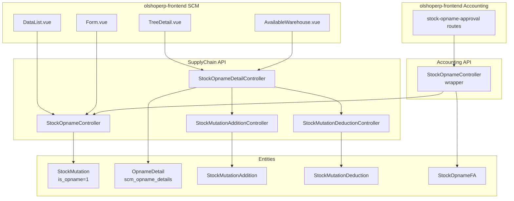
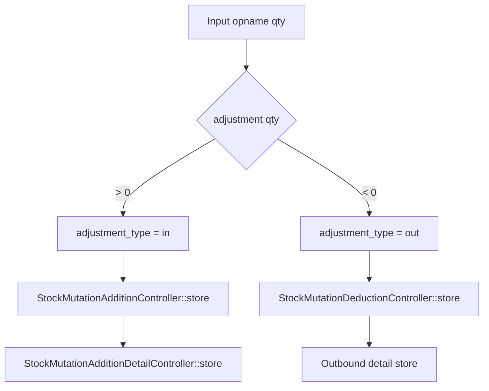

# Stock Opname — Technical Documentation

> **DRAFT** — Dokumen ini adalah draft awal hasil analisis codebase otomatis per 2026-06-19. Perlu direview PM/QA sebelum final.

**Stack:** Laravel 13 API · Vue 3 SPA  
**Primary module:** `Modules/SupplyChain` (+ `Modules/Accounting` for finance approval)  
**Menu slug:** `supplychain-stock-opname`  
**UI route:** `/supplychain/stock-opname`  
**API base:** `{VITE_API_URL}supplychain/stock-opname*`

---

## 1. Architecture Overview

---

## 2. Frontend File Map

**Root:** `olshoperp-frontend/src/pages/SCM/StockOpname/`

| File | Role | Key API |
|------|------|---------|
| `DataList.vue` | Datalist opname + export | `GET supplychain/stock-opname` |
| `Form.vue` | Create/edit wrapper | route to FormComponen |
| `FormComponen.vue` | Header form | `POST/PUT stock-opname/{id}` |
| `TreeDetail.vue` | Detail tree | `stock-opname-detail` |
| `DatalistDetail.vue` | PrimeVue detail grid | `stock-opname-detail/primevue` |
| `DataListComponen.vue` | Sub datalist component | — |
| `AvailableWarehouse.vue` | Bulk add from warehouse stock | `available_products`, `bulk-create` |
| `ApprovalEligibility.vue` | Eligible approvers | role-privilege |
| `DatalistLogApproval.vue` | Approval log | `stock-opname/{id}/log/approve` |

### Router (`src/router/index.ts`)

| Route | Component |
|-------|-----------|
| `supplychain/stock-opname` | `DataList.vue` |
| `supplychain/stock-opname/create` | `Form.vue` |
| `supplychain/stock-opname/edit/:id` | `Form.vue` |
| `accounting/stock-opname-approval` | Accounting mirror (shared/delegated UI) |
| `accounting/stock-opname-approval/edit/:id` | Finance approval edit |

---

## 3. Backend File Map

### 3.1 Controllers (SupplyChain)

| Class | Path | Responsibility |
|-------|------|----------------|
| `StockOpnameController` | `Modules/SupplyChain/Http/Controllers/StockOpnameController.php` | CRUD header, approve, export, select2 warehouse |
| `StockOpnameDetailController` | `.../StockOpnameDetailController.php` | CRUD detail, auto adjustment, import, bulk |
| `StockMutationAdditionController` | `.../StockMutationAdditionController.php` | Auto-create addition header/detail |
| `StockMutationDeductionController` | `.../StockMutationDeductionController.php` | Auto-create deduction header/detail |

### 3.2 Controllers (Accounting wrapper)

| Class | Path | Responsibility |
|-------|------|----------------|
| `Accounting\Http\Controllers\StockOpnameController` | `Modules/Accounting/Http/Controllers/StockOpnameController.php` | Delegates to SupplyChain with `StockOpnameFA`, `is_finance=true` |
| `Accounting\Http\Controllers\StockOpnameDetailController` | `.../StockOpnameDetailController.php` | Detail endpoints for finance menu |

### 3.3 Models

| Class | Table | Notes |
|-------|-------|-------|
| `StockOpname` | `scm_stock_mutations` | Extends `StockMutation`; empty subclass |
| `StockMutation` | `scm_stock_mutations` | `is_opname` flag, relations `opname_details`, `stock_additions`, `stock_deductions` |
| `OpnameDetail` | `scm_opname_details` | Per-SKU opname row |
| `StockOpnameFA` | `scm_stock_mutations` | Accounting subclass for finance menu |
| `StockOpnamePolicy` | — | SCM authorization |
| `StockOpnameFAPolicy` | — | Accounting authorization |

### 3.4 Jobs & import

| Class | Purpose |
|-------|---------|
| `StockOpnameDetailImportJob` | Async import detail Excel |
| `StockMutationStockOpnameExportJob` | Export opname list |
| `StockOpnameDetailImport` | Import parser class |

---

## 4. API Routes

### 4.1 SCM — `Modules/SupplyChain/Routes/api.php`

| Method | Path | Controller@method |
|--------|------|-------------------|
| GET | `stock-opname` | `StockOpnameController@index` |
| POST | `stock-opname` | `StockOpnameController@store` |
| GET | `stock-opname/{id}` | `StockOpnameController@show` |
| PUT | `stock-opname/{id}` | `StockOpnameController@update` |
| DELETE | `stock-opname/{id}` | `StockOpnameController@destroy` |
| POST | `stock-opname/{id}/approve` | `StockOpnameController@approve` |
| GET | `stock-opname/default-values` | `StockOpnameController@getDefaultValues` |
| GET | `stock-opname/{id}/stock-opname-detail/primevue` | `StockOpnameDetailController@index` |
| POST | `stock-opname-detail/{id}/bulk-create` | `StockOpnameDetailController@bulkCreate` |
| POST | `stock-opname/{id}/stock-opname-detail/upload` | `StockOpnameDetailController@uploadFileOpnameDetail` |
| POST | `stock-opname-detail/mass-delete-sku` | `StockOpnameDetailController@massDestroyBySku` |

### 4.2 Accounting — `Modules/Accounting/Routes/api.php`

| Method | Path | Notes |
|--------|------|-------|
| GET | `stock-opname-approval` | Finance datalist (`StockOpnameFA`) |
| POST | `stock-opname-approval/{id}/approve` | Same approve logic, `is_finance=true` |
| Resource | `stock-opname-approval` | CRUD mirror |
| Resource | `stock-opname-approval.stock-opname-detail` | Detail CRUD mirror |

---

## 5. Database

### 5.1 Header `scm_stock_mutations` (opname rows)

| Column | Keterangan |
|--------|------------|
| `is_opname` | `1` untuk stock opname |
| `warehouse_origin` | Gudang induk opname |
| `warehouse_destination` | Biasanya NULL di header |
| `code` | Prefix `SP` |
| `transaction_status` | open → approved |

Global scope `ignore_opname` pada `StockMutation` — di-bypass via `withoutGlobalScope('ignore_opname')` di controller opname.

### 5.2 Detail `scm_opname_details`

| Column | Keterangan |
|--------|------------|
| `stock_mutation_id` | FK header opname |
| `product_id` | SKU |
| `warehouse_destination_id` | Lokasi/rak |
| `opname_quantity` | Qty fisik |
| `origin_avail_quantity_in_base_unit` | Stok sistem saat create |
| `adjustment_quantity_in_base_unit` | Selisih (bisa +/-) |
| `adjustment_type` | `in` atau `out` |
| `each_price_before_discount_before_vat` | Harga untuk adjustment in |

### 5.3 Auto-generated children

| Child doc | FK | Class reference |
|-----------|-----|-----------------|
| Addition header | `transaction_reference_id` → opname id | `StockOpname::class` |
| Addition detail | `transaction_reference_id` → opname detail id | `OpnameDetail::class` |
| Deduction header | same pattern | `StockOpname::class` |
| Deduction detail | `stock_opname_detail_id` | — |

---

## 6. Auto adjustment flow

`StockOpnameDetailController@store` (simplified):

On approve (`StockOpnameController@approve`):

1. Validate sum opname additions == sum inbound mutation details
2. Validate sum opname deductions == sum outbound mutation details
3. `InboundValueAdjustmentController::approve()` per addition
4. `Accounting\StockMutationDeductionController::approve()` per deduction
5. `$stock_opname->approve($request)`

---

## 7. Index query notes

`StockOpnameController@index`:

- Filter `is_opname = 1`
- `whereNotNull('warehouse_origin')` (exclude opening stock pattern)
- Eager load `stock_additions`, `stock_deductions` + journals
- Finance index passes `StockOpnameFA` class — link di datalist mengarah ke `accounting/stock-opname-approval`

---

## 8. Permissions

| Policy | Menu |
|--------|------|
| `StockOpnamePolicy` | SCM stock opname |
| `StockOpnameFAPolicy` | Accounting stock opname approval |

Approve cache helpers: `addCacheApproveStockMutation()`, `deleteCacheApproveStockMutation()`, `firstValidateStockMutation()`.
