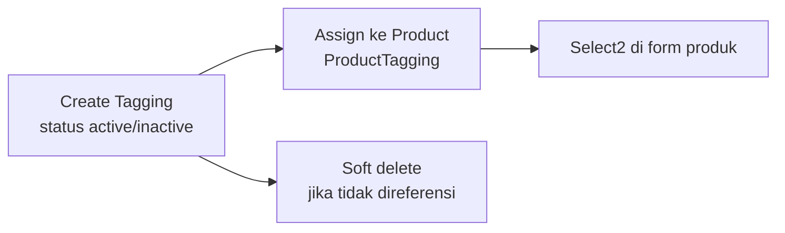
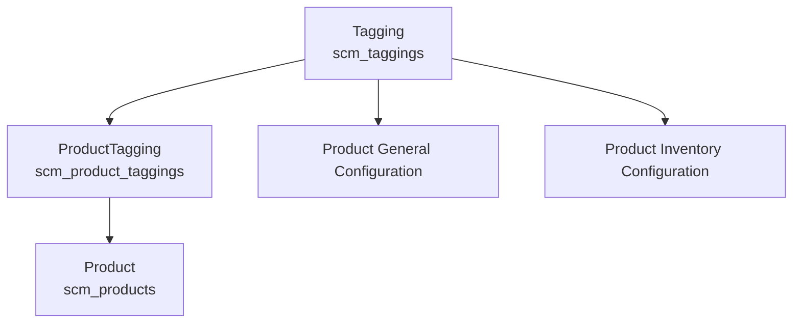

# Tagging — Requirement Detail

> **DRAFT** — Dokumen ini adalah draft awal hasil analisis codebase otomatis per 2026-06-19. Perlu direview PM/QA sebelum final.

**Modul:** SupplyChain  
**Audience:** PM, Operations, QA, Support, Developer  
**Status:** Sesuai perilaku sistem saat ini (AS-IS)

---

## Daftar Isi

1. [Fungsi & Tujuan](#1-fungsi--tujuan)
2. [How It Works — Alur Kerja](#2-how-it-works--alur-kerja)
3. [Validasi yang Berjalan](#3-validasi-yang-berjalan)
4. [Relasi Menu Lain](#4-relasi-menu-lain)
5. [FAQ](#5-faq)
6. [Known Gaps](#6-known-gaps)

---

## 1. Fungsi & Tujuan

### Apa itu Tagging?

**Tagging** menyediakan master label produk di `scm_taggings`. Produk mengacu tagging via pivot `scm_product_taggings` (`ProductTagging` entity).

### Masalah yang diselesaikan

| Kebutuhan Bisnis | Bagaimana Tagging Menjawab |
|------------------|---------------------------|
| Klasifikasi produk fleksibel | Master label + relasi many-to-many |
| Filter/konfigurasi produk | Select2 tagging di form produk |
| Kontrol data master | CRUD + audit + soft delete |

### Entitas data utama

| Entitas | Tabel |
|---------|-------|
| Tagging | `scm_taggings` |
| Product Tagging | `scm_product_taggings` |

---

## 2. How It Works — Alur Kerja

### 2.1 Siklus master tagging

### 2.2 CRUD header

1. `GET supplychain/tagging` — datalist (`TaggingController@index`).
2. `POST supplychain/tagging` — create; parse `status`/`is_all_company` dari string `'true'`.
3. `PUT supplychain/tagging/{id}` — update fields yang sama.
4. `DELETE supplychain/tagging/{id}` — set `deleted_by`, soft delete.
5. `GET supplychain/tagging/{id}/audit` — audit log.

### 2.3 Select2 (konsumsi produk)

- `GET supplychain/product/select2-tagging` → delegasi ke `TaggingController@select2Tagging`.
- Filter: `status = 1`, search by `name`, limit 25.
- Juga tersedia via `product-general-configuration/select2-tagging` dan `product-inventory-configuration/select2-tagging`.

---

## 3. Validasi yang Berjalan

### 3.1 Header — create/update

| Field | Rule |
|-------|------|
| `code` | Required, max 50, unique per company |
| `name` | Required, max 50, unique per company (kolom `name`) |
| `description` | Max 150 (optional) |
| `status` | String `'true'` → 1, else 0 |
| `is_all_company` | String `'true'` → 1, else 0 |

**Tidak ada FormRequest** — validasi inline di controller.

### 3.2 Delete

| Rule | Pesan/perilaku |
|------|----------------|
| Referenced by `ProductTagging` | Blokir via `Tagging::relations()` |
| Authorized | Policy `delete` |

### 3.3 Select2

| Rule | Perilaku |
|------|----------|
| Hanya active | `where status = 1` |
| Search | `name LIKE %q%` |
| Limit | 25 rows |

---

## 4. Relasi Menu Lain

| Menu | Relasi |
|------|--------|
| **Product General Configuration** | `select2-tagging`, assign tagging ke produk |
| **Product Inventory Configuration** | `select2-tagging`, assign tagging ke produk |
| **System Product** | `product/select2-tagging` |

---

## 5. FAQ

**Q: Apakah code dan name harus unik?**  
A: Ya, keduanya divalidasi unique per company pada create/update.

**Q: Bisakah tagging di-share antar company?**  
A: Ya, via flag `is_all_company = 1`.

**Q: Apakah ada approval workflow?**  
A: Tidak. CRUD master data langsung.

---

## 6. Known Gaps

- `select2Tagging` tidak punya route langsung `/tagging/select2`; hanya via proxy ProductController.
- Field boolean (`status`, `is_all_company`) dikirim sebagai string `'true'`/`'false'` dari frontend.
- Tidak ada dedicated FormRequest class.

---

## Related Documents

| Doc | Path |
|-----|------|
| Knowledge Base | [knowledge-base.md](./knowledge-base.md) |
| Technical | [technical.md](./technical.md) |
