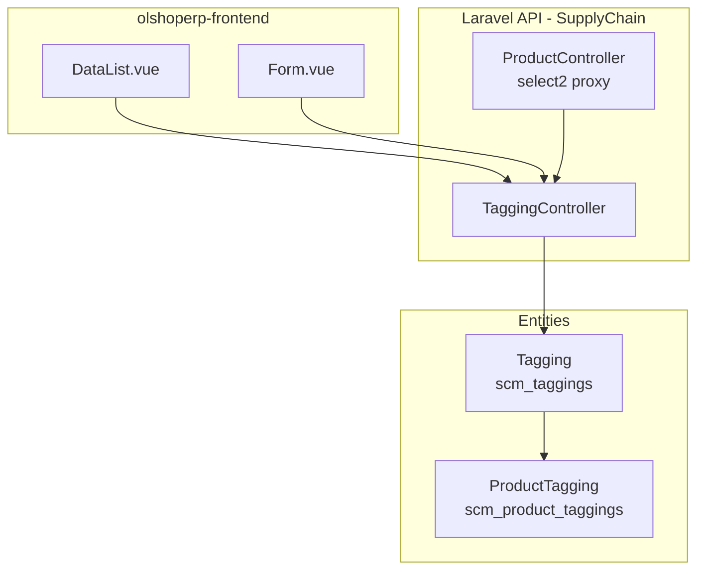

# Tagging — Technical Documentation

> **DRAFT** — Dokumen ini adalah draft awal hasil analisis codebase otomatis per 2026-06-19. Perlu direview PM/QA sebelum final.

**Stack:** Laravel 13 API · Vue 3 SPA  
**Primary module:** `Modules/SupplyChain`  
**Menu slug:** `supplychain-tagging`  
**UI route:** `/supplychain/tagging`  
**API base:** `{VITE_API_URL}supplychain/tagging*`

---

## 1. Architecture Overview

---

## 2. Frontend File Map

**Root:** `olshoperp-frontend/src/pages/SCM/master/Tagging/`

| File | Role | Key API |
|------|------|---------|
| `DataList.vue` | Datalist master tagging | `GET supplychain/tagging` |
| `Form.vue` | Create/edit tagging | `POST/PUT supplychain/tagging/{id}` |

### Router

| Route | Component |
|-------|-----------|
| `supplychain/tagging` | `DataList.vue` |
| `supplychain/tagging/create` | `Form.vue` |
| `supplychain/tagging/edit/:id` | `Form.vue` |

---

## 3. Backend — Controller

| Class | Path | Responsibility |
|-------|------|----------------|
| `TaggingController` | `Modules/SupplyChain/Http/Controllers/TaggingController.php` | CRUD, audit, select2Tagging |

| Method | Route | Notes |
|--------|-------|-------|
| `index` | GET `/tagging` | Datalist |
| `store` | POST `/tagging` | Create |
| `show` | GET `/tagging/{id}` | With trashed |
| `update` | PUT `/tagging/{id}` | Update |
| `destroy` | DELETE `/tagging/{id}` | Soft delete + `deleted_by` |
| `audit` | GET `/tagging/{id}/audit` | Audit datatable |
| `select2Tagging` | GET `/product/select2-tagging` (proxy) | Active taggings |

---

## 4. Model / Entity

| Class | Table | Notes |
|-------|-------|-------|
| `Tagging` | `scm_taggings` | `relations()` blocks delete if `ProductTagging` exists |
| `ProductTagging` | `scm_product_taggings` | Pivot produk ↔ tagging |

**Key columns (`scm_taggings`):** `code`, `name`, `description`, `status`, `is_all_company` + base audit columns.

---

## 5. DB Tables

| Table | Purpose |
|-------|---------|
| `scm_taggings` | Master tagging |
| `scm_product_taggings` | Assignment tagging ke produk |

---

## 6. API Routes

**Prefix:** `supplychain` · **Middleware:** `auth:sanctum`, `auth_verified`  
**File:** `Modules/SupplyChain/Routes/api.php`

| Method | URI | Controller |
|--------|-----|------------|
| GET | `tagging` | `TaggingController@index` |
| POST | `tagging` | `TaggingController@store` |
| GET | `tagging/{tagging}` | `TaggingController@show` |
| PUT/PATCH | `tagging/{tagging}` | `TaggingController@update` |
| DELETE | `tagging/{tagging}` | `TaggingController@destroy` |
| GET | `tagging/{tagging}/audit` | `TaggingController@audit` |
| GET | `product/select2-tagging` | `ProductController@select2Tagging` |

---

## 7. Policy

| Class | Abilities |
|-------|-----------|
| `TaggingPolicy` extends `MainPolicy` | `viewAny`, `view`, `create`, `update`, `delete` |

Mapping via Gate `RoleMenu` + menu permission flags (add/update/delete).

---

## Related Documents

| Doc | Path |
|-----|------|
| Knowledge Base | [knowledge-base.md](./knowledge-base.md) |
| Requirement | [requirement.md](./requirement.md) |
