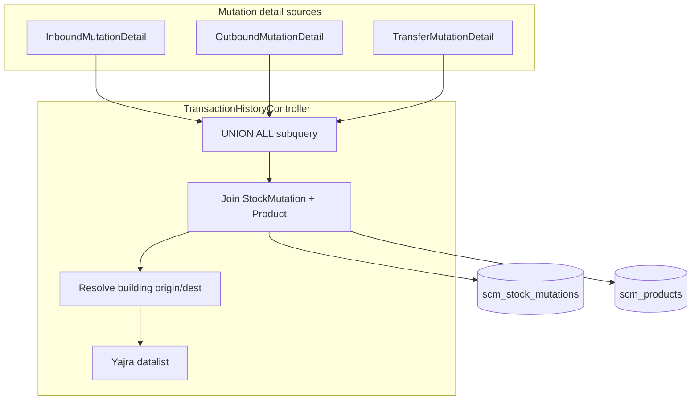
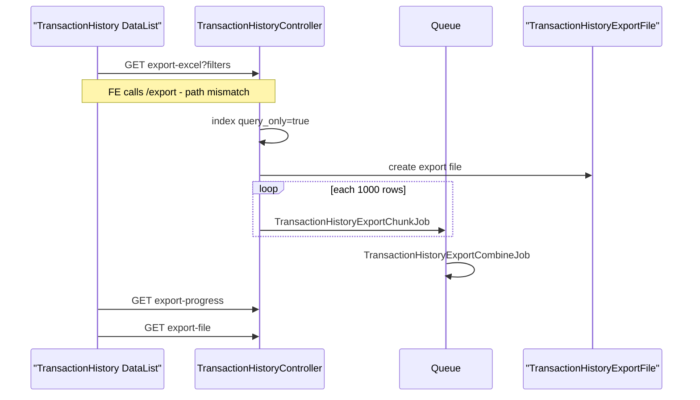

# BETA - Transaction History — Requirement Documentation

> **DRAFT** — Dokumen ini adalah draft awal hasil analisis codebase otomatis per 2026-06-19. Perlu direview PM/QA sebelum final.

## 0. Metadata & Changelog

| Version | Date | Author | Changes |
|---------|------|--------|---------|
| 1.0 | 2026-06-19 | QA - Yemima | Initial draft (AS-IS) |

## 1. Ringkasan Eksekutif

`TransactionHistoryController@index` membangun query **UNION ALL** dari `InboundMutationDetail`, `OutboundMutationDetail`, dan `TransferMutationDetail`, join `StockMutation` + `Product`, resolve warehouse building origin/destination, lalu serve via Yajra datalist. Filter: `warehouse_id` (comma), `select_periode` (comma date range), `transaction_type` (comma labels). Export: batch chunk 1000 + combine ZIP.

**Catatan:** Menu ini **berbeda** dari `supplychain-product-transaction-history` yang memakai `ItemTransactionHistoryController` + `ScmReport`.

## 2. Acceptance Criteria (AS-IS)

| ID | Kriteria | Validasi | Fitur |
|----|----------|----------|-------|
| A-01 | Union 3 sumber detail | inbound + outbound + transfer | Core query |
| A-02 | Company scope | `owned_by = getToken()->company_id` | Multi-tenant |
| A-03 | Visible mutations only | `is_visible = 1` | Filter |
| A-04 | Filter building | `warehouse_id` CSV, building level | Origin OR destination |
| A-05 | Filter periode | `select_periode` CSV [start,end] | Date on mutation |
| A-06 | Filter transaction type | `transaction_type` CSV labels | Code prefix map |
| A-07 | Kolom Date sortable | `transaction_date_formatted` | Default sort desc |
| A-08 | Trx code link | `getLinkTransactionCodeFormatted` | Edit mutation |
| A-09 | Type label | `getTypeFormatted` from code prefix | Human label |
| A-10 | Reference link | `getTransactionReferenceFormatted` + PO fallback | Trx. Ref column |
| A-11 | Description smart | `new_description_formatted` from mutation or reference | Description |
| A-12 | Advanced filter | `formattedQuery` SearchBuilder overrides | DataTables |
| A-13 | Export async | `export` → chunk jobs → combine | Export all |
| A-14 | Export files list | `exportFiles` | ExportFileTable |
| A-15 | Export progress | `exportProgress` count status=0 | Polling |

## 3. Transaction Type Map (AS-IS)

| Label FE | Prefix kode | Catatan |
|----------|-------------|---------|
| Outbound External | OT- | |
| Stock Addition | AI- | |
| Stock Deduction | AO- | |
| Picking List | PL- | |
| Checking List | CL- | |
| Packing List | PK- | |
| Transfer Scrap | TFS- | |
| Transfer Void | TFV- | |
| Failed Ship | FS- | |
| Transfer Collected | SL- | |
| Sales Return | SR- | |
| Purchase Return | PT- | |
| Purchase Inbound | IN- + supplier_id NOT NULL | |
| Other Inbound | IN- + supplier_id NULL | Filter khusus OI- |
| Transfer Internal | TFI- atau TF + type internal | |
| Transfer External | TFE- atau TF + type external | |
| Stock Opname | SP- | **Dikomentari** di FE & BE |

## 4. Validasi & Rules

| ID | Rule | Trigger | Pesan error |
|----|------|---------|-------------|
| V-01 | **Tidak ada** `authorize()` di controller | Semua endpoint | Hanya auth:sanctum middleware |
| V-02 | Export no data | count=0 | "There is no data to export" |
| V-03 | Purchase vs Other IN split | supplier_id null check | Type differentiation |
| V-04 | Opname detail excluded | OpnameDetail commented in sources | Tidak tampil |
| V-05 | Building level | `config('warehouse.building_level')` | COALESCE parent warehouse |

## 5. Fitur & Behavior

| ID | Fitur | Trigger | Expected result |
|----|-------|---------|-----------------|
| F-01 | Apply filter | `click_select` | Rebuild query string |
| F-02 | Building multiselect | PrimeVue + `real-stock/select2-warehouse` | CSV warehouse_id |
| F-03 | Period range | VueDatePicker range | CSV `select_periode` |
| F-04 | Quantity column hidden | `visible: false` di FE | Export masih bisa include |
| F-05 | Trx status hidden | `visible: false` | SearchBuilder available |
| F-06 | Copy clipboard on code/ref | HTML copy icon | UX |
| F-07 | Menu class ItemTransactionHistory | Gate seeder | Policy tidak enforced di controller |

## 6. Diagram Query

## 7. Sequence Export

## 8. QA Test Notes

- Apply tanpa filter → dataset besar; ukur response time
- Filter 1 building + 7 hari → bandingkan jumlah dengan modul mutation manual
- Purchase Inbound: mutasi IN- dengan supplier → type "Purchase Inbound"
- IN- tanpa supplier → "Other Inbound"
- Klik Trx. Code TF internal → URL mutation-transfer-internal
- Klik ref SO → URL omni/sales-order
- Export dengan filter aktif → file hanya berisi subset
- **Regression:** cek apakah export trigger dari FE berhasil (path URL)

## 9. Known Gaps / Open Questions

| Gap | Detail |
|-----|--------|
| G-01 | **FE export URL** `transaction-history/export` vs route **`export-excel`** |
| G-02 | `docs/api/supply_chain/routes.md` listing `/export` dan `/export/files` — tidak match `api.php` |
| G-03 | Tidak ada policy check meski menu_class `ItemTransactionHistory` |
| G-04 | Stock Opname type disabled |
| G-05 | Approval filter dikomentari — draft mutasi ikut tampil |
| G-06 | `PackingList` reference lookup pakai `CheckingList::find` di `getTransactionReferenceFormatted` — possible copy-paste bug |
| G-07 | Export file_name template masih "Product Transaction History" string di `export()` |

## Related Documents

| Doc | Path |
|-----|------|
| Knowledge Base | [knowledge-base.md](./knowledge-base.md) |
| Technical | [technical.md](./technical.md) |
| Product KPI report | [supplychain-product-transaction-history/requirement.md](../supplychain-product-transaction-history/requirement.md) |
