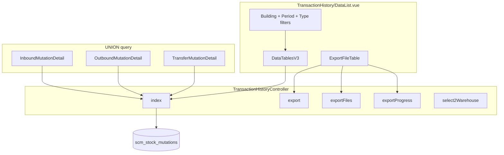
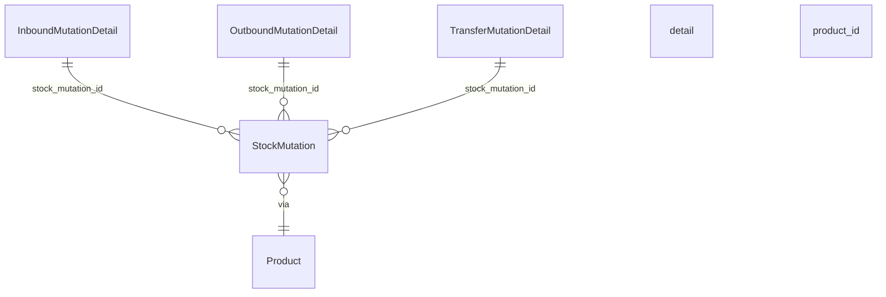

# BETA - Transaction History — Technical Documentation

> **DRAFT** — Dokumen ini adalah draft awal hasil analisis codebase otomatis per 2026-06-19. Perlu direview PM/QA sebelum final.

**UI route:** `/supplychain/transaction-history`  
**API prefix:** `supplychain/transaction-history`

**Penting:** Menu ini **tidak** memakai `ScmReport` atau `ItemTransactionHistoryController`. Lihat [supplychain-product-transaction-history/technical.md](../supplychain-product-transaction-history/technical.md) untuk laporan per-produk.

---

## 1. Architecture Overview

---

## 2. Frontend File Map

**Root:** `olshoperp-frontend/src/pages/SCM/Report/TransactionHistory/`

| File | Role | Key API |
|------|------|---------|
| `DataList.vue` | Filters + datalist + export slider | `GET transaction-history` |

**Router:** `supplychain_transaction-history_index` → `transaction-history`

### FE API URLs (data)

| Variable | Path used in FE |
|----------|-----------------|
| `api_datalist_url` | `supplychain/transaction-history` |
| `export_url` | `supplychain/transaction-history/export` |
| `export_file_url` | `supplychain/transaction-history/export-file` |
| `export_progress_url` | `supplychain/transaction-history/export-progress` |

### FE ↔ BE path alignment

| FE path | Actual route in `api.php` | Match |
|---------|---------------------------|-------|
| `.../export` | `.../export-excel` | **Mismatch** |
| `.../export-file` | `.../export-file` | OK |
| `.../export-progress` | `.../export-progress` | OK |

Building select2: `GET supplychain/real-stock/select2-warehouse` (bukan `transaction-history/select2-warehouse`).

---

## 3. Backend File Map

| File | Role |
|------|------|
| `TransactionHistoryController.php` | index, export, exportFiles, exportProgress, select2Warehouse, formatters |
| `TransactionHistoryExportFile.php` | Export metadata |
| `TransactionHistoryExportChunkJob.php` | Per-1000-rows Excel chunk |
| `TransactionHistoryExportCombineJob.php` | ZIP combine |
| `TransactionHistoryExport.php` | Maatwebsite export class |
| `ItemTransactionHistory.php` | Menu policy class only (not used in controller) |
| `ItemTransactionHistoryPolicy.php` | Gate policy |
| `WarehouseParentByType.php` | Building resolution |
| `SearchBuilder.php` | Advanced filter `formattedQuery` |

---

## 4. API Routes

Registered under `Route::prefix('transaction-history')`:

| Method | Path | Handler | Route name |
|--------|------|---------|------------|
| GET | `supplychain/transaction-history` | index | transaction-history.index |
| GET | `supplychain/transaction-history/select2-warehouse` | select2Warehouse | transaction-history.select-warehouse |
| GET | `supplychain/transaction-history/export-excel` | export | transaction-history.export |
| GET | `supplychain/transaction-history/export-file` | exportFiles | transaction-history.export.files |
| GET | `supplychain/transaction-history/export-progress` | exportProgress | transaction-history.export.progress |

Middleware: `auth:sanctum`, `auth_verified` — **no** explicit `authorize()` in controller.

### Filter query params

| Param | Format | Example |
|-------|--------|---------|
| `warehouse_id` | CSV int | `1,2,3` |
| `select_periode` | CSV date | `2026-06-01,2026-06-30` |
| `transaction_type` | CSV label | `Transfer Internal,Outbound External` |

### Datalist columns

| Column | Formatter method |
|--------|------------------|
| `transaction_date_formatted` | Carbon d-m-Y H:i:s |
| `transaction_code_formatted` | `getLinkTransactionCodeFormatted` |
| `type_formatted` | `getTypeFormatted` |
| `product_formatted` | product_sku |
| `quantity` | raw qty from union |
| `warehouse_origin_formatted` | building origin name |
| `warehouse_destination_formatted` | building dest name |
| `reference_formatted` | `getTransactionReferenceFormatted` + PO |
| `new_description_formatted` | mutation or reference desc |
| `dev_description_formatted` | mutation description truncate |
| `transaction_status_formatted` | MainModel status map |

---

## 5. Union Query Structure

Each branch selects: `id`, `stock_mutation_id`, `product_id`, `quantity`, `transaction_date`, `transaction_code`, `product_sku`, `source_type`.

Post-union joins: warehouse building parents (`WarehouseParentByType`), PO chain for inbound (`imd → pod → po`).

---

## 6. Export Pipeline

| Step | Detail |
|------|--------|
| 1 | `export()` calls `index($request, query_only=true)` |
| 2 | Count rows; chunk size **1000** |
| 3 | Create `TransactionHistoryExportFile` |
| 4 | Dispatch `TransactionHistoryExportChunkJob` per chunk with raw SQL |
| 5 | `Bus::batch` → `TransactionHistoryExportCombineJob` |
| 6 | Output ZIP via `TransactionHistoryExportCombineJob` |

Queue: `getQueueName('import')`

---

## 7. Reference Model Map

`getReferenceModelMap()` resolves Trx. Ref links:

| Class | Link prefix |
|-------|-------------|
| `SalesOrder` | `/omni/sales-order` |
| `SalesOrderGeneral` | `/businessdevelopment/sales-order-general` |
| `Wave` | `/omni/waves-management` |
| `PickingList` | `/omni/picking-list` |
| `CheckingList` | `/omni/checking-list` |
| `PackingList` | `/omni/packing-list` |
| `PurchaseOrder` | `/supplychain/purchase-order` |
| `StockMutationTransferExternal` | `/supplychain/mutation-transfer-external` |
| `FailedShip` | `/supplychain/failed-ship` |
| `SalesReturn` | `/accounting/sales-return` |
| `StockOpname` | `/supplychain/stock-opname` |
| ... | (see controller) |

---

## 8. Database Tables (read)

| Tabel | Role |
|-------|------|
| `scm_inbound_mutation_details` | Union branch |
| `scm_outbound_mutation_details` | Union branch |
| `scm_transfer_mutation_details` | Union branch |
| `scm_stock_mutations` | Header + filters |
| `scm_products` | SKU/name |
| `scm_warehouses` | Building resolution |
| `scm_warehouse_parent_by_types` | Parent building |
| `scm_transaction_history_export_files` | Export tracking |

---

## 9. Related docs

- [supplychain-product-transaction-history/technical.md](../supplychain-product-transaction-history/technical.md) — `ScmReport` + KPI
- [supplychain-product-mutation/technical.md](../supplychain-product-mutation/technical.md) — mutation history per product
- `docs/api/supply_chain/routes.md` — note stale export paths
