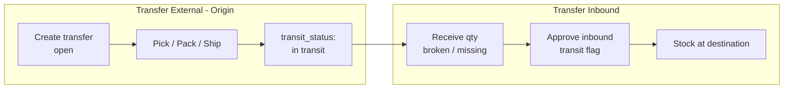
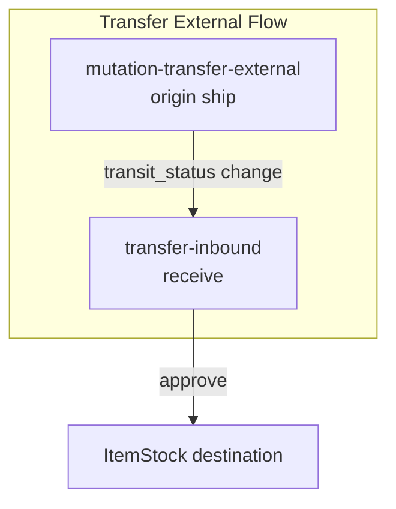

# Transfer Inbound — Requirement Detail

> **DRAFT** — Dokumen ini adalah draft awal hasil analisis codebase otomatis per 2026-06-19. Perlu direview PM/QA sebelum final.

**Modul:** SupplyChain  
**Audience:** PM, Operations, QA, Support, Developer  
**Status:** AS-IS — UI view inbound atas entity Transfer External yang sama

---

## 1. Fungsi & Tujuan

**Transfer Inbound** bukan entity terpisah. Menu ini adalah **filtered view + edit mode** dari `StockMutationTransferExternal` (`scm_stock_mutations` dengan `type = tf external`) untuk tahap penerimaan di warehouse destination.

Entity alias: `TransferInbound extends StockMutation` (empty subclass — scope via controller query).

---

## 2. How It Works — Alur Kerja

### 2.1 Transfer external lifecycle

### 2.2 Datalist filter

`StockMutationTransferExternalController@index` dengan query param `transfer_inbound=true`:

- `type = tf external`
- `warehouse_origin` AND `warehouse_destination` NOT NULL
- `is_inventory_adjustment = 0`
- `transit_status IN ('in transit', 'delivered')`
- Origin & destination warehouse: non-virtual OR virtual void-order group

Link kode di datalist → `/supplychain/transfer-inbound/edit/{id}`.

### 2.3 Update received quantity

`StockMutationTransferExternalDetailController@updateQuantityReceived`:

| Input | Mapping ke detail |
|-------|-------------------|
| `quantity_received` | `packed_in_base_unit` |
| `missing_quantity` | `picked_in_base_unit` |
| `broken_quantity` | `checked_in_base_unit` |

Validasi:

- Transaction belum approved
- `missing + broken ≤ transfer_quantity_in_base_unit`
- Received = transfer - missing - broken

Alternate: `TransferMutationMiddleDetailExternalController@updateQuantityReceived` untuk middle layer.

### 2.4 Approve (inbound)

`POST mutation-transfer-external/{id}/approve` dengan `transit` input:

1. `ensureMutationNotApprovedOrApproving()` + cache approve lock.
2. Jika approved + transit: target detail dari linked transfer record (`warehouse_transfer_external[1]`).
3. Broken qty > 0 → `getScrapWHParent(destination)`.
4. Delegasi ke `StockMutationTransferController@approve`.

---

## 3. Validasi yang Berjalan

### 3.1 Receive qty

| Rule | Pesan |
|------|-------|
| Status approved | "already approved, you can't modify" |
| missing + broken > transfer | "Quantity received doesn't match with transfer quantity" |
| received > transfer qty | "Quantity received cannot be greater than transfer quantity" |
| received + missing + broken ≠ transfer | "Defect quantity, lost quantity, and received quantity must equal the transferred quantity" |
| broken > 0 | Scrap warehouse parent must exist |

### 3.2 Approve

| Rule | Pesan |
|------|-------|
| Double reference approval | "This stock mutation transfer already approved" |
| Warehouse origin structure | `isValidWarehouseOriginStructureForApproval()` |

### 3.3 UI constraints

| Rule | Detail |
|------|--------|
| No create route | Router hanya `transfer-inbound` index + `edit/:id` |
| Shared form | `TransferExternal/Form.vue` dengan `meta.transferInbound: true` |
| Redirect after approve | `supplychain/transfer-inbound` (bukan mutation-transfer-external) |

---

## 4. Relasi Menu Lain

| Menu | Relasi |
|------|--------|
| Transfer External | Same API & entity; outbound lifecycle |
| Warehouse Setting | Scrap/void warehouse for broken qty |
| Stock History | Mutation records after approve |

---

## 5. Known Gaps / Open Questions

| ID | Gap |
|----|-----|
| G-01 | `TransferInbound` entity kosong — semua logic di `StockMutationTransferExternal` |
| G-02 | Policy `TransferInboundPolicy` ada tapi controller authorize ke `StockMutationTransferExternal` |

---

## Related Documents

| Doc | Path |
|-----|------|
| Knowledge Base | [knowledge-base.md](./knowledge-base.md) |
| Technical | [technical.md](./technical.md) |
