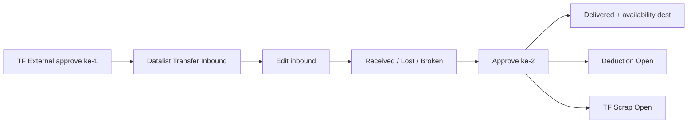
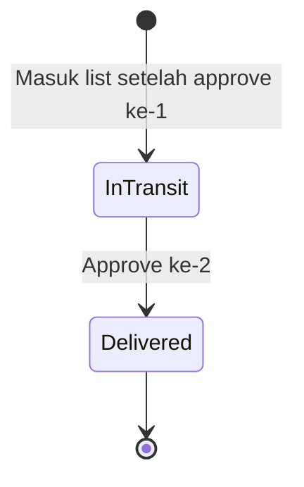
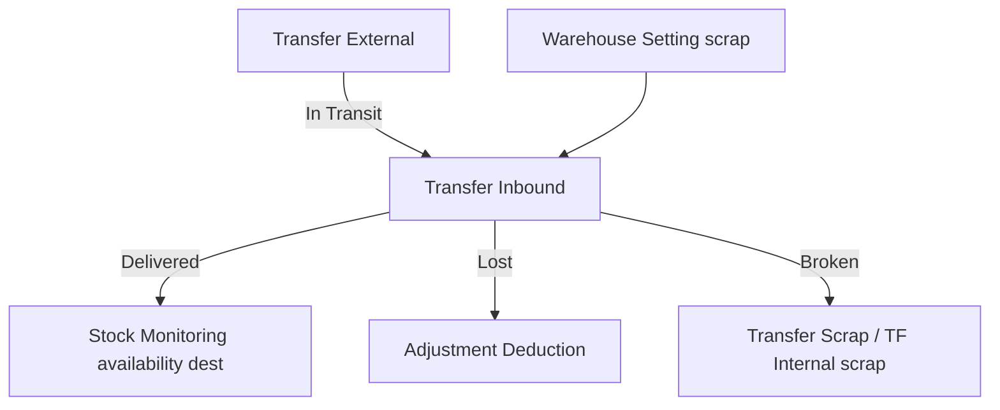

# Transfer Inbound — Requirement Documentation

**Modul:** SupplyChain  
**Audience:** PM, Operations, QA, Support, Developer  
**Route:** `/supplychain/transfer-inbound`

**SOT:** [supplychain-transfer-inbound-source-of-truth.md](../_meta/sot/supplychain-transfer-inbound-source-of-truth.md) v1.0  
**Pasangan:** [Transfer External](../supplychain-mutation-transfer-external/requirement.md) (approval ke-1; FIFO/import/Colli/Show Virtual/Void **ikut** TF Ext — tidak diulang kecuali beda di sini)

Share datalist/form produksi TF External dengan flag inbound. **Tidak ada Create.**

---

## 0. Metadata & Changelog

| Version | Date | Author | Changes |
|---------|------|--------|---------|
| 1.0 | 2026-06-19 | QA - Yemima | Initial draft stub |
| 2.0 | 2026-09-01 | QA - Yemima | Split SOT v1.0: approval ke-2; Lost/Broken Open; pairing TF Ext; GAP-TFINB-01..05 |

## 1. Ringkasan Eksekutif

Transfer Inbound menampilkan **hanya** Transfer External dengan Delivery Status **In Transit** atau **Delivered**. Operator gudang tujuan mengisi Qty Received / Lost / Broken lalu **Approve** (ke-2). Setelah itu dokumen utama **Delivered**, stok In Transit masuk destination, Lost → Stock Deduction **Open**, Broken → Transfer Internal scrap **Open**.

```mermaid
flowchart LR
  TFE[TF External approve ke-1] --> List[Datalist Transfer Inbound]
  List --> Edit[Edit inbound]
  Edit --> Qty[Received / Lost / Broken]
  Qty --> Ap2[Approve ke-2]
  Ap2 --> Deliv[Delivered + availability dest]
  Ap2 --> AD[Deduction Open]
  Ap2 --> Scrap[TF Scrap Open]
```

## 2. Prasyarat

| Prerequisite | Sumber | Catatan |
|--------------|--------|---------|
| Dokumen TF External **Approved** + Delivery **In Transit** | Transfer External | Tidak muncul jika Draft/Open |
| Privilege view/approve TF External (surface inbound) | Gate | Share policy TF External |
| Setting WH Scrap di building destination | Warehouse Setting | Wajib jika Broken lebih dari 0 |
| Received + Lost + Broken = transferred sebelum approve ke-2 | Form inbound | Satuan transfer / base unit di approve |

Create header, Select Product, Import, Available Products, autosave origin: **tidak ada**.

## 3. Siklus Status

Dokumen yang diedit = **header TF External utama** (bukan dokumen hidden). Status transaksi sudah **Approved** sejak approve ke-1. Yang berubah: **Delivery Status** + qty received/lost/broken.

```mermaid
stateDiagram-v2
    [*] --> InTransit: Masuk list setelah approve ke-1
    InTransit --> Delivered: Approve ke-2
    Delivered --> [*]
```

| Delivery | Edit received/lost/broken | Delete header | Approve ke-2 |
|----------|---------------------------|---------------|--------------|
| In Transit | Ya | Tidak | Ya |
| Delivered | Tidak | Tidak | Tidak |

**Tidak ada Void. Tidak ada reject approval ke-2.** Koreksi angka **sebelum** approve ke-2.

**Action datalist:** Update (form inbound); Approve jika eligible; tidak Create; Delete tidak untuk dokumen sudah Approved.

## 4. Acceptance Criteria — Datalist

API sama TF External + query `transfer_inbound` → filter `transit_status` in transit **atau** delivered. Link kode ke `/supplychain/transfer-inbound/edit/{id}`.

| # | Fitur | Beda vs TF External |
|---|--------|---------------------|
| Create | **Tidak ada** | Tombol Create di-hide |
| Show Virtual | TO-BE hide (sama keputusan TF Ext) | Produksi `is_show_virtual=false` |
| Bulk Delete / Approve | Ada | Approve = ke-2 untuk row In Transit |
| Kolom | Sama + **Delivery Status** | In Transit vs Delivered |

Export: with/without details sama keluarga TF Ext; with-details berisi Qty Received / Lost / Broken.

## 5. Form & Field

Header Basic Information **read-only operasional** (sudah lock sejak approve ke-1). Tidak menambah SKU.

### 5.1 Product Transfer Detail (inbound)

| Kolom | Aturan |
|-------|--------|
| **Qty Transfered** | Disabled — qty kirim approve ke-1 |
| **Qty Received** | Editable. Default = semua transferred |
| **Lost Items** | Editable. Default kosong / 0. Jika lebih dari 0 setelah approve ke-2: **Stock Deduction** **Open**, `process_type` lost, **Trx Ref = kode dokumen TF External utama** (bukan TF hidden). Approve deduction **manual** |
| **Broken Items** | Editable. Default kosong / 0. Jika lebih dari 0: **Transfer Internal** scrap, origin = In Transit destination, dest = **WH scrap** setting building destination. Status **Open** — **bukan** auto-approve. UI: *The product quantity in this field will automatically transfer to the virtual broken warehouse.* Lost: *…automatically create an adjustment out form.* |

**Group View** default; **Detail View** untuk stock ID.

**Rumus:** Qty Received + Lost Items + Broken Items **harus sama** dengan Qty Transfered. Tidak boleh melebihi transferred.

Colli: **tidak** di form inbound produksi.

## 6. How It Works

### 6.1 Isi penerimaan (contoh)

TF Ext TF001 kirim SKUPENSIL 1.000.

| Received | Lost | Broken | Hasil setelah approve ke-2 |
|----------|------|--------|----------------------------|
| 1.000 | 0 | 0 | Semua masuk Drop OFF SDA; Delivered |
| 900 | 100 | 0 | 900 availability SDA; Deduction Open 100, ref TF001 |
| 850 | 50 | 100 | 850 SDA; Deduction 50 Open; TF scrap 100 Open ke Broken WH |
| 1.001 | — | — | Ditolak: received tidak boleh lebih dari transferred |

Lost/Broken **0/kosong sah** jika received = transferred (lihat GAP-TFINB-05).

### 6.2 Generate setelah approve ke-2

1. Validasi jumlah received/lost/broken vs transferred (base unit).
2. Update qty transfer hidden leg ke **received** (allow zero).
3. Jika lost lebih dari 0: header deduction terikat TF utama; detail; **tetap Open**.
4. Jika broken lebih dari 0: wajib scrap WH; TF Internal scrap In Transit ke scrap; **tetap Open**.
5. Approve pergerakan In Transit ke destination untuk qty received.
6. Set Delivery Status dokumen utama **Delivered**.

Stock Monitoring: incoming In Transit hilang; availability destination = received. Lost tidak jadi availability. Broken menunggu approve TF scrap.

### 6.3 Tidak dilakukan di inbound

- Tidak ubah FIFO origin (sudah lock di TF Ext).
- Tidak insert SKU baru.
- Tidak auto-approve deduction/scrap (beda Failed Ship).

## 7. Validasi

| ID | Kondisi | Behavior / pesan (verbatim) |
|----|---------|------------------------------|
| V-TFINB-01 | Received lebih dari transferred | *Quantity received cannot be greater than transfer quantity* |
| V-TFINB-02 | Received + lost + broken ≠ transferred (saat set qty) | *Defect quantity, lost quantity, and received quantity must equal the transferred quantity.* |
| V-TFINB-03 | Saat approve ke-2, lost+broken+received tidak match (base) | *The lost and defect item quantities don't match the recorded received quantity. Please check again.* |
| V-TFINB-04 | Broken lebih dari 0 tapi scrap WH belum di-set | Gagal resolve scrap parent |
| V-TFINB-05 | Ubah qty setelah approved+delivered | *This transaction and it's properties already approved, you can't modify this data anymore.* |
| V-TFINB-06 | Approve ke-2 saat job lock | *Approval is being processed…* / *Approval is in progress…* |
| V-TFINB-07 | Detail tidak lengkap warehouse | *Please select warehouse on all details* |

V-TFINB-02 vs V-TFINB-03: dua endpoint (set qty vs approve). QA uji keduanya.

## 8. Relasi Menu Lain

```mermaid
flowchart TB
  TFE[Transfer External] -->|In Transit| TFIB[Transfer Inbound]
  TFIB -->|Delivered| SM[Stock Monitoring availability dest]
  TFIB -->|Lost| AD[Adjustment Deduction]
  TFIB -->|Broken| TFS[Transfer Scrap / TF Internal scrap]
  WS[Warehouse Setting scrap] --> TFIB
```

| Menu | Relasi |
|------|--------|
| Transfer External | Sumber dokumen; approval ke-1; Trx Code yang sama |
| Adjustment Deduction | Lost; ref kode TF Ext **utama**; Open sampai user approve |
| Transfer Internal / Scrap | Broken ke WH scrap; Open |
| Stock Monitoring / Product Mutation | Incoming selesai setelah Delivered |

## 9. Gaps

| ID | Deskripsi | Type | Dampak | Status |
|----|-----------|------|--------|--------|
| GAP-TFINB-01 | Share FE TF External; Create di-hide. Show Virtual TO-BE hide. | Missing Behavior (TO-BE) | Chrome datalist | Open — hide virtual in progress |
| GAP-TFINB-02 | Colli tidak ada di inbound; BETA Colli TF Ext tidak mengalir ke form inbound. | Missing Behavior | Penerimaan colli lintas gedung tidak terdefinisi | Open — Colli bukan produksi |
| GAP-TFINB-03 | Dua pesan validasi jumlah (set vs approve). | Unverified UX | Pesan berbeda | Open |
| GAP-TFINB-04 | Lost reference class live vs controller lama; **kode/URL** tetap TF Ext utama. | Unverified | Cari by class | Lihat GAP-TFEXT-05 |
| GAP-TFINB-05 | Lost/Broken bertanda required di modal padahal 0/kosong sah. | Contradiction UI | Behavior: 0 sah jika received = transferred | Pending Decision — Yemima |

## 10. FAQ

**Kenapa dokumen tidak muncul?** Belum approve ke-1 di Transfer External.

**Boleh approve ke-2 tanpa ubah qty?** Ya — default received = transferred.

**Lost deduction belum potong final?** Masih Open — approve di Adjustment Deduction.

**Broken ke gudang mana?** WH scrap setting **destination**.

**Bisa reject penerimaan?** Tidak — koreksi sebelum Approve ke-2.
