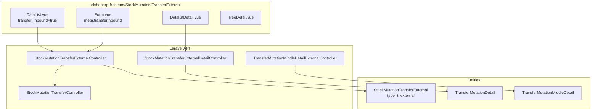
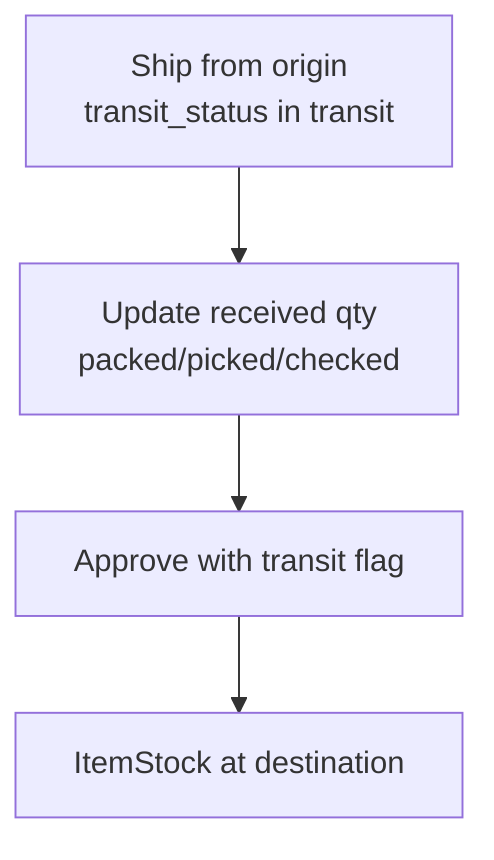

# Transfer Inbound — Technical Documentation

> **DRAFT** — Dokumen ini adalah draft awal hasil analisis codebase otomatis per 2026-06-19. Perlu direview PM/QA sebelum final.

**Stack:** Laravel 13 API · Vue 3 SPA  
**Primary module:** `Modules/SupplyChain`  
**Menu slug:** `supplychain-transfer-inbound`  
**UI route:** `/supplychain/transfer-inbound`  
**API base:** `{VITE_API_URL}supplychain/mutation-transfer-external*`

---

## 1. Architecture Overview

---

## 2. Frontend File Map

**Root:** `olshoperp-frontend/src/pages/SCM/StockMutation/TransferExternal/`  
*(Shared dengan Transfer External — dibedakan via router meta)*

| File | Role (Transfer Inbound mode) |
|------|------------------------------|
| `DataList.vue` | Datalist; passes `transfer_inbound=true` |
| `Form.vue` | Edit only; breadcrumb Transfer Inbound; redirect URL |
| `DatalistDetail.vue` | Detail + update received qty |
| `DatalistDetailGroup.vue` | Middle detail group |
| `ApprovalDialog.vue` | Approve with transit flag |
| `HeaderBasicInformation.vue` | Origin/destination (read-only inbound side) |

### Router (`src/router/index.ts`)

| Route | Component | Meta |
|-------|-----------|------|
| `supplychain/transfer-inbound` | `DataList.vue` | `transferInbound: true` |
| `supplychain/transfer-inbound/edit/:id` | `Form.vue` | `transferInbound: true` |

**No create route** for transfer-inbound.

---

## 3. Backend File Map

| Class | Path | Responsibility |
|-------|------|----------------|
| `StockMutationTransferExternalController` | `Modules/SupplyChain/Http/Controllers/StockMutationTransferExternalController.php` | Index (inbound filter), CRUD delegate, approve |
| `StockMutationTransferExternalDetailController` | `.../StockMutationTransferExternalDetailController.php` | Detail CRUD, update received, bulk FIFO |
| `TransferMutationMiddleDetailExternalController` | `.../TransferMutationMiddleDetailExternalController.php` | Middle detail receive qty |
| `StockMutationTransferController` | Shared transfer logic (store, approve core) |

### Models

| Class | Notes |
|-------|-------|
| `StockMutationTransferExternal` | Main entity; `type = TF_EXTERNAL` |
| `TransferInbound` | Empty extends `StockMutation` — placeholder |
| `TransferMutationDetail` | Detail lines with pick/check/pack/ship/received qty fields |
| `TransferInboundPolicy` | Policy stub |

---

## 4. API Routes (selected)

**Prefix:** `supplychain`

| Method | Path | Notes |
|--------|------|-------|
| GET | `mutation-transfer-external?transfer_inbound=true` | Inbound datalist filter |
| GET | `mutation-transfer-external/{id}` | Show transfer |
| POST | `mutation-transfer-external/{id}/approve` | Approve; body includes `transit` |
| POST | `mutation-transfer-detail-ext/update-received` | Update received/broken/missing |
| POST | `transfer-external-middle-detail/update-received` | Middle layer receive |
| POST | `transfer-external-middle-detail/update-qty` | setBrokenMissingQuantity |
| GET | `mutation-transfer-external/{id}/log/approve` | Approval log |

---

## 5. Database

### 5.1 Header `scm_stock_mutations` (transfer external scope)

| Column | Keterangan |
|--------|------------|
| `type` | `tf external` |
| `warehouse_origin` | Gudang asal |
| `warehouse_destination` | Gudang tujuan |
| `transit_status` | `in transit` / `delivered` |
| `transaction_status` | open → approved |

### 5.2 Detail `scm_transfer_mutation_details`

| Column | Keterangan (inbound receive) |
|--------|------------------------------|
| `transfer_quantity_in_base_unit` | Qty dikirim |
| `packed_in_base_unit` | Qty received |
| `picked_in_base_unit` | Qty missing |
| `checked_in_base_unit` | Qty broken |

### 5.3 Receive flow

---

## 6. Key Integration Points

| Sistem | Mekanisme |
|--------|-----------|
| Transfer External | Same controller/entity; outbound creates shipment |
| Warehouse scrap | `getScrapWHParent()` on broken qty |
| Virtual warehouse | Void-order virtual WH included per config `include_virtual_wh_void` |
| Item stock | Approve via `StockMutationTransferController` |

---

## 7. Permissions

Authorize via `StockMutationTransferExternal` policy (view/update/approval).  
Menu seeder: `supplychain/transfer-inbound`.

Export jobs: `StockMutationTransferInboundExportJob`, `StockMutationTransferInboundDetailExportJob`.
