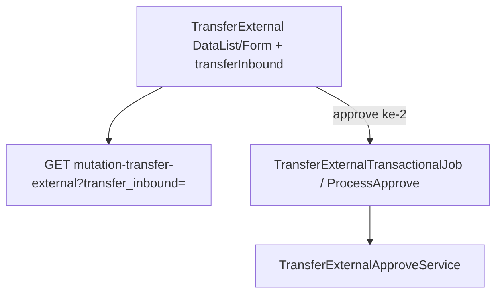
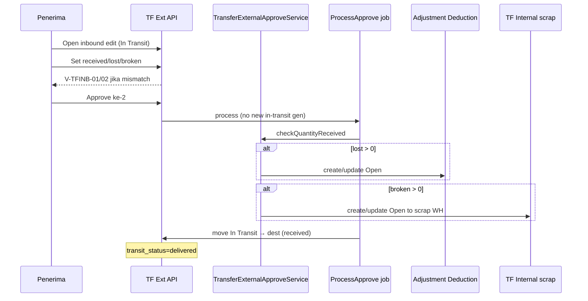

# Transfer Inbound — Technical Documentation

## 1. Architecture Overview

Bukan entity terpisah untuk header bisnis: **surface UI** atas dokumen Transfer External yang sudah `transit_status` in transit \| delivered. Share FE `TransferExternal/*` + `meta.transferInbound: true`.

```mermaid
flowchart TB
    FE["TransferExternal DataList/Form + transferInbound"]
    API["GET mutation-transfer-external?transfer_inbound="]
    APR["TransferExternalApproveService"]
    JOB["TransferExternalTransactionalJob / ProcessApprove"]
    FE --> API
    FE -->|approve ke-2| JOB
    JOB --> APR
```

Approve ke-2: `generate_transfer_external_in_transit=false` (tidak buat leg In Transit baru).

## 2. Frontend File Map

| Path | Role |
|------|------|
| `olshoperp-frontend/src/pages/SCM/StockMutation/TransferExternal/DataList.vue` | Datalist; hide Create jika inbound; `is_show_virtual=false` |
| `TransferExternal/Form.vue` | Header read-only ops; qty received/lost/broken |
| `TransferExternal/DatalistDetail.vue` | Detail inbound fields |
| Router `transfer-inbound` | `meta.transferInbound: true` |

Tidak ada folder FE terpisah khusus inbound.

## 3. Backend File Map

| File | Role |
|------|------|
| `StockMutationTransferExternalController.php` | Index + `transfer_inbound` filter; approve entry |
| `StockMutationTransferExternalDetailController.php` | Detail; set received/lost/broken |
| `TransferMutationMiddleDetailExternalController.php` | Middle qty updates |
| `TransferExternalApproveService.php` | `checkQuantityReceived`, `handleMissing` (lost), `handleBroken` |
| Jobs `TransferExternalTransactionalJob` / `ProcessApprove` | Sequence approve ke-2 |
| `StockMutationTransferInboundExportAll` (export inbound) | Export with received/lost/broken |

Entity hint: `TransferInbound` boleh ada sebagai helper/filter; dokumen kanonik tetap stock mutation TF external.

## 4. API Routes (utama)

| Method | Path | Notes |
|--------|------|-------|
| GET | `supplychain/mutation-transfer-external?transfer_inbound=` | Filter transit in transit \| delivered |
| PUT/PATCH | detail / setBrokenMissingQuantity / updateQuantityReceived | Set received/lost/broken |
| POST | `…/approve` | Approve ke-2 path |
| Export | inbound export class | With details qty fields |

Field mapping UI→storage (AS-IS): packed ≈ received, picked ≈ lost, checked ≈ broken.

## 5. Database Key Tables

| Concept | Notes |
|---------|-------|
| Header TF Ext | Same row; `transit_status` flips to delivered |
| Detail qty | transferred vs received/lost/broken |
| Deduction | Open, `process_type=lost`, ref text = main TF code |
| Scrap TF Internal | Open, origin In Transit → scrap WH |

## 6. Flow utama

```mermaid
sequenceDiagram
    participant R as Penerima
    participant API as TF Ext API
    participant Svc as TransferExternalApproveService
    participant Job as ProcessApprove job
    participant Ded as Adjustment Deduction
    participant Scr as TF Internal scrap

    R->>API: Open inbound edit (In Transit)
    R->>API: Set received/lost/broken
    API-->>R: V-TFINB-01/02 jika mismatch
    R->>API: Approve ke-2
    API->>Job: process (no new in-transit gen)
    Job->>Svc: checkQuantityReceived
    alt lost > 0
        Svc->>Ded: create/update Open
    end
    alt broken > 0
        Svc->>Scr: create/update Open to scrap WH
    end
    Job->>API: move In Transit → dest (received)
    Note over API: transit_status=delivered
```

## 7. Invariants

- List hanya `transit_status` in transit \| delivered.
- Approve ke-2 tidak generate In Transit baru.
- Deduction/scrap **Open** (manual approve).
- Trx Ref user-facing = kode header visible TF Ext.
- Create / FIFO insert / import tidak tersedia di surface ini.

## 8. Validation Highlights

[requirement §7](./requirement.md) V-TFINB-01..07. Dua pesan jumlah: set-qty vs approve-time.

## 9. Frontend Behaviors

- Hide Create; link edit `transfer-inbound/edit/{id}`.
- Lost/Broken modal boleh tampil required (*) sementara 0/kosong sah (GAP-TFINB-05).
- Tidak ada Colli UI inbound.

## 10. Failure Modes & Transaction Boundary

| Mode | Notes |
|------|-------|
| Scrap WH missing | Broken path gagal |
| Qty mismatch base unit | Approve ditolak V-TFINB-03 |
| Job lock | Pesan in progress / refresh |
| Import cache TF Ext | Seharusnya tidak aktif di inbound |

## 11. Data Lifecycle

| After approve ke-2 | Effect |
|--------------------|--------|
| Received | Availability destination ↑; incoming In Transit ↓ |
| Lost | Deduction Open; tidak jadi availability |
| Broken | Scrap TF Open; menunggu approve scrap |
| Header | Delivery Delivered |

## 12. Tests & QA Notes

- Pair dengan TF Ext dual approve.
- Uji V-TFINB-02 vs V-TFINB-03.
- Lost: cari deduction by **kode TF utama**.
- Broken: scrap WH = destination building settings.
- Default approve (received=all, lost/broken 0) harus lolos.

## 13. Known Issues

Refer [requirement §9](./requirement.md): GAP-TFINB-01..05; related GAP-TFEXT-05.
