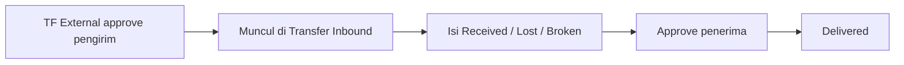
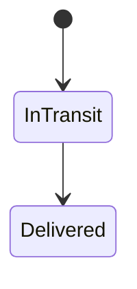

# Transfer Inbound — Panduan Pengguna

**Siapa yang baca panduan ini:** operator gudang penerima, inventory, support  
**Menu di sistem:** Supply Chain → Transfer Inbound  
**Dokumen:** nomor **TF** yang sama dengan Transfer External

---

## 1. Apa Itu & Kenapa Penting

Transfer Inbound adalah tempat **menerima barang** dari Transfer External yang sudah di-approve pengirim. Di sini kamu mengonfirmasi berapa yang diterima baik, hilang, atau rusak, lalu menyetujui penerimaan.

Tanpa langkah ini, barang tetap **In Transit** dan belum resmi masuk stok gudang tujuan.

---

## 2. Overview Flow & Proses Bisnis

### Alur singkat

**Versi teks:**

1. Pengirim selesai approve di Transfer External → dokumen **In Transit**.
2. Kamu buka Transfer Inbound, isi qty diterima / hilang / rusak.
3. Approve → **Delivered**; stok yang diterima masuk gudang tujuan.
4. Jika ada Lost / Broken, sistem buat dokumen potongan / scrap yang masih perlu di-approve di menu lain.

🎬 [Interactive demo — TF Ext ke Inbound Lost/Broken]

### Siklus status (Delivery)

| Delivery | Artinya | Bisa ubah qty? |
|----------|---------|----------------|
| In Transit | Menunggu penerimaan | Ya |
| Delivered | Selesai | Tidak |

Tidak ada Void / reject di langkah ini — koreksi angka sebelum Approve.

---

## 3. Sebelum Mulai (Flow Sebelum)

Pastikan:

- Nomor TF sudah **Approved** di Transfer External (Delivery In Transit).
- Role kamu boleh melihat / approve permukaan inbound.
- Jika akan isi **Broken**, gudang scrap untuk **gedung tujuan** sudah di-set di Warehouse Setting.

Tidak perlu (dan tidak bisa) membuat dokumen baru di menu ini.

---

## 4. Setelah Selesai (Flow Sesudah)

- Delivery jadi **Delivered**; stok yang **Received** bisa dipakai di tujuan.
- **Lost** lebih dari 0 → cek Adjustment Deduction (masih Open) → approve di sana.
- **Broken** lebih dari 0 → cek Transfer scrap / TF Internal scrap (masih Open) → approve di sana.

🎬 [Interactive demo — approve deduction & scrap setelah inbound]

---

## 5. Yang Perlu Diperhatikan

- Qty diterima tidak boleh lebih dari yang dikirim.
- Received + Lost + Broken harus **persis sama** dengan Qty Transfered.
- Setelah Delivered, qty tidak bisa diubah.
- Lost/Broken boleh 0 — sah jika semua diterima baik (meski form menandai required).
- Saat proses approve masih jalan, tunggu dan refresh.
- Cari dokumen potongan Lost dengan **kode TF utama**, bukan kode dokumen tersembunyi sistem.

---

## 6. Langkah-Langkah (Step by Step)

1. Buka Supply Chain → **Transfer Inbound**.
2. Cari nomor TF (status In Transit) → buka edit.
3. Per baris: sesuaikan **Qty Received**, **Lost Items**, **Broken Items** (default biasanya received = semua, lost/broken kosong).
4. Pastikan jumlah ketiga kolom = Qty Transfered.
5. Klik **Approve**.
6. Cek Delivery **Delivered**. Jika ada Lost/Broken, lanjutkan approve di menu potongan / scrap.

**Contoh:** kirim 1.000 → terima 900, lost 100 → setelah approve, 900 di tujuan + deduction Open 100 dengan referensi nomor TF yang sama.

---

## 7. Tips & Hal yang Sering Bikin Bingung

- **Dokumen tidak muncul?** Pengirim belum approve, atau masih Draft/Open.
- **Approve tanpa ubah angka?** Boleh — artinya semua diterima baik.
- **Broken ke gudang mana?** Scrap **tujuan**, bukan gudang pengirim.
- **Deduction belum mengurangi stok final?** Masih Open — belum di-approve di Adjustment Deduction.

---

## 8. Referensi

- [Requirement](./requirement.md)  
- [Knowledge Base](./knowledge-base.md)  
- [Technical](./technical.md)  
- [Transfer External](../supplychain-mutation-transfer-external/user-guide.md) — panduan pengirim
