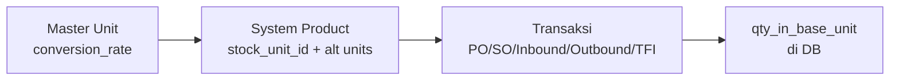
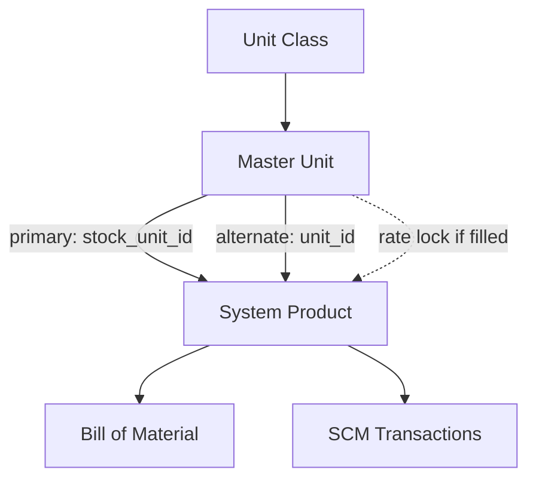

# Master Unit — Requirement Documentation

**Modul:** Supply Chain Management (Master Data)  
**Audience:** PM, Operations, QA, Support, Developer  
**Status:** AS-IS verified against codebase per 2026-07-04

**UI route:** `/supplychain/unit`  
**API base:** `{VITE_API_URL}supplychain/unit`  
**Released:** 1 Januari 2024

---

## 0. Metadata & Changelog

| Version | Date | Author | Changes |
|---------|------|--------|---------|
| 1.0 | 2026-06-19 | QA - Yemima | Initial draft from codebase analysis |
| 2.0 | 2026-07-04 | QA - Yemima | Full rewrite: merge PM requirement, codebase verification, default data, conversion helper, UI/UX, gap analysis |

---

## 1. Ringkasan Eksekutif

**Master Unit** mendefinisikan satuan pengukuran (UoM) yang dipakai di seluruh transaksi OlshopERP — PO, SO, Inbound, Outbound, Transfer Internal, BoM, Assembly, dll.

Setiap unit masuk ke **Unit Class**, dengan **1 Base Unit** per class dan **Conversion Rate** relatif terhadap base. Data disimpan di `scm_units`, class di `scm_unit_classes`.

| Kebutuhan Bisnis | Bagaimana Master Unit Menjawab |
|------------------|-------------------------------|
| Standarisasi satuan lintas transaksi | Semua transaksi refer ke unit dari master |
| Konversi otomatis | Base unit + conversion rate → kalkulasi ke base unit di DB |
| Fleksibilitas per produk | Rate NULL di master → editable di System Product alternate unit |
| Visibilitas lintas company | Toggle **Show for All Company** |

---

## 2. Konsep Dasar — Unit Class, Base Unit, Conversion Rate

### 2.1 Unit Class

Kelompok unit sejenis (Pieces, Mass, Length, Volume, Time, dll.). Setiap unit **wajib** punya `unit_class_id`.

Unit Class master: menu terpisah (`UnitClassController`), 15 class default di seeder.

### 2.2 Base Unit

- **1 Base Unit per Unit Class** (`is_base_unit = 1`)
- Conversion rate base unit **selalu = 1**
- Seluruh qty transaksi dikonversi ke base unit di database
- **Kesalahan pilihan base unit sulit di-undo** setelah dipakai transaksi — base unit edit locked di FE (`can_update = false`)

### 2.3 Conversion Rate

**Formula definisi:**

```
Conversion Rate = 1 / (jumlah base unit yang setara dengan 1 unit ini)

Contoh (Mass, base = Gram):
  1 Kilogram = 1000 Gram → rate KG = 0.001

Contoh (Pieces, base = PCS):
  1 Box = 10 Pieces → rate Box = 0.1
```

**Formula konversi (helper tool & `unitConverter`):**

```
Hasil = (Origin Value / Origin Rate) × Destination Rate
```

| Mode | Master Unit | Saat assign ke System Product |
|------|-------------|-------------------------------|
| **Rate diisi** | Fixed di master | Rate **tidak bisa diubah** di SP alternate unit |
| **Rate NULL** | Kosong (tampil `-` di datalist) | User **bisa isi** rate per produk di alternate unit |

**Validasi rate:** nullable, numeric, `lte:1`, tidak boleh `0`.

> **Catatan:** Rate = 1 untuk **non-base unit diizinkan** (Each, Unit, Kit, Set di class Pieces — setara 1:1 dengan PCS).

---

## 3. Default Unit Data Sistem

**Sumber seed:** `database/sql_seeder/scm/unit/import.sql` via `UnitSeeder`.

### 3.1 Class: Pieces (id 8) — base: **PCS**

| Code | Name | Base? | Conversion Rate |
|------|------|-------|-----------------|
| PCS | Pieces | **Ya** | 1 |
| EA | Each | Tidak | 1 |
| BX | Box | Tidak | 0.1 |
| UNT | Unit | Tidak | 1 |
| ASY | Assy | Tidak | 1 |
| KIT | Kit | Tidak | 1 |
| SET | Set | Tidak | 1 |

### 3.2 Class: Mass (id 7) — base: **Gr (Gram)**

| Code | Name | Base? | Conversion Rate |
|------|------|-------|-----------------|
| Gr | Gram | **Ya** | 1 |
| Kg | Kilo Gram | Tidak | 0.001 |
| T | Ton | Tidak | 0.000001 |
| Ons | Ounce | Tidak | 0.03527396 |

> Tidak ada code `Tons` terpisah — hanya `T`.

### 3.3 Class: Length (id 6)

**Fresh install (`import.sql`):** base = **MM (Millimeter)**

| Code | Name | Base? | Conversion Rate |
|------|------|-------|-----------------|
| MM | Milimeter | **Ya** | 1 |
| Cm | Centimeter | Tidak | 0.1 |
| M | Meter | Tidak | 0.001 |
| I | Inch | Tidak | 39.3701 |
| Ft | Foot | Tidak | 3.28084 |
| Yrd | Yard | Tidak | 1.09361 |

**Target bisnis (disetujui PM):** hapus Inch/Foot/Yard; pertahankan base **Millimeter** + rate CM/M konsisten.

**Optional seeder `FixUnitSeeder` (manual, `php artisan db:seed --class FixUnitSeeder`):**
- Menghapus Inch, Foot, Yard (id 9, 10, 11)
- **Mengubah base Length ke Centimeter (Cm)** — bukan MM — dan recalculate semua `*_base_unit_id` di DB
- Juga menambah unit Minute (Time) dan mengubah base Time

> **Gap dokumentasi vs seeder:** PM requirement menyebut MM sebagai base Length pasca-perubahan; `FixUnitSeeder` set base ke **Cm**. Verifikasi environment staging mana yang aktif.

### 3.4 Unit Class lain (ringkas)

| Class | Base (code) | Contoh unit |
|-------|-------------|-------------|
| Area | M2 | ACR, H, Km2 |
| Volume | L | Ml, Oz, GL, Qrt |
| Time | Hr | Day, Wk (+ Minute jika FixUnitSeeder) |
| Speed | KMH | KN, Mph |
| Temperature | C | F, K |
| Pressure | B | Psc, P, atm |

---

## 4. Acceptance Criteria (AS-IS)

### 4.1 Datalist

| ID | Kriteria |
|----|----------|
| A-01 | Kolom: CODE, UNIT NAME, UNIT CLASS, BASE UNIT, DEFAULT CONVERSION RATE |
| A-02 | Row group by Unit Class name |
| A-03 | Advanced filter + column show/hide (`filter_column=true`) |
| A-04 | Export Excel via DataTablesV3 (visible columns + default status/created by) |
| A-05 | Bulk delete, show deleted toggle |
| A-06 | Delete hidden untuk base unit (UI); Edit always |

### 4.2 Create / Edit

| ID | Kriteria |
|----|----------|
| A-07 | Code required, max **50**, unique per company |
| A-08 | Name required, max **50** |
| A-09 | Unit Class required |
| A-10 | Conversion rate nullable, numeric, lte:1, not 0 |
| A-11 | Description max 150, optional |
| A-12 | Yellow notice box di Create page |
| A-13 | Auto base unit jika class belum punya base |
| A-14 | Base unit: FE lock edit (`can_update=false`) |
| A-15 | Rate/class lock jika `have_relations=true` |

### 4.3 Toggles

| ID | Kriteria |
|----|----------|
| A-16 | Active ON → muncul di select2; OFF → excluded |
| A-17 | Show for All Company — visible jika `own_data=true` |
| A-18 | Default Primary Unit — max 1 per scope (system vs company) |
| A-19 | Auto-save toggles di edit mode (status, is_all_company, default primary) |

### 4.4 Conversion Helper

| ID | Kriteria |
|----|----------|
| A-20 | Slideover dari breadcrumb datalist |
| A-21 | PUT `calculate-conversion` → real-time result |
| A-22 | Destination unit filtered same class (`in-class/{unit}/select2`) |

### 4.5 Delete & Protections

| ID | Kriteria |
|----|----------|
| A-23 | Delete blocked jika linked ke Product atau ProductAlternativeUnit |
| A-24 | Rate/class update blocked jika `haveRelations()` |
| A-25 | Audit log per unit |

---

## 5. Validasi & Rules

### 5.1 Store / Update

| ID | Rule | Trigger | Pesan |
|----|------|---------|-------|
| V-01 | `code` required, max 50, unique | store/update | Laravel validation |
| V-02 | `name` required, max 50 | store/update | Laravel validation |
| V-03 | `description` max 150 | store/update | Laravel validation |
| V-04 | `unit_class_id` required | store/update | Laravel validation |
| V-05 | `conversion_rate` nullable, numeric, lte:1 | store/update | Laravel validation |
| V-06 | Rate cannot be 0 | store/update | Conversion rate must be greater than 0 |
| V-07 | Rate/class change if `haveRelations()` | update | ERR_HAVE_RELATIONS_MSG |
| V-08 | Delete if product/alt unit link | destroy | Data already have relations |

### 5.2 Auto Base Unit (store)

Jika class belum punya unit dengan `is_base_unit=1`, sistem set unit **lowest `id`** di class tersebut sebagai base (`is_base_unit=1`, `conversion_rate=1`).

> Unit yang baru dibuat bisa jadi bukan yang di-set base jika sudah ada row lama tanpa flag base — yang dipilih adalah **lowest id** di class.

### 5.3 Active Toggle — Definisi AS-IS

| PM requirement | AS-IS codebase |
|----------------|----------------|
| OFF ditolak jika "transaksi aktif" | **Tidak ada scan transaksi** — toggle langsung update `status` |
| OFF = tidak muncul di selector | **Benar** — `select2` filter `status=1`; inactive tidak selectable |

Inactive = mencegah **penggunaan baru**, bukan validasi histori transaksi.

### 5.4 Show for All Company — Definisi AS-IS

| Status | Behavior |
|--------|----------|
| OFF (default) | Private — scope company creator |
| ON | Public — visible ke semua company (`is_all_company=1`) |

**Gap vs PM requirement:** Backend **tidak memblok** revert ON → OFF jika unit dipakai company lain. FE auto-save revert on API error, tapi **tidak ada validasi eksplisit** di `UnitController@update`.

### 5.5 Delete — Definisi AS-IS vs PM

| Rule PM | AS-IS |
|---------|-------|
| Delete jika pernah dipakai transaksi | **Partial** — `haveRelations()` cek PO/SO/mutations tapi **tidak dipakai di destroy** |
| Delete base unit ditolak | **UI only** — API tidak cek `is_base_unit` |
| Delete jika dipakai BoM | **Tidak dicek** — hanya Product + ProductAlternativeUnit |
| Delete NULL rate unused | **Allowed** jika tidak linked ke product |

---

## 6. Pergerakan Data — Conversion di Transaksi



Saat save detail transaksi, `MainModelObserver` → `bulkCalculateToBaseUnit()` konversi qty ke base unit menggunakan rate produk/alternate unit.

---

## 7. Conversion Helper Tool

**UI:** `Help.vue` slideover di datalist breadcrumb  
**API:** `PUT supplychain/unit/calculate-conversion`

| Input | Field |
|-------|-------|
| Origin Value | `origValue` |
| Origin Unit | `origUnit` (unit id) |
| Destination Unit | `destUnit` (same class via `in-class/{unit}/select2`) |

**Backend formula** (`unitConverter` in `UnitHelper.php`):

```php
destValue = (origValue / origRate) × destRate
```

Cross-class → error `"Invalid Input"`.

**Contoh (Length, base MM):**

```
2 Meter → Centimeter:
  origRate(M) = 0.001, destRate(Cm) = 0.1
  Hasil = (2 / 0.001) × 0.1 = 200
```

Base unit (rate = 1) handled normally in formula.

---

## 8. UI/UX — Tombol & Behaviour

### 8.1 Datalist (`DataList.vue`)

| Tombol/Fitur | Fungsi |
|--------------|--------|
| **Create** | Navigate `/supplychain/unit/create` |
| **Edit** | Row action → edit form |
| **Delete** | Hidden server-side untuk base unit; bulk delete available |
| **Conversion Helper** | `Help.vue` slideover (breadcrumb) |
| **Advanced Filter** | `filter_column=true` |
| **Show Deleted** | Toggle soft-deleted rows |
| **Export** | DataTablesV3 Excel export |

### 8.2 Form (`Form.vue`)

| Field | Create | Edit | Notes |
|-------|--------|------|-------|
| Code* | ✓ | disabled if base/deleted/no can_update | max 50 |
| Name* | ✓ | same | max 50 |
| Unit Class* | ✓ | disabled if `have_relations` | auto-save on change (edit) |
| Conversion Rate | ✓ | disabled if `have_relations` | step 1e-10; tooltip: affects new products only |
| Description | ✓ | ✓ | max 150 |
| Set as Default to System Product | ✓ | auto-save | one per scope |
| Active | ✓ | auto-save | tooltip: inactive → unusable in transactions |
| Show for all company | ✓ if `own_data` | auto-save | hidden for other companies' records |

| Tombol | Fungsi |
|--------|--------|
| **Save & Next** | Create → POST unit |
| **Save All** | Edit → PUT unit |
| **Audit Log** | Sidebar slideover (edit only) |

**Yellow notice (create only):**

> *"If you create the first unit in this class, the system will automatically set it as the base unit."*  
> Style: `bg-[#FCE9D4]`, border `#D97707`

---

## 9. Audit Log

**Endpoint:** `GET supplychain/unit/{id}/audit`

| Kolom FE | Keterangan |
|----------|------------|
| Date | Timestamp |
| Source | **`Unit`** (class basename via `formatSource()`) — bukan "Manual/System" |
| Old Value / New Value | Field diff |
| Action | create, update, delete |
| User | Actor |

Scope: create, update (all fields), toggle active/all_company/default, soft delete.

---

## 10. Relasi Menu Lain



| Menu | Relasi |
|------|--------|
| System Product | Primary unit + alternate units |
| Bill of Material | Detail BOM `quantity_unit_id` — **tidak dicek saat delete unit** (indirect via product) |
| Purchase Order / PR | `order_quantity_unit_id` via `haveRelations()` |
| Sales Order | `sales_order_quantity_unit_id` |
| Inbound / Outbound / Transfer | qty unit columns |
| Assembly | Unit FG + komponen via product/BOM |
| Stock Opname / Addition / Deduction | qty unit |
| Shipping Service / Product DnW | length/width/height/weight units |

---

## 11. Edge Cases

| Case | Expected (AS-IS) |
|------|------------------|
| Unit pertama di class baru | Auto base (lowest id), rate=1, yellow box |
| Rate = 1 non-base (EA, KIT) | **Diizinkan** |
| Set Base Unit baru saat class sudah punya base | Tidak ada UI toggle — hanya via auto logic store |
| Conversion rate NULL, belum linked product | **Bisa delete** |
| Unit inactive tapi sudah dipakai histori | Toggle OFF allowed; histori tetap; selector baru exclude |
| Base unit delete via API | **Tidak diblok** API (hanya UI hide delete) |
| Code max length | **50** (PM doc: 30 — **gap**) |

---

## 12. Confirmed Design Decisions

| # | Keputusan | AS-IS |
|---|-----------|-------|
| D-01 | Conversion hanya dalam 1 Unit Class | ✅ `unitConverter` same class check |
| D-02 | Rate NULL → editable di SP; rate filled → locked | ✅ By design |
| D-03 | Auto base unit untuk class tanpa base | ✅ Store hook (lowest id) |
| D-04 | Base unit tidak editable di FE | ✅ `is_base_unit=1` → can_update false |
| D-05 | Rate = 1 untuk non-base diizinkan (EA, UNT, KIT, SET) | ✅ Validasi lte:1, not 0 |

---

## 13. Known Gaps / Open Items

| # | Item | AS-IS | Catatan |
|---|------|-------|---------|
| G-01 | Code max 30 (PM) vs 50 (code) | BE max **50** | Align requirement or code |
| G-02 | Toggle Active OFF blocked by active transactions | **Tidak** — hanya status flag | PM expectation vs implementation |
| G-03 | Show for All Company revert blocked | **Tidak ada validasi BE** | PM expectation vs implementation |
| G-04 | Delete blocked by transaction history | `haveRelations()` **not used in destroy** | Only product links checked |
| G-05 | Delete blocked by BoM usage | **Not implemented** | Doc overstated vs code |
| G-06 | Delete base unit API | **Not blocked** | UI only |
| G-07 | FixUnitSeeder vs PM Length base (MM vs Cm) | Seeder sets **Cm** base | Verify staging state |
| G-08 | Fresh seed still has Inch/Foot/Yard | Present in import.sql | Removed only via FixUnitSeeder |

---

## 14. FAQ

**Q: Kenapa tidak bisa ubah Conversion Rate?**  
A: Unit sudah punya relasi transaksi (`have_relations=true`) — sistem blok perubahan rate/class.

**Q: Apa beda rate diisi vs NULL di master?**  
A: Diisi = fixed saat assign ke produk. NULL = flexible per produk di alternate unit.

**Q: Kenapa unit pertama langsung jadi Base Unit?**  
A: By design — setiap class butuh base unit acuan konversi.

**Q: Bisa konversi KG ke Meter?**  
A: Tidak — lintas class tidak didukung.

**Q: Apa beda Base Unit vs Default Primary?**  
A: Base = acuan konversi dalam class. Default Primary = unit default saat create System Product baru.

---

## Related Documents

| Doc | Path |
|-----|------|
| Knowledge Base | [knowledge-base.md](./knowledge-base.md) |
| Technical | [technical.md](./technical.md) |
| System Product | [../system-product/requirement.md](../system-product/requirement.md) |
| Bill of Material | [../bill-of-material/requirement.md](../bill-of-material/requirement.md) |
| Assembly | [../supplychain-assembly/requirement.md](../supplychain-assembly/requirement.md) |
| Transfer Internal | [../supplychain-mutation-transfer-internal/requirement.md](../supplychain-mutation-transfer-internal/requirement.md) |
| Outbound External | [../supplychain-mutation-outbound/requirement.md](../supplychain-mutation-outbound/requirement.md) |
| Other Inbound | [../supplychain-other-inbound/requirement.md](../supplychain-other-inbound/requirement.md) |
| Purchase Order | [../supplychain-purchase-order/requirement.md](../supplychain-purchase-order/requirement.md) |
| Purchase Inbound | [../supplychain-mutation-inbound/requirement.md](../supplychain-mutation-inbound/requirement.md) |
