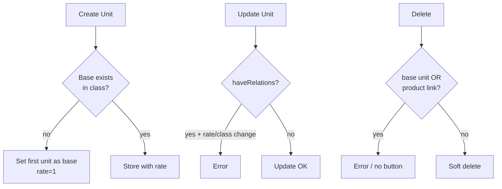

# Unit — Requirement Documentation

> **DRAFT** — Dokumen ini adalah draft awal hasil analisis codebase otomatis per 2026-06-19. Perlu direview PM/QA sebelum final.

## 0. Metadata & Changelog

| Version | Date | Author | Changes |
|---------|------|--------|---------|
| 1.0 | 2026-06-19 | QA - Yemima | Initial draft (AS-IS) |

## 1. Ringkasan Eksekutif

Master satuan `scm_units` dengan class (`unit_class_id`), base unit otomatis, conversion rate, dan proteksi relasi ke produk serta dokumen transaksi.

## 2. How It Works

## 3. Acceptance Criteria (AS-IS)

| ID | Kriteria | Validasi | Fitur |
|----|----------|----------|-------|
| A-01 | Datalist + unit class name | index | List |
| A-02 | Hide delete for base unit | action column | UI rule |
| A-03 | CRUD dengan validasi | store/update/destroy | Form |
| A-04 | Auto base unit per class | store | Side effect |
| A-05 | Select2 units | select2, select2 in-class | Dropdown |
| A-06 | Calculate conversion API | PUT calculate-conversion | Helper |
| A-07 | Audit per unit | GET unit/{id}/audit | Audit |

## 4. Validasi & Rules

| ID | Rule | Trigger | Pesan error |
|----|------|---------|-------------|
| V-01 | `code` required, max 50, unique | store/update | Laravel validation |
| V-02 | `name` required, max 50 | store/update | Laravel validation |
| V-03 | `description` max 150 | store/update | Laravel validation |
| V-04 | `unit_class_id` required numeric | store/update | Laravel validation |
| V-05 | `conversion_rate` nullable numeric lte:1 | store/update | Laravel validation |
| V-06 | Rate cannot be 0 | store/update | `Conversion rate must be greater than 0.` |
| V-07 | No rate/class change if relations | update | `ERR_HAVE_RELATIONS_MSG` |
| V-08 | No delete if product/alt unit | destroy | `Data already have relations` |

## 5. Relasi Menu

| Menu | Relasi |
|------|--------|
| Product | `stock_unit_id` |
| Product Alternative Unit | `unit_id` |
| PO, PR, mutations, shipping | via `haveRelations()` |

## 6. Permission & Dependencies

- Policy: `UnitPolicy`
- Menu id **123**
- Model: `UnitClass` (master class — menu terpisah jika ada)

## 7. QA Test Notes

- [ ] Create unit class baru → base auto
- [ ] Edit rate setelah dipakai PO → ditolak
- [ ] Default primary hanya satu per scope
- [ ] select2 limit 15 + cache 120s

## 8. Known Gaps

- `description` required rule di update tapi tidak di store (`nullable` implisit di store).

## Related Documents

| Doc | Path |
|-----|------|
| Knowledge Base | [knowledge-base.md](./knowledge-base.md) |
| Technical | [technical.md](./technical.md) |
