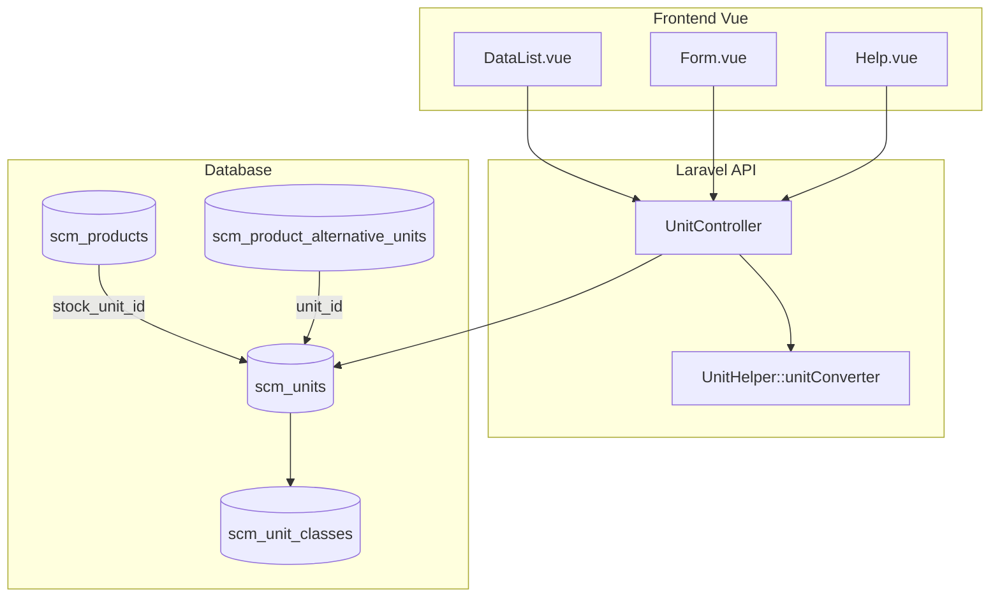

# Unit — Technical Documentation

**UI route:** `/supplychain/unit`  
**API base:** `{VITE_API_URL}supplychain/unit`  
**Table:** `scm_units` (model `Unit`)

---

## 1. Architecture Overview



---

## 2. Frontend File Map

**Root:** `olshoperp-frontend/src/pages/SCM/master/Unit/`

| File | Role | Key API |
|------|------|---------|
| `DataList.vue` | Datalist grouped by class, bulk delete, export, filter_column | `GET supplychain/unit` |
| `Form.vue` | Create/edit, toggles auto-save, yellow notice | `POST/PUT supplychain/unit/{id}` |
| `Help.vue` | Conversion helper slideover | `PUT supplychain/unit/calculate-conversion` |

### Router

| Route | Component |
|-------|-----------|
| `supplychain/unit` | `DataList.vue` |
| `supplychain/unit/create` | `Form.vue` |
| `supplychain/unit/edit/:id` | `Form.vue` |

### FE Behaviour Notes

| Feature | Implementation |
|---------|----------------|
| Yellow notice | `Form.vue` — create mode only, `bg-[#FCE9D4]` |
| Base unit lock | `is_base_unit === 1` → `can_update = false`, code disabled |
| Delete hide | Datalist action hidden when `is_base_unit === 1` |
| Auto-save toggles | Edit mode: `status`, `is_all_company`, `is_default_primary_unit` |
| Conversion rate step | `step="0.0000000001"` (1e-10) |
| Group by | DataList row group = `unit_class.name` |

---

## 3. Backend File Map

| File | Role |
|------|------|
| `Modules/SupplyChain/Http/Controllers/UnitController.php` | CRUD, select2, audit, calculate-conversion |
| `Modules/SupplyChain/Entities/Unit.php` | Model `scm_units`, `haveRelations()`, scopes |
| `Modules/SupplyChain/Entities/UnitClass.php` | Model `scm_unit_classes` |
| `Modules/SupplyChain/Policies/UnitPolicy.php` | Authorization |
| `Modules/SupplyChain/Helpers/UnitHelper.php` | `unitConverter()` |
| `database/sql_seeder/scm/unit/import.sql` | Default unit seed data |
| `database/seeders/FixUnitSeeder.php` | Optional manual seeder — Length base → Cm, delete Inch/Foot/Yard |

---

## 4. API Routes

Prefix: `supplychain/unit` (see `Modules/SupplyChain/Routes/api.php`)

| Method | Path | Controller | Notes |
|--------|------|------------|-------|
| GET | `/` | `index` | DataTablesV3 datalist |
| POST | `/` | `store` | Auto base unit hook |
| GET | `/{id}` | `show` | `withoutCompanyScope` |
| PUT/PATCH | `/{id}` | `update` | Rate/class lock via `haveRelations()` |
| DELETE | `/{id}` | `destroy` | Product + alt unit check only |
| GET | `/select2` | `select2` | Active units (`status=1`) |
| GET | `/in-class/{unit}/select2` | `select2InClass` | Same class for helper |
| GET | `/select2-mass` | `select2Mass` | Mass units only |
| GET | `/select2-class` | `select2Class` | Unit classes |
| PUT | `/calculate-conversion` | `calculateConversion` | Helper tool |
| GET | `/default-primary-unit` | `defaultPrimaryUnit` | Default for new product |
| GET | `/{id}/audit` | `audit` | Audit trail |

---

## 5. Database

### 5.1 `scm_units`

| Column | Type | Notes |
|--------|------|-------|
| `id` | bigint | PK |
| `code` | varchar(50) | Unique per company |
| `name` | varchar(50) | |
| `description` | varchar(150) | Nullable |
| `unit_class_id` | FK | → `scm_unit_classes.id` |
| `is_base_unit` | tinyint | 1 = base in class |
| `conversion_rate` | decimal | Nullable; base = 1 |
| `is_default_primary_unit` | tinyint | Max 1 per scope |
| `status` | tinyint | 1 = active (select2) |
| `is_all_company` | tinyint | Public visibility |
| `company_id` | FK | Company scope |
| `created_by`, `updated_by`, `deleted_by` | FK | Audit |
| `deleted_at` | timestamp | Soft delete |

### 5.2 `scm_unit_classes`

15 default classes from seeder (Pieces, Mass, Length, Area, Volume, Time, Speed, Temperature, Pressure, dll.)

### 5.3 Default Seed (`import.sql`)

Key rows (see requirement §3 for full table):

| Class id | Base code | Notable rates |
|----------|-----------|---------------|
| 8 (Pieces) | PCS | BX=0.1, EA/UNT/KIT/SET=1 |
| 7 (Mass) | Gr | Kg=0.001, T=0.000001, Ons=0.03527396 |
| 6 (Length) | MM | Cm=0.1, M=0.001; Inch/Foot/Yard present |

### 5.4 `FixUnitSeeder` (optional)

Run manually: `php artisan db:seed --class FixUnitSeeder`

- Deletes Inch (9), Foot (10), Yard (11)
- Changes Length base MM → **Cm (id 8)**, recalculates all `*_base_unit_id` columns
- Adds Minute unit; changes Time base to Minute
- Recalculates all `conversion_rate` in class relative to new base

> Diverges from PM requirement (MM base). Document environment-specific state.

---

## 6. Business Logic

### 6.1 Auto Base Unit (`store`)

```php
// UnitController@store — after create
if (! Unit::where('unit_class_id', $unitClassId)->where('is_base_unit', 1)->exists()) {
    $lowestIdUnit = Unit::where('unit_class_id', $unitClassId)->orderBy('id')->first();
    $lowestIdUnit->update(['is_base_unit' => 1, 'conversion_rate' => 1]);
}
```

Picks **lowest id** in class, not necessarily the newly created row.

### 6.2 `haveRelations()` — Update Lock

Checks usage in:

- `Product.stock_unit_id`
- `ProductAlternativeUnit.unit_id`
- Purchase Order detail qty units
- Sales Order detail qty units
- Stock mutations (inbound, outbound, transfer, opname, addition, deduction)
- Work order details
- Shipping / DnW dimension units

Used in **`update` only** — **not** in `destroy`.

### 6.3 `destroy` — Delete Guard

```php
// Blocks if:
Product::where('stock_unit_id', $id)->exists()
|| ProductAlternativeUnit::where('unit_id', $id)->exists()
```

No check for: `is_base_unit`, BoM direct usage, transaction history via `haveRelations()`.

### 6.4 Conversion Formula (`UnitHelper::unitConverter`)

```php
$destValue = ($origValue / $origUnit->conversion_rate) * $destUnit->conversion_rate;
```

Same `unit_class_id` required; else throws `"Invalid Input"`.

Endpoint: `PUT calculate-conversion` with `origValue`, `origUnit`, `destUnit`.

### 6.5 Transaction → Base Unit

`MainModelObserver` → `bulkCalculateToBaseUnit()` on save detail lines uses product unit + conversion rate to populate `*_in_base_unit` columns.

---

## 7. Validation Rules

### Store / Update (UnitController)

| Field | Rules |
|-------|-------|
| `code` | required, string, max:50, unique (per company) |
| `name` | required, string, max:50 |
| `description` | nullable, string, max:150 |
| `unit_class_id` | required, exists |
| `conversion_rate` | nullable, numeric, lte:1 |

Custom: rate cannot be `0` (manual check).

Update: if `haveRelations()` and rate/class changed → `ERR_HAVE_RELATIONS_MSG`.

---

## 8. Audit Log

`GET unit/{id}/audit` — standard audit trait.

| FE Column | Source |
|-----------|--------|
| Source | `formatSource()` → **`Unit`** (class basename) |
| Actions | create, update, delete, toggle fields |

---

## 9. Policy & Authorization

`UnitPolicy` — standard Gate module permissions (`viewAny`, `create`, `update`, `delete`).

Company scope via `CompanyScope`; show uses `withoutCompanyScope` for cross-company public units (`is_all_company=1`).

---

## 10. Integration Points

| Consumer | Usage |
|----------|-------|
| System Product | `stock_unit_id`, alternate units |
| Bill of Material | `quantity_unit_id` on detail (via product) |
| PO / PR / SO | Order qty unit columns |
| Inbound / Outbound / Transfer | Qty unit + base unit calc |
| Assembly (Work Order) | FG + component units via product |
| Stock Opname / Addition / Deduction | Qty unit |
| Shipping Service / Product DnW | Dimension/weight units |

---

## 11. Known Implementation Gaps

| # | Gap | Location |
|---|-----|----------|
| G-01 | Code max 50 vs PM 30 | Validation rules |
| G-02 | Active OFF — no transaction scan | `update` status toggle |
| G-03 | `is_all_company` revert not validated BE | `update` |
| G-04 | `haveRelations()` not in destroy | `UnitController@destroy` |
| G-05 | Base unit delete not blocked API | `destroy` |
| G-06 | FixUnitSeeder Length base = Cm not MM | `FixUnitSeeder.php` |

See [requirement.md §13](./requirement.md) for full gap table.

---

## Related Documents

| Doc | Path |
|-----|------|
| Requirement | [requirement.md](./requirement.md) |
| Knowledge Base | [knowledge-base.md](./knowledge-base.md) |
| System Product | [../system-product/technical.md](../system-product/technical.md) |
| Bill of Material | [../bill-of-material/technical.md](../bill-of-material/technical.md) |
| Assembly | [../supplychain-assembly/technical.md](../supplychain-assembly/technical.md) |
| Transfer Internal | [../supplychain-mutation-transfer-internal/technical.md](../supplychain-mutation-transfer-internal/technical.md) |
| Outbound External | [../supplychain-mutation-outbound/technical.md](../supplychain-mutation-outbound/technical.md) |
| Other Inbound | [../supplychain-other-inbound/technical.md](../supplychain-other-inbound/technical.md) |
| Purchase Inbound | [../supplychain-mutation-inbound/technical.md](../supplychain-mutation-inbound/technical.md) |
