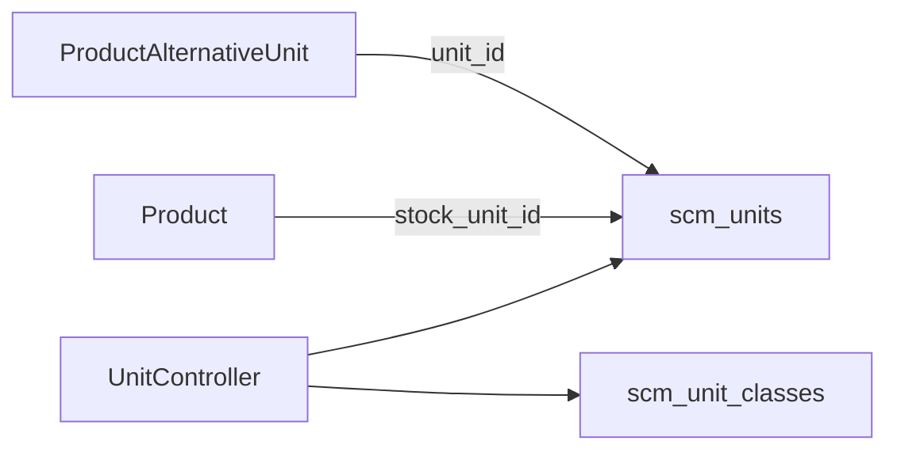

# Unit — Technical Documentation

> **DRAFT** — Dokumen ini adalah draft awal hasil analisis codebase otomatis per 2026-06-19. Perlu direview PM/QA sebelum final.

**UI route:** `/supplychain/unit`  
**API base:** `{VITE_API_URL}supplychain/unit`

---

## 1. Frontend File Map

**Root:** `olshoperp-frontend/src/pages/SCM/master/Unit/`

| File | Role | Key API |
|------|------|---------|
| `DataList.vue` | Datalist | `GET supplychain/unit` |
| `Form.vue` | Create/edit | `POST/PUT supplychain/unit/{id}` |
| `Help.vue` | Help panel | — |

### Router

| Route | Component |
|-------|-----------|
| `supplychain/unit` | `DataList.vue` |
| `supplychain/unit/create` | `Form.vue` |
| `supplychain/unit/edit/:id` | `Form.vue` |

---

## 2. Backend File Map

| File | Role |
|------|------|
| `Modules/SupplyChain/Http/Controllers/UnitController.php` | CRUD, select2, audit, conversion |
| `Modules/SupplyChain/Entities/Unit.php` | `scm_units` |
| `Modules/SupplyChain/Entities/UnitClass.php` | Class FK |
| `Modules/SupplyChain/Policies/UnitPolicy.php` | Policy |

---

## 3. API Routes

| Method | Path | Notes |
|--------|------|-------|
| GET | `unit` | index datalist |
| POST | `unit` | store |
| GET | `unit/{id}` | show (`withoutCompanyScope`) |
| PUT/PATCH | `unit/{id}` | update |
| DELETE | `unit/{id}` | destroy |
| GET | `unit/select2` | Active units |
| GET | `unit/in-class/{unit}/select2` | Same class |
| GET | `unit/select2-mass` | Mass select |
| GET | `unit/select2-class` | Unit classes |
| PUT | `unit/calculate-conversion` | Conversion helper |
| GET | `unit/default-primary-unit` | Default unit |
| GET | `unit/{id}/audit` | Audit |

---

## 4. Database — `scm_units`

| Column | Keterangan |
|--------|------------|
| `code`, `name`, `description` | Identitas |
| `unit_class_id` | FK `scm_unit_classes` |
| `is_base_unit`, `conversion_rate` | Konversi |
| `is_default_primary_unit` | Default produk |
| `status`, `is_all_company` | Flags |

---

## 5. Architecture

