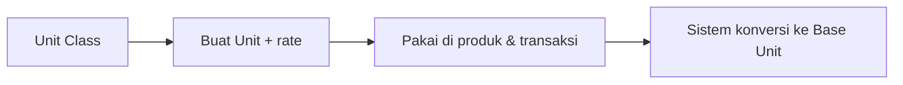

# Panduan Pengguna — Unit

**Siapa yang baca:** master data / warehouse / purchasing  
**Menu:** Supply Chain → Master → Unit  
**Route:** `/supplychain/unit`

---

## 1. Apa Itu & Kenapa Penting

**Unit** adalah daftar satuan (PCS, Box, KG, Meter, …). Setiap satuan masuk kelompok (**Unit Class**) dan punya **Base Unit** sebagai acuan konversi.

Tanpa unit yang benar, PO, inbound, BoM, dan Assembly tidak bisa menghitung qty dengan konsisten.

---

## 2. Overview Flow & Proses Bisnis

**Versi teks:**

1. Pastikan Unit Class sudah ada.  
2. Buat unit (kode, nama, class, conversion rate).  
3. Unit pertama di class otomatis jadi Base Unit.  
4. Transaksi memakai unit ini; sistem konversi ke base.

### Status

| Pengaturan | Arti |
|------------|------|
| Active ON | Muncul di dropdown transaksi baru |
| Active OFF | Tidak bisa dipilih di transaksi baru (histori tetap) |
| Base Unit | Acuan konversi dalam class; tidak bisa dihapus dari UI |

---

## 3. Sebelum Mulai

- Pahami class produk: Pieces (qty), Mass (berat), Length (dimensi), dll.  
- Rencanakan Base Unit (contoh Mass = Gram).  
- **Contoh rate:** 1 KG = 1000 Gr → conversion rate KG = 0.001 (selalu ≤ 1 ke base).

🎬 [Interactive demo akan ditambahkan di sini]

---

## 4. Setelah Selesai

- Set **Default Primary** jika unit ini yang sering dipakai saat buat produk baru.  
- Uji di System Product / PO.  
- Pakai **Conversion Helper** di daftar untuk cek hitungan (contoh: 2 Meter → Centimeter = 200, tergantung base Length).

---

## 5. Yang Perlu Diperhatikan

- Kalau kamu buat unit pertama di class, sistem otomatis jadi Base Unit — pilih class dengan hati-hati.  
- Kalau unit sudah dipakai transaksi, class & conversion rate terkunci.  
- Kalau unit dipakai di System Product, tidak bisa dihapus.  
- Kalau rate dikosongkan di master, rate bisa diisi per produk.  
- Konversi helper hanya dalam class yang sama (tidak bisa PCS → KG).

---

## 6. Langkah-Langkah

1. Buka **Unit** → **Create**.  
2. Isi Code, Name, pilih Unit Class; isi Conversion Rate bila fixed.  
3. **Save & Next**.  
4. Atur Active / Default Primary / Show for All Company di edit.  
5. Uji Conversion Helper bila perlu.

🎬 [Interactive demo akan ditambahkan di sini]

---

## 7. Tips & Hal yang Sering Bikin Bingung

- **Tidak bisa edit rate** → unit sudah dipakai; buat unit baru.  
- **Tidak muncul di dropdown** → Active OFF.  
- **Delete gagal / tombol hilang** → base unit, atau masih terpasang di produk.  
- **EA / UNT / KIT rate 1** → boleh; setara 1:1 dengan PCS.  
- **Konversi Length aneh** → base environment bisa MM atau Cm; tanya admin.

---

## 8. Referensi

| Sumber | Untuk apa |
|--------|-----------|
| [Knowledge Base](./knowledge-base.md) | Troubleshooting & Conversion Helper |
| [Requirement](./requirement.md) | Validasi |
| [Technical](./technical.md) | Developer |
| [System Product](../system-product/README.md) | Pemakaian unit di produk |
| [Assembly](../supplychain-assembly/README.md) | Konsumen unit |
