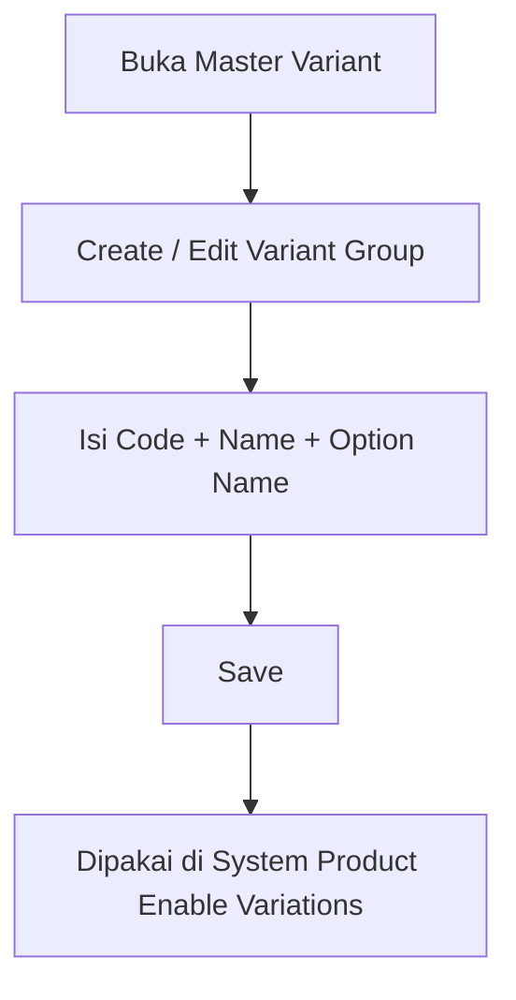

# Master Variant — Knowledge Base

**Path:** SCM → Master → **Variant**  
**Route:** `/supplychain/variant`  
**Nama di UI:** breadcrumb **Variant Group** · halaman **Master Variant Type**

---

## 1. Apa itu & kapan dipakai

**Master Variant** menyimpan **tipe / group variasi** (contoh: Color, Size) beserta **daftar opsi** (Red, Blue, S, M, …).

Dipakai saat membuat **System Product** dengan **Enable Variations** — user memilih sampai **3** Variant Group, lalu sistem generate SKU parent + child.

Tanpa master ini, produk tidak bisa punya kombinasi warna/ukuran yang terstandar.

---

## 2. Alur kerja standar

1. **Create** — Code, Variant Group Name, minimal 1 Option Name, Active ON bila mau dipakai.
2. Setelah save create **tanpa** Default: sistem **otomatis menambah opsi `random`**.  
   Jika create dengan **Set as Default System Product ON** dan hanya **1** opsi → `random` **tidak** ditambahkan.
3. **Edit** — ubah nama/opsi; opsi yang sudah dipakai di System Product **tidak boleh dihapus**.
4. Import Excel / Export All tersedia di list.

---

## 3. Field penting

| Field | Arti |
|-------|------|
| **Code** | Kode unik group (max 14) — dipakai juga di import System Product |
| **Variant Group Name** | Nama tampilan (max 14), mis. Color |
| **Option Name** | Daftar opsi (tag); tiap opsi max 14; min 1 |
| **Description** | Opsional (max 150) |
| **Active** | Non-aktif tidak muncul di select2 product |
| **Show for all company** | Share ke company lain (hanya owner company) |
| **Set as Default System Product** *(TO-BE)* | Lihat §5 |

---

## 4. Opsi `random` (AS-IS + TO-BE Default)

- Saat **create tanpa Default**, opsi **`random`** selalu ditambahkan sistem.
- **TO-BE:** create + **Default ON** + tepat 1 opsi → **tidak** menambah `random`.
- Di form edit, tag **Random** AS-IS biasanya terkunci; TO-BE boleh dihapus jika tidak dipakai product.
- Opsi ini dipakai alur **Random SKU** — detail: [Random SKU KB](../random-sku/knowledge-base.md).

---

## 5. Set as Default System Product (TO-BE — belum live)

Toggle mirip **Item Category** / **Unit**: **Set as Default System Product**.

| Aturan | Detail |
|--------|--------|
| Kapan boleh ON / save | Variant Group punya **tepat 1 opsi** (hitung **termasuk** `random` jika ada) |
| Jika opsi > 1 | Save ditolak + notifikasi jelas (create & edit) |
| Create + Default ON + 1 opsi | Berhasil; **tanpa** inject `random` |
| Create tanpa Default | Inject `random` seperti sekarang |
| Berapa Default ON | **Maksimal 1** di list (per company pemilik) |
| Ganti Default | ON di group lain → yang lama **otomatis OFF** |
| Semua OFF | **Boleh** — create/import System Product masih bisa tipe **Single** |

**Contoh:**

| Opsi di group | Default ON? |
|---------------|-------------|
| `Standard` saja (create + Default ON) | Ya — tanpa `random` |
| `random` saja | Ya |
| `random` + `Red` | Tidak (count = 2) |
| `Red` + `Blue` | Tidak |

**Efek ke System Product (TO-BE):** create/import kandidat Single → parent `SKU-(PARENT)` + child = kode user. Expand group: soft delete vs leftover — detail [System Product KB](../system-product/knowledge-base.md).

---

## 6. Troubleshooting

| Gejala | Solusi |
|--------|--------|
| Tidak bisa hapus opsi | Opsi sudah dipakai di System Product |
| Opsi duplikat ditolak | Nama opsi case-insensitive unik dalam satu group |
| Mau set Default tapi ditolak (nanti) | Pastikan hanya **1** opsi total; hapus `random` jika perlu |
| Select2 di product kosong | Cek **Active** ON + company scope |

---

## 7. FAQ

**Q: Bedanya Variant Group vs opsi?**  
A: Group = tipe (Color). Opsi = nilai (Red, Blue).

**Q: Kenapa ada `random` otomatis?**  
A: Untuk fitur Random SKU / fulfillment acak. **TO-BE:** jika create dengan Default ON + 1 opsi, `random` **tidak** ditambahkan. Default OFF → tetap inject seperti sekarang.

**Q: Harus ada Default?**  
A: Tidak. Semua Default OFF = valid.

---

## 8. Related

- [requirement.md](./requirement.md) · [technical.md](./technical.md)
- [System Product](../system-product/knowledge-base.md) · [Random SKU](../random-sku/knowledge-base.md)
