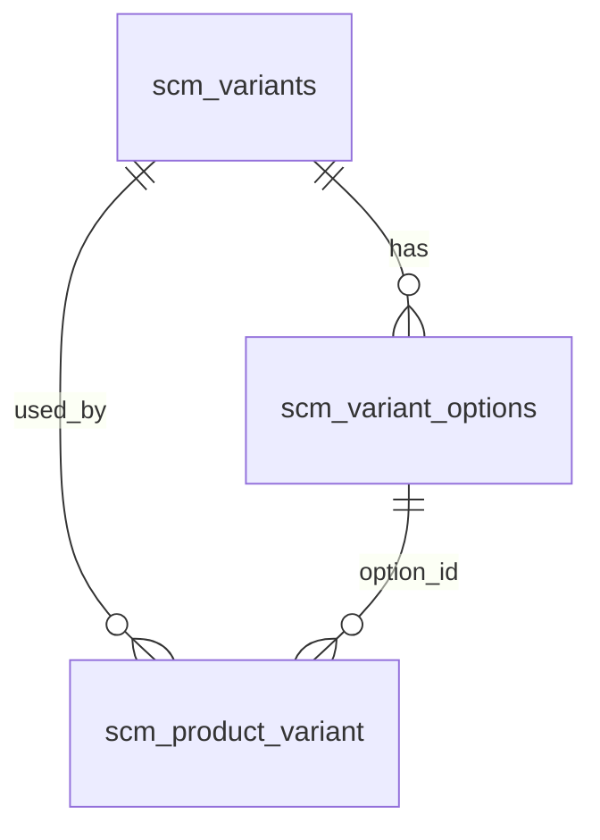

# Master Variant — Requirement Documentation

**Modul:** Supply Chain Management (SCM) / Master  
**UI route:** `/supplychain/variant`  
**UI labels:** breadcrumb **Variant Group** · page **Master Variant Type**  
**API base:** `supplychain/variant`  
**Audience:** PM, QA, Ops, Developer  
**Status:** AS-IS verified codebase 2026-08-12 · TO-BE Default `GAP-VAR-01`

**Tables:** `scm_variants` · `scm_variant_options`

---

## 0. Metadata & Changelog

| Version | Date | Author | Changes |
|---------|------|--------|---------|
| 1.0 | 2026-08-12 | QA - Yemima | AS-IS codebase + TO-BE **Set as Default System Product** (§6 / GAP-VAR-01); konsumen SP pending |
| 1.1 | 2026-08-12 | QA - Yemima | Lock konsumen SP cross-ref (`-(PARENT)`, soft-delete vs leftover); GAP-VAR-02 closed → SP GAP-SP-17/18 |
| 1.2 | 2026-08-12 | QA - Yemima | Create+Default ON+1 opsi → **skip** inject `random`; save reject Default jika opsi > 1 (create & edit) |

---

## 1. Ringkasan Eksekutif

**Master Variant** mendefinisikan **Variant Group** (tipe variasi) dan **options** yang dipilih System Product saat Enable Variations (max 3 group per product di FE).

| Kebutuhan | Jawaban menu |
|-----------|----------------|
| Standarisasi opsi warna/ukuran | Master group + options reusable |
| Random SKU | Opsi sistem `random` di-inject **create tanpa Default**; **skip** inject jika create + **Default ON** + tepat 1 opsi (`GAP-VAR-01`) |
| Default tipe produk baru (TO-BE) | Toggle **Set as Default System Product** — prasyarat System Product GAP-SP-17/18 |

---

## 2. Entity model

| Entity | Arti bisnis |
|--------|-------------|
| `scm_variants` | Variant Group (Code, Name, Active, is_all_company, owned_by) |
| `scm_variant_options` | Option Name + `is_random` |
| `scm_product_variant` | Link product ↔ variant/option (bukan scope menu ini) |

---

## 3. UI — List & Form (AS-IS)

### 3.1 Datalist

| Capability | AS-IS |
|------------|-------|
| Columns | Code, Name, Options (badge max 5 + `...`), Description, Active, Data Owner, audit |
| Actions | Create, Edit, Delete, Import, Export All, Import log/history |
| Filter / search | Standard datalist |

### 3.2 Form fields

| Field | Required | Validation | Notes |
|-------|----------|------------|-------|
| **Code** | Yes | max 14; unique per company scope (`uniqueCreate` / `uniqueUpdate`) | |
| **Variant Group Name** (`name`) | Yes | max 14 | |
| **Option Name** (`option[]`) | Yes | array min 1; each max 14; no duplicate (case-insensitive) | Multiselect tags + create-option |
| **Description** | No | max 150 | |
| **Active** (`status`) | — | boolean | Default ON di FE create |
| **Show for all company** (`is_all_company`) | — | boolean | Owner company only (FE) |

**Company / ownership (AS-IS):** ikut pola master existing — `owned_by` dari company context user login / `company_id` request; tidak ada rule khusus baru untuk Default.

### 3.3 Option UX (AS-IS)

| Behavior | Detail |
|----------|--------|
| Create save | BE **auto-prepend** `random` jika belum ada — **TO-BE exception:** create + Default ON + 1 opsi → **skip** inject |
| Edit tag **Random** | FE **blok** remove & rename (`value === 'Random'`) |
| Hapus opsi non-random | Ditolak jika sudah dipakai System Product |
| Inline rename option | `PUT variant/{id}/inline-update-option` |
| Soft-delete opsi | Sync update: opsi non-random yang tidak ada di payload di-delete |

---

## 4. Import / Export (AS-IS)

| Fitur | Behavior |
|-------|----------|
| Download template | `GET …/variant/download-template` |
| Import Excel | `POST …/variant/import-excel` · history + log · partial per row |
| Export All | Async job `VariantExportExcelJob` + progress/file endpoints |

(Detail kolom template: lihat technical / `VariantTemplateExport`.)

---

## 5. Delete & Active (AS-IS)

| Action | Rule |
|--------|------|
| Delete header | Soft delete (`deleted_by` + destroy) — policy `delete` |
| Inactive | Tidak muncul di `select2` product (`activeFilter`) |

---

## 6. TO-BE — Set as Default System Product (`GAP-VAR-01`)

### 6.1 Naming (locked)

| Layer | Value |
|-------|--------|
| UI label | **Set as Default System Product** |
| List column | **Default** (Yes/No) |
| Field | `is_default` (boolean) |
| Pattern ref | Item Category / Unit FormSwitch |

### 6.2 Eligibility — option count & create inject

Hitung **semua** opsi aktif (payload / DB), **termasuk** `random` jika ada.

| Count options | Set / save Default ON |
|---------------|------------------------|
| **= 1** | Allowed |
| **> 1** | **Reject on save** — notifikasi jelas (create & edit); Default tidak tersimpan ON |
| **0** | Impossible (min 1 option validation) |

**Inject `random` on create (TO-BE):**

| Create condition | Inject `random`? |
|------------------|------------------|
| Default **ON** + exactly **1** option | **Tidak** — save OK; list opsi = opsi user saja |
| Default **OFF** (atau tidak di-set) | **Ya** — perilaku AS-IS |

Edit: unlock remove `random` tetap berlaku; update jangan re-inject jika user menghapus.

### 6.3 Mutual exclusivity & all-OFF

| Rule | Behavior |
|------|----------|
| Max one Default ON | Scope = company pemilik (`owned_by` / token company) — mirror Item Category unset others |
| Turn ON B while A ON | A → OFF otomatis; B → ON |
| All Default OFF | **Allowed** (beda Item Category yang wajib ≥1 default) |
| Turn OFF last Default | Allowed — no “must keep one default” error |

### 6.4 Auto-clear Default when options grow

Jika `is_default = 1` dan setelah save/update **option count > 1**:

1. Set `is_default = 0` pada row tersebut  
2. Notify user: Default removed karena opsi > 1  

### 6.5 Prerequisite code changes (blocking Default)

| Gap | AS-IS | TO-BE needed |
|-----|-------|----------------|
| Create inject `random` | Selalu prepend jika belum ada | **Skip** inject jika `is_default` + option count === 1; selain itu inject AS-IS |
| Save Default ON + count > 1 | N/A | **Reject** create & edit dengan notifikasi jelas |
| FE Random lock | Tag Random tidak bisa remove | **Izinkan remove** Random (kecuali dipakai product) |
| BE delete sync | `where('is_random', 0)` — random tidak pernah terhapus | Izinkan delete `is_random=1` jika tidak di payload & unused |
| BE re-inject on update | Inject jika DB belum punya random | Jangan re-inject jika user sengaja menghapus |

### 6.6 Konsumen System Product

Detail kanonik di [system-product requirement §6.3.1–§6.3.2](../system-product/requirement.md#631-to-be--default-variant-on-create--import-gap-sp-17):

| Topic | Rule (locked) |
|-------|----------------|
| Create / import Single-eligible + Default ON | Parent `SKU-(PARENT)`; child = kode user; opsi = nama opsi master Default |
| Enable Variations OFF | Boleh → Single + **confirm popup** |
| Expand groups | Soft delete child hanya jika **zero relation**; ada relasi → leftover + generate baru + confirm (**no auto-rename**) |
| Naming expand | Omit segment opsi Default dari SKU baru |
| Datatable | Kolom Default group **hide** (fase 1 UI) |

Brief: `~/Downloads/improvement-default-variant-master-variant-system-product.md`

### 6.7 Acceptance criteria (Master Variant only)

- [ ] Form Switch **Set as Default System Product** + list column **Default**
- [ ] Create Default ON + 1 opsi → save OK **tanpa** opsi `random`
- [ ] Create Default OFF → `random` tetap ter-insert (AS-IS)
- [ ] Create/Edit Default ON + opsi > 1 → save ditolak + notifikasi jelas
- [ ] Hanya 1 Default ON per company; ON baru men-OFF yang lama
- [ ] Semua Default OFF valid
- [ ] Edit: hapus `random` dimungkinkan bila unused; grow options dengan Default ON → reject/notify
- [ ] Tidak mengubah perilaku Select2 / Active / is_all_company existing selain field baru

### 6.8 Contoh kasus

| # | Situasi | Hasil |
|---|---------|--------|
| 1 | Create: opsi `Standard`, Default ON | OK — options = [`Standard`] saja |
| 2 | Create: opsi `Red`, Default OFF | OK — [`random`, `Red`] |
| 3 | Create/Edit: opsi `Red`+`Blue`, Default ON | **Reject** + notif |
| 4 | Edit: `random`+`Red` → set Default ON | **Reject** |
| 5 | Default ON di A; ON di B (1 opsi) | A OFF, B ON |
| 6 | Semua Default OFF | Create product masih bisa Single (SP side) |

---

## 7. Related menus

| Menu | Relasi |
|------|--------|
| [System Product](../system-product/requirement.md) | Konsumen Default (TO-BE); Enable Variations max 3 |
| [Random SKU](../random-sku/requirement.md) | Ketergantungan opsi `random` |
| Item Category / Unit | Pola UX `is_default` |

---

## 8. Gaps

| ID | Summary | Status |
|----|---------|--------|
| **GAP-VAR-01** | Set as Default System Product + **skip inject `random` on create+Default ON+1 option** + reject Default if options > 1 + unlock remove `random` + mutual exclusive + all-OFF OK | Open (TO-BE) |
| **GAP-SP-17 / 18** | Konsumen create/import/expand | Open — [system-product](../system-product/requirement.md) |

---

## 9. Open questions (resolved)

| # | Topic | Decision |
|---|--------|----------|
| 1 | Count `random`? | **Yes — included** in eligibility count |
| 1b | Create + Default ON + 1 opsi | **Skip** inject `random` |
| 1c | Create + Default OFF | Inject `random` AS-IS |
| 2 | Parent format | `SKU-(PARENT)` |
| 3 | Variations OFF | Allowed → Single + confirm |
| 4 | Expand | Soft delete vs leftover; **no auto-rename** |
| 5 | Company scope | Existing owned_by / login company |
| 6 | Max 3 | Default **counts** toward 3 |
| 7 | Docs | Folder `supplychain-variant` + SP consumers |
