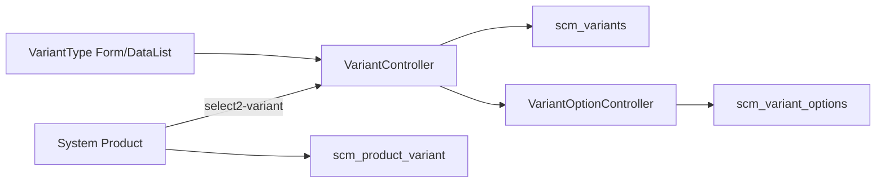

# Master Variant — Technical Documentation

**Behavior:** [requirement.md](./requirement.md) v1.0  
**UI:** `/supplychain/variant`  
**API:** `supplychain/variant`  
**Stack:** Laravel 13 · Vue 3

---

## 0. Changelog

| Version | Date | Changes |
|---------|------|---------|
| 1.0 | 2026-08-12 | AS-IS file map + TO-BE `is_default` / GAP-VAR-01 notes |
| 1.1 | 2026-08-12 | Cross-ref SP consumers GAP-SP-17/18; parent suffix `-(PARENT)` |
| 1.2 | 2026-08-12 | Create+Default ON → skip inject `random`; reject Default save if options > 1 |

---

## 1. Architecture



---

## 2. File map

### Backend

| Path | Role |
|------|------|
| `Modules/SupplyChain/Http/Controllers/VariantController.php` | CRUD, import/export, select2, inline option, audit |
| `Modules/SupplyChain/Http/Controllers/VariantOptionController.php` | Persist options; auto-inject `random`; usage guards |
| `Modules/SupplyChain/Entities/Variant.php` | `scm_variants` |
| `Modules/SupplyChain/Entities/VariantOption.php` | `scm_variant_options` |
| `Modules/SupplyChain/Policies/VariantPolicy.php` | Authz |
| `Modules/SupplyChain/Import/VariantImport.php` | Import rows |
| `Modules/SupplyChain/Exports/VariantExport.php` · `VariantTemplateExport.php` | Export / template |
| `Modules/SupplyChain/Jobs/VariantExportExcelJob.php` | Async export |
| `Modules/SupplyChain/Routes/api.php` | `variant.*` routes (~772–786) |

### Frontend

| Path | Role |
|------|------|
| `olshoperp-frontend/src/pages/SCM/master/VariantType/DataList.vue` | List |
| `…/VariantType/Form.vue` | Create/Edit · Random tag lock |
| `…/VariantType/ImportLog.vue` | Import log UI |
| Router | `supplychain_variant_index` · `create_variant_form` · `edit_variant_form` |

---

## 3. Schema (AS-IS)

### `scm_variants`

| Column | Notes |
|--------|-------|
| `code`, `name`, `description` | |
| `status`, `is_all_company`, `owned_by` | |
| audit / softDeletes | via `MainModel` |

**TO-BE:** `is_default` tinyint/boolean, default `0`; unique partial index optional (enforce in app like Item Category).

### `scm_variant_options`

| Column | Notes |
|--------|-------|
| `variant_id`, `option` | |
| `is_random` | `1` jika option name `random` (case) |
| `owned_by`, softDeletes | |

---

## 4. API (AS-IS)

| Method | Path | Notes |
|--------|------|-------|
| GET | `/supplychain/variant` | Datalist + `option_formatted` |
| POST | `/supplychain/variant` | Create + options |
| GET | `/supplychain/variant/{id}` | Show + options |
| PUT | `/supplychain/variant/{id}` | Update + options sync |
| DELETE | `/supplychain/variant/{id}` | Soft delete |
| PUT | `/supplychain/variant/{id}/inline-update-option` | Rename option |
| GET | `/supplychain/variant/{id}/select2-variant-options` | Options select2 |
| GET/POST | import/export/progress/template/history | See controller |

Product select2: `GET supplychain/product/select2-variant` (ProductController).

---

## 5. Invariants (AS-IS)

1. `option` array **min 1** on store/update.  
2. Duplicate option names (case-insensitive) rejected.  
3. On store path: if no DB option LIKE `%random%`, **prepend** `random` to payload — **TO-BE exception (`GAP-VAR-01`):** create with `is_default` + exactly 1 option → **do not** prepend.  
4. Sync delete only `is_random = 0` not in payload → **random never removed by sync** (TO-BE: allow delete unused random).  
5. Cannot remove option used on `scm_product_variant`.  
6. Code unique via `uniqueCreate` / `uniqueUpdate` (+ company_id when provided).  
7. **TO-BE:** `is_default=true` requires option count === 1 on save (create & edit); else reject with clear message.

---

## 6. TO-BE implementation notes (`GAP-VAR-01`)

Mirror **Item Category** `is_default` pattern:

```php
// conceptual — on store/update when is_default true
Variant::where('owned_by', getToken()->company_id)->update(['is_default' => 0]);
// then set current is_default = 1
```

**Differences vs Item Category:**

- Do **not** require ≥1 default remaining  
- Do **not** block delete solely because `is_default` (or: allow delete + clear; product decision — prefer allow delete if unused)  
- Validate `variantOptions()->count() === 1` before allowing ON  

**Must change with Default:**

| Area | Change |
|------|--------|
| `VariantOptionController@store` | If create/`is_default` + count options === 1 → **skip** prepend `random`; else AS-IS inject on create. Allow deleting `is_random=1` when absent from payload & unused; stop re-inject on update when user removed random. Reject save when `is_default` && count > 1 |
| `VariantController@store/update` | Validate `is_default` vs option count; mutual exclusive unset |
| `Form.vue` | Allow remove Random tag; FormSwitch `is_default`; surface validation message on options > 1 |
| `DataList.vue` | Column `Default` + `renderBoolean` / filter Yes/No |
| Migration | `is_default` on `scm_variants` |

**Notification copy (suggested):**

- Reject Default ON / save: *This Variant Group cannot be set as default because it has more than 1 option.*  
- Auto OFF after options grow (if applicable): *Default was turned off because this Variant Group now has more than 1 option.*

---

## 7. Failure modes

| Case | Result |
|------|--------|
| Duplicate option | 422 validation message |
| Remove used option | 422 cannot modify / can't be deleted |
| Default ON + count > 1 (TO-BE) | 422 or FE revert |
| Export timeout | Progress cleared after 30 min |

---

## 8. Related

- [System Product technical](../system-product/technical.md) — Enable Variations, ProductVariant  
- [Random SKU technical](../random-sku/technical.md)  
- Item Category controller — reference `is_default` unset siblings
