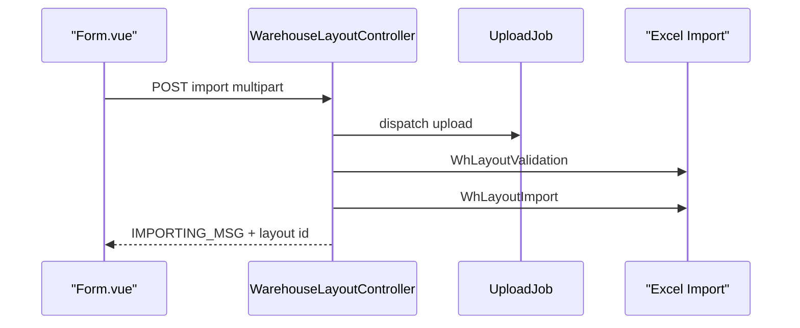

# Warehouse Layout — Technical Documentation

> **DRAFT** — Dokumen ini adalah draft awal hasil analisis codebase otomatis per 2026-06-19. Perlu direview PM/QA sebelum final.

**UI route:** `/supplychain/warehouse-layout`  
**API base:** `{VITE_API_URL}supplychain/warehouse-layout`

---

## 1. Frontend File Map

**Root:** `olshoperp-frontend/src/pages/SCM/master/WarehouseLayout/`

| File | Role | Key API |
|------|------|---------|
| `DataList.vue` | List + template download | `GET warehouse-layout` |
| `Form.vue` / `Form1.vue` | Import form | `POST warehouse-layout/import` |
| `TreeDetail.vue` | Detail per layout | `warehouse-layout/{id}/index`, `tree` |

### Router

| Route | Component |
|-------|-----------|
| `supplychain/warehouse-layout` | `DataList.vue` |
| `supplychain/warehouse-layout/create` | `Form.vue` |
| `supplychain/warehouse-layout/edit/:id` | `Form.vue` |

---

## 2. Backend

| File | Role |
|------|------|
| `WarehouseLayoutController.php` | index, import, update, destroy, tree |
| `Entities/WarehouseLayout.php` | `scm_warehouse_layouts` |
| `Entities/WarehouseLayoutDetail.php` | Details |
| `Import/WhLayoutImport.php` | Excel import |
| `Import/WhLayoutValidation.php` | Pre-import validation |
| `Policies/WarehouseLayoutPolicy.php` | Policy |
| `App\Jobs\UploadJob` / `DeleteFileJob` | File storage |

---

## 3. API Routes

| Method | Path | Notes |
|--------|------|-------|
| GET | `warehouse-layout` | index |
| GET | `warehouse-layout/{id}` | show |
| PUT/PATCH | `warehouse-layout/{id}` | update metadata only |
| DELETE | `warehouse-layout/{id}` | destroy |
| POST | `warehouse-layout/import` | create via import |
| GET | `warehouse-layout/{id}/index` | detail datalist |
| GET | `warehouse-layout/{id}/tree` | tree |
| GET | `warehouse-layout/{id}/audit/primevue` | audit |
| GET | `warehouse-layout/get-path` | FIFO path helper (dev) |

Note: `apiResource` — no `store` method on controller (create = import only).

---

## 4. Database

### `scm_warehouse_layouts`

| Column | Keterangan |
|--------|------------|
| `name`, `description` | Metadata |
| `file_name` | Stored upload path |

### `scm_warehouse_layout_details`

| Column | Keterangan |
|--------|------------|
| `warehouse_layout_id` | FK header |
| `warehouse_id` | FK `scm_warehouses` |

---

## 5. Architecture

