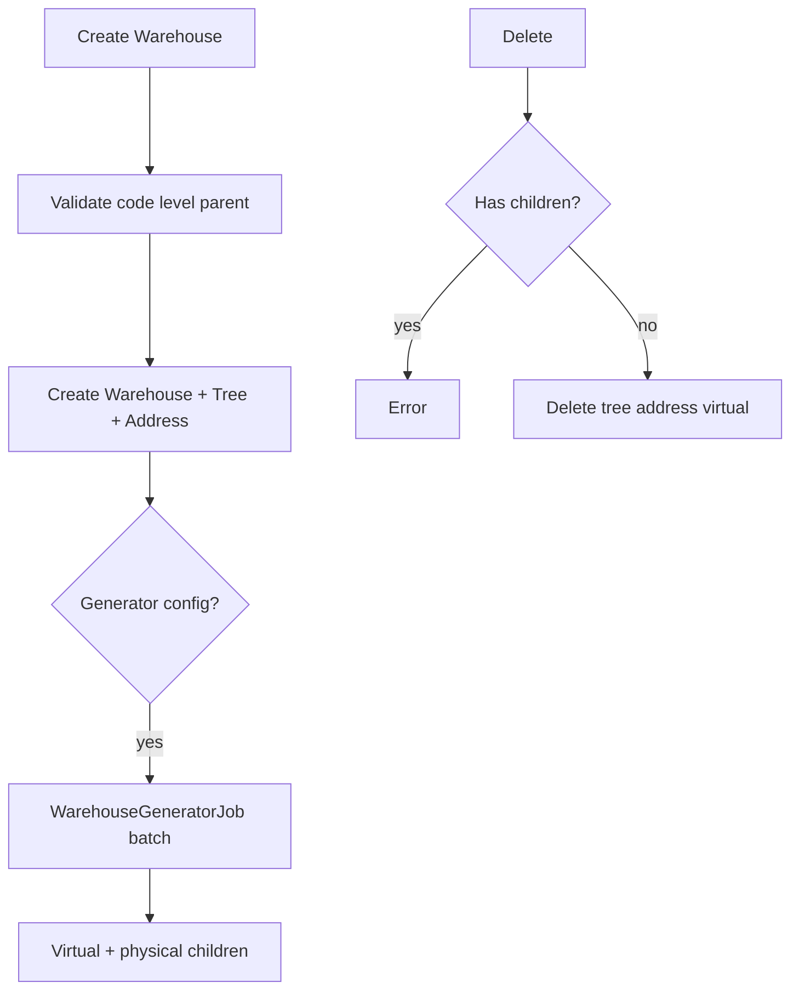
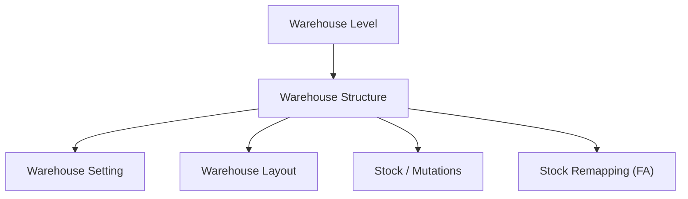

# Warehouse Structure — Requirement Documentation

> **DRAFT** — Dokumen ini adalah draft awal hasil analisis codebase otomatis per 2026-06-19. Perlu direview PM/QA sebelum final.

## 0. Metadata & Changelog

| Version | Date | Author | Changes |
|---------|------|--------|---------|
| 1.0 | 2026-06-19 | QA - Yemima | Initial draft (AS-IS) |

## 1. Ringkasan Eksekutif

Hierarki gudang fisik (`scm_warehouses`, `scm_warehouse_trees`, `scm_warehouse_addresses`) dengan generator async, virtual warehouses, validasi parent/level, dan integrasi stok/transaksi.

## 2. How It Works

## 3. Acceptance Criteria (AS-IS)

| ID | Kriteria | Validasi | Fitur |
|----|----------|----------|-------|
| A-01 | Datalist non-virtual, non-3pl process_group | index filter | List |
| A-02 | Create dengan tree + optional generator | store | Form |
| A-03 | Update dengan stock guard on parent | update | Form |
| A-04 | Delete leaf only | destroy | Delete |
| A-05 | Tree API | GET warehouse/tree | Tree view |
| A-06 | Select2 banyak variasi | select2*, select | Dropdown modul lain |
| A-07 | Generator checking on index | generator_checking_job | Background |
| A-08 | Audit | warehouse/{id}/audit | Audit |

## 4. Validasi & Rules (store — utama)

| ID | Rule | Trigger | Pesan error |
|----|------|---------|-------------|
| V-01 | `code` required, max 50, no spaces regex | store/update | `Warehouse code cannot contain spaces` |
| V-02 | `name` required, max 150 | store/update | Laravel |
| V-03 | `warehouse_space_type` required, active | store | `Warehouse Space Type not found` |
| V-04 | `manage_by` in internal/external | store | Rule::in |
| V-05 | `owner_company` required, active | store | `Company not found` |
| V-06 | Region cascade valid if filled | store | Province/City/... not found |
| V-07 | Generator prefix unique, alphabet | store | `Prefix must be unique/alphabet` |
| V-08 | Parent not drop-off, passes setting check | store | Various business errors |
| V-09 | Delete: no children | destroy | `Parent data can't be deleted while all child...` |

## 5. Relasi Menu

**Stock Remapping:** Warehouse Origin memakai exclusion rules yang **sama** dengan Stock Deduction & Outbound (exclude WIP Assembly, Outrack, virtual). Detail: [accounting-stock-remapping](../accounting-stock-remapping/requirement.md).

## 6. Permission

- `WarehousePolicy`, menu id **122**
- `menu_actives` includes `supplychain/warehouse/*` (route structure uses `warehouse-structure`)

## 7. QA Test Notes

- [ ] Create building + generator prefix
- [ ] Parent change blocked when stock exists
- [ ] Delete parent with child → error
- [ ] 3PL warehouses excluded from default index

## 8. Known Gaps

- `warehouse-structure` vs `warehouse` route naming — dokumentasi teknis perlu konsisten saat onboarding.

## Related Documents

| Doc | Path |
|-----|------|
| Knowledge Base | [knowledge-base.md](./knowledge-base.md) |
| Technical | [technical.md](./technical.md) |
| Warehouse Level | [../supplychain-warehouse-type/requirement.md](../supplychain-warehouse-type/requirement.md) |
| Warehouse Setting | [../supplychain-setting/requirement.md](../supplychain-setting/requirement.md) |
