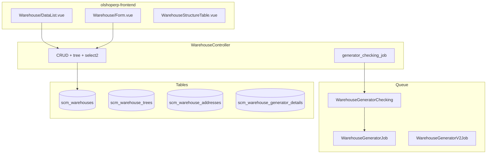

# Warehouse Structure — Technical Documentation

> **DRAFT** — Dokumen ini adalah draft awal hasil analisis codebase otomatis per 2026-06-19. Perlu direview PM/QA sebelum final.

**UI route:** `/supplychain/warehouse-structure`  
**API base:** `{VITE_API_URL}supplychain/warehouse`

---

## 1. Architecture Overview

---

## 2. Frontend File Map

**Root:** `olshoperp-frontend/src/pages/SCM/master/Warehouse/`

| File | Role | Key API |
|------|------|---------|
| `DataList.vue` | Datalist | `GET supplychain/warehouse` |
| `Form.vue` | Create/edit (large form) | `POST/PUT supplychain/warehouse` |
| `WarehouseStructureTable.vue` | Parent-by-type table | `warehouse/wh-parent-by-type` |
| `components/WarehouseDropdown.vue` | Shared select | various select2 |

### Router

| Route | Component |
|-------|-----------|
| `supplychain/warehouse-structure` | `DataList.vue` |
| `supplychain/warehouse-structure/create` | `Form.vue` |
| `supplychain/warehouse-structure/edit/:id` | `Form.vue` |

---

## 3. Backend File Map

| File | Role |
|------|------|
| `WarehouseController.php` | Main controller (~1900 lines) |
| `Entities/Warehouse.php` | `scm_warehouses` |
| `Entities/WarehouseTree.php` | Tree relations |
| `Entities/WarehouseAddress.php` | Address |
| `Entities/WarehouseGenerator.php` | Generator header |
| `Jobs/WarehouseGeneratorJob.php` | Async structure generation |
| `Concerns/CanCreateVirtualWarehouse.php` | Virtual WH trait |
| `Policies/WarehousePolicy.php` | Policy |

---

## 4. API Routes (selected)

| Method | Path | Notes |
|--------|------|-------|
| GET/POST/PUT/DELETE | `warehouse` | Resource CRUD |
| GET | `warehouse/tree` | Full tree |
| GET | `warehouse/tree/{id}` | Subtree |
| GET | `warehouse/{id}/audit` | Audit |
| GET | `warehouse/select2` | General select2 |
| GET | `warehouse/select2-warehouse-type` | Levels |
| GET | `warehouse/wh-parent-by-type` | Parent by type index |
| GET | `warehouse/{id}/virtual-children` | Virtual children |

---

## 5. Database

### `scm_warehouses` (key columns)

| Column | Keterangan |
|--------|------------|
| `warehouse_space_type_id` | FK level |
| `owner_company_id`, `manage_by` | Ownership |
| `is_virtual`, `process_group` | Virtual process warehouses |
| `is_drop_off`, `include_ats` | Flags |
| `warehouse_generator_id` | Link generator batch |

### `scm_warehouse_trees`

`warehouse_id`, `parent_id` — tree adjacency.

---

## 6. Jobs

| Job | Purpose |
|-----|---------|
| `WarehouseGeneratorChecking` | Dispatch pending generators on index |
| `WarehouseGeneratorJob` / `V2` | Create child structure |
| `WarehouseCreateVirtualJob` | Virtual warehouse creation |
| `WarehouseStructureGeneratorJob` | Import/staging helper |

Batch names: `warehouse-generator`, `warehouse-generator-checking`.
